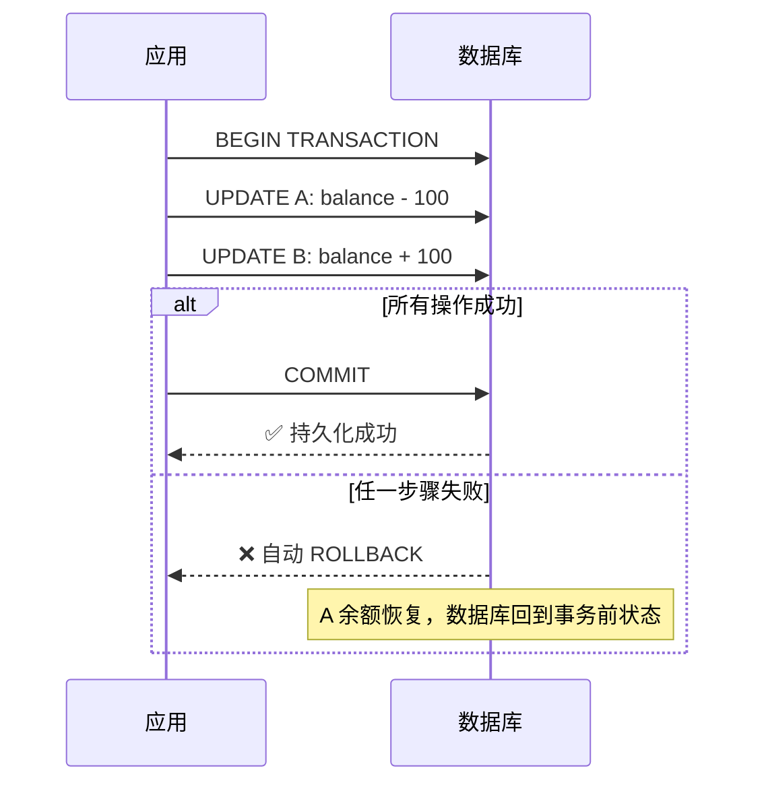
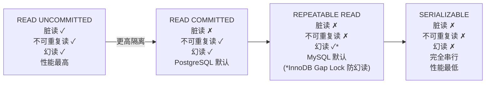
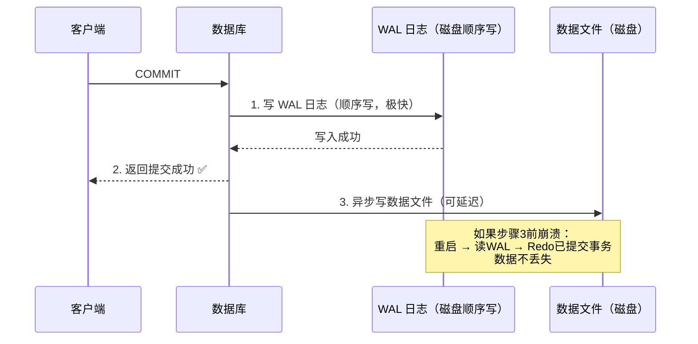
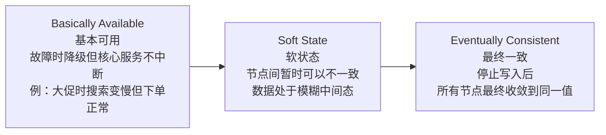

# ACID vs BASE

## TL;DR

- **ACID** 是关系型数据库的事务保证：强一致，操作要么全成功要么全失败
- **BASE** 是分布式系统的一致性模型：接受暂时不一致，换取高可用和高性能
- 两者不是非此即彼，是不同场景下的不同权衡

---

## ACID

ACID 是关系型数据库（MySQL、PostgreSQL 等）事务的四个特性。

### A — Atomicity（原子性）

一个事务里的所有操作，**要么全部成功，要么全部回滚**，不存在"做了一半"的状态。

经典例子：银行转账

```sql
BEGIN TRANSACTION;
  UPDATE accounts SET balance = balance - 100 WHERE id = 'A';
  UPDATE accounts SET balance = balance + 100 WHERE id = 'B';
COMMIT;
```

如果第二条 UPDATE 失败（比如 B 账户不存在），整个事务回滚，A 的余额不会减少。



**没有原子性会怎样**：A 扣了 100，B 没收到，钱凭空消失。

### C — Consistency（一致性）

事务执行前后，数据库必须满足所有**预定义的规则和约束**。

```sql
-- 约束：balance 不能小于 0
CREATE TABLE accounts (
  id VARCHAR(10),
  balance DECIMAL CHECK (balance >= 0)
);

-- 这个事务会失败（违反约束）
BEGIN TRANSACTION;
  UPDATE accounts SET balance = balance - 200 WHERE id = 'A'; -- A 只有 100
COMMIT; -- 回滚，因为违反了 balance >= 0 的约束
```

Consistency 保证数据从一个"合法状态"转变到另一个"合法状态"，不会出现中间的非法状态。

**注意**：这里的 C 和 CAP 定理里的 C 是不同的概念。CAP 里的 C 是"分布式节点间数据一致"，ACID 里的 C 是"数据满足约束"。

### I — Isolation（隔离性）

并发执行的事务，互相之间不能"看到"对方未提交的数据，就好像它们是顺序执行的一样。

**没有隔离性会产生的问题：**

**脏读（Dirty Read）**：读到另一个事务未提交的数据
```
事务1：UPDATE balance = 50（未提交）
事务2：SELECT balance → 读到 50
事务1：ROLLBACK → balance 回到 100
事务2 读到的 50 是"幻象"
```

**不可重复读（Non-repeatable Read）**：同一事务内，两次读同一行，结果不同
```
事务1：SELECT balance → 100
事务2：UPDATE balance = 50，COMMIT
事务1：SELECT balance → 50（前后不一致）
```

**幻读（Phantom Read）**：同一事务内，两次查询，结果集的行数不同
```
事务1：SELECT COUNT(*) FROM orders WHERE user_id=1 → 5
事务2：INSERT INTO orders ... （插入第 6 条）COMMIT
事务1：SELECT COUNT(*) FROM orders WHERE user_id=1 → 6（多了一行）
```

**隔离级别（Isolation Level）**（从弱到强）：

| 级别 | 脏读 | 不可重复读 | 幻读 | 性能 |
|------|------|-----------|------|------|
| READ UNCOMMITTED | 可能 | 可能 | 可能 | 最高 |
| READ COMMITTED | 不会 | 可能 | 可能 | 高 |
| REPEATABLE READ | 不会 | 不会 | 可能 | 中 |
| SERIALIZABLE | 不会 | 不会 | 不会 | 最低 |



MySQL InnoDB 默认是 **REPEATABLE READ**，PostgreSQL 默认是 **READ COMMITTED**。

隔离级别越高，越安全，但并发性能越低（因为需要更多的锁）。

### D — Durability（持久性）

事务一旦提交，数据就**永久保存**，即使系统崩溃也不会丢失。

数据库通过 **WAL（Write-Ahead Log，预写日志）** 实现持久性：



如果在步骤 3 之前崩溃，重启后数据库读取 WAL，重做所有已提交的事务，数据不会丢失。

**持久性不等于不会丢数据**：如果磁盘物理损坏，WAL 也没了。这就是为什么还需要备份和主从复制。

---

## BASE

BASE 是分布式系统（尤其是 NoSQL 数据库）采用的一致性模型，是 ACID 的"对立面"，但也是"务实的妥协"。

BASE = **B**asically **A**vailable, **S**oft state, **E**ventually consistent



### BA — Basically Available（基本可用）

系统在出现故障时，**允许损失部分功能，但核心服务仍然可用**。

例子：
- 电商系统在大促时数据库压力大，搜索变慢，但下单功能正常 → 基本可用
- 推荐系统故障，首页显示降级内容（热门商品），但浏览和下单不受影响 → 基本可用
- 对比：不基本可用 = 整个网站 502

### S — Soft State（软状态）

系统的状态可能在一段时间内**不一致**，这是被允许的。

"软"的意思是：数据不是强一致的，不同节点在同一时刻可能看到不同的值，系统处于一个"模糊的中间态"。

这与 ACID 的 Consistency 直接矛盾，ACID 要求每次操作后数据都在一个合法的确定状态。

### E — Eventually Consistent（最终一致性）

系统承诺：如果**停止写入**，经过一段时间后，所有节点的数据**最终会达到一致**。

"最终"意味着没有明确的时间保证，可能是毫秒级，也可能是秒级，取决于系统实现。

**最终一致性的例子：DNS**

你把域名 A 解析从 1.2.3.4 改成 5.6.7.8，不同地区的用户会在不同时间看到新地址：

```
修改后 1 分钟：
  上海用户 → DNS 缓存 → 1.2.3.4（旧）
  纽约用户 → DNS 缓存 → 5.6.7.8（新）

修改后 48 小时：
  所有用户 → 5.6.7.8（一致了）
```

这就是最终一致性：暂时不一致，但最终会一致。

---

## ACID vs BASE：对比总结

| 维度 | ACID | BASE |
|------|------|------|
| 一致性 | 强一致，事务内保证 | 最终一致，暂时可以不一致 |
| 可用性 | 出错时可能拒绝服务 | 出错时降级但仍可用 |
| 性能 | 锁机制影响并发 | 无锁或弱锁，高并发 |
| 扩展性 | 垂直扩展为主（更强的机器） | 水平扩展（更多的机器） |
| 适用场景 | 金融、订单、库存 | 社交、内容、日志、推荐 |
| 典型技术 | MySQL, PostgreSQL, Oracle | Cassandra, DynamoDB, CouchDB |

---

## 什么时候用 ACID，什么时候用 BASE

**必须用 ACID 的场景（数据错了会造成严重后果）：**
- 银行转账、支付
- 库存扣减（超卖会有损失）
- 订单状态流转
- 用户账户余额

**可以用 BASE 的场景（数据短暂不一致可以接受）：**
- 社交媒体的点赞数、评论数（差几个没关系）
- 用户行为日志（不需要实时一致）
- 推荐系统（今天推了昨天的内容无所谓）
- 购物车（各地看到的暂时不一样影响不大）
- DNS、CDN 缓存

**真实系统通常混合使用：**

一个电商系统：
- 订单和支付 → MySQL（ACID）
- 商品评论数 → Cassandra（BASE）
- 用户行为追踪 → Kafka + HBase（BASE）
- 搜索索引 → Elasticsearch（BASE，异步同步）

---

## 一个让人迷惑的问题：NoSQL 就是 BASE，SQL 就是 ACID？

**不完全准确。**

- 大多数关系型数据库（SQL）是 ACID 的
- 大多数 NoSQL 数据库选择 BASE，但不是全部

例外：
- **MongoDB** 从 4.0 版本开始支持多文档 ACID 事务
- **CockroachDB** 是分布式 SQL 数据库，支持 ACID
- **Google Spanner** 是全球分布式数据库，也支持 ACID
- **Cassandra** 支持轻量级事务（Lightweight Transactions），但性能代价很高

所以更准确的说法是：**ACID vs BASE 是一致性模型的选择，不完全由数据库类型决定**。

---

## 与 Node.js/TS 生态的类比

你用 TypeORM 或 Prisma 时，事务是这样写的：

```typescript
// ACID 事务
await prisma.$transaction(async (tx) => {
  await tx.account.update({
    where: { id: 'A' },
    data: { balance: { decrement: 100 } }
  });
  
  await tx.account.update({
    where: { id: 'B' },
    data: { balance: { increment: 100 } }
  });
});
// 要么都成功，要么都回滚 —— Atomicity
```

而用 Redis 做缓存时，你接受的是 BASE 语义：

```typescript
// 写数据库
await prisma.user.update({ where: { id: 1 }, data: { name: 'Alice' } });

// 更新缓存（异步，可能有短暂延迟）
await redis.set('user:1', JSON.stringify({ name: 'Alice' }), 'EX', 3600);

// 在缓存更新完成之前，其他服务读到的是旧数据
// 这就是 BASE 的 Soft State + Eventually Consistent
```

---

## 常见陷阱

1. **混淆 ACID 的 C 和 CAP 的 C**：ACID-C 是"约束不被违反"，CAP-C 是"分布式节点数据一致"，完全不同
2. **认为 BASE 意味着数据不可靠**：BASE 是经过设计的权衡，不是"随便丢数据"，最终一致性保证数据最终会对
3. **在需要强一致性的场景用了 BASE**：库存扣减用 Cassandra，结果超卖——这是架构选型错误
4. **认为事务级别越高越好**：SERIALIZABLE 级别会严重影响并发，大多数场景用 READ COMMITTED 或 REPEATABLE READ 足够

---

## 关联文档

- [02_cap_theorem.md](02_cap_theorem.md) — BASE 的 E（最终一致性）对应 CAP 的 AP 选择
- [../04_distributed/01_consistency_models.md](../04_distributed/01_consistency_models.md) — 一致性的完整谱系
- [../04_distributed/02_distributed_tx.md](../04_distributed/02_distributed_tx.md) — 分布式事务：跨服务如何实现 ACID
- [../02_storage/01_rdbms.md](../02_storage/01_rdbms.md) — 关系型数据库如何实现 ACID

---

## 面试常见问答

### 简单

**Q：解释 ACID 中的原子性（Atomicity）。**

A：原子性指事务中的所有操作要么全部成功提交，要么全部回滚，不存在"部分成功"的中间状态。经典例子是银行转账：A 账户扣款和 B 账户入账必须同时成功，如果入账失败，扣款必须撤销。数据库通过 undo log 实现回滚。

---

**Q：什么是脏读？什么隔离级别能防止它？**

A：脏读是指一个事务读取了另一个**未提交**事务修改的数据。如果那个事务后来回滚，读到的数据就成了"幻象"，从未真正存在过。READ COMMITTED 及以上隔离级别能防止脏读——只有已提交的数据才对其他事务可见。

---

**Q：BASE 中的"最终一致性"是什么意思？**

A：最终一致性是指：如果系统停止接收新的写入，经过一段时间（可能是毫秒也可能是秒），所有节点的数据最终会收敛到一致的状态。它不保证任意时刻所有节点一致，只保证"在没有新写入的情况下，迟早会一致"。DNS 是典型例子：修改域名解析后，全球各地的 DNS 缓存会在 TTL 过期后陆续更新，最终所有人看到同一个 IP。

---

### 中等

**Q：数据库默认隔离级别是什么？为什么不默认用最强的 SERIALIZABLE？**

A：MySQL InnoDB 默认是 REPEATABLE READ，PostgreSQL 默认是 READ COMMITTED。不默认 SERIALIZABLE 是因为它性能代价极高：SERIALIZABLE 通过给所有读取加锁（或使用 SSI 算法追踪依赖关系）来防止幻读，会大幅降低并发度，死锁概率也更高。大多数应用场景并不需要完全串行化，READ COMMITTED 或 REPEATABLE READ 在安全性和性能之间取得了更好的平衡。只有金融对账、审计等场景才需要 SERIALIZABLE。

---

**Q：一个系统同时用 MySQL 存订单、用 Elasticsearch 做搜索、用 Redis 做缓存，三者之间的数据一致性怎么保证？**

A：这是典型的多存储系统一致性问题，无法用数据库事务覆盖，需要接受最终一致性：
- **MySQL → Elasticsearch**：通过 Binlog + Canal/Debezium 监听数据库变更，异步写入 ES。可能有秒级延迟，搜索结果暂时不反映最新数据
- **MySQL → Redis**：写数据库后删除对应缓存（Cache-Aside 模式），下次读时回源重建。或者用消息队列异步更新
- **容忍度**：搜索索引延迟几秒可接受；缓存短暂不一致可接受；但订单金额、库存等核心数据必须以 MySQL 为准
- **核心原则**：以 MySQL 为 Source of Truth，其他存储都是派生数据，允许短暂滞后

---

**Q：Durability（持久性）是如何实现的？如果服务器在 COMMIT 后、写磁盘前崩溃了怎么办？**

A：通过 WAL（Write-Ahead Log，预写日志）实现。COMMIT 时数据库先把操作记录写入 WAL（顺序写，速度快），写入成功才返回客户端 COMMIT 确认。实际的数据页修改可以延迟异步完成（写入 buffer pool，定期 flush 到磁盘）。如果在 COMMIT 后、数据页写入前崩溃，重启时数据库读取 WAL，重新应用所有已提交但未写入数据页的操作（Redo），数据不会丢失。如果在写 WAL 过程中崩溃，这条 WAL 不完整，重启后忽略，事务视为未提交（Undo）。

---

### 难

**Q：不可重复读和幻读有什么区别？举例说明，并解释 REPEATABLE READ 为什么能防止不可重复读但不能防止幻读（MySQL 除外）。**

A：
- **不可重复读**：同一事务内，两次读**同一行**，结果不同（因为其他事务修改并提交了这行）
- **幻读**：同一事务内，两次执行**同一范围查询**，返回的行数不同（因为其他事务插入或删除了满足条件的行）

区别：不可重复读针对已有行的**修改**，幻读针对满足条件的行的**新增/删除**。

REPEATABLE READ 用 MVCC（多版本并发控制）解决不可重复读：事务开始时创建一个快照，后续所有读操作都读这个快照版本，看不到其他事务的修改。但普通的 MVCC 快照不能防止幻读：INSERT 操作插入新行，快照中没有它，但用范围条件查询时，新行满足条件，可能会"出现"。

MySQL InnoDB 在 REPEATABLE READ 下用 Gap Lock（间隙锁）额外防止了幻读：锁住查询条件范围内的间隙，阻止其他事务在这个范围内插入新行。所以 MySQL 的 REPEATABLE READ 实际上防止了幻读，而标准 SQL 定义的 REPEATABLE READ 不防幻读。

---

**Q：微服务架构中，用户下单涉及订单服务、库存服务、支付服务三个独立数据库，如何保证原子性？**

A：跨服务无法使用数据库事务，需要用分布式事务模式。常见方案：

**Saga 模式（推荐）**：把跨服务操作拆成一系列本地事务，每步失败时执行补偿操作：
```
1. 创建订单（订单服务）→ 成功
2. 扣减库存（库存服务）→ 成功
3. 扣款（支付服务）→ 失败
   ↓ 触发补偿
3'. 退款（支付服务补偿，跳过）
2'. 恢复库存（库存服务补偿）
1'. 取消订单（订单服务补偿）
```
Saga 是最终一致性，过程中数据暂时不一致，但最终收敛。

**2PC（两阶段提交）**：协调者先问所有参与者"能提交吗"，都同意才发提交指令。强一致但有性能和可用性问题（协调者挂了会阻塞所有参与者），一般不推荐在微服务中使用。

实际工程中 Saga 是主流，具体在 `04_distributed/02_distributed_tx.md` 有详细讲解。
