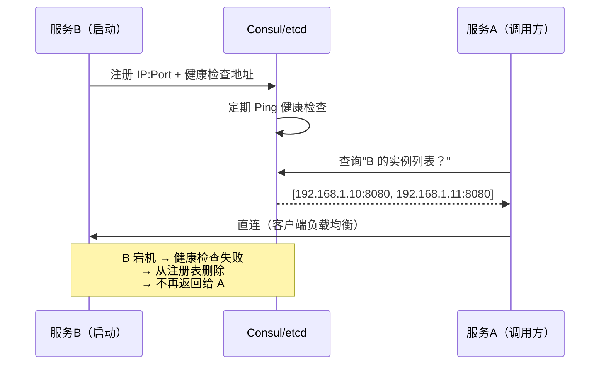
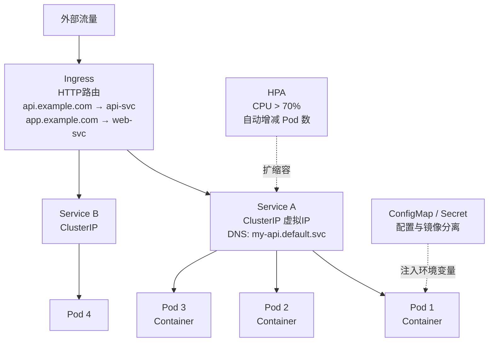
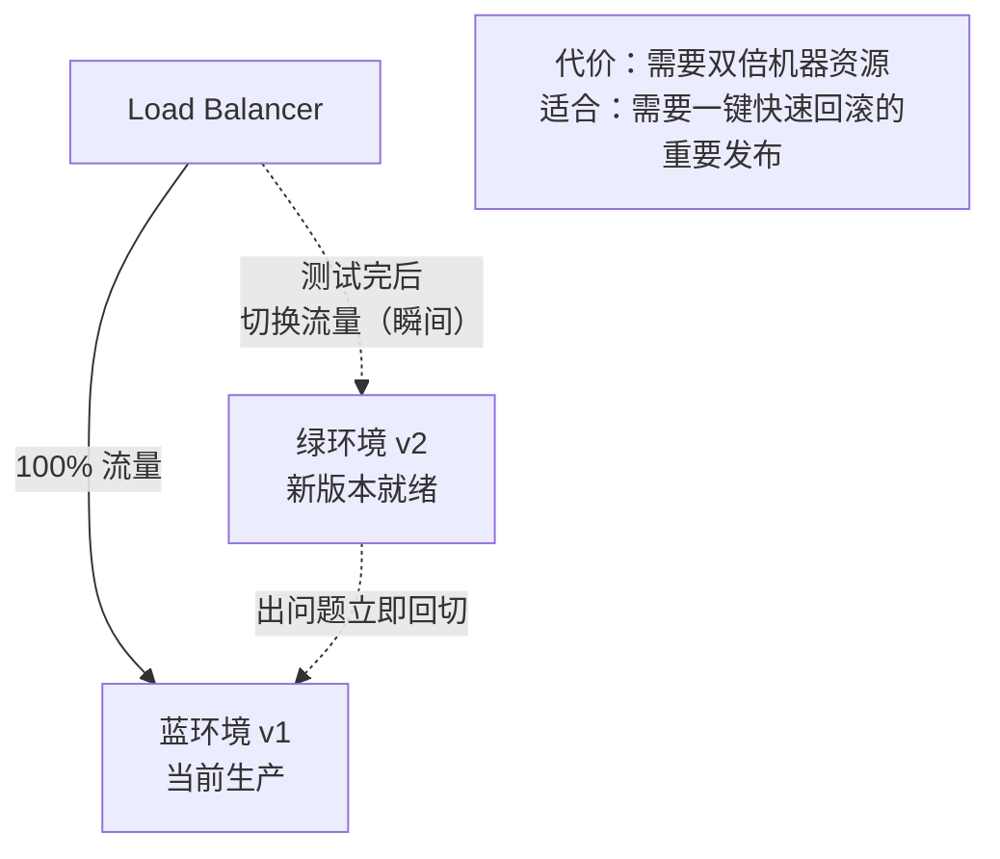
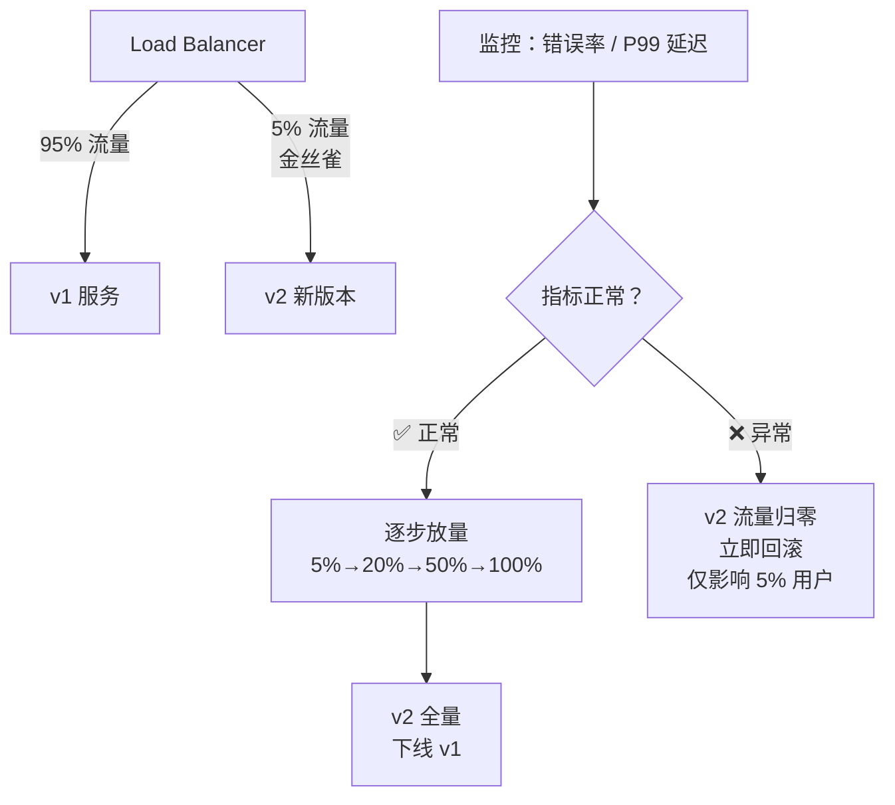
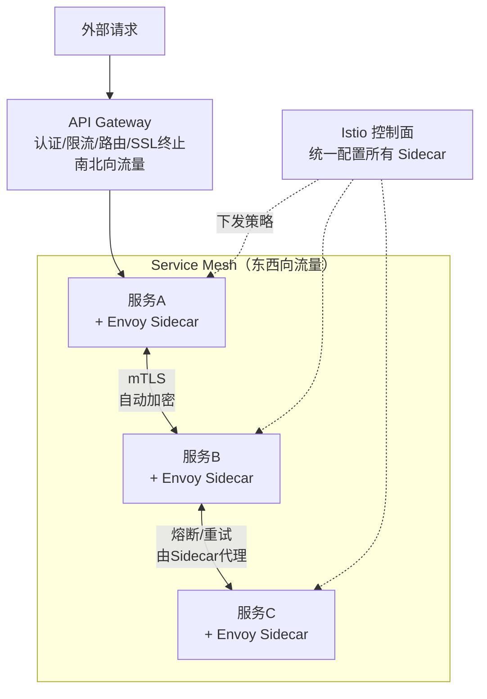

# 微服务与部署架构

## TL;DR

面试中"如何部署你设计的系统"是常见追问。本文覆盖：
- 微服务拆分原则（什么时候拆、怎么拆）
- 服务发现（组件之间怎么找到彼此）
- 容器化与 Kubernetes 基础（面试够用的深度）
- 部署策略（蓝绿、金丝雀）
- API Gateway vs Service Mesh

---

## 单体 vs 微服务

### 什么时候拆服务

**不要一开始就上微服务**：

```
单体的优势：
  - 一个进程，本地函数调用，没有网络延迟
  - 事务简单（同一数据库，ACID 保证）
  - 部署简单（一个 Docker 镜像）
  - 调试简单（一个日志流）

微服务的适合时机：
  - 团队大了（>20 人），不同模块需要独立发布节奏
  - 某个模块资源需求特殊（视频转码需要 GPU，其他不需要）
  - 某个模块需要单独扩缩容（搜索服务 QPS 高，订单服务低）
  - 技术栈差异（ML 服务用 Python，API 用 Go）
```

### 拆分原则

```
按业务能力拆（而不是按技术层拆）：
  ✅ 正确：用户服务 / 订单服务 / 支付服务 / 通知服务
  ❌ 错误：数据库服务 / 缓存服务 / API 服务（这是按技术层）

每个服务：
  - 有自己独立的数据库（不共享 DB）
  - 通过 API 或消息队列与其他服务通信
  - 可以独立部署，不影响其他服务
```

### 微服务带来的新问题

```
原本单体里的函数调用，变成了网络调用：
  - 延迟：增加网络往返
  - 故障：网络可能超时、失败
  - 数据一致性：跨服务事务（Saga / 2PC）
  - 可观测性：请求跨多个服务，需要分布式追踪（Trace ID）
  - 服务发现：A 服务怎么知道 B 服务在哪个 IP？
```

---

## 服务发现

### 问题

微服务的实例会动态增减（扩缩容、故障重启），IP 地址不固定。服务 A 如何找到服务 B 当前的健康实例？

### 方案一：客户端服务发现（Client-Side Discovery）

```
服务注册中心（如 Consul / etcd / Eureka）

启动时：
  服务 B 启动 → 把自己的 IP:Port 注册到 Consul
  
调用时：
  服务 A 查询 Consul："B 的实例列表是什么？"
  Consul 返回：[192.168.1.10:8080, 192.168.1.11:8080]
  服务 A 自己选一个（负载均衡在客户端）→ 直连

健康检查：
  Consul 定期给每个注册实例发 HTTP 健康检查
  实例挂了 → 从注册表删除 → 不再返回给查询者
```



**优点：** 客户端直连，没有额外跳跃，延迟低
**缺点：** 每个服务客户端都要内嵌服务发现逻辑（多语言维护成本高）

### 方案二：服务端服务发现（Server-Side Discovery）

```
                     [DNS / Load Balancer]
                           |
  服务 A ── HTTP ──→  B.internal.svc  ──→  [B 实例1]
                                      ──→  [B 实例2]

Kubernetes 内置这种模式：
  - 每个 Service 有一个 ClusterIP（虚拟 IP）
  - DNS 解析 my-service → ClusterIP
  - kube-proxy 把流量分发到后端 Pod
  - Pod 上下线时，kube-proxy 自动更新规则
```

```
优点：服务 A 不需要感知服务发现逻辑，就像调普通 HTTP 一样
缺点：多了一跳（通过 kube-proxy），有微小延迟
Kubernetes 推荐方式
```

---

## Kubernetes 核心概念（面试够用版）

### 为什么需要 Kubernetes

```
没有 K8s 时：
  手动管理：哪台机器跑哪个服务，手动扩容，手动重启挂掉的容器
  
K8s 解决：
  - 自动调度：把容器分配到合适的节点（考虑 CPU/内存 资源）
  - 自动重启：容器挂了自动拉起
  - 自动扩缩容：根据 CPU 使用率或 QPS 自动增减实例数（HPA）
  - 服务发现 + 负载均衡：内置（见上）
  - 滚动更新：更新时不中断服务
```

### 核心对象

```
Pod：
  K8s 的最小调度单元，包含一个或多个容器
  共享网络命名空间（同一 Pod 内的容器通过 localhost 通信）
  临时的——Pod 挂了就没了，不会自动重建（需要上层控制器）

Deployment：
  管理一组相同的 Pod（副本集）
  声明"我想要 3 个 my-api 的 Pod 一直运行"
  K8s 负责保证副本数，挂了自动重建
  支持滚动更新（Rolling Update）

Service：
  给一组 Pod 提供稳定的 DNS 名称和虚拟 IP
  类型：
    ClusterIP：只在集群内部访问（服务间通信）
    NodePort：在每个节点上开一个端口，外部可访问（测试用）
    LoadBalancer：创建云厂商的 LB（生产用，如 AWS ALB）

Ingress：
  HTTP/HTTPS 路由规则，把外部请求路由到不同 Service
  类似 nginx 的反向代理配置，但由 K8s 管理
  
  host: api.example.com  → 路由到 api-service:80
  host: app.example.com  → 路由到 web-service:3000
  path: /v1/*            → 路由到 v1-service
  path: /v2/*            → 路由到 v2-service

ConfigMap / Secret：
  配置和密钥与镜像分离，注入到 Pod 的环境变量或文件
```



### 典型部署配置（面试能画出来）

```yaml
# Deployment：管理 3 副本的 API 服务
apiVersion: apps/v1
kind: Deployment
spec:
  replicas: 3                      # 3 个 Pod 副本
  strategy:
    type: RollingUpdate
    rollingUpdate:
      maxUnavailable: 1            # 更新时最多 1 个 Pod 不可用
      maxSurge: 1                  # 最多多出 1 个 Pod
  template:
    spec:
      containers:
      - name: api
        image: my-api:v1.2.3
        resources:
          requests: { cpu: "100m", memory: "256Mi" }
          limits:   { cpu: "500m", memory: "512Mi" }
        readinessProbe:            # 就绪探针：Pod 准备好了才接流量
          httpGet: { path: /health, port: 8080 }
        livenessProbe:             # 存活探针：不健康就重启
          httpGet: { path: /health, port: 8080 }
```

### HPA（水平自动扩缩容）

```
面试高频：如何处理流量高峰？

HPA（Horizontal Pod Autoscaler）：
  监控 Pod 的 CPU 使用率（或自定义指标如 QPS）
  超过 70% CPU → 自动增加 Pod 数量
  低于 30% CPU → 自动减少 Pod 数量

配置：
  minReplicas: 2（最少 2 个，保证高可用）
  maxReplicas: 20
  targetCPUUtilizationPercentage: 70

注意：扩容需要时间（启动 Pod + 预热），通常 30 秒到 2 分钟
  → 对于可预测的流量峰值（如大促），提前手动扩容
  → 对于突发流量，HPA 来不及，需要消息队列缓冲
```

---

## 部署策略

### 滚动更新（Rolling Update）

```
K8s 默认策略。逐步替换旧 Pod，过渡期新旧版本共存。

v1 v1 v1 v1
  ↓ （更新开始）
v2 v1 v1 v1
v2 v2 v1 v1
v2 v2 v2 v1
v2 v2 v2 v2

好处：不中断服务
问题：新旧版本同时在线，如果有 API 不兼容，可能出错
适合：向后兼容的更新
```

### 蓝绿部署（Blue-Green）



### 金丝雀发布（Canary Release）



---

## API Gateway vs Service Mesh

### API Gateway（南北向流量：外部 → 内部）

```
外部请求入口，处理：
  - 认证（JWT 验证、API Key 校验）
  - 限流（每个 API Key 限 1000 QPS）
  - 路由（/v1/* → v1服务，/v2/* → v2服务）
  - SSL 终止（外部 HTTPS → 内部 HTTP）
  - 请求/响应转换
  - 访问日志

典型产品：Kong、AWS API Gateway、nginx

放在哪里：集群边缘，作为唯一的外部入口
```

### Service Mesh（东西向流量：服务 → 服务）

```
微服务之间通信的基础设施层，处理：
  - mTLS（服务间双向加密认证）
  - 熔断（自动熔断不健康的下游）
  - 重试（失败自动重试，带 timeout）
  - 分布式追踪（Trace ID 自动传播）
  - 流量分割（金丝雀发布）

实现方式：Sidecar 模式
  每个 Pod 旁边自动注入一个 Envoy Proxy 容器
  所有流量进出都经过 Envoy，Envoy 统一处理上述能力
  业务代码不需要修改

典型产品：Istio（控制面） + Envoy（数据面）

代价：
  - 运维复杂（学习曲线高）
  - 每个 Pod 多一个容器（CPU/内存开销）
  - 适合大规模微服务（> 20 个服务），小团队用 API Gateway + 手动处理足够
```



```
面试中表达（何时用 Service Mesh）：
"服务间通信的可观测性、熔断、mTLS 可以通过 Service Mesh 统一解决，
 避免在每个服务里手写重试逻辑。但 Service Mesh 的运维复杂度较高，
 在服务数量少时直接在 API 框架层（如 gRPC 拦截器）实现也够用。"
```

---

## 面试中如何谈部署

面试官问"你设计的这个系统怎么部署？"时的标准回答框架：

```
1. 容器化：
   "每个服务打包成 Docker 镜像，存入镜像仓库（ECR / Harbor）"

2. 编排：
   "用 Kubernetes 管理，每个服务是一个 Deployment，
    设置最少 2 个副本保证高可用，HPA 根据 CPU 自动扩缩容"

3. 流量入口：
   "外部流量通过 API Gateway（如 Kong）进来，
    处理鉴权和限流；内部服务间通过 K8s Service（ClusterIP + DNS）互访"

4. 发布策略：
   "普通发布用滚动更新（K8s 默认），
    高风险发布用金丝雀（先 5% 流量验证），
    重大版本用蓝绿（一键回滚）"

5. 配置管理：
   "环境变量和 Secret 用 Kubernetes ConfigMap / Secret 注入，
    不 hardcode 在镜像里；生产 Secret 用 Vault 管理"
```

---

## 关联文档

- [../03_communication/01_sync.md](../03_communication/01_sync.md) — API Gateway 与 REST/gRPC
- [../04_distributed/04_fault_tolerance.md](../04_distributed/04_fault_tolerance.md) — 熔断器（Service Mesh 中自动实现）
- [../05_methodology/reference/04_observability.md](../05_methodology/reference/04_observability.md) — 分布式追踪（Service Mesh 提供）
