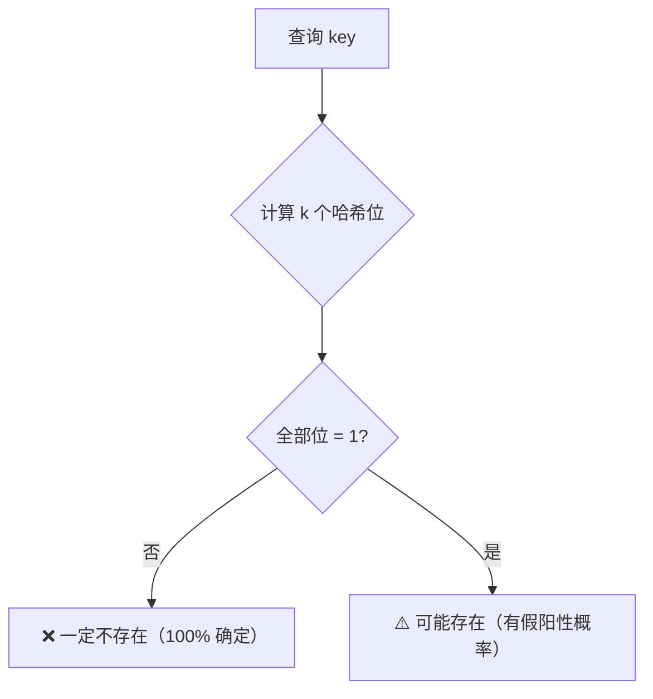
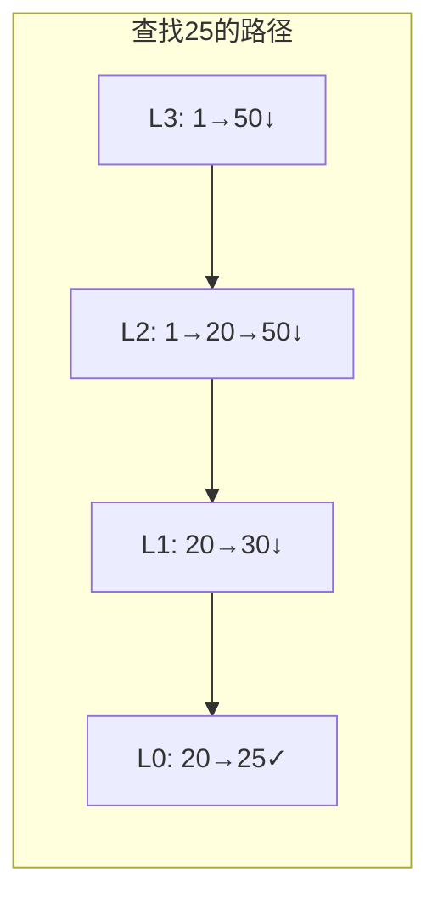
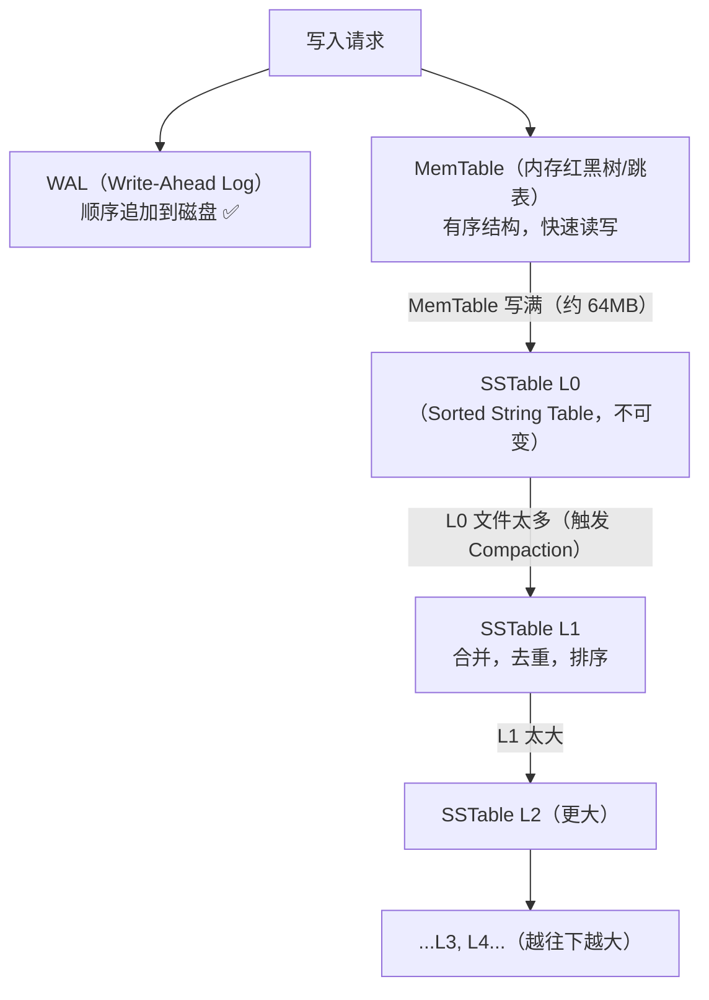
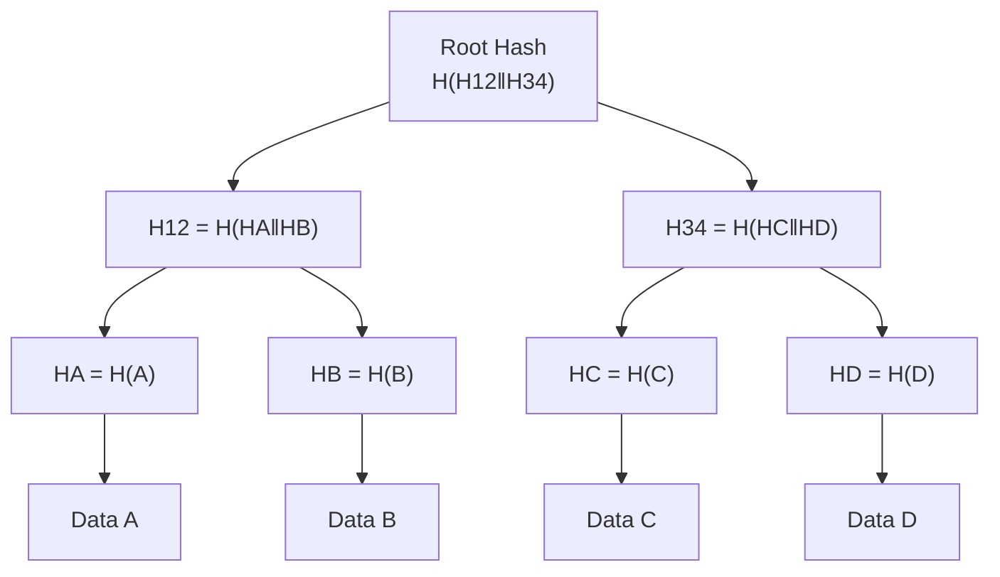
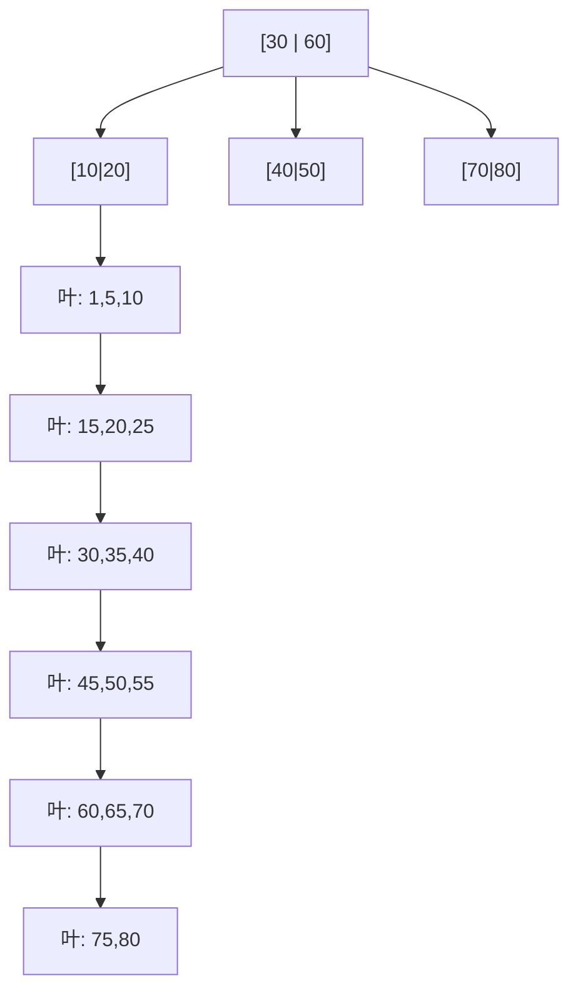

# 系统设计必知数据结构底层原理

## TL;DR

| 数据结构 | 核心特点 | 典型应用 |
|----------|---------|---------|
| Bloom Filter | 概率性判断"不存在"，零误判 | 缓存穿透防护、URL 去重 |
| Skip List | 概率性多层链表，O(log n) | Redis ZSet、LevelDB MemTable |
| LSM Tree | 写入极快，顺序写磁盘，读需合并 | Cassandra、RocksDB、HBase |
| Merkle Tree | 树形哈希，高效验证数据一致性 | Git、BitTorrent、区块链 |
| B+ Tree | 所有数据在叶子节点，叶链表支持范围扫描 | MySQL InnoDB、PostgreSQL |

---

## 布隆过滤器（Bloom Filter）

### 核心思想

用一个 **m 位的位数组** + **k 个哈希函数** 表示一个集合，不存储真实元素。

```
位数组（m=16 位）：
  初始：0 0 0 0 0 0 0 0 0 0 0 0 0 0 0 0

插入 "google.com"（k=3 个哈希函数）：
  hash1("google.com") % 16 = 2  → 把第 2 位设为 1
  hash2("google.com") % 16 = 7  → 把第 7 位设为 1
  hash3("google.com") % 16 = 11 → 把第 11 位设为 1

结果：0 0 1 0 0 0 0 1 0 0 0 1 0 0 0 0
          ↑           ↑       ↑
          2           7       11
```

**查询"apple.com"：**
- 计算 3 个哈希值，检查对应位是否全为 1
- 如果有任何一位为 0 → **一定不在集合里**（100% 确定）
- 如果全为 1 → **可能在集合里**（存在误判，假阳性）



### 假阳性率

```
假阳性率 p ≈ (1 - e^(-kn/m))^k

其中：
  n = 已插入元素数量
  m = 位数组大小
  k = 哈希函数数量

最优哈希函数数量：k = (m/n) × ln2 ≈ 0.693 × (m/n)

实际配置建议：
  n = 100 万，p = 1%   → m = 9.585 MB（约 10MB）
  n = 100 万，p = 0.1% → m = 14.377 MB（约 15MB）
  
  相比存储 100 万条 URL（每条 50 字节 = 50MB），Bloom Filter 节省 80%+ 空间
```

### 局限性

```
1. 不支持删除（位被多个元素共享，无法区分）
   → 解决：Counting Bloom Filter（每位改为计数器，支持删减）
   
2. 有假阳性（False Positive），但没有假阴性（False Negative）
   → 说"不存在"是 100% 准确的
   → 说"存在"需要二次验证（查 DB）
   
3. 不能枚举元素
```

### 应用场景

**场景 1：缓存穿透防护**
```
用户请求 key=99999（不存在的数据）
→ 正常逻辑：Cache Miss → 查 DB → DB 也没有 → 下次还是穿透
→ 加 Bloom Filter：
    启动时把 DB 里所有存在的 key 加入 Bloom Filter
    请求来时先查 Bloom Filter：
      "不存在" → 直接返回空，不查 DB（彻底防穿透）
      "可能存在" → 正常查 Cache/DB
```

**场景 2：爬虫 URL 去重**
```
已爬取 URL 集合存 Bloom Filter（比 HashSet 省 10 倍内存）
新 URL → 查 Bloom Filter → "不存在" 则爬取 → 爬取后加入 Filter
```

**场景 3：弱密码检测**
```
存储 1 亿个已知弱密码的 Bloom Filter（约 180MB）
用户注册时查询新密码是否在弱密码库里
```

---

## 跳表（Skip List）

### 为什么需要跳表

普通有序链表查找 O(n)，BST 平衡需要旋转（实现复杂）。跳表用**概率性多层索引**实现 O(log n)，且实现比红黑树简单得多。

### 核心结构

```
Level 3: 1 ─────────────────────────────── 50 ──────── nil
Level 2: 1 ──────────── 20 ────────────── 50 ──── 80 ─ nil
Level 1: 1 ──── 10 ──── 20 ──── 30 ────── 50 ──── 80 ─ nil
Level 0: 1 ─ 5 ─ 10 ─ 17 ─ 20 ─ 25 ─ 30 ─ 40 ─ 50 ─ 70 ─ 80 ─ nil
（底层链表，包含所有元素）
```

**查找 25 的过程（从最高层开始）：**
```
Level 3: 1 → 50（25 < 50，下降到 Level 2）
Level 2: 1 → 20（25 > 20）→ 50（25 < 50，下降到 Level 1）
Level 1: 20 → 30（25 < 30，下降到 Level 0）
Level 0: 20 → 25 ✓  找到！
```



### 层高概率

每个节点被提升到第 k 层的概率 = p^(k-1)，通常 p = 0.5 或 0.25。
- 平均每个节点层数 = 1/(1-p)，p=0.5 时平均 2 层
- 跳表的高度期望 = log_{1/p}(n)，n=100万 时约 20 层

### 核心操作复杂度

| 操作 | 平均复杂度 | 最坏复杂度 |
|------|---------|---------|
| 查找 | O(log n) | O(n)（极小概率） |
| 插入 | O(log n) | O(n) |
| 删除 | O(log n) | O(n) |
| 范围查询 | O(log n + k) | — |

### Redis ZSet 为什么用跳表

```
Redis Sorted Set（ZAGG/ZADD/ZRANGE）底层用跳表 + Hash：
  Hash：O(1) 查某个 member 的 score
  跳表：O(log n) 按 score 范围查询（ZRANGEBYSCORE）

为什么不用红黑树？
  1. 范围查询：跳表 Level 0 是有序链表，范围扫描只需在 Level 0 遍历
     红黑树的范围扫描需要中序遍历，更复杂
  2. 实现简单：跳表代码远比红黑树简洁，Redis 追求可读性
  3. 并发友好：跳表更容易实现无锁或细粒度锁
```

---

## LSM Tree（Log-Structured Merge-Tree）

### 核心问题：写放大 vs 读放大

传统 B+ Tree（MySQL）：随机写磁盘 → 写 IO 慢  
LSM Tree 的思路：**把随机写变成顺序写**，用读时的合并代价换取写的性能。

### 核心组件



**SSTable（Sorted String Table）**：不可变的有序文件，每个 key-value 按 key 排序。

### 写入流程

```
1. 写 WAL（顺序写磁盘）—— 崩溃恢复用
2. 写 MemTable（写内存）—— 快速返回
3. MemTable 写满 → flush 成 L0 SSTable（顺序写磁盘）
4. 后台 Compaction：合并 L0 → L1 → L2...
```

写入延迟极低（内存操作），但后台有持续的 Compaction 开销（写放大）。

### 读取流程

```
查找 key "foo"：
1. 查 MemTable（最新）
2. 查 L0 的每个 SSTable（可能有多个重叠文件）
3. 查 L1 的 SSTable（每层文件无重叠，二分找到对应文件）
4. 查 L2...依次向下

优化：
  Bloom Filter：每个 SSTable 维护一个 Bloom Filter
    → "foo 一定不在这个文件里" → 跳过
    → 大幅减少磁盘读
  Block Cache：热点数据块缓存在内存
```

### Compaction 策略

```
Size-Tiered（HBase/ScyllaDB 默认）：
  积累 N 个相似大小的 SSTable → 合并成一个更大的 SSTable
  优点：写放大小
  缺点：空间放大大（合并时暂时需要 2× 空间）

Leveled（RocksDB/Cassandra 默认）：
  L1/L2/... 每层总大小有上限（如 L1 10MB，L2 100MB）
  L0 文件推入 L1 时合并，保证 L1+ 的文件不重叠
  优点：读性能好（无重叠，二分查找）
  缺点：写放大大（一个 key 被 rewrite 多次）
```

### 为什么 Cassandra/RocksDB 用 LSM Tree

```
Cassandra 的写入模式：
  大量时序数据（用户行为事件、传感器数据）
  写远多于读（Insert-heavy workload）
  一次写永不更新（Append-only）

LSM Tree 完美匹配：
  写 → 内存 → 顺序写磁盘 → 极快
  读 → 多文件查找（但有 Bloom Filter 优化）
  Delete → 写入一个 Tombstone 标记（而非真正删除，在 Compaction 时真正清理）
```

---

## Merkle Tree（默克尔树）

### 核心思想

每个叶节点存数据块的哈希，每个非叶节点存子节点哈希的哈希。根哈希（Root Hash）代表整个数据集的"指纹"。

```
数据块：[A, B, C, D]

         Root = H(H12 || H34)
        /                    \
   H12 = H(HA||HB)      H34 = H(HC||HD)
   /      \               /       \
HA=H(A)  HB=H(B)      HC=H(C)  HD=H(D)
  |         |            |         |
  A         B            C         D
```



### 高效验证（Merkle Proof）

**验证 C 是否在树中，只需要提供：**
```
证明路径：[HD, H12, Root]
验证方：
  HC' = H(C)         （重新计算 C 的哈希）
  H34' = H(HC' || HD)（用提供的 HD）
  Root' = H(H12 || H34') （用提供的 H12）
  Root' == Root → C 在树中

只需 log₂(n) 个哈希，不需要传输整个数据集
```

### 应用场景

**Git：**
```
每个 Commit 是一个 Merkle Tree（通过 Tree 对象）
  Root（Commit Hash）
    ├── Tree（目录树哈希）
    │     ├── Blob（文件A哈希）
    │     └── Blob（文件B哈希）
    └── Parent（父 Commit 哈希）

两个 Commit 对比：只需对比 Root Hash
差异检测：Root 不同 → 递归比较 Tree → 找到哪个 Blob 变了
→ Git diff 的高效实现
```

**P2P 文件分发（BitTorrent）：**
```
下载 1GB 文件，拆成 1000 个 1MB 块
每块有哈希，用 Merkle Root 验证完整性
下载单块后立即验证（不用等全部下完）
来自不同 peer 的块可独立验证
```

**分布式数据库（Cassandra 反熵）：**
```
Cassandra 节点间数据同步：
  把 Token Range 内的数据建 Merkle Tree
  两节点交换 Root Hash → 不同则逐级比较
  找到具体哪个 Token Range 有差异 → 只同步差异部分
  避免全量扫描（反熵修复）
```

**区块链：**
```
区块头只存 Merkle Root（32 字节）
轻量级节点（SPV）无需下载全部交易
通过 Merkle Proof 验证某笔交易是否在区块里
```

---

## B+ Tree

### 与 B-Tree 的区别

```
B-Tree（B树）：
  所有节点（包括内部节点）都存数据
  内部节点：[key | data | key | data | ...]
  
B+ Tree（B+树）：
  内部节点只存 key（作为路由），不存实际数据
  所有数据都在叶节点
  叶节点之间有双向链表连接
```

### 核心结构

```
                  [30 | 60]              ← 内部节点，只有key，无data
                /     |      \
         [10|20]   [40|50]   [70|80]    ← 内部节点
         / | \     / | \      / | \
        叶  叶  叶  叶  叶  叶  叶  叶  叶   ← 叶节点（含data）
        ↕  ↕  ↕  ↕  ↕  ↕  ↕  ↕  ↕
        ─────────────────────────────── ← 叶节点双向链表
```



### 查找流程

```
查找 key=25：
  根节点 [30|60]：25 < 30 → 走左子树
  内部节点 [10|20]：20 < 25 < 30 → 走右指针
  叶节点：找到 25 对应的 data

O(log_t n) 次磁盘 IO，t = 树的阶数（通常 100~1000）
```

### 为什么 B+ Tree 比 BST 适合数据库

```
磁盘 IO 是瓶颈：
  每次读写磁盘是"页"（通常 16KB）
  B+ Tree 的节点大小 = 一个磁盘页
  一个节点可以存 100~1000 个 key
  树高 = log_{100~1000}(n) ≈ 3~4（10亿行数据树高约 3）

对比 BST（红黑树）：
  每个节点只有 1 个 key
  树高 = log₂(n) ≈ 30（10亿行数据树高约 30）
  = 30 次磁盘 IO vs 3 次磁盘 IO
```

### 范围查询为什么快

```
SELECT * FROM orders WHERE create_time BETWEEN '2024-01-01' AND '2024-12-31'

步骤：
1. 用 B+ Tree 找到 '2024-01-01' 对应的叶节点（O(log n)）
2. 沿叶节点链表顺序扫描到 '2024-12-31'（O(k)，k=范围内记录数）

不需要回到根节点！叶链表让范围扫描变成顺序 IO（极快）

B-Tree 的范围查询：需要中序遍历（回到根节点，多次随机 IO）
```

### MySQL InnoDB 的 B+ Tree 实现

```
主键索引（聚簇索引，Clustered Index）：
  叶节点直接存整行数据
  按主键组织物理存储
  主键查询：B+ Tree 到叶节点一步到位

二级索引（Secondary Index）：
  叶节点存的是主键值（不是行数据）
  查询流程：B+ Tree 找到主键 → 再用主键查聚簇索引（回表）
  覆盖索引（Covering Index）：SELECT 的字段全在二级索引里 → 不需要回表

页大小：16KB
默认每页约存 1170 个 key（整数主键）
树高 3 = 可存约 1170 × 1170 × 16 ≈ 2200 万行
树高 4 = 可存约 256 亿行
```

---

## 面试速查：选哪个数据结构

| 面试场景 | 最佳回答 |
|----------|---------|
| 缓存穿透/URL 去重 | Bloom Filter（空间小，快速判断"不存在"） |
| Redis 排行榜 / 有序集合 | Skip List（ZSet 底层，O(log n) 范围查询） |
| 数据库写密集场景 | LSM Tree（顺序写，Cassandra/RocksDB 选它的原因） |
| 数据一致性验证 / 副本同步 | Merkle Tree（O(log n) 找到差异，不需全量比较） |
| 数据库索引 / 范围查询 | B+ Tree（顺序叶链表，O(log n + k) 范围扫描） |

---

## 关联文档

- [../02_storage/01_rdbms.md](../02_storage/01_rdbms.md) — B+ Tree 在 MySQL 索引中的应用
- [../02_storage/02_nosql.md](../02_storage/02_nosql.md) — Cassandra LSM Tree 与 ScyllaDB
- [../06_case_studies/12_web_crawler.md](../06_case_studies/12_web_crawler.md) — 爬虫 URL 去重（Bloom Filter）
- [../06_case_studies/07_distributed_cache.md](../06_case_studies/07_distributed_cache.md) — 分布式缓存（跳表在 Redis 中）
