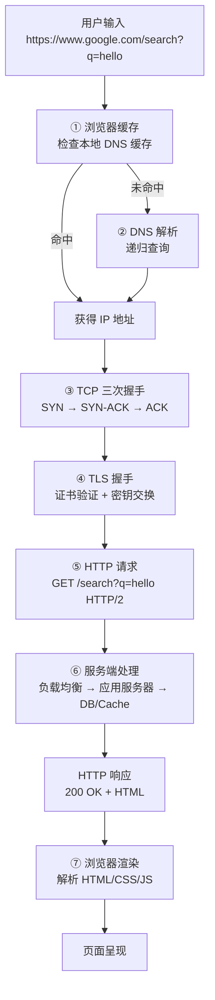
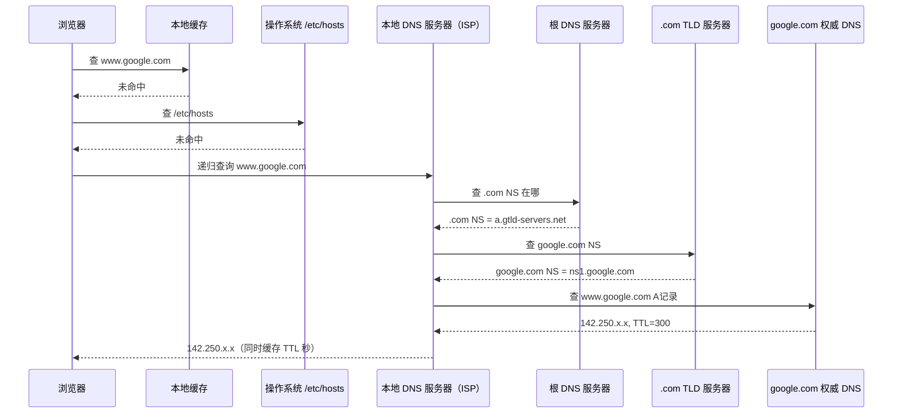
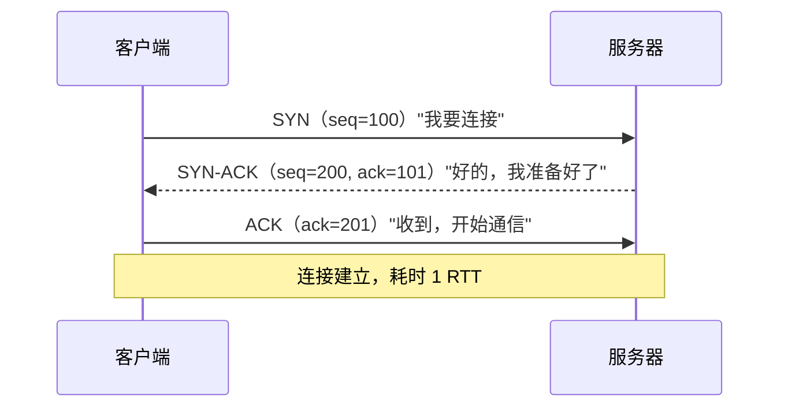
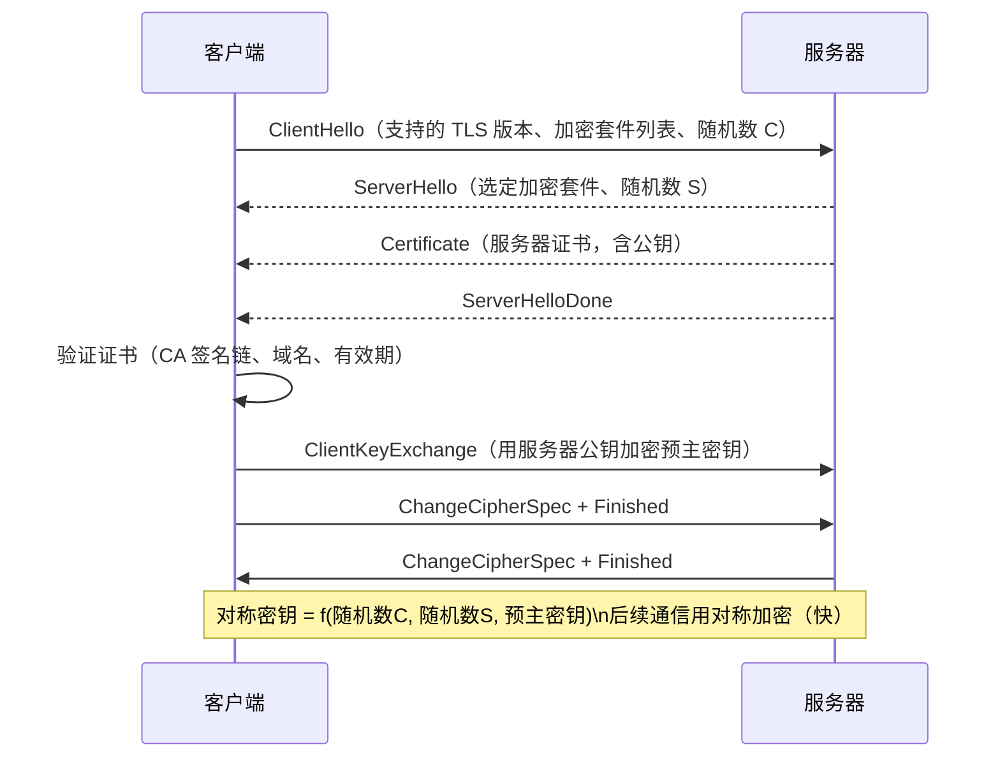
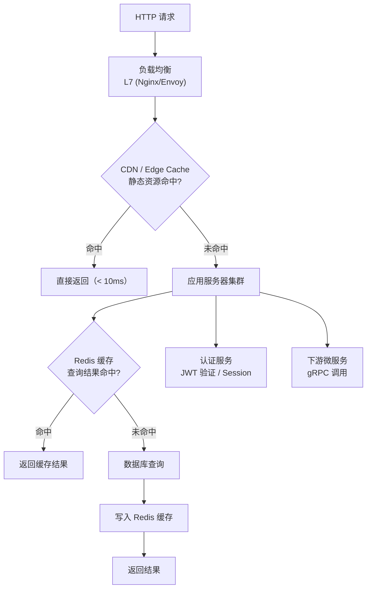
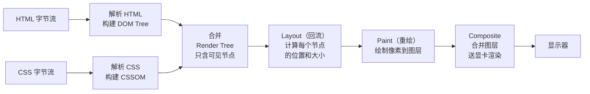

# 输入 URL 到页面显示：发生了什么？

## TL;DR

经典全栈考题，考察你对整个 Web 技术栈的理解深度。答案分 7 个阶段：DNS 解析 → TCP 握手 → TLS 握手 → HTTP 请求 → 服务端处理 → 浏览器渲染 → 页面呈现。

---

## 完整流程图



---

## ① DNS 解析



**关键点：**
- 浏览器缓存 → OS 缓存 → 本地 DNS → 根 DNS → TLD DNS → 权威 DNS（层层查找）
- TTL 控制缓存时间；CDN 靠低 TTL（几十秒）实现快速切换
- `hosts` 文件优先级高于 DNS（本地开发 `127.0.0.1 myapp.local`）

---

## ② TCP 三次握手



**为什么是三次而不是两次？**

两次握手服务器无法确认客户端能收到自己的包。三次握手双方各验证一次"对方能收到我发的包"。

**HTTP/2 的优化：** 同一个 TCP 连接复用多个请求（多路复用），不需要为每个资源重新握手。

---

## ③ TLS 握手（HTTPS）



**TLS 1.3 的优化：** 1-RTT 完成握手（比 TLS 1.2 的 2-RTT 快），支持 0-RTT 恢复（再次连接时 0 延迟）。

---

## ④ HTTP 请求

```
GET /search?q=hello HTTP/2
Host: www.google.com
Accept: text/html,application/xhtml+xml
Accept-Encoding: gzip, br       ← 支持压缩
Accept-Language: zh-CN,zh;q=0.9
Cookie: SIDCC=xxx; NID=xxx      ← 会话信息
Cache-Control: no-cache
User-Agent: Mozilla/5.0 ...
```

**HTTP/2 vs HTTP/1.1 关键区别：**

| | HTTP/1.1 | HTTP/2 |
|---|---|---|
| 传输格式 | 文本 | 二进制帧（Binary Frame）|
| 多路复用 | 不支持，队头阻塞 | 支持，同一连接并发多请求 |
| 头部压缩 | 无 | HPACK 压缩（重复头部只发差量）|
| 服务器推送 | 不支持 | 支持（Server Push）|

---

## ⑤ 服务端处理



**Google 搜索的特殊之处：**
- 查询不打 DB，而是查**倒排索引**（预构建的搜索索引集群）
- 结果排序用 PageRank + 机器学习模型打分
- 整个查询路径 < 200ms（含网络传输）

---

## ⑥ 浏览器渲染流水线



### 关键渲染路径（Critical Rendering Path）

```
HTML → DOM → Render Tree → Layout → Paint → Display

阻塞因素：
  ① CSS 阻塞渲染：浏览器拿到全部 CSS 才能构建 CSSOM，再才能渲染
     → 优化：<link> 放 <head>，内联关键 CSS
  ② JS 阻塞解析：遇到 <script> 立即停止解析 HTML，执行 JS
     → 优化：<script defer>（下载不阻塞，DOM 解析完后执行）
            <script async>（下载不阻塞，下载完立即执行）
```

### 性能指标

```
FCP  (First Contentful Paint)：首次有内容出现 < 1.8s
LCP  (Largest Contentful Paint)：最大内容绘制 < 2.5s（Core Web Vital）
TTI  (Time to Interactive)：可交互时间 < 3.8s
CLS  (Cumulative Layout Shift)：布局稳定性 < 0.1（Core Web Vital）
```

---

## 全程时间线

```
0ms       用户按回车
0-2ms     浏览器检查缓存、hosts 文件
2-50ms    DNS 解析（有缓存则 < 1ms）
50-100ms  TCP 三次握手（1 RTT，假设 RTT=50ms）
100-250ms TLS 1.3 握手（1 RTT）
250ms     发出 HTTP 请求
250-500ms 服务端处理（含网络传输）
500ms     收到 HTML 第一字节（TTFB）
500-800ms 解析 HTML、CSS，加载关键资源
800ms     FCP：页面有内容出现
1-3s      加载 JS、图片，页面完全可交互
```

---

## 面试追问

**Q: HTTP 和 HTTPS 的区别？**

HTTPS = HTTP + TLS。TLS 提供：①加密（防窃听）②完整性（防篡改，HMAC）③身份验证（证书确认服务器身份）。HTTP 是明文，中间人可看到全部内容。

**Q: 浏览器怎么知道证书是真的？**

证书由 CA（证书颁发机构）签名，浏览器内置信任的根 CA 列表。验证链：网站证书 → 中间 CA → 根 CA。自签名证书不在信任链里，所以浏览器报警告。

**Q: 同一个 IP 怎么部署多个 HTTPS 网站（虚拟主机）？**

TLS 的 **SNI（Server Name Indication）**：在 ClientHello 里带上域名，服务器根据域名选择对应的证书。这样一个 IP 可以服务多个 HTTPS 域名。

**Q: 为什么有时候刷新页面还是用旧的 CSS？**

浏览器缓存了旧 CSS 文件（`Cache-Control: max-age=31536000`）。解决方法：**Cache Busting** — 文件名加内容哈希（`style.a1b2c3.css`），内容变了文件名变了，强制加载新文件。

**Q: HTTP/3 解决了什么问题？**

HTTP/2 的队头阻塞在 TCP 层仍存在（一个包丢失，所有流都等待）。HTTP/3 基于 **QUIC**（UDP 实现），每个流独立，一个流的丢包不影响其他流。握手也更快（0-RTT 恢复）。
