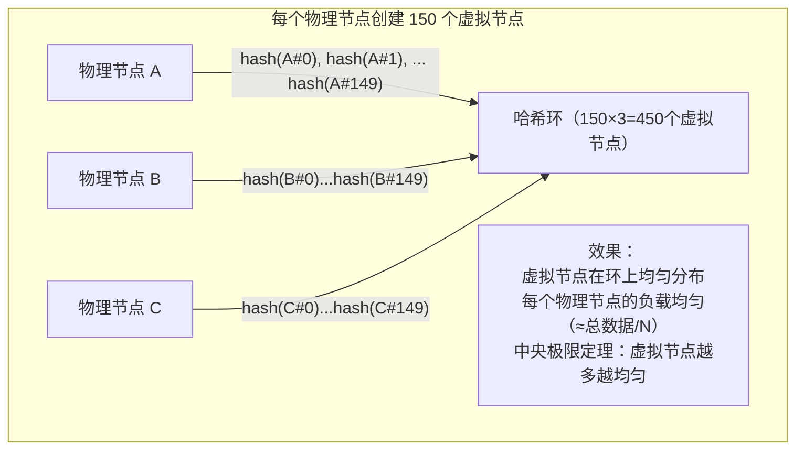
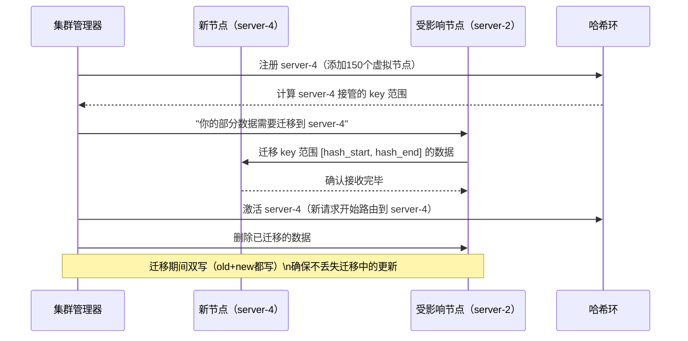
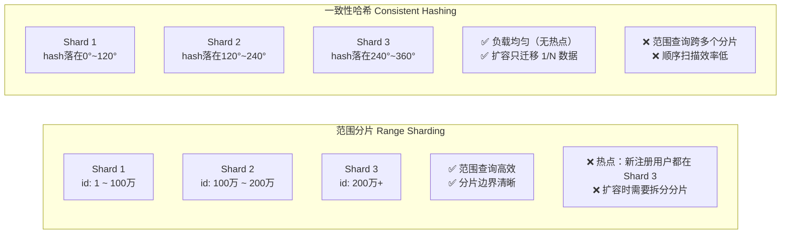

# 一致性哈希（Consistent Hashing）深度解析

## TL;DR

一致性哈希解决了**分布式系统扩缩容时数据迁移量大**的问题。传统取模哈希在节点增减时需要迁移几乎所有数据，而一致性哈希只需迁移 **1/N** 的数据。面试中必须能解释虚拟节点（Virtual Nodes）及其解决的问题。

---

## 对比：普通取模哈希 vs 一致性哈希

| | 取模哈希 `key % N` | 一致性哈希 |
|--|-----------------|----------|
| 增加1个节点 | 需要迁移约 `(N-1)/N` 的数据 | 只迁移 `1/(N+1)` 的数据 |
| 删除1个节点 | 需要迁移约 `(N-1)/N` 的数据 | 只迁移 `1/N` 的数据 |
| 实现复杂度 | 极简 | 中等（哈希环 + 二分查找）|
| 负载均衡 | 均匀 | 不均匀（需要虚拟节点解决）|
| 适用场景 | 数据量固定，不扩容 | 动态扩缩容，云原生 |

---

## 核心原理：哈希环

```mermaid
flowchart LR
    subgraph 哈希环（0 ~ 2^32-1）
        A["节点A\nHash=90°"]
        B["节点B\nHash=180°"]
        C["节点C\nHash=270°"]
        D["节点D\nHash=360°/0°"]
        
        K1["Key1\nHash=120°\n→ 顺时针找到B"]
        K2["Key2\nHash=200°\n→ 顺时针找到C"]
        K3["Key3\nHash=310°\n→ 顺时针找到D"]
        K4["Key4\nHash=60°\n→ 顺时针找到A"]
    end
```

**规则：**
1. 将哈希空间组成一个环（0 ~ 2³²-1，首尾相连）
2. 每个服务器节点用 `hash(server_name)` 映射到环上某个位置
3. 每个 key 用 `hash(key)` 映射到环上，**顺时针找到第一个服务器节点**
4. 增加节点时，只有该节点到其**前驱节点**之间的 key 需要迁移

---

## 节点变动时的数据迁移分析

```mermaid
flowchart TD
    subgraph 增加节点 E（插入到 B 和 C 之间）
        Before["迁移前：B 负责 hash(90°) ~ hash(180°)\n包含 Key1(120°)"]
        After["增加 E（150°）后：\nB 只负责 90° ~ 150°\nE 负责 150° ~ 180°\n只有 Key1(120°) 无需迁移，150° ~ 180° 的 key 迁移到 E"]
        Before --> After
    end
    
    subgraph 迁移数据量
        Formula["迁移量 ≈ 总数据量 / (N+1)\nN=4节点时，增加1个 → 迁移约 20%\n\n取模哈希 N→N+1：迁移约 N/(N+1)≈80%"]
    end
```

---

## 虚拟节点（Virtual Nodes / VNodes）

**问题：没有虚拟节点时的不均衡问题**

```mermaid
flowchart TD
    subgraph 3个物理节点，哈希环分布不均
        Ring["哈希环 0°~360°"]
        A1["节点A：0°"]
        B1["节点B：5°（靠近A，A几乎没有数据！）"]
        C1["节点C：180°（B负责 5°~180°的所有数据）"]
        
        Problem["B 承载 ~50% 数据\nA 承载 ~1% 数据\nC 承载 ~50% 数据\n严重不均衡"]
    end
```

**虚拟节点解决方案：**



---

## TypeScript 实现

```typescript
import { createHash } from 'crypto';

class ConsistentHashRing {
  private ring: Map<number, string> = new Map();
  private sortedKeys: number[] = [];
  private readonly virtualNodes: number;

  constructor(virtualNodes: number = 150) {
    this.virtualNodes = virtualNodes;
  }

  private hash(key: string): number {
    const buf = createHash('md5').update(key).digest();
    // 取前4字节作为32位无符号整数
    return buf.readUInt32BE(0);
  }

  addNode(node: string): void {
    for (let i = 0; i < this.virtualNodes; i++) {
      const virtualKey = `${node}#${i}`;
      const hash = this.hash(virtualKey);
      this.ring.set(hash, node);
      this.sortedKeys.push(hash);
    }
    this.sortedKeys.sort((a, b) => a - b);
  }

  removeNode(node: string): void {
    for (let i = 0; i < this.virtualNodes; i++) {
      const virtualKey = `${node}#${i}`;
      const hash = this.hash(virtualKey);
      this.ring.delete(hash);
      const idx = this.sortedKeys.indexOf(hash);
      if (idx !== -1) this.sortedKeys.splice(idx, 1);
    }
  }

  getNode(key: string): string | null {
    if (this.ring.size === 0) return null;
    const hash = this.hash(key);
    
    // 二分查找：顺时针找到第一个 >= hash 的节点
    let lo = 0, hi = this.sortedKeys.length - 1;
    while (lo < hi) {
      const mid = Math.floor((lo + hi) / 2);
      if (this.sortedKeys[mid] < hash) lo = mid + 1;
      else hi = mid;
    }
    
    // 环绕：如果所有节点都小于 hash，取第一个（环的起点）
    const idx = this.sortedKeys[lo] >= hash ? lo : 0;
    const nodeHash = this.sortedKeys[idx];
    return this.ring.get(nodeHash) ?? null;
  }

  // 获取某个 key 的 N 个副本节点（不同物理节点）
  getReplicaNodes(key: string, replicas: number): string[] {
    if (this.ring.size === 0) return [];
    const hash = this.hash(key);
    const result: string[] = [];
    const seen = new Set<string>();
    
    let lo = 0, hi = this.sortedKeys.length - 1;
    while (lo < hi) {
      const mid = Math.floor((lo + hi) / 2);
      if (this.sortedKeys[mid] < hash) lo = mid + 1;
      else hi = mid;
    }
    let startIdx = this.sortedKeys[lo] >= hash ? lo : 0;
    
    for (let i = 0; i < this.sortedKeys.length && result.length < replicas; i++) {
      const idx = (startIdx + i) % this.sortedKeys.length;
      const node = this.ring.get(this.sortedKeys[idx])!;
      if (!seen.has(node)) {
        seen.add(node);
        result.push(node);
      }
    }
    return result;
  }
}

// 使用示例
const ring = new ConsistentHashRing(150);
ring.addNode('server-1');
ring.addNode('server-2');
ring.addNode('server-3');

console.log(ring.getNode('user:12345'));        // → 某个server
console.log(ring.getReplicaNodes('data:abc', 3)); // → ['server-1','server-2','server-3']

// 扩容：只有部分 key 需要重新路由
ring.addNode('server-4');
// server-4 接管原来某些虚拟节点的范围内的 key，只有这些 key 需要迁移
```

---

## 节点扩缩容时的数据迁移流程



---

## 负载均衡分析

```mermaid
flowchart TD
    subgraph 虚拟节点数对负载分布的影响
        V10["10个虚拟节点/物理节点\n标准差：±15%（不均匀）"]
        V100["100个虚拟节点/物理节点\n标准差：±5%（较均匀）"]
        V150["150个虚拟节点/物理节点\n标准差：±3%（均匀，推荐）"]
        V1000["1000个虚拟节点\n标准差：±1%（极均匀，但内存开销大）"]
        V10 --> V100 --> V150 --> V1000
    end
    
    subgraph 不同权重的节点（异构集群）
        Big["高配节点（16核64GB）\n分配 300 个虚拟节点（占比多）"]
        Small["低配节点（4核16GB）\n分配 75 个虚拟节点（占比少）"]
        BigSmall["负载按硬件能力自动分配！"]
        Big & Small --> BigSmall
    end
```

---

## 实际系统中的应用

| 系统 | 一致性哈希的用途 | 虚拟节点数 |
|------|--------------|----------|
| Amazon DynamoDB | 数据分片（Token Ring）| 可配置 |
| Apache Cassandra | 数据分片（vnode）| 默认 256 |
| Redis Cluster | 哈希槽（16384个槽）| 16384 槽=虚拟节点 |
| Memcached | 缓存分片 | 150-200 |
| Nginx upstream | 负载均衡 | 实现级可配 |

**Redis Cluster 的哈希槽（本质上也是虚拟节点）：**

```
Redis Cluster 使用 16384 个哈希槽（slot）：
  key → CRC16(key) % 16384 → slot 编号
  每个节点负责一段连续的 slot 范围
  
  优点：slot 数量固定（不是环），迁移更简单（移动 slot 而非计算范围）
  类比：16384 个虚拟节点，节点间重新分配这些虚拟节点
```

---

## 与 Range-Based Sharding 对比



**选择原则：**

```
时间序列数据（日志、监控）→ Range Sharding（按时间范围查询效率高）
用户数据/缓存 → 一致性哈希（均匀分布，避免热点）
电商订单 → 可以两者结合（按 user_id 一致性哈希，订单在用户分片内按时间范围存储）
```

---

## 面试追问

**Q: 为什么 Cassandra 默认 256 个虚拟节点，而不是 10 个或 10000 个？**

虚拟节点数的 tradeoff：  
- 太少（< 50）：节点间负载方差大，扩容时迁移不均匀  
- 太多（> 500）：内存开销大（每个虚拟节点要存 hash → 物理节点的映射），且扩容时需要计算的范围太多  
- 150~256：经验值，负载标准差在 3-5%，内存开销可接受

**Q: 一致性哈希能保证同一用户的请求总路由到同一服务器吗（Sticky Session）？**

是的，只要节点数不变，`hash(user_id)` 总是映射到同一节点。  
但节点故障/扩容后，部分用户会路由到新节点，Session 失效。  
解决：不依赖本地 Session（改用 Redis 存 Session），或客户端 re-login。

**Q: 如果哈希函数分布不均（所有 key 都 hash 到同一区间），怎么办？**

① 换更好的哈希函数（MD5/xxHash/MurmurHash），大多数哈希函数对随机输入分布均匀  
② 虚拟节点从不同 seed 派生：`hash(node + "#" + i)` 而不是 `hash(node) + i`  
③ 监控各节点的实际 QPS 和数据量，如发现持续不均，增加虚拟节点数
