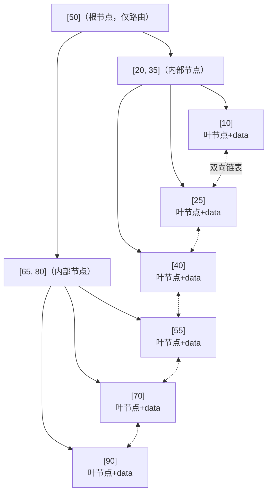
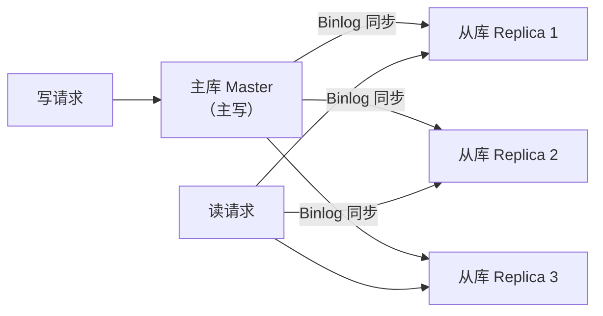

# 关系型数据库：索引 / 复制 / 分片

## TL;DR

- **索引**：用空间换时间，把 O(N) 的全表扫描变成 O(log N) 的树查找
- **主从复制**：写主库，读从库，提升读吞吐；主库挂了从库顶上，提升可用性
- **分片（Sharding）**：把数据水平切割分散到多台机器，突破单机存储和性能上限

这三个技术是关系型数据库应对规模增长的核心手段，按这个顺序使用：索引优化 → 主从分离 → 分片。

---

## 索引（Index）

### 为什么需要索引

没有索引时，数据库查找数据要全表扫描（Table Scan）：

```sql
SELECT * FROM users WHERE email = 'alice@example.com';
-- 没有索引：遍历每一行，对比 email，O(N)
-- 100万行数据 → 可能扫描 100万行
```

加了索引：

```sql
CREATE INDEX idx_users_email ON users(email);
-- 查询走索引：O(log N)，100万行只需约 20 次比较
```

### B+ Tree 索引（最常见）

MySQL InnoDB 和 PostgreSQL 默认使用 **B+ Tree（B+树）** 索引。

**B+ Tree 的结构：**



**为什么用 B+ Tree 而不是普通二叉树？**

- 普通二叉树（AVL/红黑树）树高 O(log₂N)，100万行需要约 20 层，每层一次磁盘 I/O → 20 次磁盘读
- B+ Tree 每个节点可以存放很多 key（节点大小 = 磁盘页大小，通常 16KB），树高只有 3-4 层 → 3-4 次磁盘读
- 叶节点形成有序链表，范围查询（`WHERE id BETWEEN 100 AND 200`）非常高效，不需要回溯

**聚簇索引（Clustered Index）vs 非聚簇索引（Non-Clustered Index）：**

- **聚簇索引**：叶节点直接存数据行本身。InnoDB 的主键索引是聚簇索引，数据按主键顺序物理存储
- **非聚簇索引（二级索引）**：叶节点存的是主键值，查到主键后还需要再查一次聚簇索引（**回表**）

```
-- 查询走非聚簇索引（email 索引），需要回表
SELECT * FROM users WHERE email = 'alice@example.com';
-- 1. email 索引找到主键 id = 42
-- 2. 用 id = 42 查聚簇索引，得到完整行数据
-- 共 2 次索引查找

-- 覆盖索引：查询的列都在索引里，不需要回表
SELECT id, email FROM users WHERE email = 'alice@example.com';
-- 如果索引是 (email, id)，直接从索引返回，不回表
```

### 索引失效的场景（重要）

以下操作会导致索引不被使用：

```sql
-- 1. 对索引列做函数计算
SELECT * FROM users WHERE YEAR(created_at) = 2024;  -- 索引失效
-- 改写：WHERE created_at >= '2024-01-01' AND created_at < '2025-01-01'

-- 2. 隐式类型转换
SELECT * FROM users WHERE phone = 13800138000;  -- phone 是 VARCHAR，传了 INT
-- 改写：WHERE phone = '13800138000'

-- 3. LIKE 以通配符开头
SELECT * FROM users WHERE name LIKE '%alice';  -- 索引失效
-- LIKE 'alice%' 可以用索引，'%alice' 不行

-- 4. 联合索引没有遵循最左前缀
-- 索引：(a, b, c)
SELECT * FROM t WHERE b = 1;   -- 索引失效，没有从 a 开始
SELECT * FROM t WHERE a = 1;   -- 可以用索引
SELECT * FROM t WHERE a = 1 AND b = 1;  -- 可以用索引
```

### 什么时候不该加索引

- **低基数列**（Cardinality 低）：性别字段只有 M/F，索引没有意义，扫描一半的行和全表扫描差不多
- **频繁写入的表**：每次 INSERT/UPDATE/DELETE 都要维护索引，写入性能下降
- **小表**：几千行以内，全表扫描比走索引还快（索引有额外查找开销）

---

## 主从复制（Replication）

### 为什么需要复制

单台数据库的问题：
- 读写都打到一台机器，QPS 有上限
- 机器挂了，整个服务不可用

主从复制用一台**主库（Master/Primary）**负责写，多台**从库（Replica/Slave）**负责读：



### 复制原理：Binlog

MySQL 通过 **Binlog（Binary Log，二进制日志）** 实现复制：

```
1. 客户端写入主库
2. 主库把操作记录写入 Binlog（格式：Row/Statement/Mixed）
3. 从库的 I/O 线程连接主库，拉取新的 Binlog 事件
4. 从库把 Binlog 写入 Relay Log（中继日志）
5. 从库的 SQL 线程读取 Relay Log，重放操作
```

### 同步方式

**异步复制（默认）：**
- 主库写完，立即返回成功，不等从库确认
- 优点：性能好，主库不受从库影响
- 缺点：主库挂了，未同步的数据丢失（复制延迟）

**半同步复制：**
- 主库写完后，至少等 1 个从库确认收到 Binlog，再返回成功
- 优点：减少数据丢失窗口
- 缺点：增加了主库的写入延迟

**同步复制：**
- 等所有从库确认后才返回
- 优点：强一致
- 缺点：延迟高，任何一个从库慢都影响主库写入

### 复制延迟（Replication Lag）

从库的数据落后主库的时间叫**复制延迟**。高峰期可能有几秒甚至几十秒。

**影响：** 写完主库立刻读从库，可能读到旧数据（Write-After-Read 问题）

**常见解决方案：**
- **读己写一致性**：用户刚写入的内容，该用户后续读取时强制读主库
- **带时间戳的路由**：写入时记录时间戳，读取时如果从库延迟超过阈值，转到主库读
- **接受延迟**：对于不关键的展示（比如点赞数），接受几秒的延迟

### 故障转移（Failover）

主库挂了，需要将一台从库**提升（promote）**为新主库：

**手动切换**：DBA 操作，慢但可控
**自动切换**：使用 MHA（MySQL High Availability）、Orchestrator 等工具，或云数据库的自动故障转移功能（如 AWS RDS Multi-AZ）

自动切换的风险：**脑裂（Split Brain）**——旧主库网络闪断后恢复，和新主库同时接受写入，造成数据冲突。解决方案是 STONITH（Shoot The Other Node In The Head），确保旧主库被彻底隔离。

---

## 分片（Sharding）

### 什么时候需要分片

- 单台主库写入达到瓶颈（通常 MySQL 在 10000 QPS 左右）
- 数据量超过单机磁盘容量（几 TB 以上）
- 复制已经无法解决问题（复制只分担读，写仍然是单机）

**分片应该是最后手段，优先使用：**
1. 优化查询和索引
2. 增加缓存
3. 读写分离
4. 升级更强的机器（垂直扩展）
5. 分表（只分表不分库）

### 分片策略

**水平分片（Horizontal Sharding）：** 把表的行拆分到不同数据库实例

**范围分片（Range Sharding）：**
```
用户 ID 1-1000000    → Shard 1
用户 ID 1000001-2000000 → Shard 2
用户 ID 2000001-3000000 → Shard 3
```
优点：范围查询高效，扩容简单（直接加新分片存新范围的数据）
缺点：热点问题（新注册用户都在最新分片，写入不均匀）

**哈希分片（Hash Sharding）：**
```
shard = hash(user_id) % N   （N = 分片数）
```
优点：数据分布均匀，没有热点
缺点：范围查询要扫所有分片；扩容时（N 变了）大量数据要重新分配（**一致性哈希**可以缓解这个问题）

**目录分片（Directory Sharding）：**
维护一张路由表（`user_id → shard_id`），每次查询先查路由表再查对应分片
优点：灵活，可以动态调整
缺点：路由表是单点，本身需要高可用

### 分片带来的问题

**跨分片查询：**
```sql
-- 这个查询在分片后无法在单个数据库完成
SELECT u.name, o.total FROM users u JOIN orders o ON u.id = o.user_id;
-- 需要应用层在多个分片上查询后聚合，或者在设计时把相关数据放在同一分片
```

**跨分片事务：**
两个分片上的操作无法用单个数据库事务保证，需要分布式事务（2PC 或 Saga），复杂度大幅上升。

**分片键选择：**
一旦选定，几乎不可更改。选错了（比如按国家分片，某个国家用户爆炸性增长），会造成严重的数据倾斜。

---

## 与 Node.js/TS 生态的类比

你用 Prisma 时，查询计划（Query Plan）是这样分析的：

```bash
# 在 PostgreSQL 里执行，看查询是否走了索引
EXPLAIN ANALYZE SELECT * FROM users WHERE email = 'alice@example.com';

# 输出示例（走了索引）：
# Index Scan using idx_users_email on users
#   Index Cond: (email = 'alice@example.com')
#   Planning Time: 0.1 ms
#   Execution Time: 0.05 ms

# 输出示例（没走索引，全表扫描）：
# Seq Scan on users
#   Filter: (email = 'alice@example.com')
#   Rows Removed by Filter: 999999
#   Execution Time: 450 ms
```

这是你排查慢查询时最常用的工具。遇到慢查询，第一步永远是 `EXPLAIN`。

---

## 常见陷阱

1. **为每一列都加索引**：每个索引都占磁盘空间，且写入时要维护，大量索引会拖慢写入
2. **联合索引顺序错误**：`(status, user_id)` 和 `(user_id, status)` 适用的查询不同，要按最常用的查询模式建索引
3. **过早分片**：分片会引入大量复杂度，绝大多数系统在需要分片之前就能通过其他手段解决性能问题
4. **忽略复制延迟**：写完主库立刻读从库，读到旧数据，引发业务 Bug（比如：刚修改了密码，立刻登录却说密码错误）
5. **分片键选择不当**：按 `created_at` 分片，老数据冷新数据热，分片不均；按 `user_id` 哈希分片，某个大客户的数据就集中在一个分片

---

## 面试常见问答

### 简单

**Q：什么是数据库索引？为什么能加速查询？**

A：索引是数据库为特定列创建的额外数据结构（通常是 B+ Tree），用空间换时间。没有索引时，查找一条记录要全表扫描，时间复杂度 O(N)。有了索引，B+ Tree 的高度只有 3-4 层，查找复杂度降为 O(log N)，且每次只需要 3-4 次磁盘 I/O。代价是索引占额外磁盘空间，且每次写入都要同时维护索引结构。

---

**Q：主从复制中，从库的数据一定和主库一样吗？**

A：不一定。异步复制（默认配置）下，主库写完就返回，从库异步同步，存在复制延迟。这段延迟内，从库数据落后于主库。延迟通常是毫秒级，但高峰期可能到秒级甚至更长。这就是为什么"读己写"场景（用户刚写入后立刻读取）不能读从库，需要读主库。

---

### 中等

**Q：MySQL 的 B+ Tree 索引为什么把所有数据放在叶节点，而不是内部节点也存数据？**

A：B+ Tree 相比 B Tree（内部节点也存数据），有两个优势：
1. **内部节点更小**，每个节点能存更多 key，树更矮，减少磁盘 I/O
2. **叶节点之间有链表**，支持高效的范围查询——找到起始叶节点后，沿链表顺序扫描即可，不需要回溯内部节点

大多数数据库的范围查询（`BETWEEN`、`ORDER BY`）都非常高频，叶节点链表是 B+ Tree 的核心优势。

---

**Q：什么是覆盖索引（Covering Index）？什么情况下有用？**

A：覆盖索引是指查询所需的所有列都包含在索引中，不需要回表查主键索引。例如查询 `SELECT id, email FROM users WHERE email = 'alice@example.com'`，如果索引是 `(email, id)`，则 email 和 id 都在索引里，直接从索引返回，省去了一次回表 I/O。覆盖索引在高频查询、数据量大、回表开销明显时效果显著。建联合索引时可以有意将常用查询的返回列也加进索引。

---

### 难

**Q：假设用户表有 1 亿行数据，按 user_id 分片到 4 个库，现在需要扩容到 8 个库，怎么做？**

A：这是分片扩容的经典难题。直接改分片数（N=4 → N=8）会导致大部分数据的目标分片改变（hash(id) % 8 ≠ hash(id) % 4），需要迁移大量数据，风险极高。

方案1：**翻倍扩容（常用）**
每个分片一分为二，数据迁移量最小。步骤：
- 新建 4 个空分片
- 每个旧分片的数据按新规则拆分到旧分片和对应的新分片（各保留一半）
- 双写过渡：写入同时写旧分片和新分片
- 验证数据一致后，切换读流量，停止双写

方案2：**一致性哈希**
从设计阶段就用一致性哈希，虚拟节点机制使扩容时只有少量数据需要迁移（约 1/N 的数据）。但初期实现复杂。

方案3：**逻辑分片 > 物理分片**
设计时逻辑上分成 1024 个分片（足够多），物理上 4 台机器各管 256 个逻辑分片。扩容时把部分逻辑分片移到新机器，无需重新哈希，只需更新路由表。这是 Twemproxy 等代理的常见做法。

---

**Q：数据库读写分离后，如何处理"读己写"一致性问题（用户写完马上读到旧数据）？**

A：有几种方案，按复杂度排序：

1. **写操作后的一段时间内强制读主库**：设置一个时间窗口（如 1 秒），用户最近有写入时，读请求路由到主库。实现简单，但浪费主库资源
2. **同步点（Sync Point）**：记录每次写入对应的 Binlog 位置，读取时检查从库是否已同步到该位置，未到则等待或读主库
3. **Session 级路由**：用户在同一次会话（Session）内的读请求都路由到主库，会话结束后才走从库。适合用户对自己数据非常敏感的场景
4. **接受最终一致性**：提示用户"数据处理中，稍后刷新"，产品层面解决一致性感知问题。对非关键场景最简单

实际工程中通常用方案 1 或方案 4，方案 2 需要数据库中间件支持（如 ProxySQL）。

---

## 关联文档

- [00_choice_framework.md](00_choice_framework.md) — 什么时候选关系型数据库
- [02_nosql.md](02_nosql.md) — 对比 NoSQL 的存储模型
- [../04_distributed/01_consistency_models.md](../04_distributed/01_consistency_models.md) — 主从复制的一致性模型
- [../04_distributed/02_distributed_tx.md](../04_distributed/02_distributed_tx.md) — 跨分片事务的处理方式
