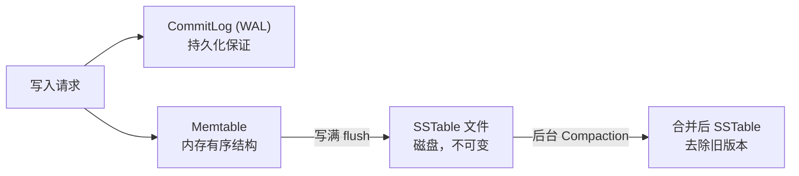
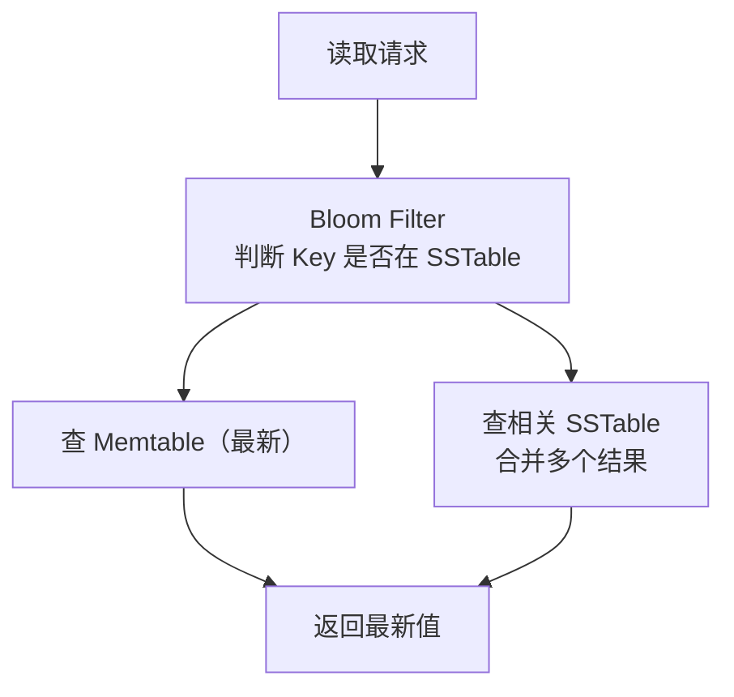

# NoSQL 全景：KV / 文档 / 列 / 图

## TL;DR

NoSQL 不是一种数据库，是**四类完全不同的数据库**的统称，每类解决不同问题：
- **KV（键值）**：Redis / DynamoDB — 极低延迟，简单查找
- **文档型**：MongoDB — 灵活 Schema，JSON 文档
- **宽列（列族）**：Cassandra / HBase — 极高写入吞吐，时序/事件数据
- **图**：Neo4j — 关系密集，多跳查询

选错类型比选错具体产品危害更大。

---

## KV（键值）数据库

### 数据模型

最简单的数据模型：一个 Key 对应一个 Value。

```
Key          Value
----------   ----------------------------
user:1       {"name": "Alice", "age": 30}
session:abc  {"userId": 1, "expires": ...}
counter:pv   1024
```

Value 对数据库来说是不透明的二进制，数据库不解析它，只管存和取。

### Redis

Redis 是最常用的 KV 数据库，但它不只是简单 KV，支持丰富的数据结构：

| 数据结构 | 命令 | 适用场景 |
|---------|------|---------|
| String | GET/SET | 缓存、计数器、分布式锁 |
| Hash | HGET/HSET | 对象属性（减少序列化开销） |
| List | LPUSH/RPOP | 消息队列、最新消息列表 |
| Set | SADD/SMEMBERS | 标签、关注列表（去重） |
| Sorted Set | ZADD/ZRANGE | 排行榜、带分数的优先级队列 |
| Bitmap | SETBIT/GETBIT | 用户签到、布隆过滤器 |
| HyperLogLog | PFADD/PFCOUNT | 近似计数（UV 统计，误差约 0.81%） |
| Stream | XADD/XREAD | 消息流（轻量级 Kafka） |

**Redis 的特点：**
- 全内存操作，读写延迟 < 1ms
- 单线程处理命令（避免锁），QPS 可达 10 万+
- 持久化选项：RDB（快照）或 AOF（追加日志），可配置持久化强度
- 集群模式（Redis Cluster）：16384 个哈希槽分配到不同节点，水平扩展

**Redis 的限制：**
- 数据量受内存大小限制
- 不支持复杂查询（只能按 Key 查，不能 SELECT WHERE）
- 不是主数据库，宕机有数据丢失风险

### DynamoDB

AWS 的全托管 KV/文档数据库，适合需要极高扩展性且不想运维的场景：

- 无服务器（Serverless），自动扩缩容
- 单位键查询延迟 < 10ms
- 支持 LSM Tree 结构，写入吞吐极高
- 支持全局表（Global Tables）多地域复制

**DynamoDB 的限制：** 查询必须通过主键或二级索引，不支持任意过滤（没有 WHERE 任意列），设计时需要仔细规划访问模式。

---

## 文档型数据库

### 数据模型

文档型数据库以 JSON（或 BSON）文档为单位存储数据，文档可以嵌套，不同文档的结构可以不同：

```json
// 用户文档
{
  "_id": "user_001",
  "name": "Alice",
  "email": "alice@example.com",
  "address": {                      // 嵌套对象
    "city": "Shanghai",
    "zip": "200000"
  },
  "tags": ["premium", "verified"],  // 数组
  "createdAt": "2024-01-01"
}

// 另一个用户文档（结构不同，没有 address 字段，有 phone 字段）
{
  "_id": "user_002",
  "name": "Bob",
  "phone": "138xxxx",
  "createdAt": "2024-02-01"
}
```

这就是 **Schema 灵活性**：不同文档可以有不同字段，无需提前定义全部字段。

### MongoDB

最流行的文档数据库。

**适合 MongoDB 的场景：**
- 字段不固定，Schema 经常变动（产品早期迭代快）
- 数据天然是嵌套文档结构（订单含商品列表，用户含地址）
- 需要水平扩展（MongoDB 内置 Sharding）

**MongoDB 的查询能力：**

```javascript
// 可以按任意字段查询（需要对应索引）
db.users.find({ "address.city": "Shanghai", tags: "premium" })

// 聚合管道
db.orders.aggregate([
  { $match: { status: "completed" } },
  { $group: { _id: "$userId", total: { $sum: "$amount" } } },
  { $sort: { total: -1 } }
])
```

**MongoDB 的限制：**
- 跨文档事务（4.0 版本后支持，但性能有代价）
- 不适合有大量复杂 JOIN 的场景（虽然有 $lookup，但效率不如 RDBMS）
- Schema 灵活是双刃剑：容易写入垃圾数据，需要应用层做数据校验

---

## 宽列数据库（Wide-Column Store）

### 数据模型

宽列数据库的核心思想和关系型数据库不同：

```
关系型数据库：每行有固定的列，所有行结构相同
宽列数据库：每行可以有不同的列，且列可以有时间戳（多版本）
```

以 Cassandra 为例：

```
PartitionKey  ClusteringKey  Column1   Column2   Column3
user_001      2024-01-01     event_A   event_B
user_001      2024-01-02     event_C             event_D
user_002      2024-01-01               event_E
```

数据按 **PartitionKey** 决定存在哪个节点（分区），同一分区内按 **ClusteringKey** 排序。

### Cassandra

**Cassandra 的设计目标：高可用 + 高写入吞吐**

**写入原理（LSM Tree）：**



写入只是追加（Append-Only），没有随机写，因此写入速度极快。

**读取原理：**



读取比写入慢，因为可能要合并多个 SSTable。

**Cassandra 的特点：**
- 无主节点，对等架构（Peer-to-Peer），没有单点故障
- 可调一致性（Quorum 读写，详见 04_distributed/01_consistency_models.md）
- 数据按 PartitionKey 分布，同一分区的数据保证在同一节点（或副本）
- 不支持 JOIN，不支持任意查询，必须按分区键查

**Cassandra 最适合的场景：**
- 时间序列数据（监控指标、IoT 数据）
- 消息/事件流（按用户 ID + 时间查询）
- 大量写入、写多读少的场景

**Cassandra 的数据建模思路：** 和关系型数据库完全相反——**先想好查询，再设计表结构**。每种查询模式通常需要单独建一张表（冗余存储），用空间换查询效率。

---

## 图数据库

### 数据模型

图数据库以**节点（Node）**和**边（Edge）**为基本单位：

```
(Alice) -[关注]→ (Bob)
(Alice) -[点赞]→ (帖子A)
(Bob)   -[评论]→ (帖子A)
```

节点和边都可以有属性（Property）。

### 什么场景适合图数据库

**多跳关系查询：**

```cypher
// 用 Cypher 查询语言（Neo4j）
// 找出 Alice 的朋友的朋友（2跳）
MATCH (alice:User {name: "Alice"})-[:FRIEND]->(friend)-[:FRIEND]->(fof)
WHERE fof <> alice
RETURN fof.name

// 用 SQL 实现同样的查询需要多次自连接，性能差
SELECT u3.name FROM users u1
  JOIN friendships f1 ON u1.id = f1.user_id AND u1.name = 'Alice'
  JOIN friendships f2 ON f1.friend_id = f2.user_id
  JOIN users u3 ON f2.friend_id = u3.id
  WHERE u3.id != u1.id;
```

跳数越多，SQL 的性能越差（指数级），而图数据库的遍历算法对多跳查询非常高效。

**适合图数据库的场景：**
- 社交网络（好友推荐、共同好友）
- 知识图谱（实体关系）
- 欺诈检测（账号间的关联网络）
- 推荐系统（"买了 A 的人也买了 B"）
- 访问控制图（权限依赖关系）

**不适合图数据库的场景：**
- 普通的业务数据（关系不密集）
- 大量数据的批量聚合（图数据库不擅长 GROUP BY、SUM 等操作）

---

## 四类 NoSQL 横向对比

| 维度 | KV（Redis） | 文档（MongoDB） | 宽列（Cassandra） | 图（Neo4j） |
|------|------------|----------------|-----------------|------------|
| 数据模型 | Key-Value | JSON 文档 | 行 + 动态列 | 节点 + 边 |
| 查询能力 | 只能按 Key | 灵活，支持嵌套查询 | 按分区键+聚集键 | 图遍历，多跳查询 |
| 写入性能 | 极高（内存） | 高 | 极高（LSM Tree） | 中 |
| 读取性能 | 极高（内存） | 高 | 中（多 SSTable） | 高（关系遍历） |
| 水平扩展 | 有（Cluster） | 有（Sharding） | 天然（Peer-to-Peer） | 有限 |
| 一致性 | 可配置 | 可配置 | 可调（Quorum） | 强一致（单机） |
| 事务 | 有限（单命令原子） | 多文档事务（4.0+） | 轻量级事务 | 完整 ACID |
| 适用场景 | 缓存、会话、计数 | 内容管理、用户档案 | 时序、事件、消息 | 社交、推荐、权限 |

---

## 与 Node.js/TS 生态的类比

你可能用过这些库：

```typescript
// Redis（KV）
import { Redis } from 'ioredis';
const redis = new Redis();
await redis.setex('user:1:profile', 3600, JSON.stringify(user));
const cached = await redis.get('user:1:profile');

// MongoDB（文档型）
import { MongoClient } from 'mongodb';
const users = db.collection('users');
await users.insertOne({ name: 'Alice', address: { city: 'Shanghai' } });
const result = await users.find({ 'address.city': 'Shanghai' }).toArray();

// 注意：你用 Mongoose/Prisma 连 MongoDB 时，
// Schema 约束是应用层加的，不是数据库原生的
```

---

## 常见陷阱

1. **用 MongoDB 做关系型数据应该做的事**：文档嵌套不能替代 JOIN，数据冗余导致更新困难
2. **Cassandra 的数据建模照搬关系型**：没有先想查询模式，导致查询要全表扫描（Cassandra 的全表扫描代价极高）
3. **Redis 存了超大 Value**：单个 Value 超过 MB 级，会阻塞 Redis 单线程，影响所有其他请求
4. **用图数据库存普通业务数据**：Neo4j 在节点/边超过亿级时性能下降，大多数业务关系用 RDBMS 就够
5. **把 DynamoDB 当作有灵活查询能力的 RDBMS**：DynamoDB 的每种查询模式都需要提前建索引或设计表结构，灵活性极差

---

## 面试常见问答

### 简单

**Q：Redis 和 Memcached 有什么区别？**

A：两者都是内存 KV 缓存，主要区别：Redis 支持丰富的数据结构（List、Set、Sorted Set、Hash 等），Memcached 只有字符串。Redis 支持持久化（RDB/AOF），Memcached 不持久化。Redis 单线程处理命令（6.0 后 IO 多线程），Memcached 多线程。Redis 支持 Pub/Sub、Lua 脚本、事务，Memcached 不支持。现在几乎所有新项目都选 Redis，Memcached 的使用场景越来越少。

---

**Q：MongoDB 的 ObjectId 是什么？有什么特点？**

A：ObjectId 是 MongoDB 自动生成的 12 字节唯一 ID（`_id` 字段默认值）。组成：4 字节 Unix 时间戳 + 5 字节随机值 + 3 字节递增计数器。特点：时间有序（可以按 ObjectId 排序推断插入时间）；在分布式环境中保证唯一（不需要中心协调）；比 UUID 短（24 位十六进制字符串 vs 36 位）。

---

### 中等

**Q：Cassandra 为什么写入速度比 MySQL 快很多？**

A：本质区别是**写入方式**：MySQL（InnoDB）用 B+ Tree，写入需要找到正确位置并插入，涉及随机磁盘 I/O 和页分裂。Cassandra 用 LSM Tree（Log-Structured Merge Tree），写入只是追加到 CommitLog 和 Memtable，是顺序写，磁盘顺序写比随机写快 10-100 倍。代价是读取时要合并多个 SSTable（但可以用 Bloom Filter 过滤），读性能不如 B+ Tree。

---

**Q：什么是 MongoDB 的 Change Stream？有什么用？**

A：Change Stream 是 MongoDB 3.6 引入的功能，允许应用订阅集合/数据库/整个实例的数据变更事件（INSERT、UPDATE、DELETE），类似于 MySQL 的 Binlog。用途：实时同步数据到其他系统（如 Elasticsearch、Redis）、触发副作用（数据变更时发通知）、事件驱动架构的数据源。实现原理是基于 Oplog（操作日志），Change Stream 是对 Oplog 的友好封装。

---

### 难

**Q：设计一个系统存储 10 亿用户的社交关系（关注/粉丝），每秒新增 10 万条关系，如何选型和设计？**

A：这是高写入 + 关系查询的混合场景，需要多存储配合：

**写入存储（Cassandra）：**
关系是事件型数据，高写入，按用户查询（"A 关注了谁"、"谁关注了 A"）：
```
表1 following (user_id, target_id, created_at)  -- 查某用户关注了谁
表2 followers (user_id, follower_id, created_at) -- 查某用户的粉丝
```
冗余存储，两张表分别按不同维度查询。

**关系计算（图数据库或计算层）：**
如果需要多跳查询（推荐算法：关注你的人也关注了谁），从 Cassandra 批量导入到图数据库（Neo4j/Amazon Neptune）做离线计算，或者用 Spark GraphX 做图计算。

**缓存（Redis）：**
用 Sorted Set 缓存头部用户（大 V）的粉丝列表，减少 Cassandra 的读压力：
```
ZADD followers:user_001 <timestamp> follower_id
ZRANGE followers:user_001 0 99  -- 获取最新 100 个粉丝
```

**关键设计决策：** 大 V 的粉丝数可能有几亿，要做特殊处理（分段存储，异步广播），不能和普通用户用同一套逻辑。

---

## 关联文档

- [00_choice_framework.md](00_choice_framework.md) — 选型决策框架
- [03_cache.md](03_cache.md) — Redis 作为缓存层的使用模式
- [../04_distributed/01_consistency_models.md](../04_distributed/01_consistency_models.md) — Cassandra 的可调一致性
- [../06_case_studies/06_chat_system.md](../06_case_studies/06_chat_system.md) — Cassandra 在消息系统中的应用
