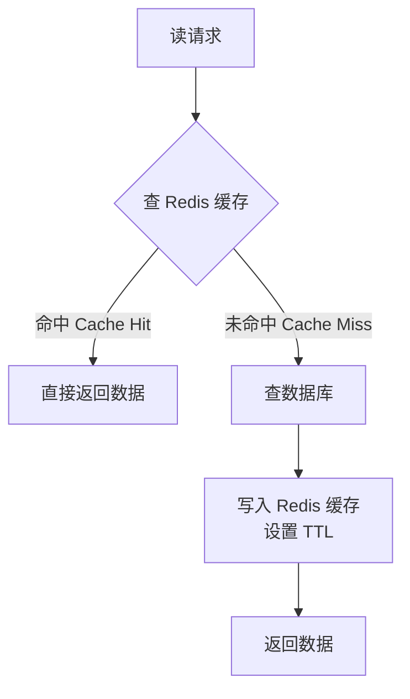

# 缓存：策略 / 穿透 / 击穿 / 雪崩

## TL;DR

- **缓存**：把慢速数据源的数据存在快速存储中，以空间换时间
- **三大模式**：Cache-Aside（最常用）/ Write-Through / Write-Back
- **三大问题**：缓存穿透（查不存在的 Key）/ 缓存击穿（热点 Key 过期）/ 缓存雪崩（大量 Key 同时过期）

每个问题都有标准解法，面试必考。

---

## 为什么需要缓存

数据库的读取延迟通常在 1-10ms，而 Redis 的读取延迟在 0.1ms 以内。对于读多写少的数据，每次都查数据库是浪费：

```
没有缓存：
用户请求 → 应用服务器 → 数据库（10ms）→ 返回

有缓存：
用户请求 → 应用服务器 → Redis 缓存（0.1ms）→ 返回（缓存命中）
                       → 数据库 → Redis 写入 → 返回（缓存未命中）
```

缓存的本质是**以内存换 latency**，以**数据副本**换**访问速度**。

---

## 缓存读写策略

### Cache-Aside（旁路缓存，最常用）

**读取流程：**



**写入流程：**


**为什么写入时"删除"而不是"更新"缓存？**

更新缓存有并发问题：

```
线程A 写数据库（值=2），准备更新缓存
线程B 写数据库（值=3），更新缓存（值=3）
线程A 更新缓存（值=2）← 覆盖了线程B，缓存是旧值
```

删除缓存是幂等的，不存在覆盖问题。删除后，下次读请求会重建缓存。

**Cache-Aside 的代码示例：**

```typescript
async function getUser(userId: string): Promise<User> {
  // 1. 查缓存
  const cached = await redis.get(`user:${userId}`);
  if (cached) return JSON.parse(cached);

  // 2. 查数据库
  const user = await db.users.findOne({ id: userId });
  if (!user) return null;

  // 3. 写入缓存，设 TTL
  await redis.setex(`user:${userId}`, 3600, JSON.stringify(user));
  return user;
}

async function updateUser(userId: string, data: Partial<User>): Promise<void> {
  // 1. 写数据库
  await db.users.update({ id: userId }, data);
  // 2. 删除缓存（不是更新）
  await redis.del(`user:${userId}`);
}
```

**Cache-Aside 的问题：** 第一次写完数据库但还没删除缓存时，如果有读请求，读到的是旧缓存。这是可接受的短暂不一致（TTL 到期后自动修正，或下次写入时删除）。

---

### Write-Through（写穿）

**写入时同步更新数据库和缓存：**

```
写请求 → 写缓存（同步写数据库）→ 返回
读请求 → 读缓存（始终命中）
```

优点：缓存和数据库始终同步，读请求始终命中缓存
缺点：写入延迟高（同步写两个存储）；对写多读少的数据，大量写入缓存但很少被读到，浪费内存

---

### Write-Back（写回，又叫 Write-Behind）

**写入时只写缓存，异步批量写数据库：**

```
写请求 → 写缓存（标记为 dirty）→ 立即返回（快！）
后台 → 定期把 dirty 数据批量写入数据库
```

优点：写入极快（只写内存）；批量写数据库（合并多次写为一次）
缺点：如果缓存崩溃，dirty 数据丢失；实现复杂（需要维护 dirty 标记和异步写任务）

适用场景：写入频繁但不要求强持久化的场景（游戏积分、计数器），或者 CPU/SSD 缓存（硬件层面的 Write-Back）

---

### 三种策略对比

| 策略 | 读性能 | 写性能 | 数据一致性 | 适用场景 |
|------|--------|--------|-----------|---------|
| Cache-Aside | 首次 Miss 有延迟 | 正常 | 短暂不一致 | 最通用，读多写少 |
| Write-Through | 高（总命中） | 低（双写） | 强一致 | 读多写少，对一致性要求高 |
| Write-Back | 高（总命中） | 极高 | 弱（可能丢数据） | 写多，允许少量丢失 |

---

## 缓存三大问题

### 1. 缓存穿透（Cache Penetration）

**现象：** 查询**根本不存在**的数据，每次都绕过缓存打到数据库。

```
恶意请求：GET /user/id=-99999  （不存在的 ID）
  → 缓存查不到（因为从没缓存过）
  → 打数据库（查不到，返回 null）
  → 不写入缓存（因为没有数据）
  → 每次请求都打数据库，数据库压力暴增
```

**解决方案 1：缓存空值**

```typescript
const user = await db.users.findOne({ id: userId });
// 即使查到的是 null，也缓存一个短暂的空值
await redis.setex(`user:${userId}`, 60, user ? JSON.stringify(user) : 'NULL');
```

缺点：缓存了大量空值，浪费内存；如果攻击者用不同的不存在的 ID 轮番请求，仍然会有大量 DB 查询（只是每个 ID 只查一次）

**解决方案 2：布隆过滤器（Bloom Filter）**

布隆过滤器是一个概率数据结构，用极小的空间告诉你"某个元素一定不存在"或"可能存在"：

```
布隆过滤器：存储所有合法 user_id 的哈希摘要

查询 user_id = -99999：
  布隆过滤器："这个 ID 一定不存在" → 直接返回 null，不查 DB

查询 user_id = 1001：
  布隆过滤器："这个 ID 可能存在" → 查缓存 → 查 DB
```

特点：
- 误报率（False Positive）：可能说"存在"但实际不存在（误差可以配置）
- 零漏报（False Negative）：绝对不会说"不存在"但实际存在
- 空间极小：10 亿个元素只需约 1.2GB 内存（误报率 1%）

---

### 2. 缓存击穿（Cache Breakdown）

**现象：** 一个**极热的 Key** 在缓存过期的瞬间，大量并发请求同时穿透到数据库。

```
Key "热门商品A" 缓存过期
  → 1000 个并发请求同时 cache miss
  → 1000 个请求同时查数据库
  → 数据库瞬间被打崩
```

**解决方案 1：永不过期 / 逻辑过期**

```typescript
interface CacheValue {
  data: User;
  logicExpireAt: number;  // 逻辑过期时间
}

async function getHotUser(userId: string): Promise<User> {
  const cached = await redis.get(`user:${userId}`);

  if (cached) {
    const { data, logicExpireAt } = JSON.parse(cached);
    if (Date.now() < logicExpireAt) {
      return data;  // 未逻辑过期，直接返回
    }
    // 逻辑过期了，异步重建缓存，先返回旧数据
    rebuildCacheAsync(userId);  // 非阻塞
    return data;  // 返回旧数据（可接受短暂不一致）
  }

  return await rebuildCache(userId);
}
```

**解决方案 2：互斥锁（Mutex）**

```typescript
async function getUser(userId: string): Promise<User> {
  const cached = await redis.get(`user:${userId}`);
  if (cached) return JSON.parse(cached);

  // 获取分布式锁，只有一个线程去查 DB
  const lockKey = `lock:user:${userId}`;
  const lockAcquired = await redis.set(lockKey, '1', 'NX', 'EX', 5);

  if (lockAcquired) {
    // 我拿到锁，去查 DB，重建缓存
    try {
      const user = await db.users.findOne({ id: userId });
      await redis.setex(`user:${userId}`, 3600, JSON.stringify(user));
      return user;
    } finally {
      await redis.del(lockKey);
    }
  } else {
    // 没拿到锁，等一小会再试
    await sleep(50);
    return getUser(userId);  // 重试（这时缓存可能已经重建好了）
  }
}
```

---

### 3. 缓存雪崩（Cache Avalanche）

**现象：** 大量缓存 Key **同时过期**，或者 Redis 服务器宕机，导致所有请求打到数据库，数据库崩溃。

```
情况1：批量导入缓存时设置了相同的 TTL
  → 1小时后，所有 Key 同时过期
  → 全部请求打到 DB

情况2：Redis 宕机
  → 所有请求打到 DB
```

**解决方案 1：TTL 加随机抖动**

```typescript
// 不要固定 TTL
// await redis.setex(key, 3600, value);

// 加随机抖动，让不同 Key 在不同时间过期
const ttl = 3600 + Math.floor(Math.random() * 600);  // 3600 ± 600 秒
await redis.setex(key, ttl, value);
```

**解决方案 2：Redis 高可用（集群/哨兵）**

单点 Redis 宕机 → 所有请求穿透。必须做高可用：
- **Redis Sentinel（哨兵）**：监控主节点，自动故障转移
- **Redis Cluster**：数据分片 + 每个分片有副本，单节点故障不影响整体

**解决方案 3：多级缓存**

```
请求 → L1 缓存（本地内存，JVM Heap）→ L2 缓存（Redis）→ 数据库
```

Redis 宕机时，L1 本地缓存仍然能抗住部分请求，给 Redis 恢复赢得时间。

**解决方案 4：熔断降级**

数据库压力过大时，主动降级：返回空数据或默认数据，拒绝新请求，让系统有时间恢复，而不是在压力下彻底崩溃。

---

## 缓存的其他关键问题

### 缓存更新策略

**先删缓存还是先写数据库？**

**先删缓存，后写数据库（错误！）：**
```
1. 删除缓存（cache miss 了）
2. 此时有读请求，cache miss，查 DB，读到旧数据，写入缓存（旧数据）
3. 写数据库（新数据）
结果：缓存里是旧数据，且不会自动修正
```

**先写数据库，后删缓存（推荐）：**
```
1. 写数据库（新数据）
2. 删除缓存
短暂窗口：步骤1完成、步骤2未完成时，读请求读到旧缓存（可接受）
```

**延迟双删（更安全）：**
```typescript
await db.update(data);        // 写数据库
await redis.del(cacheKey);    // 第一次删缓存
await sleep(500);             // 等一会（等所有读请求完成）
await redis.del(cacheKey);    // 第二次删缓存（确保没有旧数据残留）
```

### 缓存大 Key 问题

Redis 是单线程处理命令，一个大 Key 的操作会阻塞所有其他请求：

```
HGETALL user_followers:big_v  // 粉丝列表有 1000 万条 → 单次操作几百 ms → 阻塞 Redis
```

**解决：** 拆分大 Key，把一个 Hash 拆成多个（`user_followers:big_v:0`, `user_followers:big_v:1`...），或者改用 Sorted Set 分页查询

### 热 Key 问题

单个 Key 的访问量过高，打满单个 Redis 节点：

```
微博热搜第一名的帖子 → 每秒几十万次读请求全部打到同一个 Key
```

**解决：**
- 本地缓存（JVM 缓存）：热 Key 在应用服务器本地缓存，不走 Redis
- Key 复制：`hot_post` → `hot_post:0`、`hot_post:1`...`hot_post:N`，随机选一个，把流量分散到多个节点

---

## 与 Node.js/TS 生态的类比

你在 Express/Fastify 里实现 Cache-Aside：

```typescript
// 中间件形式的缓存层
function cacheMiddleware(ttl: number) {
  return async (req: Request, res: Response, next: NextFunction) => {
    const key = `cache:${req.url}`;
    const cached = await redis.get(key);

    if (cached) {
      res.setHeader('X-Cache', 'HIT');
      return res.json(JSON.parse(cached));
    }

    // 替换 res.json，在返回数据的同时写入缓存
    const originalJson = res.json.bind(res);
    res.json = (data: any) => {
      redis.setex(key, ttl, JSON.stringify(data));  // 异步写缓存
      res.setHeader('X-Cache', 'MISS');
      return originalJson(data);
    };

    next();
  };
}

// 使用
app.get('/api/products', cacheMiddleware(300), productController.list);
```

---

## 常见陷阱

1. **缓存所有数据**：低频访问的数据缓存意义不大，只缓存热点数据
2. **TTL 设太长**：数据更新了但缓存一直没刷，用户长时间看到旧数据
3. **TTL 设太短**：缓存频繁过期，命中率低，数据库压力没有实质降低
4. **忘记处理缓存穿透**：接口对外暴露，攻击者可以轻易构造不存在的 Key 打垮系统
5. **写数据库和删缓存不是原子的**：网络故障、程序崩溃导致删缓存步骤没执行，缓存永远是旧数据（需要有兜底 TTL）

---

## 面试常见问答

### 简单

**Q：Cache-Aside 和 Write-Through 有什么区别？各自适合什么场景？**

A：Cache-Aside 是应用层管理缓存，读时懒加载（miss 了才写入缓存），写时删除缓存。适合读多写少，对短暂不一致可以接受的场景，是最常用的模式。Write-Through 是写时同步更新数据库和缓存，保证缓存始终最新，读请求总是命中。适合读多写少且对数据一致性要求较高的场景。代价是写入延迟更高（双写）。

---

**Q：缓存穿透、击穿、雪崩分别是什么？**

A：三个不同问题：
- **穿透**：查询的 Key 根本不存在（数据库里也没有），每次都要打到数据库。解决：布隆过滤器或缓存空值
- **击穿**：热点 Key 过期瞬间，大量并发请求同时 miss，打崩数据库。解决：互斥锁或逻辑过期（不真正过期）
- **雪崩**：大量 Key 同时过期，或 Redis 宕机，全部流量打到数据库。解决：TTL 加随机抖动、Redis 高可用、多级缓存

---

### 中等

**Q：为什么推荐先写数据库，再删缓存，而不是先删缓存再写数据库？**

A：先删缓存再写数据库存在数据不一致的时间窗口：删了缓存后到写数据库完成前，如果有读请求 miss 了缓存，会把旧的数据库数据写入缓存，之后写数据库完成，缓存里反而是旧数据，且不会自动修正（除非等 TTL 过期）。先写数据库再删缓存虽然也有短暂不一致（写完库还没删缓存时读到旧缓存），但这个窗口极短，且缓存被删后会用新数据重建，最终正确。写操作失败时也不会有问题（事务回滚，缓存没动）。

---

**Q：如何防止缓存击穿（热点 Key 过期时大量并发请求）？**

A：两种主流方案：
1. **互斥锁**：第一个 miss 的请求获取分布式锁去查 DB 重建缓存，其他请求等待锁释放后直接读缓存。缺点：等待期间请求被阻塞，有锁竞争开销
2. **逻辑过期（推荐）**：Key 永不真实过期（不设 Redis TTL），而是在 Value 里存一个逻辑过期时间。读取时检查逻辑时间：未过期直接返回；已过期则立即返回旧数据（不阻塞！），同时异步触发缓存重建任务。代价是会短暂返回旧数据，但适合可以接受最终一致性的场景

---

### 难

**Q：设计一个高并发电商大促场景（秒杀）的缓存架构。**

A：秒杀的核心挑战：瞬间极高并发（可能每秒几十万请求）+ 库存绝对不能超卖。

**多级缓存架构：**

```
CDN 层 → Nginx 本地缓存（lua-resty-redis）→ Redis 集群 → MySQL
```

**热点数据预加载：**
秒杀开始前将商品信息和库存量预加载到 Redis，避免 cold start：
```
redis.set(`stock:item_001`, 1000)
redis.set(`item_info:001`, JSON.stringify(item))
```

**库存扣减（原子操作）：**
用 Redis Lua 脚本保证原子性，防止超卖：
```lua
local stock = tonumber(redis.call('GET', KEYS[1]))
if stock > 0 then
  redis.call('DECR', KEYS[1])
  return 1  -- 秒杀成功
else
  return 0  -- 库存不足
end
```

**流量漏斗：**
请求不能全部打到数据库：
- CDN/Nginx 层：静态页面直接返回，减少应用服务器请求
- Redis 层：库存扣减在 Redis 完成，成功后异步写 DB（Write-Back）
- 消息队列：扣减成功的请求放入 MQ，下游慢慢处理订单，削峰填谷

**防止超卖的保底：**
数据库 Update 加 WHERE 条件：`UPDATE stock SET count = count - 1 WHERE item_id = ? AND count > 0`，如果 Redis 出现误差，数据库层兜底。

---

## 关联文档

- [02_nosql.md](02_nosql.md) — Redis 数据结构详解
- [../04_distributed/04_fault_tolerance.md](../04_distributed/04_fault_tolerance.md) — 熔断和限流（雪崩的补充防御）
- [../04_distributed/06_distributed_lock.md](../04_distributed/06_distributed_lock.md) — 缓存击穿的互斥锁实现
- [../06_case_studies/07_distributed_cache.md](../06_case_studies/07_distributed_cache.md) — 分布式缓存系统设计案例
