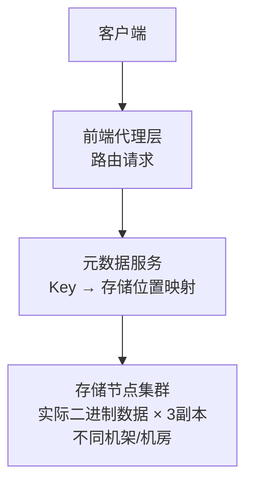

# 对象存储

## TL;DR

- **对象存储**：把文件作为不可分割的"对象"存储，通过唯一 Key（URL）访问，天然水平扩展
- **与文件系统的本质区别**：没有目录层级、不支持原地修改、通过 HTTP API 访问
- **典型产品**：Amazon S3、阿里云 OSS、Google Cloud Storage
- **适合**：图片、视频、日志、备份、静态网站——任何"写一次读多次"的文件

---

## 对象存储 vs 文件系统 vs 块存储

三种存储方式解决不同问题：

| 维度 | 文件系统（NFS/HDFS） | 块存储（EBS/SAN） | 对象存储（S3） |
|------|---------------------|-----------------|--------------|
| 访问方式 | 路径（/data/img/a.jpg） | 块设备（扇区/块） | HTTP URL |
| 修改文件 | 支持原地修改 | 支持原地修改 | **不支持**，覆盖写 = 上传新版本 |
| 目录结构 | 有真实目录树 | 无 | 无（Key 里的 `/` 只是命名约定） |
| 扩展性 | 有限 | 有限 | **近乎无限**，横向扩展 |
| 延迟 | 低（本地） | 极低 | 中（网络 HTTP） |
| 成本 | 中 | 高 | **极低** |
| 适用 | 应用需要文件系统语义 | 数据库磁盘、虚拟机 | 媒体文件、备份、静态资产 |

---

## 对象存储的核心概念

### Bucket（桶）和 Object（对象）

```
Bucket: my-company-assets          ← 相当于一个命名空间
  └── Object Key: images/avatar/user_001.jpg   ← 唯一标识符
  └── Object Key: videos/2024/intro.mp4
  └── Object Key: backups/db-2024-01-01.sql.gz
```

**Bucket**：全局唯一的命名空间，一个账号可以创建多个 Bucket。
**Object Key**：对象的唯一标识符，包含完整路径。Key 中的 `/` 只是字符，不是真实目录分隔符。
**Object**：实际存储的数据 + 元数据（Metadata）

```
Object = {
  Key: "images/avatar/user_001.jpg",
  Data: <binary>,
  Metadata: {
    ContentType: "image/jpeg",
    ContentLength: 204800,
    LastModified: "2024-01-01T00:00:00Z",
    ETag: "abc123...",   // 内容的 MD5/哈希，用于校验和版本判断
    CustomMeta: { "userId": "1001", "source": "upload" }
  }
}
```

### 访问方式

对象存储通过 HTTP REST API 访问：

```
PUT  /bucket/key    → 上传对象
GET  /bucket/key    → 下载对象
DELETE /bucket/key  → 删除对象
HEAD /bucket/key    → 获取元数据（不下载内容）
LIST /bucket?prefix=images/  → 列出前缀匹配的对象
```

---

## 大文件上传：分片上传（Multipart Upload）

单次 HTTP 上传大文件（几 GB 的视频）有问题：
- 网络中断 = 重新上传
- 单个 HTTP 请求有超时限制
- 无法利用多线程并行上传

**分片上传流程：**

```
1. 初始化：POST /bucket/key?uploads
   → 服务器返回 UploadId

2. 上传各分片（可并行）：
   PUT /bucket/key?partNumber=1&uploadId=xxx  (第1片，5MB)
   PUT /bucket/key?partNumber=2&uploadId=xxx  (第2片，5MB)
   PUT /bucket/key?partNumber=3&uploadId=xxx  (第3片，剩余部分)
   → 每片返回 ETag

3. 完成：POST /bucket/key?uploadId=xxx
   → 服务器合并所有分片，返回最终对象的 URL
```

优点：
- 任意分片失败只需重传那一片
- 多线程并行上传，速度快
- S3 最小分片 5MB，最多 10000 片，最大文件 5TB

---

## 访问控制

### 公开 vs 私有

```
Public:  任何人都可以通过 URL 访问（适合公开的静态资源）
Private: 只有有权限的人才能访问（适合用户私有文件）
```

### Pre-signed URL（预签名 URL）

私有文件需要临时授权访问时，不需要暴露密钥，用**预签名 URL**：

```typescript
// 服务端生成预签名 URL（有效期 1 小时）
const url = await s3.getSignedUrlPromise('getObject', {
  Bucket: 'my-private-bucket',
  Key: 'user/1001/private-doc.pdf',
  Expires: 3600
});

// 返回给客户端
// URL 类似：https://bucket.s3.amazonaws.com/key?X-Amz-Signature=...&X-Amz-Expires=3600
// 1小时内任何人都可以访问，1小时后失效
```

**用途：**
- 用户下载自己的私有文件
- 限时分享（"这个链接 24 小时内有效"）
- 允许客户端直接上传到 S3（避免文件经过应用服务器，节省带宽和服务器资源）

### 客户端直传（Client-side Direct Upload）

```
传统方式（文件经过服务器）：
客户端 → 上传到应用服务器 → 应用服务器转存到 S3

直传方式（文件不经过服务器）：
1. 客户端 → 请求应用服务器获取预签名上传 URL
2. 应用服务器 → 生成 PUT 预签名 URL → 返回给客户端
3. 客户端 → 直接 PUT 到 S3（不经过应用服务器）
4. 客户端 → 通知应用服务器上传完成
```

优点：应用服务器不需要处理大文件，节省带宽和 CPU；S3 的上传性能远比应用服务器好。

---

## 对象存储的高级功能

### 版本控制（Versioning）

开启 Versioning 后，覆盖写不会删除旧数据，每次写入都保存一个新版本：

```
写入 key=photo.jpg，版本1 → abc
写入 key=photo.jpg，版本2 → def（不覆盖，保留版本1）
写入 key=photo.jpg，版本3 → ghi

读取 photo.jpg → 默认返回最新版本（ghi）
读取 photo.jpg?versionId=abc → 返回版本1
```

适合：需要回滚能力的场景（配置文件、代码产物备份）

### 生命周期规则（Lifecycle）

自动管理对象的存储类别和删除：

```yaml
# 配置示例：
- 上传后 30 天 → 转为低频访问存储（便宜 50%）
- 上传后 90 天 → 转为归档存储（便宜 90%）
- 上传后 365 天 → 自动删除
```

适合：日志文件、临时文件、旧版本备份

### 事件通知（Event Notification）

对象上传/删除时触发事件，驱动后续处理：

```
用户上传视频 → S3 触发事件 → Lambda 函数执行视频转码 → 转码结果存回 S3
```

---

## 对象存储的内部架构（概念）

对象存储是如何实现"近乎无限"扩展的？



**关键设计：**
- 数据按内容哈希或 Key 哈希分散存储，天然负载均衡
- 每个对象存 3 个副本（不同机架、不同机房），任意 2 个副本损坏仍可恢复
- 元数据和数据分离，元数据服务可以独立扩展

这就是为什么 S3 可以存 几千亿 个对象，且持久性（Durability）可以达到 11 个 9（99.999999999%）——不是指可用性，而是数据不丢失的概率。

---

## 与 Node.js/TS 生态的类比

你在 Node.js 项目里用 AWS SDK 操作 S3：

```typescript
import { S3Client, PutObjectCommand, GetObjectCommand } from '@aws-sdk/client-s3';
import { getSignedUrl } from '@aws-sdk/s3-request-presigner';

const s3 = new S3Client({ region: 'ap-east-1' });

// 上传
await s3.send(new PutObjectCommand({
  Bucket: 'my-bucket',
  Key: `avatars/${userId}.jpg`,
  Body: fileBuffer,
  ContentType: 'image/jpeg',
}));

// 生成预签名下载 URL（有效期 1 小时）
const url = await getSignedUrl(s3, new GetObjectCommand({
  Bucket: 'my-bucket',
  Key: `avatars/${userId}.jpg`,
}), { expiresIn: 3600 });
```

---

## 常见陷阱

1. **把 Key 全放同一个"目录"前缀**：早期 S3 按 Key 字典序分区，大量同前缀 Key 会打到同一个分区，导致热点（现在 S3 已优化，但仍建议前缀多样化）
2. **不用 CDN，直接暴露 S3 URL**：S3 下载按流量计费且有 latency，静态资源应该放在 CDN 后面
3. **忘记设置 CORS**：前端直接访问 S3 会被浏览器 CORS 拦截，需要在 Bucket 配置 CORS 规则
4. **用对象存储存频繁修改的小文件**：对象存储每次"修改"都是上传新版本，不适合频繁更新的文件（如日志实时追加），用文件系统或数据库更合适
5. **忽略访问控制**：Bucket 设置了 Public，用户上传的私密文件对所有人可见（真实安全事故来源）

---

## 面试常见问答

### 简单

**Q：对象存储和传统文件系统有什么本质区别？**

A：核心区别三点：
1. **访问方式**：文件系统通过路径（`/home/user/file.txt`）访问；对象存储通过 HTTP URL 和唯一 Key 访问
2. **修改语义**：文件系统支持原地修改（seek + write）；对象存储只支持整体覆盖（上传新版本），不能局部修改
3. **扩展性**：文件系统扩展需要复杂的分布式文件系统（NFS、HDFS）；对象存储天然分布式，通过 Key 哈希分散到成千上万台机器，几乎无限扩展

---

**Q：什么是预签名 URL？为什么用它？**

A：预签名 URL 是对象存储服务端生成的带有签名和过期时间的临时访问链接。服务端用私钥对"Bucket + Key + 过期时间"签名，嵌入 URL 参数中。任何人持有这个 URL 都可以在有效期内访问对应对象，过期后失效。好处：私有文件可以临时分享，不需要给访问者发放永久密钥；可以允许客户端直接上传到 S3，文件不经过应用服务器，节省带宽。

---

### 中等

**Q：用户要上传一个 5GB 的视频文件，你会怎么设计上传流程？**

A：直接单次上传 5GB 有超时和断点续传的问题，应该用分片上传：
1. 客户端向应用服务器请求初始化分片上传，获取 UploadId 和每个分片的预签名 PUT URL
2. 客户端把文件切成 10MB 的分片，并行向 S3 上传（可同时上传 5 个分片）
3. 每片上传完获得 ETag，记录已上传的分片状态（支持断点续传：关闭后重开，只重传未完成的分片）
4. 所有分片上传完，客户端通知服务器，服务器调用 S3 完成合并
5. 服务器收到合并成功的回调，更新数据库里的视频状态为"处理中"，触发异步转码任务

---

### 难

**Q：设计一个支持千万用户的文件分享系统（类似 Dropbox），存储层怎么设计？**

A：核心挑战：存储容量无限扩展、去重降低成本、版本控制、权限管理。

**存储架构：**
- **对象存储（S3）**：实际文件存储，按内容哈希（SHA-256）命名 Key，天然去重（相同文件只存一份）
- **元数据数据库（PostgreSQL）**：存储文件名、所有者、权限、版本历史、文件 → S3 Key 的映射

**内容寻址（Content-Addressed Storage）：**
```
文件 Key = SHA256(文件内容)
// 两个用户上传同一个文件 → 相同 Key → 只在 S3 存一份
// 元数据表里有两条记录，但指向同一个 S3 Key
```

**分块存储（Chunk-based）：**
更激进的去重：把文件切成固定大小的 chunk（4MB），每个 chunk 单独存储。不同文件如果有相同的 chunk（如一段公共视频片段），只存一份。

**版本控制：**
利用 S3 的 Versioning，或者在元数据层自己维护版本链（每次修改不覆盖，插入新记录，指向新的 S3 Key）。

**权限控制：**
元数据层维护权限表（ACL），下载时先验证权限，通过后生成有限时预签名 URL。权限变更不需要修改 S3 配置，只改元数据。

---

## 关联文档

- [03_cache.md](03_cache.md) — 静态资源配合 CDN 缓存
- [../01_fundamentals/04_network_basics.md](../01_fundamentals/04_network_basics.md) — CDN 与对象存储的配合
- [../06_case_studies/08_distributed_storage.md](../06_case_studies/08_distributed_storage.md) — 分布式文件存储系统设计案例
