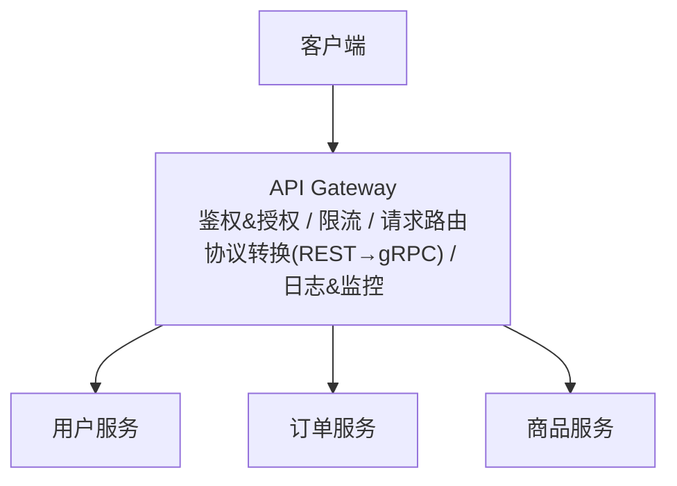

# 同步通信：REST / gRPC / GraphQL / API Gateway

## TL;DR

- **REST**：最通用，基于 HTTP，人类可读，生态完善——适合大多数公开 API 和服务间通信
- **gRPC**：基于 HTTP/2 + Protobuf，性能高、类型严格——适合内部微服务间的高频调用
- **GraphQL**：客户端按需取数据，减少 Over-fetching/Under-fetching——适合复杂前端、移动端
- **API Gateway**：微服务架构的"大门"，统一处理鉴权、限流、路由、监控

---

## REST

### 核心思想

REST（Representational State Transfer）把系统里的一切抽象为**资源（Resource）**，用 HTTP 方法表示操作：

```
资源          HTTP 方法    含义
/users        GET         获取用户列表
/users        POST        创建新用户
/users/1      GET         获取 ID=1 的用户
/users/1      PUT         完整替换 ID=1 的用户
/users/1      PATCH       部分更新 ID=1 的用户
/users/1      DELETE      删除 ID=1 的用户
/users/1/orders GET       获取用户 1 的所有订单
```

### REST 的优点

- **无状态（Stateless）**：每个请求都包含完整上下文，服务器不需要记录会话状态，天然支持水平扩展
- **可缓存**：GET 请求的响应可以被 CDN、浏览器、代理缓存，降低服务器压力
- **通用**：HTTP 协议无处不在，任何语言都有 HTTP 客户端
- **人类可读**：JSON + HTTP，调试方便

### REST 的缺点

**Over-fetching（取多了）：**
```
GET /users/1
← 返回所有字段：id, name, email, avatar, bio, preferences...
  但客户端只需要 name 和 avatar
```

**Under-fetching（取少了，N+1 问题）：**
```
GET /users → 返回用户列表（100 个用户）
然后需要每个用户的订单：
GET /users/1/orders
GET /users/2/orders
...共 100 次请求
```

**版本管理麻烦：**
API 变更时需要维护 `/v1/users` 和 `/v2/users`，老版本不能随意下线。

### REST 的最佳实践

```
命名：用名词，不用动词
✓ GET /orders
✗ GET /getOrders

状态码要准确：
200 OK       - 成功
201 Created  - 创建成功
400 Bad Request - 请求参数错误
401 Unauthorized - 未登录
403 Forbidden    - 无权限
404 Not Found    - 资源不存在
409 Conflict     - 冲突（如重复创建）
422 Unprocessable Entity - 校验失败
429 Too Many Requests    - 限流
500 Internal Server Error - 服务器错误

分页：
GET /users?page=1&limit=20
GET /users?cursor=abc123&limit=20  （Cursor 分页，性能更好）

幂等性：
GET/DELETE/PUT 必须幂等
POST 不要求幂等，但可以通过 Idempotency-Key 实现
```

---

## gRPC

### 核心思想

gRPC 是 Google 开源的 RPC（Remote Procedure Call，远程过程调用）框架。

**核心区别：**
- REST：把远程调用伪装成"操作资源"，消息格式用 JSON
- gRPC：直接调用远程函数，消息格式用 **Protobuf（Protocol Buffers）**

### Protobuf vs JSON

**Protobuf（二进制序列化）：**
```protobuf
// user.proto 定义
message User {
  int32 id = 1;
  string name = 2;
  string email = 3;
}

message GetUserRequest {
  int32 user_id = 1;
}

service UserService {
  rpc GetUser(GetUserRequest) returns (User);
}
```

```
JSON:   {"id": 1, "name": "Alice", "email": "alice@example.com"}
        → 60 字节，需要字符串解析

Protobuf: 0a 05 41 6c 69 63 65 ...
          → ~20 字节，直接二进制解析，速度快 5-10 倍
```

### gRPC 的特点

**基于 HTTP/2：**
- 多路复用：同一个连接同时发送多个 RPC，不需要建立多个连接
- 头部压缩：减少重复头部传输
- 流式支持：支持服务端流（Server Streaming）、客户端流、双向流

**四种调用模式：**

```protobuf
service ChatService {
  // 1. 一元（Unary）：最常见，类似普通函数调用
  rpc SendMessage(Message) returns (Response);

  // 2. 服务端流（Server Streaming）：服务器持续发数据
  rpc WatchMessages(WatchRequest) returns (stream Message);

  // 3. 客户端流（Client Streaming）：客户端持续发数据
  rpc UploadLog(stream LogEntry) returns (UploadSummary);

  // 4. 双向流（Bidirectional Streaming）
  rpc Chat(stream Message) returns (stream Message);
}
```

**强类型：**
Protobuf 定义就是接口契约，编译器生成客户端和服务端代码，类型不匹配在编译时报错，而不是运行时。

### gRPC 的缺点

- 浏览器不能直接调用（需要 gRPC-Web 代理层）
- Protobuf 二进制不可读，调试困难
- 学习曲线比 REST 高
- 生态没有 REST 广泛（中间件、日志、监控工具需要额外支持）

### REST vs gRPC 选型

| 场景 | 推荐 |
|------|------|
| 对外公开 API | REST（浏览器兼容，易于文档化） |
| 内部微服务通信（高频、延迟敏感） | gRPC（性能好，类型安全） |
| 移动端 API（流量敏感） | gRPC 或 REST + 压缩 |
| 流式数据传输 | gRPC（原生流式支持） |
| 简单项目/小团队 | REST（学习成本低） |

---

## GraphQL

### 核心思想

GraphQL 是 Facebook 开源的 API 查询语言。客户端**声明需要什么字段**，服务端只返回这些字段。

```graphql
# 客户端查询
query {
  user(id: "1") {
    name
    avatar           # 只要这两个字段，不要其他
    orders {         # 同时获取订单
      id
      total
    }
  }
}

# 服务端响应
{
  "data": {
    "user": {
      "name": "Alice",
      "avatar": "https://...",
      "orders": [
        { "id": "o1", "total": 99.9 }
      ]
    }
  }
}
```

一次请求就获取了用户信息 + 订单（解决 Under-fetching），且只返回了需要的字段（解决 Over-fetching）。

### GraphQL 的优点

- **灵活取数**：客户端控制响应格式，减少网络传输
- **单端点**：所有查询都发到 `POST /graphql`，无需管理大量 URL
- **强类型 Schema**：类型定义就是文档，自动生成 API 文档
- **内省（Introspection）**：客户端可以查询 Schema 结构，工具可以自动补全

### GraphQL 的缺点

**N+1 问题（不解决会很慢）：**
```graphql
query {
  users {         # 查 100 个用户
    name
    orders {      # 每个用户再查订单 → 100 次 SQL 查询！
      total
    }
  }
}
```
必须用 **DataLoader**（批量加载器）把 100 次查询合并成 1 次。

**缓存复杂：**
REST 的 GET 请求可以用 URL 作为缓存 Key，CDN 直接缓存。GraphQL 全部是 POST，且相同 URL 查询内容不同，CDN 不能直接缓存，需要持久化查询（Persisted Queries）或应用层缓存。

**安全风险：**
客户端可以构造极深的嵌套查询，耗尽服务器资源：
```graphql
query { user { friends { friends { friends { orders { items { reviews { ... } } } } } } } }
```
需要限制查询深度和复杂度。

### GraphQL 适合什么场景

- 有多种客户端（Web/iOS/Android）且需求各不同
- 数据关系复杂，前端需要灵活组合
- 公开 Developer API（GitHub、Shopify 的 API 都是 GraphQL）

**不适合：**
- 简单的 CRUD 应用（Over-engineering）
- 文件上传（GraphQL 不擅长）
- 流式数据

---

## API Gateway

### 是什么

API Gateway 是微服务架构中的**统一入口**，所有外部请求都经过它再路由到后端服务：



### API Gateway 的核心功能

**路由：**
```
GET /users/*     → 用户服务
GET /orders/*    → 订单服务
POST /payments/* → 支付服务
```

**鉴权（Authentication）：**
Gateway 统一验证 JWT Token，合法才转发到后端服务。后端服务不需要各自实现鉴权逻辑。

**限流（Rate Limiting）：**
```
每个 IP 每分钟最多 100 次请求
每个用户每天最多 1000 次 API 调用
```

**熔断（Circuit Breaking）：**
后端服务不可用时，Gateway 快速返回错误，而不是让请求堆积等待超时。

**协议转换：**
外部用 REST，内部用 gRPC。Gateway 在边界做转换，内外解耦。

**常见产品：** AWS API Gateway、Kong、Nginx（手动配置）、Traefik

---

## 与 Node.js/TS 生态的类比

```typescript
// Express 就是一个简单的 API Gateway 模式
app.use('/users', authenticate, rateLimit(100), proxyTo('http://user-service'));
app.use('/orders', authenticate, proxyTo('http://order-service'));

// gRPC 在 Node.js 中（@grpc/grpc-js）
const userClient = new UserService('localhost:50051', grpc.credentials.createInsecure());
userClient.getUser({ userId: 1 }, (err, response) => {
  console.log(response.name);
});
```

---

## 常见陷阱

1. **REST 滥用 POST**：应该用 GET 的地方用了 POST，导致不可缓存、不幂等
2. **gRPC 对外暴露**：gRPC 不适合直接给浏览器调用，需要在边界加 REST/GraphQL 层
3. **GraphQL 没有处理 N+1**：忘记用 DataLoader，一次查询触发数千次 DB 查询
4. **API Gateway 成为单点故障**：Gateway 必须高可用部署（多实例），否则整个系统都挂了
5. **在 API Gateway 写业务逻辑**：Gateway 只做横切关注点（鉴权、限流、路由），业务逻辑放服务里

---

## 面试常见问答

### 简单

**Q：REST 中 PUT 和 PATCH 有什么区别？**

A：PUT 是完整替换资源——你发送的数据就是资源的完整新状态，未发送的字段会被清空。PATCH 是部分更新——只更新你发送的字段，其他字段保持不变。PUT 必须幂等（多次调用结果一致），PATCH 通常也设计为幂等。实践中 PATCH 更常用，因为它只传需要修改的字段，网络传输少且不会意外清空字段。

---

**Q：什么是 API 的幂等性？哪些 HTTP 方法要求幂等？**

A：幂等性是指：执行同一个操作一次和多次的效果相同（不产生副作用的叠加）。HTTP 方法中，GET/HEAD/PUT/DELETE 必须是幂等的：多次 GET 得到相同结果，多次 DELETE 第一次删除成功，后续返回 404 但资源状态没有进一步改变。POST 不要求幂等（多次 POST 创建多条记录）。幂等性对网络重试很重要：超时后客户端可以安全重试幂等操作，而不用担心产生副作用。

---

### 中等

**Q：什么时候选 gRPC，什么时候选 REST？**

A：gRPC 适合：内部微服务间的高频调用（延迟敏感，几百 ms 的差距都重要）；需要强类型和代码生成（大型团队，接口契约要严格）；需要流式通信（服务端推送、双向流）；多语言团队（Protobuf 支持几乎所有语言）。REST 适合：对外公开 API（浏览器直接调用，文档友好）；团队小、项目简单（REST 学习成本低）；需要 CDN 缓存（GET 请求可以被缓存）。很多公司的做法：外部暴露 REST，内部微服务间用 gRPC。

---

**Q：GraphQL 的 N+1 问题是什么？如何解决？**

A：N+1 问题是指：查询一个列表（1次）后，对列表每个元素再分别查询关联数据（N次），共 N+1 次数据库查询。GraphQL 的解决方案是 **DataLoader**：它把在同一个事件循环 tick 内的多个"单元素查询"收集起来，合并成一次批量查询（`SELECT WHERE id IN (...)`），然后把结果分发给各个等待者。DataLoader 把 N+1 变成 2 次查询（1次主查询 + 1次批量关联查询），大幅降低数据库压力。

---

### 难

**Q：如果要设计一个 API Gateway，你会关注哪些方面？**

A：API Gateway 的核心设计要点：

**可用性（高优先级）：**
Gateway 是单点入口，必须比后端服务更高可用。多实例无状态部署，前面挂 Load Balancer，配置全存在外部（Consul/etcd），实例随时可以替换。

**性能（低延迟）：**
Gateway 在每次请求的关键路径上，增加的延迟应该 < 1ms。鉴权用 JWT（本地验证，不需要查数据库），限流用内存计数器（或 Redis，但 Redis 调用有延迟），热点路由规则缓存在本地。

**限流策略：**
按 IP、按用户 ID、按 API Key 分别限流。用令牌桶算法（允许短时突发），而不是固定窗口（会有边界效应）。限流状态存 Redis（多实例共享状态）。

**鉴权/授权分离：**
Gateway 只做鉴权（验证你是谁），授权（你能做什么）交给下游服务。Gateway 验证 JWT 有效性，把解码后的用户信息透传给后端（`X-User-Id: 1001`），后端根据业务规则决定权限。

**可观测性：**
每个请求记录：请求 ID（用于链路追踪）、上游服务、响应时间、状态码。请求 ID 透传给所有下游服务，形成完整调用链。

**熔断和降级：**
后端服务连续失败后，Gateway 开启熔断，快速返回 503 而不是等待超时，给后端服务恢复的时间。

---

## 关联文档

- [02_async.md](02_async.md) — 同步调用 vs 异步消息队列的权衡
- [../04_distributed/04_fault_tolerance.md](../04_distributed/04_fault_tolerance.md) — 熔断器模式详解
- [../05_methodology/reference/03_patterns.md](../05_methodology/reference/03_patterns.md) — API Gateway 设计模式
