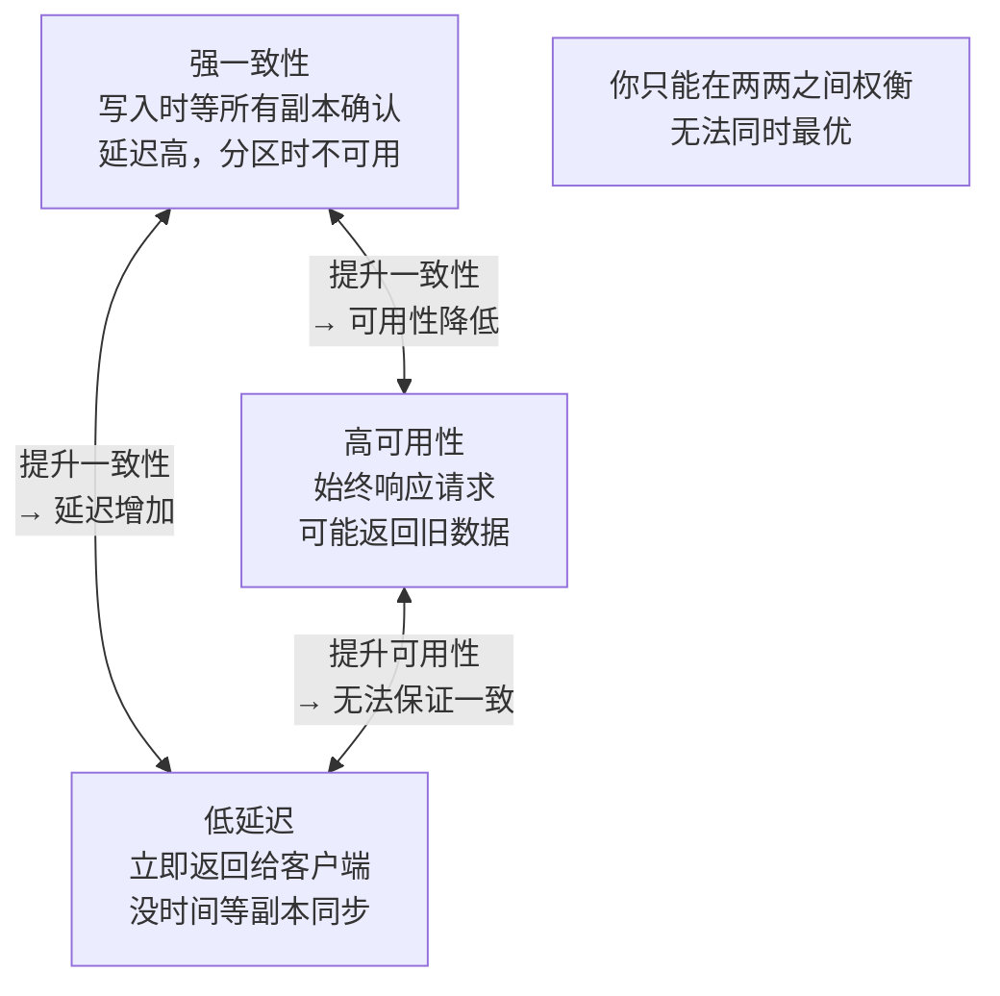
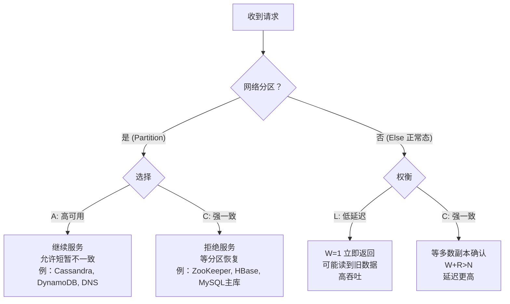
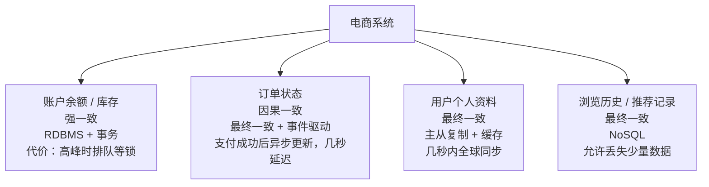

# 一致性 vs 可用性 vs 延迟：权衡图谱

## TL;DR

这篇文档是整个分布式系统知识的"导航图"，把前面所有概念串联成一张决策表：**根据业务场景，明确你愿意牺牲什么、保住什么**。

核心结论：**没有免费的午餐，每种保证都有代价，选型的本质是选择你能承受哪种代价。**

---

## 三个核心维度

分布式系统的设计永远在这三个维度之间取舍：



- **强一致性（Strong Consistency）**：所有节点在任何时刻看到完全相同的数据
- **高可用性（High Availability）**：系统始终响应请求，不拒绝服务
- **低延迟（Low Latency）**：每个操作快速完成

**为什么不能同时拥有三者？**

- 强一致性要求写入时同步到所有节点才返回 → 延迟高，某节点宕机时无法写入 → 可用性降低
- 高可用要求即使部分节点故障也能响应 → 可能返回旧数据 → 一致性降低
- 低延迟要求立即返回 → 没时间等所有节点同步 → 一致性降低

---

## 决策表：场景 → 牺牲什么 → 得到什么

| 场景 | 核心需求 | 牺牲 | 得到 | 典型方案 |
|------|---------|------|------|---------|
| 银行转账 | 绝对不能出现数据错误 | 可用性（分区时拒绝服务）、高延迟 | 强一致性 | MySQL + 2PC / Saga |
| 库存扣减 | 不能超卖 | 可用性（高峰时排队或降级） | 强一致性 | Redis 原子操作 + DB 事务 |
| 用户个人资料 | 读多写少 | 短暂不一致（几秒内修复） | 低延迟 + 高可用 | 主从复制 + 缓存 |
| 点赞数 / 阅读量 | 计数，允许误差 | 精确性（±1% 误差可接受） | 高吞吐 + 低延迟 | Redis INCR + 异步写 DB |
| 购物车 | 不能丢，可以暂时不一致 | 强一致 | 高可用 | DynamoDB / Cassandra（AP） |
| 消息系统 | 不丢消息，顺序可靠 | 延迟（消息入队后异步处理） | 高可靠 + 解耦 | Kafka（At-least-once）|
| DNS 解析 | 高可用，可以短暂返回旧 IP | 一致性（TTL 内可能旧） | 高可用 + 低延迟 | 最终一致性（AP）|
| 新闻 Feed | 用户不在意几秒的延迟 | 强一致 | 高可用 + 可扩展 | 最终一致性 + 异步 Fanout |
| 金融交易记录 | 查询历史要准确 | 实时性（可以延迟归档） | 正确性 + 持久性 | 先写 DB，再异步同步分析库 |
| 搜索索引 | 允许新内容延迟出现 | 实时一致（新文章 1 分钟后可搜到） | 高可用 + 高吞吐 | Elasticsearch（最终一致）|

---

## PACELC 模型：更完整的权衡框架

CAP 定理只描述了"分区时"的选择，但实际上即使没有分区，也有权衡：



### 正常状态下的 Latency vs Consistency

写操作需要同步到多少副本才返回？

```
写请求                 副本1（主）
  ↓                       ↓
写入完成               同步副本2
  ↓                       ↓
立即返回 ←← 选延迟    等副本2确认后返回 ←← 选一致性
（可能副本2还没有）    （延迟更高）
```

**Quorum（法定人数）写入：**
```
N = 总副本数
W = 写入成功需要的副本数
R = 读取需要查询的副本数

强一致性条件：W + R > N
  例：N=3, W=2, R=2 → 2+2>3，读一定能读到最新写

低延迟写：W=1, R=1 → 1+1<3，可能读到旧数据（最终一致）
高可靠写：W=3, R=1 → 写全部副本才返回，延迟最高但一致性最强
```

这就是 Cassandra、DynamoDB 可调一致性的底层逻辑。

---

## 一致性的层次谱系

不是只有"强一致"和"最终一致"两种，中间有很多层次：

```
强 ←——————————————————————————————————→ 弱

线性一致 > 顺序一致 > 因果一致 > 最终一致
```

| 一致性级别 | 含义 | 代价 | 使用场景 |
|-----------|------|------|---------|
| **线性一致性（Linearizability）** | 操作看起来是原子的、瞬间完成的，所有进程看到相同的顺序 | 最高延迟，最难实现 | 分布式锁、Leader 选举 |
| **顺序一致性（Sequential Consistency）** | 所有操作有全局顺序，但时间上可以稍微落后 | 高延迟 | 少数场景 |
| **因果一致性（Causal Consistency）** | 有因果关系的操作按因果顺序，无因果关系的并发操作可以乱序 | 中等 | 社交媒体帖子、评论 |
| **最终一致性（Eventual Consistency）** | 最终会一致，过程中可以不一致 | 最低延迟，最高可用 | 大多数 NoSQL、缓存、DNS |

---

## 实际系统的混合策略

真实系统不会全部选同一种策略，而是**按数据类型分层**：



**原则：价值越高的数据，一致性要求越强，代价也越高；次要数据放宽一致性换取性能。**

---

## 面试中如何回答权衡问题

面试官常见提问：
- "你的设计里 A 服务和 B 服务的数据一致性怎么保证？"
- "用户刚更新了个人资料，立刻读到的是旧数据怎么办？"
- "两个用户同时抢同一件商品，怎么处理？"

**回答框架：**

1. **确认业务容忍度**：这个不一致的代价是什么？是钱（不行）还是用户体验（可接受）？
2. **说清楚牺牲的是什么**：选了强一致，说明代价是延迟升高/可用性降低；选了最终一致，说明代价是短暂不一致
3. **给出一致性窗口**：最终一致不等于"永远不一致"，说清楚"在 X 秒/毫秒内会收敛"
4. **补偿机制**：即使选了弱一致性，也要有补偿——发现不一致时如何修复（重试、对账、补偿事务）

---

## 一句话总结各技术的定位

| 技术 | 一句话定位 | 一致性偏好 |
|------|-----------|-----------|
| MySQL（主从） | 强一致写，可配置读 | CP（写），AP（读） |
| PostgreSQL | 强一致，支持复杂事务 | CP |
| Redis（单机） | 极低延迟缓存，弱持久化 | 一致性强（单机），性能第一 |
| Redis Cluster | 分布式缓存，可能不一致 | AP |
| MongoDB | 文档存储，可调一致性 | 默认 CP，可配置 AP |
| Cassandra | 高写入，可调一致性 | 默认 AP |
| DynamoDB | 全托管，可调一致性 | 默认 AP，可选强一致读 |
| ZooKeeper | 分布式协调，强一致 | CP |
| Kafka | 高吞吐日志，最终一致 | AP（生产侧）|
| Elasticsearch | 全文搜索，最终一致 | AP |

---

## 关联文档

- [01_consistency_models.md](01_consistency_models.md) — 一致性级别的完整技术解析
- [02_distributed_tx.md](02_distributed_tx.md) — 强一致跨服务的实现方案
- [../02_storage/00_choice_framework.md](../02_storage/00_choice_framework.md) — 数据库选型框架
- [../05_methodology/design_process/03_tradeoff_analysis.md](../05_methodology/design_process/03_tradeoff_analysis.md) — 如何在面试中有条理地展示权衡
