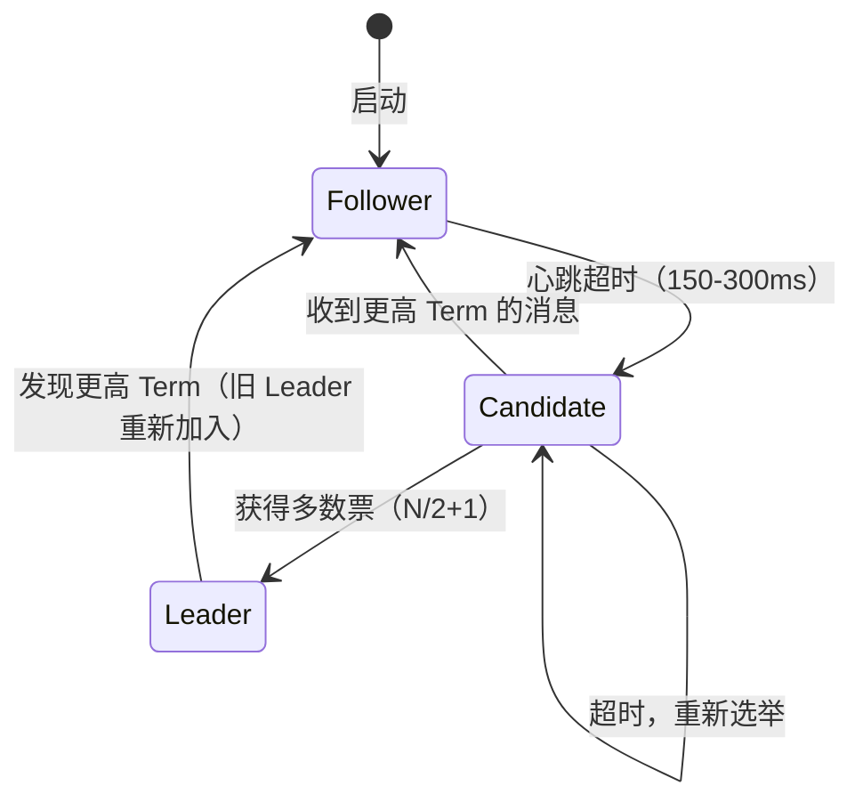
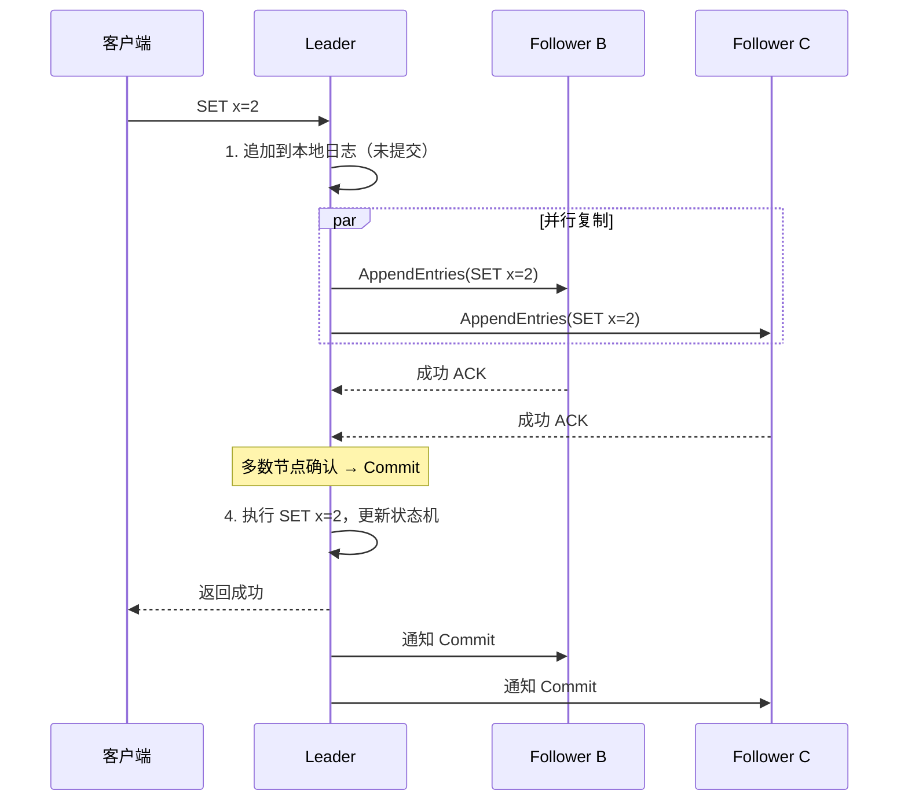
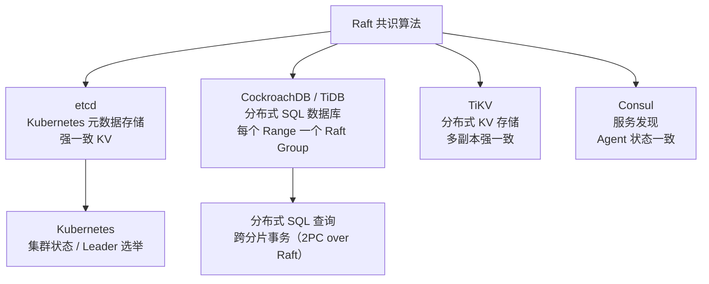

# 共识算法：Raft / Paxos

## TL;DR

- **共识（Consensus）**：分布式系统中多个节点对某个值达成一致，即使有节点宕机
- **Paxos**：共识算法的理论奠基，难理解、难实现，实际工程几乎不直接用
- **Raft**：为"易于理解"而设计，是 etcd、CockroachDB、TiKV 的基础——**这个要理解**
- **工程应用**：你不需要自己实现 Raft，但要理解它解决什么问题、有什么限制

---

## 为什么需要共识算法

分布式系统的核心难题：**在节点可能随时宕机、网络可能随时中断的情况下，如何让多个节点对某件事达成一致？**

```
场景：分布式锁
  节点A 和 节点B 同时申请锁
  必须有且只有一个节点获得锁
  如果没有共识，可能两个都认为自己持有锁（脑裂）

场景：分布式数据库的 Leader 选举
  主节点宕机，需要选出新主节点
  必须所有节点认同同一个新主节点
  如果没有共识，两个节点各自认为自己是主节点，各自接受写入，数据分叉
```

共识算法解决的就是：**如何在部分节点故障的情况下，剩余节点达成一致决定？**

---

## 共识算法的前提条件

**FLP 不可能性定理（1985年）：**

在异步网络中（消息延迟无上限），即使只有一个节点故障，也无法保证共识算法在有限时间内终止。

**实际解决方案：** 放宽"异步"假设，引入随机超时（Raft 的做法），在大多数情况下可以收敛，只是不能保证每次都能在固定时间内完成。

**容错限制：**

任何共识算法都只能容忍 **少于半数（N/2）的节点故障**。

```
3 个节点：容忍 1 个故障（法定人数 = 2）
5 个节点：容忍 2 个故障（法定人数 = 3）
7 个节点：容忍 3 个故障（法定人数 = 4）
```

这就是为什么分布式系统节点数通常是奇数。

---

## Raft 算法

Raft 是 2014 年提出的共识算法，设计目标是"比 Paxos 更容易理解"。

### 角色

Raft 中每个节点处于以下三种状态之一：

- **Leader（领导者）**：唯一，处理所有读写请求，定期向 Follower 发心跳
- **Follower（追随者）**：被动响应，响应 Leader 的请求
- **Candidate（候选者）**：临时状态，在选举期间出现



### Leader 选举

**任期（Term）：** Raft 把时间划分为一个个任期，每个任期由一次选举开始。

```
Term 1: 节点A 当选 Leader，运行正常
        A: Leader, B: Follower, C: Follower

Term 1 → A 崩溃 → B 和 C 超时，发现没有心跳

Term 2: 选举开始
  B 或 C 先超时（随机等待 150-300ms）→ 成为 Candidate
  发送 RequestVote 给其他节点："我想当 Leader，我是 Term 2 的候选者"

投票规则：
  - 每个节点每个 Term 只能投一票
  - 只投给日志"至少和自己一样新"的候选者（保证新 Leader 有最新数据）

B 获得多数票（N/2 + 1）→ B 成为 Term 2 的 Leader
B 开始发心跳，C 收到心跳后恢复 Follower 状态
```

**随机超时防止选票分裂：**
如果所有节点同时超时，都变成 Candidate，所有节点可能各投自己，没人得到多数票。Raft 用随机化的超时时间（150-300ms 随机），大概率让一个节点先超时，先拿到多数票。

### 日志复制

Raft 的核心工作是让所有节点的**日志（Log）**保持一致：



**关键保证：**
- 只要多数节点确认了某条日志，这条日志就被"提交"，即使 Leader 此后宕机，新 Leader 也一定拥有这条日志
- 新 Leader 必须有"最新的日志"（投票规则保证），不会遗漏已提交的日志

### 安全性保证

Raft 保证两个关键性质：

1. **选举安全（Election Safety）**：每个 Term 最多有一个 Leader
2. **日志匹配（Log Matching）**：如果两个节点的日志在某个位置有相同的 Term 和 Index，则该位置之前的所有日志也完全相同

---

## Paxos

Paxos 是 Leslie Lamport 1989 年提出的共识算法，是所有共识算法的理论基础。

### 基本 Paxos 流程（概念理解）

**三个角色：**
- **Proposer（提议者）**：提出一个值
- **Acceptor（接受者）**：接受或拒绝提议
- **Learner（学习者）**：学习最终达成一致的值

**两个阶段：**

```
阶段一 Prepare：
  Proposer 生成唯一编号 n，发送 Prepare(n) 给多数 Acceptor
  Acceptor 响应：
    - 承诺不再接受编号 < n 的提议
    - 返回自己已接受的最高编号提议（如果有）

阶段二 Accept：
  如果 Proposer 收到多数 Acceptor 的 Promise：
    - 如果有 Acceptor 返回了已接受的值 v，用 v 作为提议值
    - 否则，用自己想提议的值 v
    - 发送 Accept(n, v) 给多数 Acceptor
  Acceptor 接受（如果 n 仍是最大编号）
```

### Paxos 为什么难

- **多轮 Paxos 如何处理多个值的序列**：Basic Paxos 只决定一个值，Multi-Paxos 实际工程需要大量扩展
- **活锁**：两个 Proposer 可以互相干扰，无限循环
- **Leader 选举本身也需要共识**：鸡生蛋问题
- **实现细节极多**：Lamport 自己也承认"Paxos 的细节难以完整描述"

**实际工程中 Paxos 的应用：**
- Google Chubby（分布式锁服务，Paxos 变体）
- Google Spanner（Paxos 变体）
- Apache Zookeeper（ZAB 协议，类 Paxos）

---

## Raft 在实际系统中的应用



---

## 工程上的注意点

### 不需要自己实现

除非你在做分布式数据库或协调服务，否则直接用 etcd 或 ZooKeeper 提供的共识保证，不要自己实现。

### Leader 的性能瓶颈

所有写请求都经过 Leader，Leader 是吞吐上限。应对方式：
- **Multi-Raft**：把数据分片（Shard），每个分片有独立的 Raft Group，不同分片的 Leader 在不同节点上，分散压力
- **批量提交（Batching）**：多个写请求合并成一条日志提交，减少网络往返

### 读操作的选择

- **从 Leader 读（强一致）**：确保读到最新数据，但增加 Leader 压力
- **从 Follower 读（可能读到旧数据）**：减轻 Leader 压力，但有读到旧数据的风险
- **Lease Read**：Leader 在租约（Lease）时间内无需通过多数派就可以安全地响应读，兼顾一致性和性能

---

## 与 Node.js/TS 生态的类比

你在 Kubernetes 中部署 Node.js 服务时，背后的 etcd 就是用 Raft 保证一致性的：

```
kubectl get pods
→ API Server 读取 etcd（Raft 保证一致性）
→ 返回最新的 Pod 状态

kubectl apply -f deployment.yaml
→ API Server 写入 etcd（通过 Raft Leader 写入，多数副本确认）
→ 控制器 watch etcd 变更，执行 Reconcile
```

当 etcd 的一个节点宕机时，Raft 保证剩余多数节点继续工作，Kubernetes 不受影响（只要宕机的不超过半数）。

---

## 常见陷阱

1. **认为 Raft = 强一致性读**：Raft 只保证写入的强一致性。从 Follower 读可能读到旧数据，只有从 Leader 读（或 Lease Read）才有强一致性
2. **节点数设为偶数**：4 个节点和 3 个节点的容错能力一样（都只能容忍 1 个故障），但 4 个节点浪费资源
3. **认为共识算法能容忍拜占庭故障**：Raft/Paxos 只能容忍节点宕机（Crash Fault Tolerance），不能容忍节点发送错误消息（Byzantine Fault）。区块链用的 PBFT 才能容忍拜占庭故障
4. **忽视网络分区时的脑裂**：分区时少数派可能以为 Leader 宕机，发起新选举。Raft 通过 Term 机制解决：新任期的 Leader 会让旧 Leader 立刻退位

---

## 面试常见问答

### 简单

**Q：什么是分布式共识？它解决什么问题？**

A：分布式共识是让分布式系统中多个节点对某个值或某件事达成一致的协议，即使有部分节点宕机或网络故障。它解决的核心问题是：在不可靠的网络和可能故障的节点情况下，保证系统的关键状态（如谁是 Leader、某个操作的顺序）不会出现矛盾，即两个节点对同一个问题得出不同的"确定"答案（脑裂）。

---

**Q：为什么 Raft 集群通常是奇数节点（3、5、7）？**

A：Raft 需要多数节点（N/2 + 1）才能工作（选举和日志提交）。奇数节点能最大化容错效率：3 个节点容忍 1 个故障，4 个节点也只能容忍 1 个故障，但需要多花一台机器；5 个节点容忍 2 个故障，6 个节点也只容忍 2 个。偶数节点只浪费资源，不增加容错能力，所以实践中永远用奇数。

---

### 中等

**Q：Raft 是如何保证 Leader 选举后，新 Leader 不会丢失已提交的日志？**

A：通过投票规则：Follower 只会投票给"日志至少和自己一样新"的候选者。日志的"新旧"比较规则：先比最后一条日志的 Term，Term 大的更新；Term 相同则比 Index，Index 大的更新。如果某条日志被多数节点（N/2 + 1）确认，那么任何新 Leader 候选者要获得多数票，至少有一个拥有该日志的节点投票给它，而只有候选者日志不旧于该节点才能得到投票。因此新 Leader 一定拥有所有已提交的日志。

---

### 难

**Q：Raft 的性能瓶颈在哪里？大规模场景下如何优化？**

A：Raft 的性能瓶颈主要有两个：

**写入瓶颈（Leader 是单点）：**
所有写请求必须经过 Leader，Leader 的处理能力是系统上限。解决：
- **Multi-Raft**（分片方案）：把数据分成多个 Range，每个 Range 有独立的 Raft Group，不同 Range 的 Leader 分散在不同节点。TiKV、CockroachDB 都用这个方案
- **Pipeline（流水线）**：Leader 不等上一批日志复制完成就发下一批，并发提高吞吐

**读取瓶颈（需要经过 Leader 保证一致性）：**
- **Follower Read + Lease**：Leader 持有一个租约，租约内 Follower 可以安全读取（租约期间不可能有新 Leader），减轻 Leader 压力
- **Read Index**：Leader 先确认自己还是当前 Leader（通过一轮心跳），然后返回当前提交 Index，Follower 等到自己的日志追上这个 Index 后才响应读请求

**日志压缩（Snapshot）：**
日志会无限增长，需要定期把状态机做快照（Snapshot），压缩旧日志。新加入的节点不需要重放全部日志，直接安装快照即可。

---

## 关联文档

- [01_consistency_models.md](01_consistency_models.md) — 共识算法提供的是线性一致性
- [06_distributed_lock.md](06_distributed_lock.md) — 分布式锁依赖共识的强一致性
- [../02_storage/01_rdbms.md](../02_storage/01_rdbms.md) — 分布式数据库（CockroachDB/TiDB）基于 Raft
