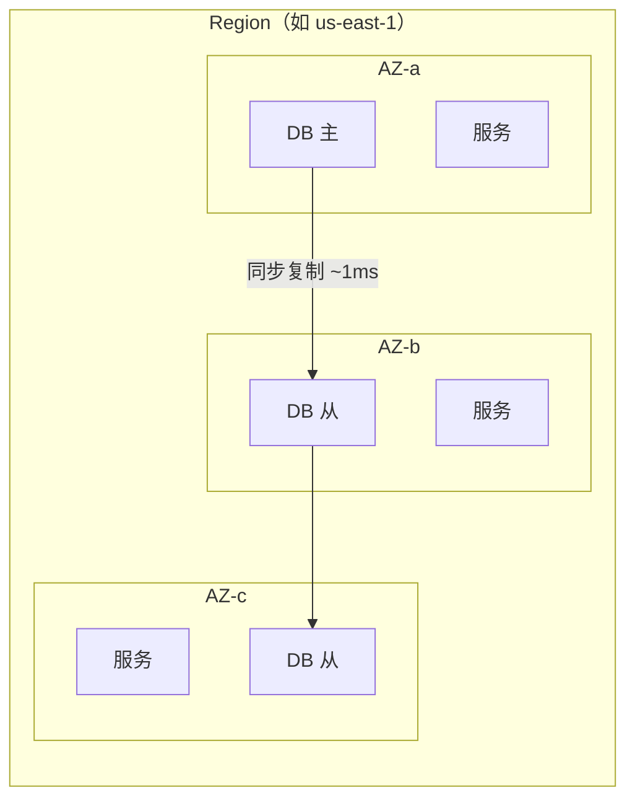
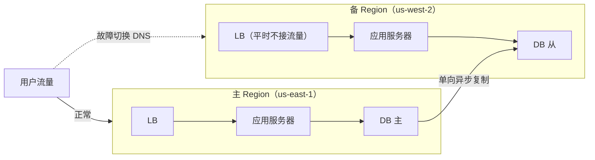
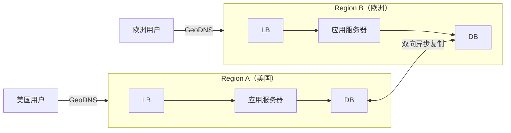

# 多地域架构 + 灾难恢复（RTO / RPO）

## TL;DR

- **为什么多地域**：单个数据中心/可用区故障时系统仍可用；降低全球用户延迟
- **RTO**：故障到恢复正常服务的最长允许时间（"能停多久"）
- **RPO**：故障时最多允许丢失多久的数据（"能丢多少"）
- **核心矛盾**：地理距离 → 网络延迟 → 强一致性和低延迟无法兼得

---

## 基础概念

### RTO 与 RPO

```
故障发生
    |
    |←—— RPO ——→|←————————— RTO ————————→|
    |            |                         |
  最后一次      故障点                   系统恢复
  数据备份                               正常服务

RPO（Recovery Point Objective）= 故障点 - 最后备份点
  → 最多丢失多久的数据
  → RPO = 0：零数据丢失（同步复制）
  → RPO = 1h：允许丢最近 1 小时数据（每小时备份）

RTO（Recovery Time Objective）= 系统恢复时间 - 故障发生时间
  → 系统停摆的最长允许时长
  → RTO = 0：立即切换，用户无感知（Active-Active）
  → RTO = 4h：允许 4 小时内恢复（冷备份）
```

### 可用性与 RTO 的关系

| 可用性 | 每年允许停机 | 对应 RTO 数量级 |
|--------|------------|----------------|
| 99%（两个九）| 87.6 小时 | 小时级 |
| 99.9%（三个九）| 8.7 小时 | 小时级 |
| 99.99%（四个九）| 52 分钟 | 分钟级 |
| 99.999%（五个九）| 5 分钟 | 秒级 |

五个九 = 全年停机不超过 5 分钟，RTO 必须是秒级 → 只有 Active-Active 能做到。

---

## 部署模式

### 模式一：单地域多可用区（Single Region, Multi-AZ）



特点：抵御单机/单 AZ 故障；AZ 间延迟约 1~2ms，同步复制影响小；实现简单，大多数云服务默认支持。无法抵御整个 Region 故障。

适合：99.99% 可用性目标，预算有限。

### 模式二：主备地域（Active-Passive / Warm Standby）



切换方式：修改 DNS 指向备 Region（TTL 要提前降低）。

| 变体 | 备 Region 状态 | 切换时间 |
|------|-----------|--------|
| Hot Standby | 全量运行，随时就绪 | 分钟级 |
| Warm Standby | 最小规模，故障时扩容 | 10~30 分钟 |
| Cold Standby | 只有数据备份，需重建环境 | 小时级 |

### 模式三：主主地域（Active-Active）



两个 Region 同时接受读写；故障时把流量切到健康 Region。RTO 秒级（DNS 切换）或毫秒级（Anycast）；RPO 接近 0；核心难点是双向写入的冲突问题。

---

## Active-Active 的核心难点：写冲突

```
场景：用户 A 同时在美国和欧洲改了自己的头像
  Region A 收到：{ userId: 1, avatar: "cat.jpg" }
  Region B 收到：{ userId: 1, avatar: "dog.jpg" }
  两边互相同步 → 冲突！最终结果是猫还是狗？
```

### 冲突解决策略

**策略一：用户绑定到主 Region（Region Affinity）**

```
每个用户有一个"主 Region"，该用户的写请求只路由到主 Region
其他 Region 对该用户只做读（从主 Region 同步）

优点：无写冲突
缺点：用户离主 Region 远时，写延迟高（如欧洲用户的主 Region 在美国）
适合：用户数据强一致要求高的场景（银行、支付）
```

**策略二：Last Write Wins（最后写胜出）**

```
每次写操作带上时间戳，冲突时保留时间戳更大的
  Region A：{ avatar: "cat.jpg", ts: 1000 }
  Region B：{ avatar: "dog.jpg", ts: 1001 }
  → 保留 dog.jpg（ts 更大）

问题：时钟不同步（Clock Skew）——不同机器的时间可能差几毫秒~秒
  → 用逻辑时钟（Lamport Timestamp）或混合逻辑时钟（HLC）替代物理时钟

适合：允许少量数据冲突的场景（社交媒体头像、昵称）
```

**策略三：CRDT（无冲突数据结构）**

```
用专门设计的数据结构，使并发修改天然不冲突

例子：计数器用 G-Counter（每个 Region 只能增加自己的计数，合并时取最大值）
  Region A：{ A: 10, B: 0 }  
  Region B：{ A: 0, B: 5 }
  合并：{ A: 10, B: 5 } → 总计数 = 15

适合：购物车、点赞数、协同编辑（见 17_collaborative_editor.md）
不适合：强语义的业务数据（账户余额不能用 CRDT）
```

**策略四：事务路由到单 Region**

```
对于无法容忍冲突的操作（转账、扣库存），强制路由到单个 Region 处理
牺牲该操作的低延迟，换取正确性

"写在最近 Region，强事务路由到主 Region"
```

---

## 数据复制策略

### 同步复制 vs 异步复制

```
同步复制：
  主 Region 写操作必须等备 Region 确认后才返回成功
  
  写请求 → Region A 写 → 等 Region B 确认 → 返回成功
  
  RPO = 0（不丢数据）
  代价：延迟 = 本地处理 + 跨 Region 网络往返
        美国 → 欧洲 RTT ≈ 80ms → 每次写增加 80ms 延迟
  适合：金融交易、强一致要求高的核心数据

异步复制：
  主 Region 写完立即返回，复制在后台进行
  
  写请求 → Region A 写 → 立即返回 → 后台复制到 Region B
  
  RPO > 0（可能丢失复制延迟窗口内的数据，通常秒级）
  延迟：与单 Region 相同（无等待开销）
  适合：非核心数据（用户行为日志、非关键配置）
```

### 混合策略（最常见）

```
核心数据（账户余额、库存）→ 同步复制，牺牲延迟保 RPO=0
用户行为数据（浏览历史、点赞）→ 异步复制，允许秒级 RPO
静态内容 → CDN + 对象存储异步同步，RPO 无所谓
```

---

## 全球流量路由

### GeoDNS

```
DNS 服务器根据用户来源 IP 返回最近 Region 的 IP：
  上海用户 → DNS 返回亚太 Region IP
  纽约用户 → DNS 返回美国 Region IP

切换机制：故障时修改 DNS 记录，TTL 提前降低（60~300 秒）
缺点：DNS 缓存导致切换有延迟；客户端 DNS 可能泄露地理位置
```

### Anycast

```
多个 Region 宣告同一个 IP，网络层路由到最近节点
切换几乎瞬时（BGP 收敛，秒级）
适合：CDN、DDoS 防护、DNS 服务
```

### 全局负载均衡（GSLB）

```
在 DNS 层做健康感知路由：
  - 监控每个 Region 的健康状态
  - 故障 Region 自动从 DNS 响应中移除
  - 考虑网络质量（延迟、丢包率），不只是地理距离
  
代表产品：Cloudflare Load Balancing、AWS Global Accelerator、F5 GTM
```

---

## 实际设计决策表

| 业务场景 | 推荐模式 | RTO 目标 | RPO 目标 | 关键考量 |
|---------|---------|---------|---------|---------|
| 金融支付 | Active-Passive + 同步复制 | < 1 分钟 | 0 | 正确性 > 性能 |
| 电商平台 | Active-Active（用户绑定 Region）| 秒级 | 秒级 | 全球用户低延迟写 |
| 社交媒体 Feed | Active-Active + 异步复制 | 秒级 | 分钟级 | 最终一致可接受 |
| 内部管理系统 | Single Region Multi-AZ | 分钟级 | 小时级 | 低成本 |
| 视频/图片 CDN | Active-Active + 对象存储同步 | 毫秒级 | 无所谓 | 读多写少，CDN 天然 Active-Active |

---

## 故障切换 Playbook（面试必备）

面试官常问："Region 整体故障了，你怎么处理？"

```
检测（Detection）：
  健康检查失败 → 触发告警（Prometheus + PagerDuty）
  人工确认或自动触发 Failover 流程
  
决策（Decision）：
  是真正的 Region 故障，还是网络分区？
  → 如果是脑裂（两 Region 互相认为对方挂了），贸然切换可能导致双主
  → 需要外部裁判（第三方 Region 或 Global Health Check 服务）

切换（Failover）：
  1. 停止向故障 Region 写入（防止数据继续分叉）
  2. 等待备 Region 追上复制延迟（如果 RPO 不为 0）
  3. 修改 GeoDNS / GSLB，把流量切到备 Region
  4. 备 Region 扩容（如果是 Warm Standby）
  5. 验证备 Region 正常响应

回切（Failback）：
  主 Region 恢复后，不要立刻切回
  先同步数据（把故障期间备 Region 的写入同步回主 Region）
  再选择低峰期切换
  
关键：自动切换（Auto Failover）需要非常谨慎，
      错误的自动切换可能比故障本身危害更大（数据不一致）
      建议：自动检测 + 自动告警，人工确认 Failover
```

---

## 面试问答

**Q: Active-Active 和 Active-Passive 怎么选？**

A: 取决于 RTO/RPO 要求和预算。Active-Passive（主备）实现简单，数据一致性容易保证，但 RTO 是分钟级，备 Region 资源闲置浪费。Active-Active 两端同时服务，RTO 秒级，全球用户延迟低，但需要处理写冲突，实现复杂且成本翻倍。大多数业务从 Active-Passive 开始，用户增长到需要全球低延迟时再考虑 Active-Active。金融类系统即使全球部署，核心写操作也通常还是路由到单一主 Region 避免冲突。

**Q: RPO=0 是否可能？**

A: 同步多副本复制可以做到理论上的 RPO=0，但有两个现实限制：(1) 跨地域同步复制有网络延迟（美欧 80ms RTT），每次写操作都要等，对写延迟影响很大；(2) 极端情况下网络彻底中断，即使同步复制也无法跨 Region 写入，这时要么拒绝写入（保一致性）要么接受本地写入（破坏 RPO=0）。实践中金融系统用同步复制追求低 RPO，但完全意义上的 RPO=0 很难跨 Region 实现。

**Q: 如何防止 Active-Active 的脑裂（Split Brain）？**

A: 脑裂是指两个 Region 因网络分区互相认为对方宕机，各自独立运行，导致数据分叉。防御措施：(1) 引入第三方仲裁节点（Quorum），写操作需要多数节点确认，单个 Region 不能单独完成 Quorum；(2) Fencing Token——切换时先强制让旧主的操作失效再激活新主；(3) 对关键操作（如扣款）强制路由到唯一主 Region，不允许两端都写。

---

## 关联文档

- [03_consensus.md](03_consensus.md) — Raft 共识算法（多地域的基础）
- [01_consistency_models.md](01_consistency_models.md) — 跨地域一致性级别
- [02_distributed_tx.md](02_distributed_tx.md) — 跨地域分布式事务
- [../01_fundamentals/04_network_basics.md](../01_fundamentals/04_network_basics.md) — BGP Anycast 全球路由
