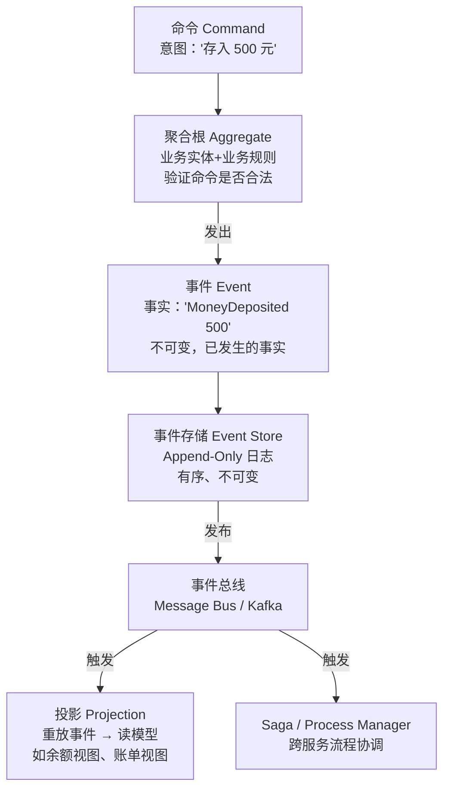
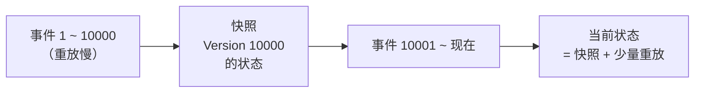
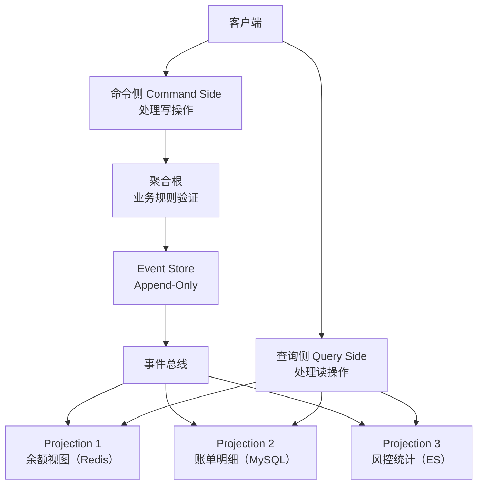

# Event Sourcing（事件溯源）

## TL;DR

传统系统存**当前状态**（UPDATE 覆盖），Event Sourcing 存**状态变化的历史**（只 INSERT 事件）。当前状态 = 重放所有事件的结果。天然支持完整审计日志、时间旅行、事件驱动集成。

---

## 核心思想对比

### 传统 CRUD

```
账户余额表：
  account_id | balance | updated_at
  1001       | 1500    | 2024-01-20

问题：
  - 无法知道余额是怎么变成 1500 的
  - 无法回溯某个时间点的状态
  - 并发更新需要锁
```

### Event Sourcing

```
事件日志（append-only）：
  event_id | account_id | event_type          | amount | occurred_at
  1        | 1001       | AccountOpened        | 0      | 2024-01-01
  2        | 1001       | MoneyDeposited       | 1000   | 2024-01-05
  3        | 1001       | MoneyDeposited       | 800    | 2024-01-10
  4        | 1001       | MoneyWithdrawn       | 300    | 2024-01-20

当前余额 = 0 + 1000 + 800 - 300 = 1500 ✓
1月10号余额 = 0 + 1000 + 800 = 1800（时间旅行）
完整操作历史可审计 ✓
```

---

## 核心概念



---

## TypeScript 实现

### 事件定义

```typescript
// 事件是不可变的事实记录
interface DomainEvent {
  readonly eventId:      string;
  readonly aggregateId:  string;
  readonly eventType:    string;
  readonly occurredAt:   Date;
  readonly version:      number; // 聚合的版本号，用于乐观锁
}

// 银行账户领域事件
interface AccountOpenedEvent extends DomainEvent {
  eventType: 'AccountOpened';
  payload: { ownerId: string; initialBalance: number };
}

interface MoneyDepositedEvent extends DomainEvent {
  eventType: 'MoneyDeposited';
  payload: { amount: number; description: string };
}

interface MoneyWithdrawnEvent extends DomainEvent {
  eventType: 'MoneyWithdrawn';
  payload: { amount: number; description: string };
}

interface AccountFrozenEvent extends DomainEvent {
  eventType: 'AccountFrozen';
  payload: { reason: string };
}

type BankEvent =
  | AccountOpenedEvent
  | MoneyDepositedEvent
  | MoneyWithdrawnEvent
  | AccountFrozenEvent;
```

### 聚合根（包含业务逻辑）

```typescript
enum AccountStatus { ACTIVE = 'ACTIVE', FROZEN = 'FROZEN', CLOSED = 'CLOSED' }

class BankAccount {
  // 当前状态（从事件重放得到）
  private id:      string = '';
  private ownerId: string = '';
  private balance: number = 0;
  private status:  AccountStatus = AccountStatus.ACTIVE;
  private version: number = 0;

  // 待提交的未发布事件
  private uncommittedEvents: BankEvent[] = [];

  // ── 命令处理（业务规则入口）───────────────────────────────────────────────────

  static open(accountId: string, ownerId: string, initialBalance: number): BankAccount {
    if (initialBalance < 0) throw new Error('初始余额不能为负');

    const account = new BankAccount();
    account.applyEvent({
      eventId:     crypto.randomUUID(),
      aggregateId: accountId,
      eventType:   'AccountOpened',
      occurredAt:  new Date(),
      version:     1,
      payload:     { ownerId, initialBalance },
    } as AccountOpenedEvent);

    return account;
  }

  deposit(amount: number, description = ''): void {
    if (this.status !== AccountStatus.ACTIVE) throw new Error('账户不可用');
    if (amount <= 0) throw new Error('存款金额必须大于0');

    this.applyEvent({
      eventId:     crypto.randomUUID(),
      aggregateId: this.id,
      eventType:   'MoneyDeposited',
      occurredAt:  new Date(),
      version:     this.version + 1,
      payload:     { amount, description },
    } as MoneyDepositedEvent);
  }

  withdraw(amount: number, description = ''): void {
    if (this.status !== AccountStatus.ACTIVE) throw new Error('账户不可用');
    if (amount <= 0) throw new Error('取款金额必须大于0');
    if (this.balance < amount) throw new Error(`余额不足：当前 ${this.balance}`);

    this.applyEvent({
      eventId:     crypto.randomUUID(),
      aggregateId: this.id,
      eventType:   'MoneyWithdrawn',
      occurredAt:  new Date(),
      version:     this.version + 1,
      payload:     { amount, description },
    } as MoneyWithdrawnEvent);
  }

  freeze(reason: string): void {
    if (this.status !== AccountStatus.ACTIVE) throw new Error('账户已冻结或已关闭');

    this.applyEvent({
      eventId:     crypto.randomUUID(),
      aggregateId: this.id,
      eventType:   'AccountFrozen',
      occurredAt:  new Date(),
      version:     this.version + 1,
      payload:     { reason },
    } as AccountFrozenEvent);
  }

  // ── 事件应用（更新内部状态，无业务规则）──────────────────────────────────────

  private applyEvent(event: BankEvent): void {
    this.handleEvent(event);
    this.uncommittedEvents.push(event);
  }

  private handleEvent(event: BankEvent): void {
    switch (event.eventType) {
      case 'AccountOpened':
        this.id      = event.aggregateId;
        this.ownerId = event.payload.ownerId;
        this.balance = event.payload.initialBalance;
        this.status  = AccountStatus.ACTIVE;
        break;
      case 'MoneyDeposited':
        this.balance += event.payload.amount;
        break;
      case 'MoneyWithdrawn':
        this.balance -= event.payload.amount;
        break;
      case 'AccountFrozen':
        this.status = AccountStatus.FROZEN;
        break;
    }
    this.version = event.version;
  }

  // ── 从事件历史重建（Event Store 加载时调用）──────────────────────────────────

  static reconstitute(events: BankEvent[]): BankAccount {
    const account = new BankAccount();
    for (const event of events) {
      account.handleEvent(event); // 直接 handle，不加到 uncommitted
    }
    return account;
  }

  getUncommittedEvents(): BankEvent[] { return [...this.uncommittedEvents]; }
  clearUncommittedEvents(): void      { this.uncommittedEvents = []; }

  // Getters
  getId():      string        { return this.id; }
  getBalance(): number        { return this.balance; }
  getStatus():  AccountStatus { return this.status; }
  getVersion(): number        { return this.version; }
}
```

### Event Store

```typescript
// 事件存储接口
interface EventStore {
  append(aggregateId: string, events: DomainEvent[], expectedVersion: number): Promise<void>;
  load(aggregateId: string, fromVersion?: number): Promise<DomainEvent[]>;
  loadAll(fromEventId?: string): Promise<DomainEvent[]>;
}

// 内存实现（生产用 PostgreSQL / EventStoreDB / DynamoDB）
class InMemoryEventStore implements EventStore {
  private readonly streams = new Map<string, DomainEvent[]>(); // aggregateId → events
  private readonly allEvents: DomainEvent[] = [];

  async append(aggregateId: string, events: DomainEvent[], expectedVersion: number): Promise<void> {
    const stream = this.streams.get(aggregateId) ?? [];

    // 乐观锁：检查版本号（防止并发冲突）
    const currentVersion = stream.length;
    if (currentVersion !== expectedVersion) {
      throw new Error(
        `并发冲突：预期版本 ${expectedVersion}，实际版本 ${currentVersion}`
      );
    }

    stream.push(...events);
    this.streams.set(aggregateId, stream);
    this.allEvents.push(...events);
  }

  async load(aggregateId: string, fromVersion = 0): Promise<DomainEvent[]> {
    return (this.streams.get(aggregateId) ?? []).slice(fromVersion);
  }

  async loadAll(fromEventId?: string): Promise<DomainEvent[]> {
    if (!fromEventId) return [...this.allEvents];
    const idx = this.allEvents.findIndex(e => e.eventId === fromEventId);
    return this.allEvents.slice(idx + 1);
  }
}
```

### Repository（聚合根的存取门面）

```typescript
class BankAccountRepository {
  constructor(
    private readonly store:     EventStore,
    private readonly publisher: EventPublisher,
  ) {}

  async load(accountId: string): Promise<BankAccount> {
    const events = await this.store.load(accountId) as BankEvent[];
    if (events.length === 0) throw new Error(`账户 ${accountId} 不存在`);
    return BankAccount.reconstitute(events);
  }

  async save(account: BankAccount): Promise<void> {
    const events          = account.getUncommittedEvents();
    const expectedVersion = account.getVersion() - events.length;

    // 原子写入（乐观锁）
    await this.store.append(account.getId(), events, expectedVersion);
    account.clearUncommittedEvents();

    // 发布到事件总线（供 Projection 和下游服务消费）
    for (const event of events) {
      await this.publisher.publish(event);
    }
  }
}
```

### Projection（读模型）

```typescript
// 读模型：余额快照（查询用，不是真实状态）
interface AccountSummary {
  accountId: string;
  balance:   number;
  status:    string;
  lastUpdatedAt: Date;
}

class AccountSummaryProjection {
  private readonly views = new Map<string, AccountSummary>();

  // 消费事件，维护读模型
  handle(event: BankEvent): void {
    switch (event.eventType) {
      case 'AccountOpened':
        this.views.set(event.aggregateId, {
          accountId:     event.aggregateId,
          balance:       event.payload.initialBalance,
          status:        'ACTIVE',
          lastUpdatedAt: event.occurredAt,
        });
        break;
      case 'MoneyDeposited': {
        const view = this.views.get(event.aggregateId)!;
        view.balance += event.payload.amount;
        view.lastUpdatedAt = event.occurredAt;
        break;
      }
      case 'MoneyWithdrawn': {
        const view = this.views.get(event.aggregateId)!;
        view.balance -= event.payload.amount;
        view.lastUpdatedAt = event.occurredAt;
        break;
      }
      case 'AccountFrozen': {
        const view = this.views.get(event.aggregateId)!;
        view.status = 'FROZEN';
        view.lastUpdatedAt = event.occurredAt;
        break;
      }
    }
  }

  // 查询（O(1)，无需重放事件）
  getAccount(accountId: string): AccountSummary | undefined {
    return this.views.get(accountId);
  }

  // 从头重建（Projection 损坏或需要修改时）
  rebuild(allEvents: BankEvent[]): void {
    this.views.clear();
    allEvents.forEach(e => this.handle(e));
  }
}
```

---

## Snapshot（快照）优化



```typescript
interface Snapshot {
  aggregateId: string;
  version:     number;
  state:       unknown; // 序列化的聚合状态
  createdAt:   Date;
}

class BankAccountWithSnapshot extends BankAccount {
  // 序列化当前状态为快照
  takeSnapshot(): Snapshot {
    return {
      aggregateId: this.getId(),
      version:     this.getVersion(),
      state: {
        balance: this.getBalance(),
        status:  this.getStatus(),
        ownerId: '', // 实际实现中暴露 getter
      },
      createdAt: new Date(),
    };
  }

  static fromSnapshot(snapshot: Snapshot, laterEvents: BankEvent[]): BankAccountWithSnapshot {
    const account = new BankAccountWithSnapshot();
    // 从快照恢复状态（跳过重放早期事件）
    (account as any).balance = (snapshot.state as any).balance;
    (account as any).status  = (snapshot.state as any).status;
    (account as any).version = snapshot.version;
    // 只重放快照之后的事件
    for (const event of laterEvents) {
      (account as any).handleEvent(event);
    }
    return account;
  }
}
```

---

## CQRS + Event Sourcing 组合



**关键优势：**
- 读写分离：读模型针对查询优化，可以有多个读模型
- 读模型可以随时重建：重放所有事件即可
- 投影失败不影响主流程（最终一致）

---

## 适用场景 vs 不适用

| 适用 | 不适用 |
|------|-------|
| 金融交易（余额变更必须可审计） | 简单 CRUD（用户名更新不需要历史） |
| 订单状态流转（每次状态变更要追溯） | 数据量超大且不需要历史（日志流水） |
| 分布式系统跨服务协调（Saga） | 团队不熟悉事件驱动（学习曲线陡） |
| 需要"时间旅行"调试 | 读多写少且不需要审计 |

---

## 面试追问

**Q: Event Sourcing 和传统日志有什么区别？**

传统日志是给人看的字符串，Event Sourcing 的事件是结构化领域对象，可以被程序消费、重放、构建不同读模型。传统日志不能驱动业务逻辑，事件可以。

**Q: 如果事件格式需要改变（Schema Evolution）怎么办？**

① 向前兼容：新事件加字段，旧代码忽略新字段 ② 向后兼容：保留旧字段 ③ 版本迁移：写 Upcaster，读到老版本事件时自动转换为新格式。关键是永远不要删字段，只加字段。

**Q: 并发写入同一聚合怎么处理？**

Event Store 的 `append` 方法通过**乐观锁**（预期版本号）保证：两个并发请求都基于版本 5 写入，第一个成功后版本变 6，第二个写入时发现版本不匹配（`5 ≠ 6`），抛并发冲突错误，应用层重试。

**Q: Projection 的最终一致延迟怎么处理？**

用户下单后立刻查订单，可能还没投影到读模型。解法：① 命令返回后等待投影完成（同步，简单但慢）② 命令侧直接从事件重建聚合状态返回给前端（不走读模型）③ 前端乐观更新（假设成功，异步确认）
