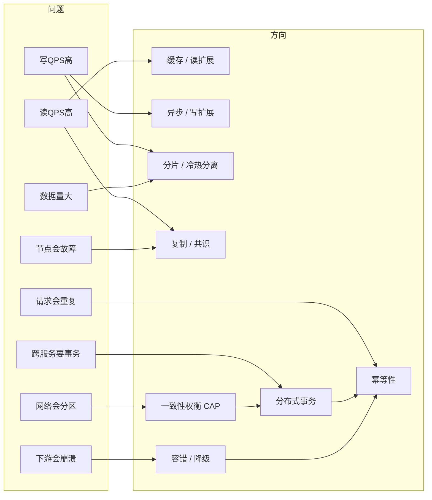
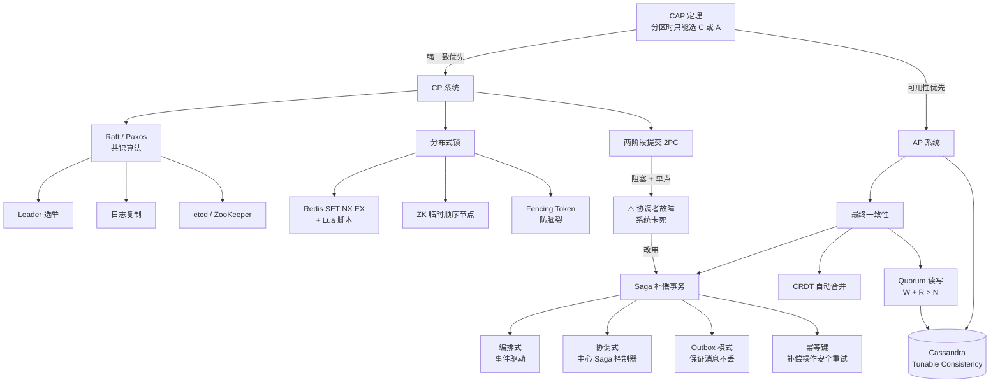
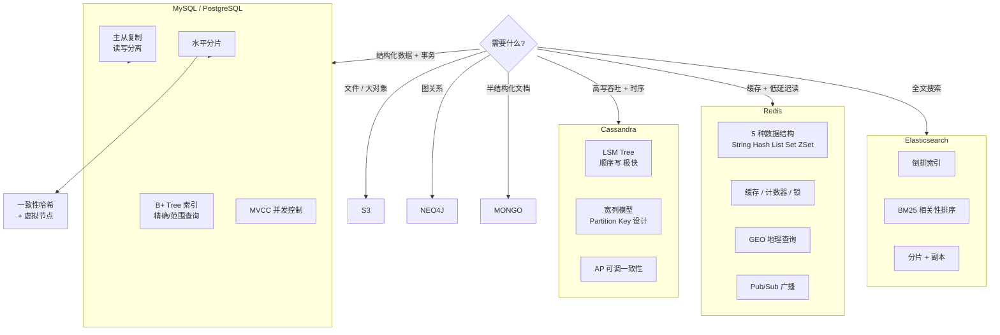
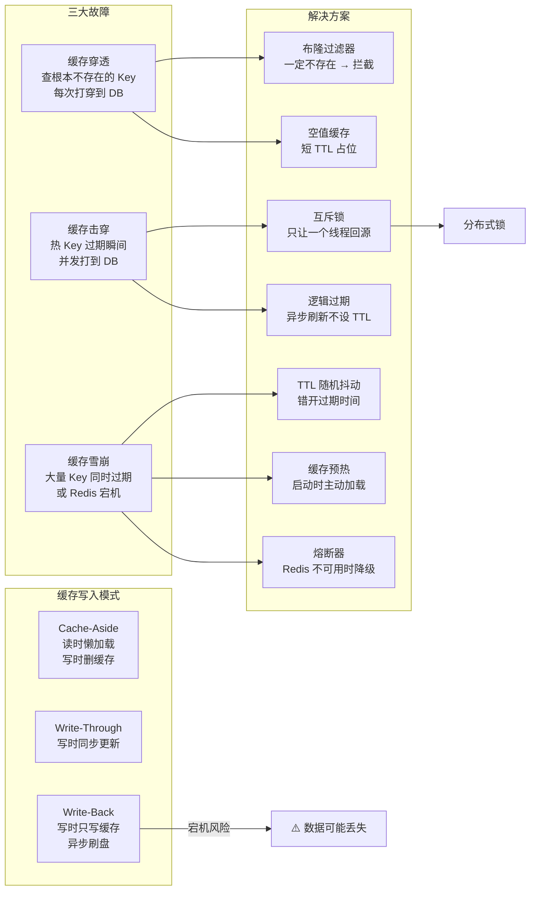
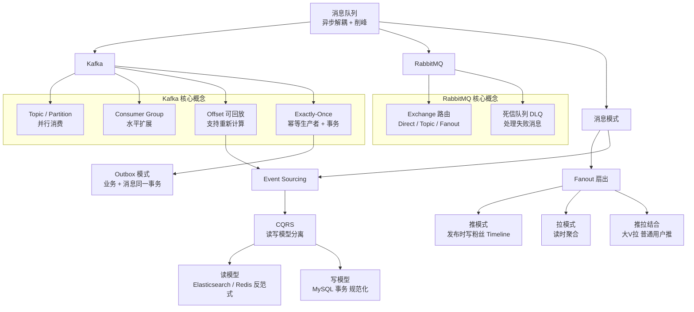
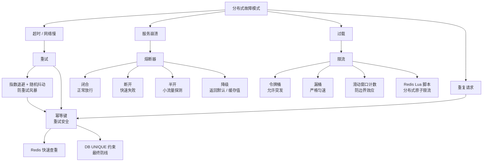
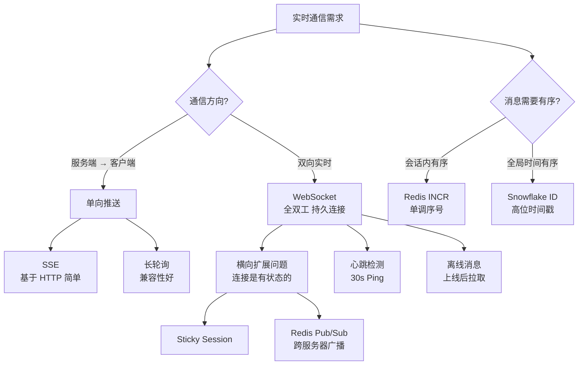
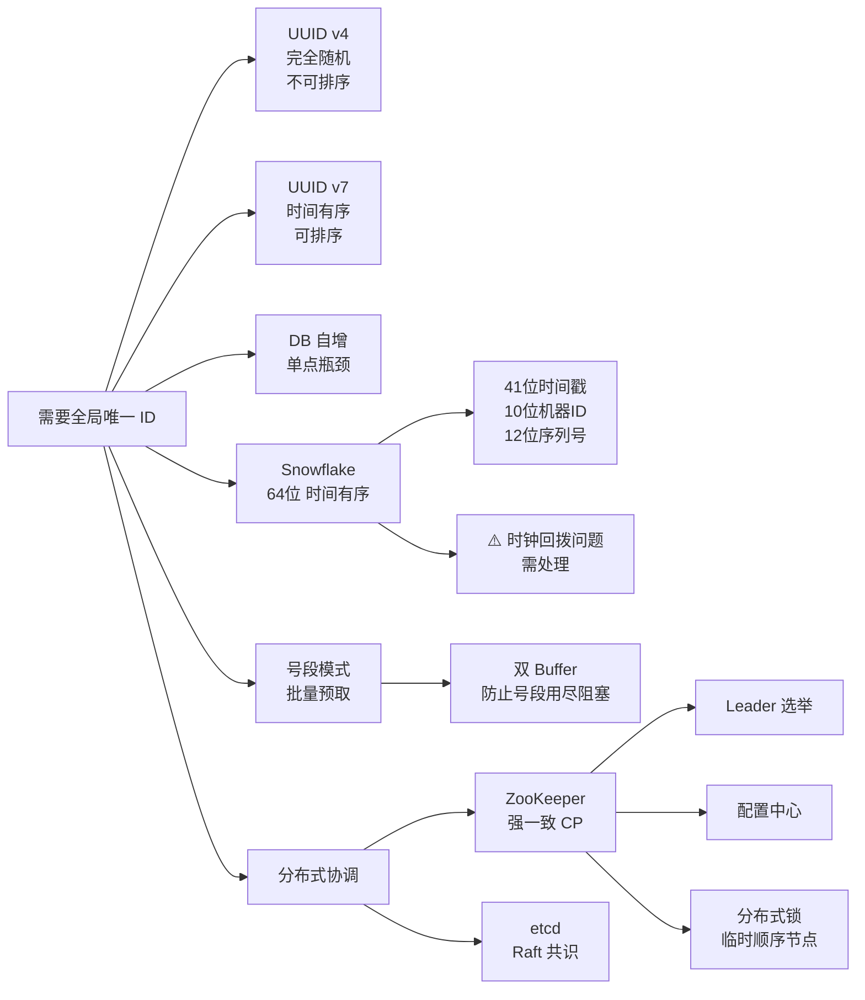
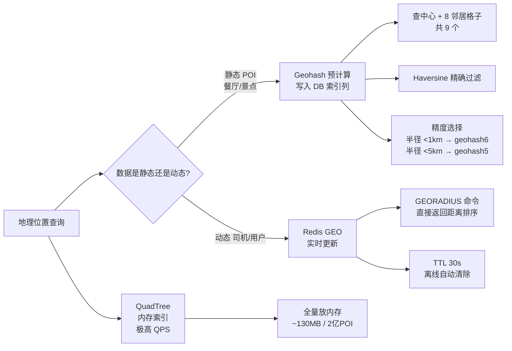
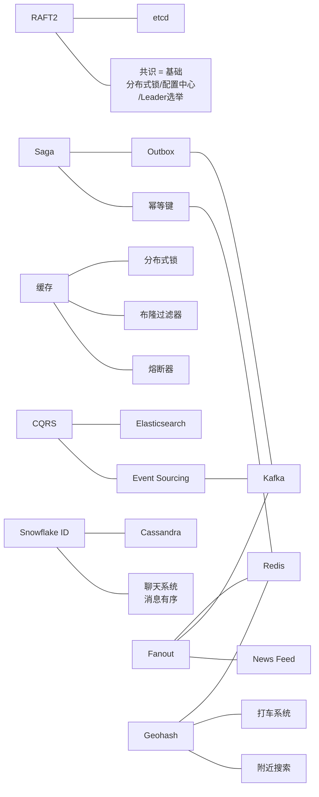

# 系统设计概念关系网

> 用法：遇到某个问题，顺着箭头找到对应的概念和技术；看到某个技术，顺着反向箭头找到它解决的问题。

---

## 图一：全局视图（问题 → 方向）

遇到什么问题，往哪个方向找答案。

---

## 图二：一致性权衡全景（核心中的核心）

CAP 定理是所有分布式决策的起点。

---

## 图三：存储选型决策

---

## 图四：缓存体系与三大故障

---

## 图五：异步消息与事件驱动

---

## 图六：容错与弹性

---

## 图七：实时通信选型

---

## 图八：ID 生成与分布式协调

---

## 图九：地理位置系统

---

## 图十：概念总线（快速跳转）

> 这张图不关注方向，只标注"哪些概念经常一起出现"。

---

## 阅读建议

**面试前一天**，按这个顺序扫一遍各图：

1. **图一（全局）**：建立"问题 → 方向"的直觉
2. **图二（一致性）**：CAP 是最高频的考点，必须烂熟
3. **图六（容错）**：几乎每个系统设计题都要提
4. **图四（缓存）**：穿透/击穿/雪崩三连问必考
5. **图五（消息）**：Kafka 相关的 case study 很多

**做 Mock 时**，画架构图之后，对照图三（存储选型）和图七（实时通信）检查有没有遗漏的考虑点。
