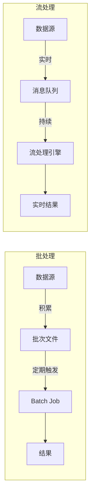
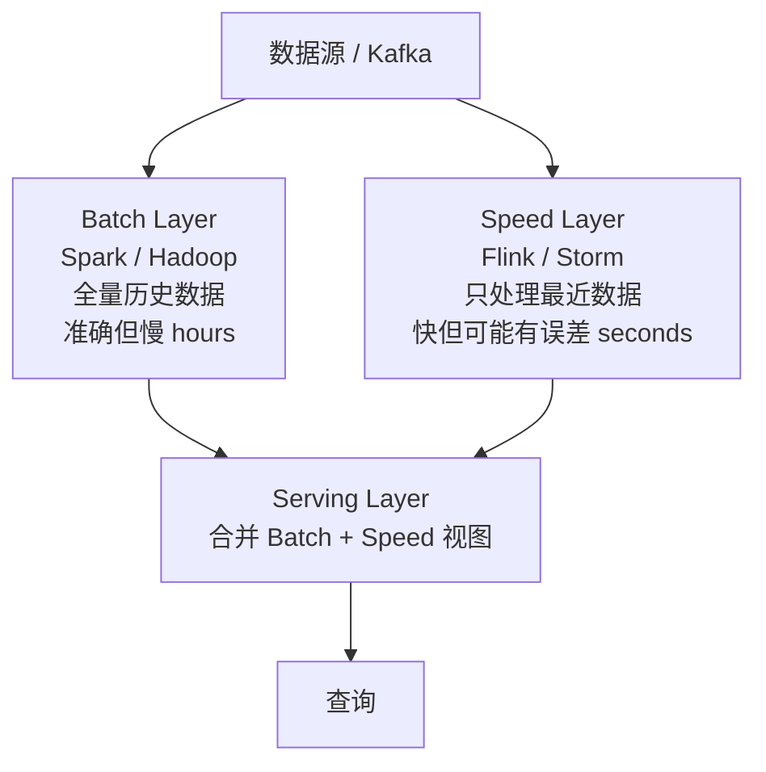
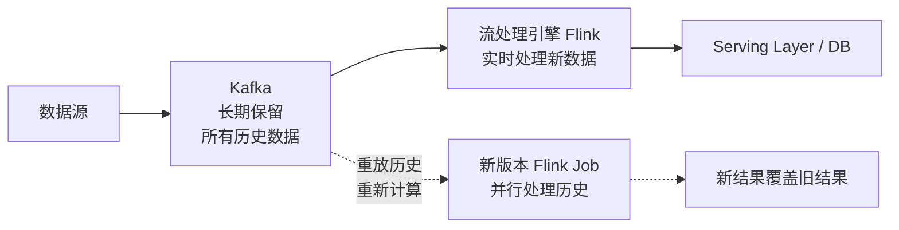
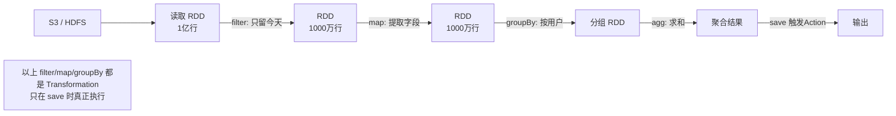
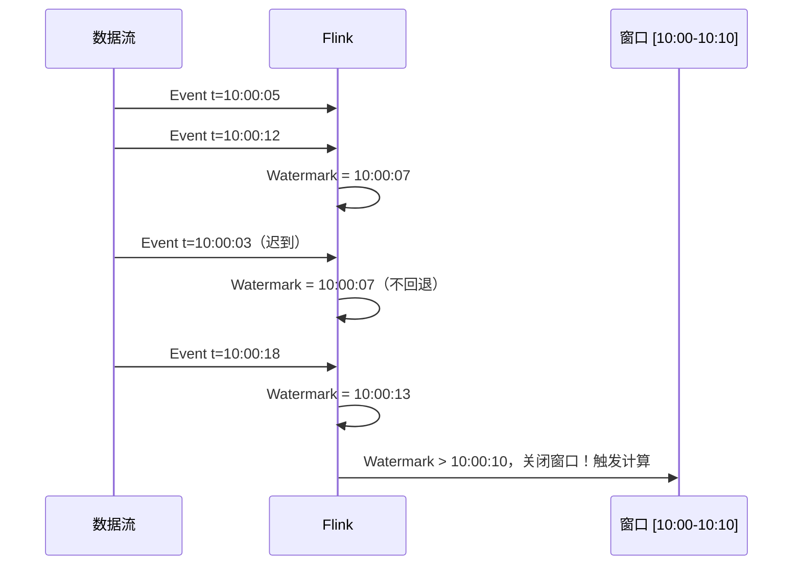
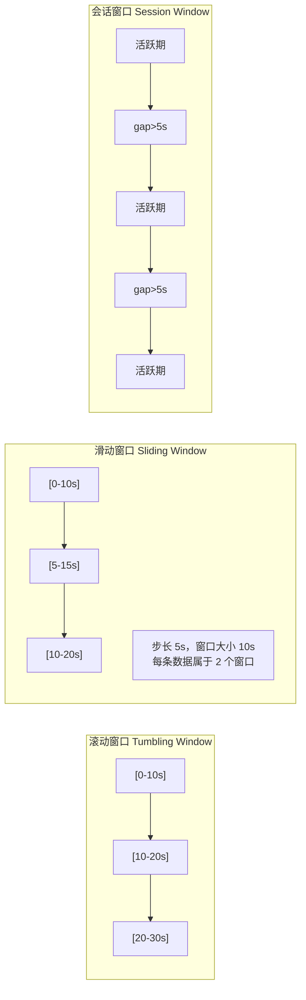
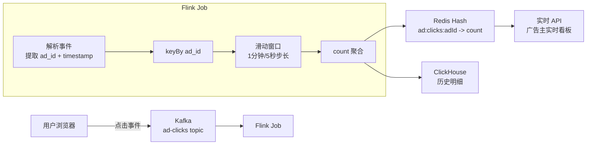

# 流处理与数据管道

## TL;DR

| 架构 | 核心思路 | 代表框架 |
|------|---------|---------|
| 批处理 | 收集一段时间数据，定期运行 | Hadoop MapReduce, Spark Batch |
| 流处理 | 数据到来即处理，延迟极低 | Flink, Kafka Streams |
| Lambda 架构 | 批+流双轨，Batch 保准确性，Speed 保低延迟 | Spark + Storm |
| Kappa 架构 | 只有流，历史数据通过重放 Kafka 处理 | Flink + Kafka |

---

## 批处理 vs 流处理

```
批处理（Batch Processing）：
  数据边界明确：处理"上午的所有日志"
  延迟高：通常分钟到小时级别
  吞吐量大：一次处理 TB 级数据
  适合：离线报表、日终对账、ETL 数仓

流处理（Stream Processing）：
  数据无边界：连续到来的事件流
  延迟低：毫秒到秒级
  每次处理少量数据（一条或一个小批次）
  适合：实时监控、欺诈检测、实时推荐
```



---

## Lambda 架构

Nathan Marz 在 2011 年提出，解决"既要低延迟，又要高准确性"的矛盾。

### 三层结构



**Batch Layer（批处理层）：**
- 存储全量原始数据（不可变，append-only）
- 定期（每小时/每天）重新计算所有数据的结果视图
- 结果准确，但有延迟

**Speed Layer（速度层）：**
- 只处理从上一次批处理完成到现在的新数据
- 快速（秒级）但可能有近似值或小误差
- 批处理完成后，这部分的速度层结果可被丢弃

**Serving Layer（服务层）：**
- 合并批处理视图和速度层视图
- 响应查询：先查 Batch 结果，再补充 Speed 结果

### Lambda 架构的问题

```
1. 维护两套代码：批处理逻辑和流处理逻辑需要分别实现（同一个业务写两遍）
2. 两套系统：Batch（Spark/Hadoop）+ Speed（Flink/Storm）运维复杂
3. 合并逻辑复杂：Batch 和 Speed 结果的合并容易出错
4. "近实时"可能不够：Speed Layer 的窗口期仍然有延迟
```

---

## Kappa 架构

Jay Kreps（Kafka 作者）在 2014 年提出，用一套流处理系统替代 Lambda 的两套。

### 核心思想



**关键点：历史数据重放（Replay）**
```
Kafka 保留所有历史数据（可配置保留时间，甚至永久保留）
当需要重新计算时（业务逻辑改变、Bug 修复）：
  1. 启动新版本的 Flink Job
  2. 从 Kafka 最早的 offset 开始重放数据
  3. 新结果写到新的 Serving Layer 表
  4. 验证通过后，将查询切换到新表
  5. 删除旧表，停止旧 Job
```

### Lambda vs Kappa 对比

| 维度 | Lambda | Kappa |
|------|--------|-------|
| 复杂度 | 高（两套系统） | 低（一套流处理） |
| 代码维护 | 批流两套逻辑 | 只有流处理逻辑 |
| 历史重算 | 重跑 Batch Job | 从 Kafka 重放 |
| 存储成本 | 需要存储历史快照 | Kafka 长期保留（成本较高） |
| 实时性 | Speed Layer 近实时 | 真正实时 |
| 适用场景 | 数据量超大、Kafka 存不下历史 | 数据量可控、流处理能力强 |

**现代趋势：** Kafka 存储成本下降 + Flink 成熟 → Kappa 越来越流行。但超大历史数据（PB 级）通常仍用 Lambda。

---

## Apache Spark 基础

### 核心概念

**RDD（Resilient Distributed Dataset）：**
```
不可变、可分区、可并行的数据集
每个 RDD 知道如何从父 RDD 或存储重建（血缘，Lineage）
→ 节点故障时，只重建丢失的 partition，而不是重跑整个 Job
```

**DataFrame / Dataset（Spark 2.0+）：**
```
有 Schema 的 RDD，支持 SQL 优化器（Catalyst）
推荐使用 DataFrame，比原始 RDD 快 10x+（自动优化执行计划）
```

**Transformations vs Actions：**
```
Transformations（惰性求值，不立即执行）：
  map, filter, groupBy, join, flatMap, select...
  → 只是构建 DAG（有向无环图），记录"怎么做"
  
Actions（触发真正计算）：
  count(), collect(), show(), write.save()...
  → 触发 DAG 执行，真正计算

原因：惰性求值让 Spark 可以优化整个计算流程（合并步骤，减少 shuffle）
```



### Shuffle（最贵的操作）

```
groupBy / join 需要把相同 key 的数据汇集到同一节点
→ 需要跨网络传输数据（Shuffle）
→ Shuffle 是 Spark Job 最贵的操作，能减少就减少

优化策略：
1. 先 filter 后 join（减少参与 Shuffle 的数据量）
2. Broadcast Join：小表（< 10MB）广播到每个节点，避免 Shuffle
3. 选择合适的 partition 数（太少/太多都不好）
```

### Spark Structured Streaming

```
Spark 的流处理模式：
  把流看作无界表（Unbounded Table）
  每个微批（Micro-Batch，通常 100ms~1s）处理一批新数据
  追加到结果表

vs Flink：
  Spark Streaming：Micro-Batch（本质还是批处理，延迟 100ms+）
  Flink：真正的逐条流处理（延迟 10ms 以下）
```

---

## Apache Flink 深度解析

Flink 是**真正的流处理引擎**：每条数据到来立即处理，而不是积累一批再处理。

### 时间语义（重要！）

```
流处理中的时间有三种：

事件时间（Event Time）：
  事件真正发生的时间（数据中携带的时间戳）
  例：用户点击按钮的时间 = 2024-01-15 10:30:05.123
  
摄入时间（Ingestion Time）：
  数据进入 Flink 的时间
  
处理时间（Processing Time）：
  Flink 实际处理这条数据的时间

推荐：大多数场景用 Event Time（准确反映业务时间）
```

**为什么 Event Time 难处理？**
```
网络延迟、设备时钟不同步 → 数据乱序到达：

真实时间线：
  10:00:01 发生事件 A
  10:00:02 发生事件 B
  10:00:03 发生事件 C

Flink 收到顺序（网络延迟不同）：
  10:00:01 收到 C（到了）
  10:00:02 收到 A（迟了）
  10:00:04 收到 B（很迟）

如果用 Processing Time：C 在 10:00:01 窗口，A/B 在之后的窗口 → 错误
如果用 Event Time：A/B/C 都应在 10:00:00-10:00:10 窗口 → 正确
```

### Watermark（水位线）

```
Flink 用 Watermark 跟踪 Event Time 的进展：

Watermark = t 意味着：
  "所有 Event Time ≤ t 的数据都已经到达了（或者我们决定不再等了）"
  → 可以关闭 ≤ t 的窗口并触发计算

Watermark 的生成：
  Watermark(t) = max(收到的事件时间) - 最大允许延迟
  
  例：最大允许延迟 = 5 秒
  收到 Event Time = 10:00:15 的数据
  → Watermark = 10:00:10
  → 10:00:10 之前的窗口可以关闭了

权衡：
  允许延迟越大 → 结果越准确，但实时性越差
  允许延迟越小 → 实时性好，但可能丢失迟到数据
```



### 窗口类型



**滚动窗口（Tumbling Window）：**
```
大小固定，不重叠，每个事件只属于一个窗口
每分钟的订单总量（每分钟一个窗口，互不重叠）
```

**滑动窗口（Sliding Window）：**
```
大小固定，有重叠（步长 < 窗口大小）
每 5 分钟统计最近 1 小时的活跃用户
→ 一条数据可能属于多个窗口（写放大，谨慎用于大数据量）
```

**会话窗口（Session Window）：**
```
按活跃/不活跃分割，无固定大小
用户连续操作算一个 Session，静止超过 N 秒开始新 Session
适合用户行为分析
```

### Exactly-Once 语义（Checkpoint）

```
Flink 如何保证精确一次处理（不重复、不丢失）？

Checkpoint 机制：
  Flink 定期（如每 10 秒）给所有算子的状态打快照
  快照包含：算子内部状态 + Kafka 的消费 offset

故障恢复：
  某个节点崩溃 → 从最近的 Checkpoint 恢复
  从对应的 Kafka offset 重新消费
  → 保证每条数据被处理且只被处理一次

前提条件：
  Source 支持 replay（Kafka ✅，UDP 数据流 ❌）
  Sink 支持幂等写或两阶段提交（DB with unique key ✅）
```

### Flink 状态管理（State）

```
有状态流处理（Stateful）：
  每个 key 维护独立状态
  例：用户登录次数计数器（每个 userId 有自己的 count）

状态存储：
  RocksDB State Backend（默认，持久化到磁盘）
    → 支持超大状态（不受内存限制）
    → 读写有磁盘 IO
  HashMapStateBackend（纯内存）
    → 快，但状态大小受内存限制
    → 适合小状态场景

状态 TTL：
  keyedState.ttlConfig = TTLConfig.of(Duration.ofDays(7))
  → 自动清理 7 天未访问的 key，防止状态无限增长
```

---

## 实战案例：广告点击实时聚合

设计一个系统：统计每个广告在过去 1 分钟内的点击次数（实时）



**Flink 代码概要（Java/Scala 伪代码）：**
```java
DataStream<ClickEvent> clicks = env
    .addSource(new FlinkKafkaConsumer<>("ad-clicks", schema, props));

clicks
    .assignTimestampsAndWatermarks(
        WatermarkStrategy.<ClickEvent>forBoundedOutOfOrderness(Duration.ofSeconds(5))
            .withTimestampAssigner((event, t) -> event.getTimestamp())
    )
    .keyBy(ClickEvent::getAdId)
    .window(SlidingEventTimeWindows.of(Time.minutes(1), Time.seconds(5)))
    .aggregate(new CountAggregator())
    .addSink(new RedisSink());
```

---

## 数据倾斜（Data Skew）处理

```
问题：某些 key 的数据量是其他 key 的 100 倍
  一个广告的点击量占全部的 80%
  → 处理该 key 的节点成为瓶颈，其他节点空闲

解决方案：

1. 两阶段聚合（局部 + 全局）：
   Phase 1：每个节点对热点 key 做局部聚合
             key = adId + random(0,9)  → 10 个并行子 key
   Phase 2：合并 10 个子 key 的结果 → 真正的 adId 总计

2. 预聚合（Pre-aggregation）：
   在 Kafka Producer 端先做局部聚合，减少进入 Flink 的数据量

3. Broadcast Join 替代普通 Join：
   维度表（小表）广播到每个节点，不做 Shuffle
```

---

## 面试速查：流处理关键问题

| 问题 | 标准答案 |
|------|---------|
| Lambda vs Kappa 怎么选？ | Lambda：数据量极大（Kafka 存不下历史）或需要严格准确性；Kappa：优先，代码简单，Kafka 能扛住 |
| Flink 如何保证 Exactly-Once？ | Checkpoint + Source Replay（Kafka）+ Sink 幂等写 |
| Event Time vs Processing Time 怎么选？ | 有乱序数据用 Event Time；对时效性要求极高且数据基本不乱序用 Processing Time |
| 数据倾斜怎么处理？ | 两阶段聚合（局部 random key + 全局合并） |
| 窗口选哪种？ | 独立周期报表→滚动；最近 N 分钟实时指标→滑动；用户行为分析→会话 |
| Flink State 过大怎么办？ | RocksDB State Backend + 设置 TTL + 考虑聚合压缩状态 |

---

## 关联文档

- [../../../06_case_studies/11_ad_click_aggregator.md](../../06_case_studies/11_ad_click_aggregator.md) — 广告点击聚合完整案例（Lambda/Kappa 选型）
- [../../../03_communication/02_async.md](../../03_communication/02_async.md) — Kafka 基础（流处理的数据源）
- [../../../07_real_world/02_uber.md](../../07_real_world/02_uber.md) — Flink 在 Uber 动态定价中的应用
