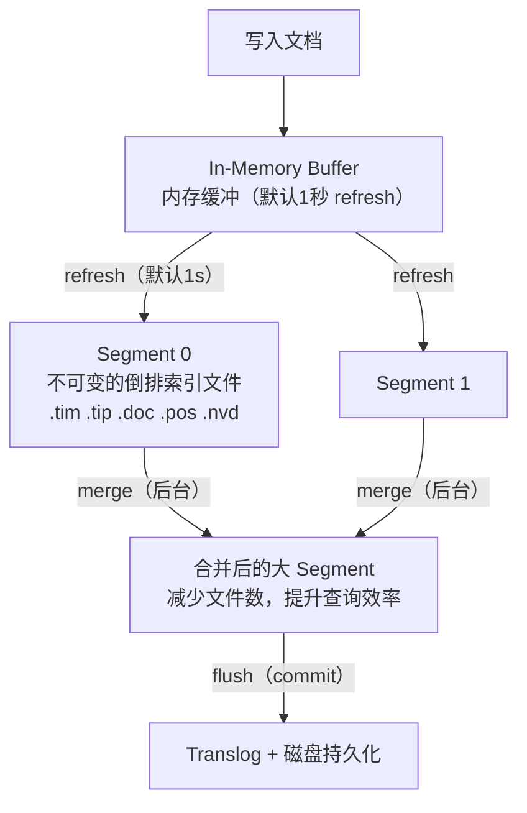
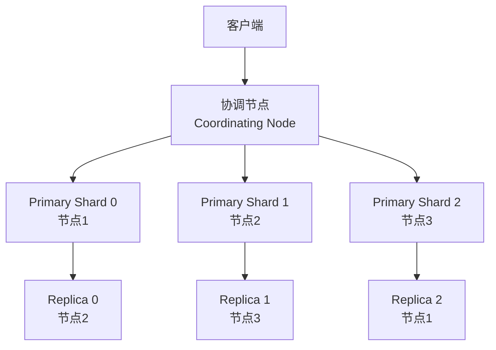
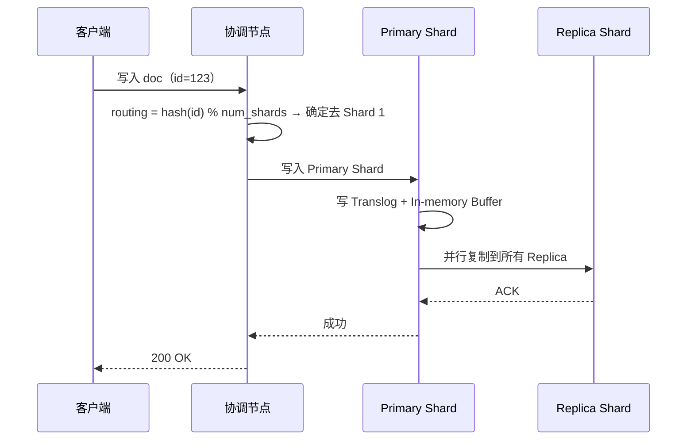
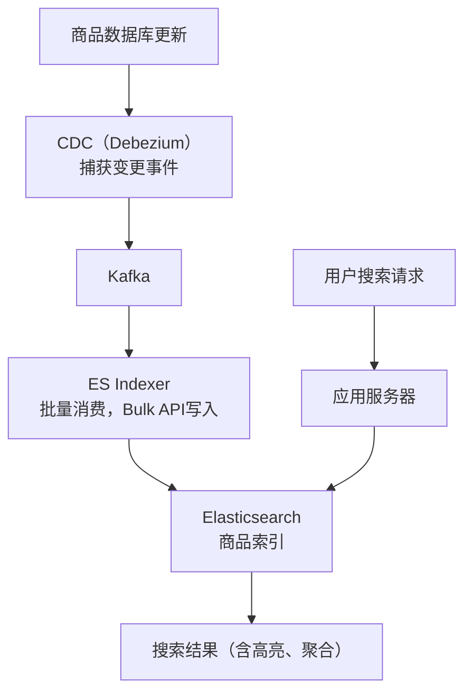

# Elasticsearch 深度解析

## TL;DR

Elasticsearch 是分布式倒排索引。理解它需要从三层看：**Lucene 段（数据结构层）→ 分片（分布式层）→ 集群（运维层）**。面试中被追问"为什么 ES 搜索快"或"ES 有什么坑"，这篇是答案。

---

## 倒排索引内部机制

### 正向索引 vs 倒排索引

```
正向索引（传统数据库）：
  Doc1 → ["苹果", "手机", "价格"]
  Doc2 → ["苹果", "电脑", "MacBook"]

查"苹果" → 要扫描所有文档，O(n)

倒排索引（Elasticsearch）：
  "苹果"  → [Doc1(pos:0), Doc2(pos:0)]
  "手机"  → [Doc1(pos:1)]
  "电脑"  → [Doc2(pos:1)]
  "MacBook" → [Doc2(pos:2)]

查"苹果" → 直接从索引找到 [Doc1, Doc2]，O(1) 查表
```

### Posting List（倒排列表）

每个词项（Term）对应一个 Posting List，包含：

```
Term: "苹果"
Posting List:
  ┌──────┬────────┬──────────┬─────────────┐
  │ DocID│  TF    │  Pos     │  Offsets    │
  │  1   │   2    │ [0, 15]  │ [(0,2),(30,32)] │
  │  5   │   1    │ [8]      │ [(40,42)]   │
  │  12  │   3    │ [0,5,20] │ ...         │
  └──────┴────────┴──────────┴─────────────┘
  TF = Term Frequency（词频，用于相关性打分）
  Pos = 词在文档中的位置（短语查询用）
  Offsets = 字符偏移（高亮显示用）
```

### Lucene Segment（段）



**关键特性：Segment 不可变（Immutable）**

- 写入后不能修改，更新 = 删除旧 doc + 写入新 doc
- 删除只是打标记（.del 文件），Segment Merge 时才真正清除
- 好处：无锁并发读、OS 文件系统缓存友好

### Near Real-Time（NRT）

```
写入 → 内存 Buffer（不可搜索）
        ↓ refresh（默认每秒）
      Segment（可搜索但未 fsync）
        ↓ flush（默认每30分钟 或 Translog达到阈值）
      磁盘持久化（commit point）

所以 ES 是 "近实时" 而不是 "实时"：
  写入后默认 1 秒内可以被搜索到
  
调整 refresh_interval:
  index.refresh_interval: "1s"    ← 默认，搜索延迟 1s
  index.refresh_interval: "30s"   ← 批量写入场景，提升吞吐量 30x
  index.refresh_interval: "-1"    ← 关闭自动 refresh（reindex 大量数据时用）
```

---

## 相关性评分（BM25）

ES 7.x 默认用 BM25（Best Matching 25），比 TF-IDF 更好：

```
BM25 公式：
  Score(q, d) = Σ IDF(t) × TF_norm(t, d)

  IDF(t) = log((N - df + 0.5) / (df + 0.5))
    N = 文档总数
    df = 包含该词的文档数
    词越稀有 → IDF 越高 → 权重越大

  TF_norm(t, d) = tf × (k1 + 1) / (tf + k1 × (1 - b + b × dl/avgdl))
    tf = 词频
    k1 = 词频饱和因子（默认1.2）：tf 越高增益越小
    b  = 文档长度归一化（默认0.75）
    dl = 文档长度
    avgdl = 平均文档长度

对比 TF-IDF：
  TF-IDF：tf 线性增长（"苹果苹果苹果"比"苹果"高3倍）
  BM25：  tf 饱和（"苹果"出现10次和出现100次效果相近）
          且短文档里的词权重更高
```

---

## 分布式架构



### 写入流程



### 查询流程（两阶段）

```
第一阶段：Query Phase（分散）
  协调节点 → 广播 Query 到所有 Shard（Primary 或 Replica）
  每个 Shard → 返回 Top K 文档的 DocID + Score（只返回元数据）
  协调节点 → 汇总所有 DocID，全局 Top K 排序

第二阶段：Fetch Phase（聚集）
  协调节点 → 根据全局 Top K 的 DocID，fetch 实际文档内容
  聚合结果返回客户端

为什么两阶段：
  第一阶段只传 (DocID, Score)，数据量小
  如果直接拉全部文档内容，N 个 Shard 各返回 K 个完整文档，
  协调节点拿到 N×K 个文档再排序，网络传输 + 内存浪费
```

---

## 深度分页陷阱

```
GET /index/_search
{
  "from": 10000,
  "size": 10
}

问题：
  每个 Shard 都要返回 10000+10=10010 个文档给协调节点
  5个 Shard → 50050 个文档在协调节点排序
  → 内存 OOM、延迟极高

ES 默认限制 max_result_window = 10000

解决方案：

① Search After（推荐）：
  第一页：sort by _score, _id，记录最后一条的 sort 值
  下一页：search_after: [上一页最后的 sort 值]
  → 每个 Shard 只返回 size 条（10条），不累积

② Scroll API（大量导出用）：
  第一次请求生成快照（scroll_id），
  后续用 scroll_id 分批拉取
  → 适合数据导出，不适合实时翻页

③ 限制最大页数：
  业务上不允许翻到第 1000 页
  搜索引擎 Top 结果才有价值
```

---

## 常见性能优化

### 写入优化

```
1. 批量写入（Bulk API）
   单条写入：每条 1 次网络往返 + 1 次 Segment 刷新
   Bulk API：一批 1000 条，一次网络往返，批量 refresh
   → 吞吐提升 10-50x

2. 关闭自动 Refresh（批量导入时）
   PUT /my_index/_settings
   { "refresh_interval": "-1" }
   // 导入完成后手动 refresh
   POST /my_index/_refresh

3. 调大 Translog flush 阈值
   "translog.durability": "async"    ← 异步写磁盘，性能提升但极端情况丢数据
   "translog.flush_threshold_size": "1gb"

4. 预留足够的 Heap（推荐 JVM Heap = 机器内存的 50%，最多31GB）
   另一半留给 OS 文件系统缓存 Lucene 的文件
```

### 查询优化

```
1. 使用 Filter 而非 Query（无需打分的条件）
   Query Context：计算相关性分数，不缓存
   Filter Context：只过滤，结果缓存在 "Filter Cache"
   
   // ❌ 用 must 做范围过滤（计算了没用的分数）
   { "query": { "range": { "age": { "gte": 18 } } } }
   
   // ✅ 用 filter（走缓存）
   { "query": { "bool": { "filter": { "range": { "age": { "gte": 18 } } } } } }

2. 只取需要的字段（_source filtering）
   { "_source": ["title", "price"] }  // 不传输整个文档

3. 避免 wildcard 前缀通配符（*foo 性能差）
   "wildcard": { "title": "*苹果" }  ← 全扫所有词项
   改用 edge_ngram 在索引期处理前缀

4. Shard 大小建议
   每个 Shard 10-50 GB
   过多小 Shard：协调节点开销大
   过大单 Shard：合并慢、恢复慢
```

### Mapping 优化

```json
{
  "mappings": {
    "properties": {
      "title": {
        "type": "text",
        "analyzer": "ik_max_word",     // 中文分词
        "fields": {
          "keyword": {                  // 同时支持精确匹配和聚合
            "type": "keyword",
            "ignore_above": 256
          }
        }
      },
      "price": { "type": "float" },
      "status": {
        "type": "keyword"              // 枚举值用 keyword，不分词
      },
      "description": {
        "type": "text",
        "index": false                 // 只存储，不建索引（不需要搜索的字段）
      },
      "raw_log": {
        "type": "text",
        "norms": false                 // 禁用 norms（不需要相关性打分的字段）
      }
    }
  }
}
```

---

## 面试高频场景

### 场景：实时搜索商品



### 场景：日志分析（ELK Stack）

```
Log → Logstash/Filebeat（采集）→ Kafka（缓冲）→ Logstash（处理）→ ES（存储+搜索）→ Kibana（可视化）

索引策略：
  按日期分索引：logs-2024-01-15, logs-2024-01-16...
  ILM（Index Lifecycle Management）：
    Hot  → 最近7天，SSD，副本1
    Warm → 7-30天，HDD，副本0（只读）
    Cold → 30-90天，压缩，迁移到冷存储
    Delete → 90天后删除
```

---

## 面试追问

**Q: ES 为什么不适合做主数据库？**

① 写入不是实时（1秒 refresh 延迟），② 不支持事务，③ 更新代价高（删旧写新），④ 磁盘占用大（倒排索引额外存储），⑤ 不支持复杂 JOIN。ES 是搜索/分析引擎，主数据存 MySQL/PostgreSQL，ES 做镜像。

**Q: ES 集群的脑裂问题（Split-Brain）如何解决？**

`discovery.min_master_nodes = quorum = N/2 + 1`（ES 7.x 改为自动配置）。分区时少数派节点因无法达到法定人数，拒绝成为 Master，避免出现两个 Master。

**Q: Segment Merge 对性能有影响吗？**

有，Merge 是 CPU + IO 密集型操作。可以调低 merge 优先级，或者在业务低峰期手动触发 `_forcemerge`（把所有 Segment 合并成 1 个，查询性能最优，但操作期间 IO 压力大）。
