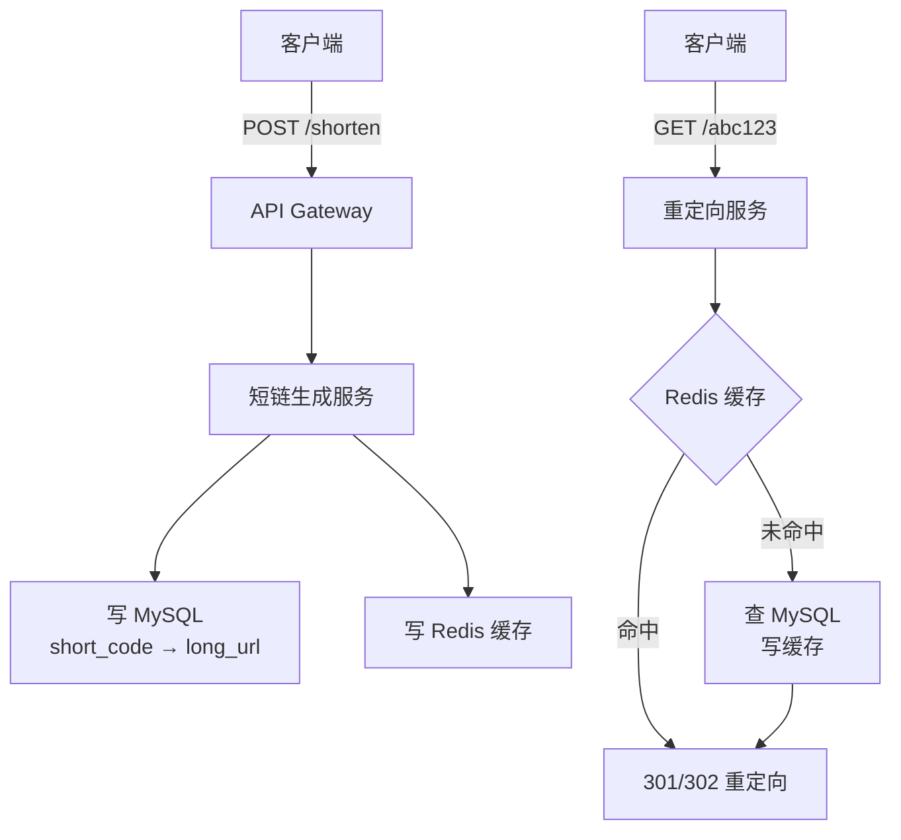

# 系统设计案例：URL 短链接服务

## TL;DR

把长 URL（`https://www.example.com/very/long/path?with=many&params=here`）映射成短码（`https://short.ly/abc123`），点击后重定向到原始地址。核心难点是**短码的全球唯一生成**和**高并发重定向**。

---

## 需求澄清（面试开始必做）

**功能需求：**
- 给定长 URL，生成短码（写接口）
- 访问短码，重定向到长 URL（读接口）
- 支持自定义短码（可选）
- 支持短链过期（可选）

**非功能需求：**
- 高可用（读接口不能挂，用户点链接必须能访问）
- 低延迟重定向（< 10ms）
- 短码不可预测（防止遍历扫描）

**规模估算（面试中必讲）：**
```
假设：1 亿 DAU，每人每天生成 1 条短链，点击 10 次

写 QPS = 1 亿 / 86400 ≈ 1,200 次/秒（不高）
读 QPS = 1,200 × 10 = 12,000 次/秒
读写比 = 10:1（读多写少）

存储估算（5 年）：
  1 条短链记录：1,200 QPS × 86400 秒 × 365 天 × 5 年 ≈ 1900 亿条
  每条记录：short_code(8B) + long_url(100B) + metadata(50B) ≈ 160 字节
  总存储：1900 亿 × 160B ≈ 30 TB（需要分片，但单库可以撑到几百亿）
```

---

## 高层架构



---

## 核心设计：短码生成

### 方案一：Hash 截断（最常见）

```typescript
import crypto from 'crypto';

function generateShortCode(longUrl: string): string {
  // MD5 or SHA256，取前 6 个字节，Base62 编码
  const hash = crypto.createHash('md5').update(longUrl).digest('hex');
  // 取前 8 个字符，Base62 转换
  return hashToBase62(hash.slice(0, 8));
}

// Base62 字符集：0-9 A-Z a-z（62个字符）
const BASE62_CHARS = '0123456789ABCDEFGHIJKLMNOPQRSTUVWXYZabcdefghijklmnopqrstuvwxyz';

function hashToBase62(hex: string): string {
  let num = BigInt('0x' + hex);
  let result = '';
  while (num > 0) {
    result = BASE62_CHARS[Number(num % 62n)] + result;
    num = num / 62n;
  }
  return result.padStart(7, '0'); // 7位Base62 = 62^7 ≈ 3.5万亿种
}
```

**问题：Hash 冲突**

不同的长 URL 可能生成相同的短码：

```
解决方法：
1. 写入 DB 时检测 UNIQUE 约束是否冲突
2. 冲突时在 URL 后追加随机盐，重新 Hash
3. 重试最多 3 次

while (retries < 3) {
  const code = generateShortCode(longUrl + salt);
  try {
    await db.insert({ code, longUrl });
    return code;
  } catch (e) {
    if (isUniqueViolation(e)) {
      salt = Math.random().toString();
      retries++;
    }
  }
}
```

**问题：同一个 URL 生成多次**

同一个长 URL 多次生成应该返回同一个短码（去重）：

```typescript
// 先查是否已存在
const existing = await db.query(
  'SELECT short_code FROM urls WHERE long_url_hash = ?',
  [sha256(longUrl)] // 用长 URL 的 hash 做索引（不直接存全 URL 做查询条件）
);
if (existing) return existing.short_code;
```

---

### 方案二：全局自增 ID + Base62 编码（更可靠）

```
数据库自增 ID：1, 2, 3, ..., 1000000
Base62 编码：
  1       → "1"
  62      → "Z"
  3844    → "ZZ"
  238328  → "ZZZ"
  1000000 → "4c92"

7 位 Base62 = 62^7 = 3,521,614,606,208（3.5 万亿），足够用
```

**分布式唯一 ID：**

多台服务器不能都用 DB 自增（性能瓶颈），可以用 Snowflake：

```typescript
// Snowflake ID 生成器（见 04_distributed/05_id_generation.md）
const id = snowflake.nextId(); // 全局唯一 64 位整数
const shortCode = toBase62(id); // 转成 10 位 Base62
```

---

## 重定向：301 vs 302

这是面试高频考点：

| | 301 Moved Permanently | 302 Found (Temporary) |
|--|----------------------|----------------------|
| 含义 | 永久重定向 | 临时重定向 |
| 浏览器行为 | 浏览器缓存此重定向，下次直接跳转（不再请求服务器）| 每次都请求服务器 |
| 服务器流量 | 第一次命中后，后续请求都被浏览器短路，服务器流量少 | 每次都到服务器，流量大 |
| 分析统计 | **无法统计点击次数**（浏览器缓存后直接跳，不经过服务器）| **可以统计点击次数** |
| 修改 URL | **不能**（改了用户也不会知道）| **可以**（可以随时修改长 URL）|

**选择策略：**
- 想节省服务器流量、短链永久有效 → 301
- 想统计点击、支持修改 → 302
- **绝大多数商业短链服务选 302**（需要统计数据）

---

## 数据库设计

```sql
CREATE TABLE urls (
  id          BIGINT PRIMARY KEY AUTO_INCREMENT,
  short_code  VARCHAR(10)  NOT NULL UNIQUE,
  long_url    TEXT         NOT NULL,
  long_url_hash CHAR(64)   NOT NULL, -- SHA256，用于去重查询
  user_id     BIGINT,                -- 创建者
  created_at  TIMESTAMP    NOT NULL DEFAULT NOW(),
  expires_at  TIMESTAMP,             -- 过期时间（可为 NULL）
  click_count BIGINT       DEFAULT 0,

  INDEX idx_long_url_hash (long_url_hash),
  INDEX idx_short_code (short_code)
);
```

---

## 缓存设计

```
读 QPS 12,000 次/秒，数据库完全扛得住，但重定向要求 < 10ms

读缓存（Cache-Aside）：
  Key: "url:{short_code}"
  Value: 长 URL 字符串
  TTL: 24 小时（热链接会被不断刷新）

写时：写 DB 成功后，删缓存（等下次读时重新加载）
     或 直接写缓存（Write-Through，适合热链接场景）
```

---

## 过期短链的处理

```
方案一：懒删除（Lazy Deletion）
  查到记录时检查 expires_at，如果过期返回 404
  不主动删，定期批量清理（CRON 每天凌晨跑）

方案二：主动删除（对存储紧张的系统更合适）
  用 Redis Sorted Set 存"过期时间 → short_code"
  后台进程轮询 ZRANGEBYSCORE，删除过期条目
```

---

## 分片策略（如果数据量太大）

```
选择 short_code 的前 2 个字符做 Hash Shard Key：
  "ab..." → Shard 0
  "cd..." → Shard 1
  ...

优点：读请求（给定短码）可以直接路由到正确分片
缺点：写请求（生成短码）需要先确定分片再写入
```

---

## 完整数据流

**写流程（生成短链）：**
```
1. 用户 POST /shorten { url: "https://..." }
2. API Gateway 鉴权、限流
3. 短链服务：
   a. 计算 SHA256(long_url)，查 DB 是否已存在
   b. 已存在 → 直接返回已有短码
   c. 不存在 → 生成短码（Hash 截断或 Snowflake）
   d. 写入 DB（UNIQUE 约束防冲突）
   e. 写入 Redis 缓存
4. 返回短链 URL
```

**读流程（访问短链）：**
```
1. 用户 GET /abc123
2. 重定向服务：
   a. Redis GET "url:abc123"
   b. 缓存命中 → 302 重定向
   c. 缓存未命中 → 查 DB → 写入缓存 → 302 重定向
   d. DB 也没有 → 返回 404
3. 异步：发消息给统计服务（记录点击）
```

---

## Node.js 类比

如果你写过 Express：
```typescript
// Express 里重定向
app.get('/:code', async (req, res) => {
  const { code } = req.params;

  // 先查 Redis
  let longUrl = await redis.get(`url:${code}`);

  if (!longUrl) {
    // 查数据库
    const record = await db.query('SELECT long_url FROM urls WHERE short_code = ?', [code]);
    if (!record) return res.status(404).send('Not found');
    longUrl = record.long_url;
    // 写缓存
    await redis.setex(`url:${code}`, 86400, longUrl);
  }

  // 302 重定向（可以记录点击）
  res.redirect(302, longUrl);
});
```

---

## 常见陷阱

1. **短码预测性**：不要用纯数字自增 ID 做短码（`/1`, `/2`，用户会枚举扫描访问别人的链接）。Base62 编码自增 ID 问题更小，但如果安全要求高，需要在 ID 上加混淆（如 Feistel Network 置换）

2. **长 URL 去重的查询问题**：不要用 `WHERE long_url = ?`（TEXT 列不能建精确索引）。用 `WHERE long_url_hash = SHA256(long_url)`，先用 hash 列找到候选记录，再比较原始 URL

3. **301 缓存带来的统计失效**：如果业务需要统计点击，必须用 302

4. **缓存和 DB 不一致**：写 DB 成功后写缓存失败怎么办？下次读时 Cache Miss 会回源 DB，自动修复。但如果写 DB 失败、缓存写成功（顺序错了）就会有脏缓存，所以要先写 DB 再写缓存

5. **无过期设计导致存储爆满**：长期运行的服务必须有过期机制

---

## 面试 Q&A

### 简单

**Q: 为什么用 Base62 而不是 Base64？**

A: Base64 包含 `+` 和 `/`，在 URL 中是特殊字符，需要 percent-encoding（变成 `%2B` 和 `%2F`），会让短码变长且看起来丑。Base62 用 0-9、A-Z、a-z，全是 URL 安全字符，不需要转义。

**Q: 301 和 302 重定向有什么区别？**

A: 301 是永久重定向，浏览器会缓存，后续访问直接跳转而不经过服务器，所以**无法统计点击次数**。302 是临时重定向，每次都经过服务器，可以统计点击，也支持随时修改目标 URL。商业短链服务（Bit.ly 等）通常选 302。

---

### 中等

**Q: 如何防止同一个长 URL 生成多个不同的短码？**

A: 建一个额外的反向查找：以长 URL 的 SHA256 hash 为索引，写入时先 `SELECT WHERE long_url_hash = ?`，已存在直接返回，不存在才生成新短码。注意：如果业务允许同一 URL 有多个短码（比如不同用户生成的），这步可以跳过。

**Q: 如果 Hash 冲突了怎么处理？**

A: 在长 URL 后追加随机盐（`random_string + long_url`），重新计算 Hash，直到不冲突为止。最多重试 3-5 次。同时在 `short_code` 列上建 UNIQUE 约束，让数据库作为最终防线。

---

### 困难

**Q: 如何设计支持每天 1 亿次生成、10 亿次重定向的高并发系统？**

A: 分层来看：

**写（生成）：**
- 写 QPS ≈ 1200 次/秒，单台 MySQL 完全够，不用分片
- 短码生成用 Snowflake 分布式 ID，避免 DB 做自增（高并发时 AUTO_INCREMENT 会成为瓶颈）
- 多台短链生成服务水平扩展，无状态

**读（重定向）：**
- 读 QPS ≈ 12,000 次/秒，Redis 单机 10 万+ QPS，轻松应对
- 极热链接可能单 Key 成热点（如病毒式传播的新闻），需要本地缓存（服务器内存）+ Redis 双层缓存
- Redis 宕机时，回退到 MySQL 读，配合 Circuit Breaker 防止雪崩

**全球低延迟：**
- 多地部署重定向服务（CDN Edge 或多区域 K8s 集群）
- Redis 全球多副本（允许复制延迟，最终一致可以接受）
- 真正 < 10ms 的目标需要把重定向服务部署在距离用户的 CDN Edge 节点

**Q: 如果要支持自定义短码（如 `/myblog`），设计有什么变化？**

A: 需要注意：
1. 自定义短码可能和系统生成的短码冲突 → 自定义短码单独存一个命名空间，或者给系统生成的短码加前缀（如 `s_abc123`），用户自定义的无前缀
2. 自定义短码需要鉴权（登录用户才能用，防止抢占 `/google`、`/amazon` 等）
3. 自定义短码长度和字符集需要有限制（防止 SQL 注入、超长码等）

---

## 关联文档

- [../04_distributed/05_id_generation.md](../04_distributed/05_id_generation.md) — Snowflake ID 生成
- [../02_storage/03_cache.md](../02_storage/03_cache.md) — 缓存策略（Cache-Aside）
- [../02_storage/01_rdbms.md](../02_storage/01_rdbms.md) — MySQL 索引设计
