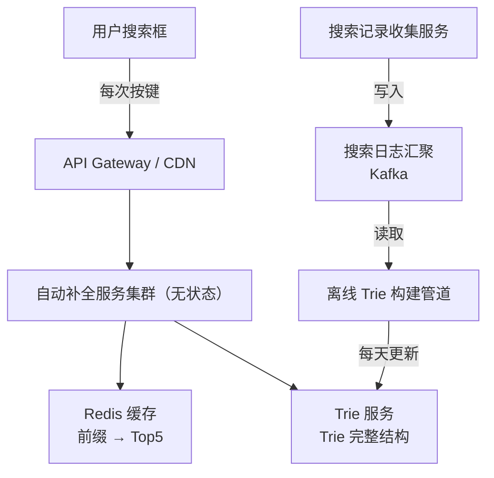

# 系统设计案例：搜索自动补全（Search Autocomplete）

## TL;DR

用户在搜索框输入 "appl"，系统实时返回 ["apple", "application", "apple watch", "apply"] 等候选词。核心难点：**如何在 < 100ms 内从数十亿条搜索记录中找出最相关的补全词**。

---

## 需求澄清

**功能需求：**
- 用户每输入一个字符，返回最多 5 条补全建议
- 按搜索频率排名（热门词排前面）
- 仅支持前缀匹配（输入 "appl" 能补全 "apple"，不能补全 "snapple"）
- 只考虑过去 1 周的热门搜索词（数据有时效性）

**非功能需求：**
- 延迟：< 100ms（每次按键后的响应时间）
- 高可用（搜索框是核心功能）
- 规模：日活 5000 万，每人每天平均搜索 5 次，每次搜索平均输入 10 个字符

**规模估算：**
```
查询 QPS = 5000 万 × 5 次 × 10 字符 / 86400 ≈ 30,000 QPS（峰值 2-3 倍 ≈ 10 万 QPS）
数据量：假设 Top 100 万搜索词，每个词 20 字节，= 20 MB（非常小！可以全量缓存）
更新频率：每天重新计算一次热门词（离线计算）
```

---

## 核心数据结构：Trie（前缀树）

```
Trie 树示例（存储：apple, app, application）：

root
└── a
    └── p
        └── p (词: app, 频率: 1200)
            ├── l
            │   └── e (词: apple, 频率: 8500)
            └── l
                └── i
                    └── c
                        └── a
                            └── t
                                └── i
                                    └── o
                                        └── n (词: application, 频率: 3200)

查询 "appl" 的过程：
1. 从根节点出发，沿 a→p→p→l 走到 "appl" 节点
2. 收集该节点下的所有叶子节点（所有以 "appl" 为前缀的词）
3. 按频率排序，返回 Top 5
```

**Trie 的问题：** 如果每个节点都要遍历子树找 Top K，时间复杂度是 O(子树大小)，对热门前缀（如 "a"）子树可能极大。

**优化：在每个节点缓存 Top K 词（空间换时间）**

```
每个 Trie 节点额外存储：top5_suggestions = [最热的5个以此前缀开头的词]

查询 "appl"：
  直接读取 "appl" 节点的 top5_suggestions
  O(1) 复杂度！

代价：
  更新一个词的频率时，需要更新从根节点到该词的路径上所有祖先节点的 top5
  更新复杂度 O(词的长度 × K × log K)，可以接受（离线批量更新）
```

---

## 系统架构



---

## 两层缓存设计

### Layer 1：浏览器端缓存（最省钱）

```javascript
// 前端实现：同一个前缀不要重复请求
const cache = new Map();

async function getSuggestions(prefix: string): Promise<string[]> {
  if (cache.has(prefix)) return cache.get(prefix);

  const results = await fetch(`/api/autocomplete?q=${prefix}`);
  const data = await results.json();

  cache.set(prefix, data.suggestions);
  // 本地缓存 1 分钟（TTL 通过 setTimeout 实现）
  setTimeout(() => cache.delete(prefix), 60000);

  return data.suggestions;
}
```

效果：相同前缀只发一次网络请求，剩余全部本地命中。

### Layer 2：Redis 缓存（服务端）

```
Key: "ac:{prefix}"  （如 "ac:appl"）
Value: JSON 数组，["apple", "application", "apply", ...]
TTL: 10 分钟（补全词变化不频繁，缓存命中率极高）

命中率分析：
  用户输入 "apple" 的过程：
  a → ap → app → appl → apple（5 次请求）
  这 5 个前缀都会分别缓存
  下一个输入同样前缀的用户：全部 Cache Hit
```

---

## 数据更新流程（离线计算）

补全词的频率数据不需要实时更新（用户不会感知到「昨天搜了什么」的微小变化），每天重新计算一次即可。

```
Step 1: 收集搜索日志
  每次搜索 → Kafka Topic "search_events"
  事件格式：{ userId, query, timestamp, clicked_result }

Step 2: 离线聚合（MapReduce / Spark）
  每天凌晨：
  - 统计过去 7 天每个搜索词的频率
  - 过滤低频词（< 100 次搜索的词不进 Trie）
  - 生成新的 Trie（包含 Top 100 万词，每个节点有 Top 5 前缀）

Step 3: 热更新 Trie
  新 Trie 构建完毕 → 写入新的 Redis 快照
  自动补全服务 → 加载新快照（蓝绿更新，不中断服务）

  注意：Trie 完整存储在内存里（100 万词 × 平均词长 8 × 节点额外数据 ≈ 几百 MB），
        用 Redis Hash 存储，或直接序列化到服务进程内存
```

---

## Trie 存储设计

**方案 A：存在 Redis 里（推荐，多实例共享）**

```
Redis Hash:
Key: "trie_node:{prefix}"
Field: "suggestions"  Value: JSON Array of {word, score}
Field: "children"     Value: JSON Array of next chars

例：
trie_node:appl → {
  suggestions: [
    {word: "apple", score: 8500},
    {word: "application", score: 3200},
    {word: "apply", score: 2100}
  ],
  children: ["e", "i", "y"]
}

查询 "appl"：
  HGET trie_node:appl suggestions → 直接返回 Top 5
  O(1) 查询！
```

**方案 B：存在服务进程内存里（更快，但横向扩展时每台都要加载）**

```typescript
// 全量 Trie 序列化成 JSON，服务启动时加载到内存
// 100 万词的 Trie ≈ 500MB 内存

class TrieService {
  private trie: Map<string, { suggestions: string[]; }> = new Map();

  lookup(prefix: string): string[] {
    return this.trie.get(prefix)?.suggestions ?? [];
  }

  // 每天更新：原子替换
  async reload(newTrieData: Map<string, any>) {
    this.trie = newTrieData; // 直接替换引用，原子操作
  }
}
```

---

## 处理特殊情况

### Unicode / 多语言

```
"应用" 的前缀补全：
  "应" → ["应用", "应该", "应届"]
  "应用" → ["应用程序", "应用商店"]

Trie 的 Key 用 Unicode 字符串，不用字节序列
中文字符 = 1 个节点（不是 3 个字节）
```

### 拼音补全（中文特色）

```
输入 "yingyong" → 返回 ["应用", "营业", "影响"]

实现：
  构建两套索引：
  1. 原始词 Trie（直接前缀匹配）
  2. 拼音 Trie（pinyin → 原始词）
  
  查询时同时查两个，结果合并去重
```

---

## 节流（Throttle）优化

不要每按一个键就发一次请求：

```javascript
// 防抖（Debounce）：停止输入 150ms 后才发请求
function debounce(fn: Function, delay: number) {
  let timer: NodeJS.Timeout;
  return (...args: any[]) => {
    clearTimeout(timer);
    timer = setTimeout(() => fn(...args), delay);
  };
}

const fetchSuggestions = debounce(async (query: string) => {
  const results = await getSuggestions(query);
  renderSuggestions(results);
}, 150);

searchInput.addEventListener('input', (e) => {
  fetchSuggestions(e.target.value);
});
```

效果：用户输入 "apple" 的 5 个字符如果在 150ms 内完成，只发 1 次请求而不是 5 次。

---

## Node.js 类比

如果你写过自动补全功能，这就是 Redis ZADD + ZRANGEBYLEX 的组合技：

```typescript
// Redis 实现前缀匹配（适合小规模场景）
// 利用 Sorted Set 的字典序特性

// 写入词汇
await redis.zadd('words', 0, 'apple');
await redis.zadd('words', 0, 'application');
await redis.zadd('words', 0, 'apply');

// 查询以 "appl" 开头的词
const results = await redis.zrangebylex('words', '[appl', '[appl\xff', 'LIMIT', 0, 5);
// 返回：['apple', 'application', 'apply']
```

但这个方案不支持按频率排序。真正的补全系统用上面介绍的 Trie + 预缓存 Top K 方案。

---

## 常见陷阱

1. **实时更新 vs 离线更新**：不要试图实时更新 Trie（每次搜索立即修改节点）。Trie 更新时要修改从根到目标节点的整条路径，并发写入极其复杂。用离线批量更新（每天一次）足够，用户感知不到差异

2. **Trie 节点数量爆炸**：英文词典有 17 万词，每词平均 7 字母，Trie 节点数 ≈ 17 万 × 7/2 ≈ 60 万节点。100 万搜索词的 Trie ≈ 350 万节点，每节点存 Top 5 ≈ 200 字节，总计 700MB，内存可以接受

3. **低频词的处理**：不要把所有词都加入 Trie。设置频率阈值（如过去 7 天搜索次数 < 100），低频词不进 Trie，否则数据量失控

4. **前缀过短的请求**：1 个字符的前缀（如 "a"）匹配词太多，可以不返回补全（节省资源），或只从固定的 Top 10 热词列表里过滤

---

## 面试 Q&A

### 简单

**Q: 为什么 Trie 是做前缀搜索的好数据结构？**

A: 所有以相同前缀开头的词共享前缀路径上的节点，查找时沿着前缀字符串走到对应节点，时间复杂度是 O(前缀长度)，与词库大小无关。而用 B-Tree 索引做前缀匹配（`LIKE 'appl%'`）最差情况是 O(log N) 加上扫描范围内所有词，Trie 更快且内存局部性更好。

**Q: 补全建议需要实时反映搜索热度变化吗？**

A: 通常不需要。热门词的频率数据每天更新一次即可，用户察觉不到「昨天 vs 今天」的微小差异。实时更新 Trie 需要对整条前缀路径加写锁，代价高且复杂，工程价值不高。

---

### 中等

**Q: 每个 Trie 节点预缓存 Top K，更新频率数据时如何维护？**

A: 更新一个词（如 `apple` 的频率从 8500 → 9000）时，需要更新从根到该词的所有祖先节点：`a → ap → app → appl → apple`。对每个祖先节点，重新计算其 Top K 列表（检查 apple 是否挤进了 Top K，以及它的新排名）。这是 O(词长 × K × log K) 的操作，在离线批量重建时做，不在在线服务里做。

**Q: 如果用户搜索量激增（如热点事件），补全词不及时怎么办？**

A: 日常情况每天重建一次 Trie 足够。对于热点事件（如突发新闻），可以：1）提高重建频率（每小时一次）；2）热词实时写入 Redis 黑板（单独的热词 Key），查询时合并 Trie 结果和热词列表，热词强制排在前面。

---

### 困难

**Q: 如何设计支持 10 万 QPS 的自动补全服务，延迟 P99 < 50ms？**

A: 多层优化：

**减少请求量：** 前端防抖（150ms），浏览器本地缓存（Map，1分钟 TTL）。实际到达服务端的 QPS 可能只有 10% 即 1 万 QPS。

**服务端 Redis 缓存：** Key = `ac:{prefix}`，TTL = 10 分钟。缓存命中时直接返回 JSON，< 1ms。

**Redis 集群：** 1 万 QPS 的缓存查询，Redis 单机能轻松扛，即使缓存 miss 导致 Trie 查询，Redis GET 也 < 1ms。

**Trie 本地内存：** 把 Trie 直接加载到每台自动补全服务器的进程内存（500MB），避免网络 hop。查询完全在内存里做，< 0.1ms。

**水平扩展：** 自动补全服务是无状态的（Trie 每台都一样），可以通过负载均衡水平扩展。10 万 QPS ÷ 1 万 QPS/服务器 = 10 台服务器。

**P99 分析：** 本地内存查询 < 0.1ms + 序列化 < 0.5ms + 网络 < 5ms = 总共 < 6ms，远小于 50ms。P99 的"慢请求"来自 GC、缓存冷启动等，通过 JVM 调优（或用 Rust/Go 减少 GC）可以控制在 20ms 以内。

---

## 关联文档

- [../02_storage/03_cache.md](../02_storage/03_cache.md) — Redis 缓存策略
- [../02_storage/02_nosql.md](../02_storage/02_nosql.md) — Redis 数据结构（Sorted Set）
- [../05_methodology/reference/01_numbers_cheatsheet.md](../05_methodology/reference/01_numbers_cheatsheet.md) — 延迟数字参考
