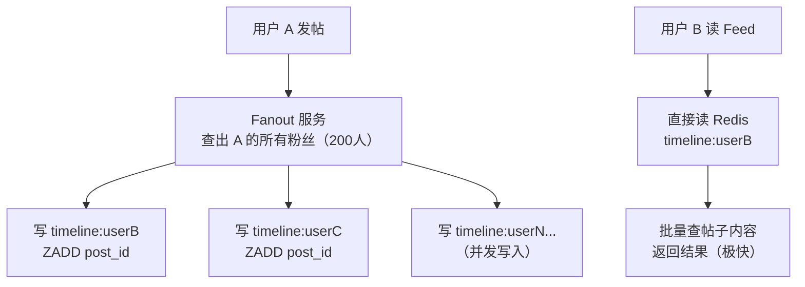
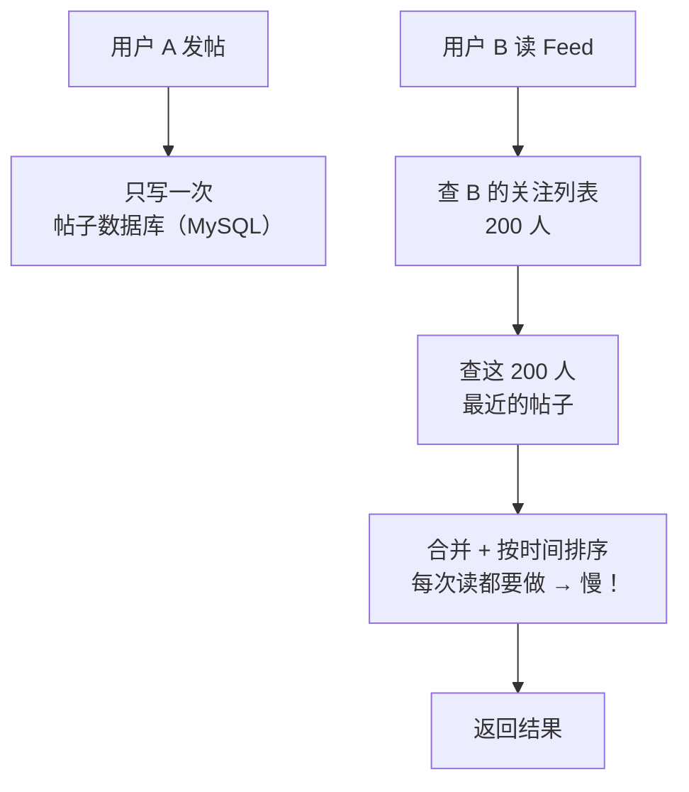
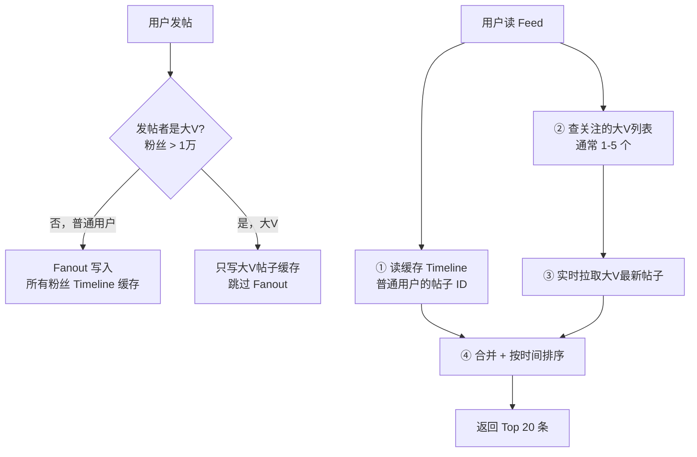
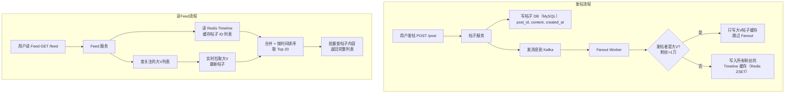

# 系统设计案例：新闻 Feed（News Feed / Timeline）

## TL;DR

Twitter、微博、Facebook Timeline 的核心：用户打开 App，看到所有关注者的最新动态，按时间倒序排列。核心难点：**大 V 发帖后如何高效让数千万粉丝都能看到**。

---

## 需求澄清

**功能需求：**
- 用户可以发帖（Post）
- 用户打开 App 看到 Feed（关注者的最新帖子，时间倒序）
- Feed 只显示用户关注的人发的内容
- 支持点赞、转发（不深入设计这个）

**非功能需求：**
- 延迟：Feed 加载 < 1 秒
- 发帖后关注者应该"很快"看到（几秒内可以接受，不需要毫秒级）
- 大 V 问题：某用户有 5000 万粉丝发了帖

**规模估算：**
```
DAU: 1 亿
每人平均关注 200 人
每人每天发帖 2 次，读 Feed 10 次
写 QPS = 1 亿 × 2 / 86400 ≈ 2,400 QPS
读 QPS = 1 亿 × 10 / 86400 ≈ 12,000 QPS
读写比 = 5:1（读多写少）

Fanout 成本估算（推模式）：
2,400 帖/秒 × 200 粉丝 = 480,000 次缓存写入/秒（可以接受）
但 1 个大 V 发帖 = 5000 万次写入（不可接受！）
```

---

## 核心设计选择：推 vs 拉

### 方案一：推模式（Fanout on Write）



**优点：** 读极快（预计算好了）
**缺点：** 大 V 写入代价极高

---

### 方案二：拉模式（Fanout on Read）



**优点：** 写极快（只写一次）
**缺点：** 读很慢

---

### 方案三：推拉结合（Twitter 的实际做法）



**关键 insight：** 大 V 通常关注的人少（几千个用户关注了 Elon Musk），而普通用户的帖子 Fanout 代价小。读时额外拉取的大 V 数量有限（用户关注的大 V 通常 < 10 个），合并成本可控。

---

## 详细架构



---

## Redis 数据结构

### Timeline 缓存

```
数据结构：Redis Sorted Set（ZSET）
Key: "timeline:{userId}"
Score: 帖子发布时间戳（Unix 毫秒）
Member: 帖子 ID

写入（Fanout 时）：
  ZADD timeline:userB 1700000001000 "post123"
  ZADD timeline:userB 1700000002000 "post456"
  ZREMRANGEBYRANK timeline:userB 0 -1001  // 只保留最新 1000 条

读取（倒序，最新在前）：
  ZREVRANGE timeline:userB 0 19  // 读最新 20 条帖子 ID
```

### 帖子内容缓存

```
数据结构：Redis Hash
Key: "post:{postId}"
Field-Value:
  "author_id"   → "user123"
  "content"     → "Hello world"
  "created_at"  → "1700000001000"
  "like_count"  → "1523"
  "image_url"   → "https://..."
TTL: 1 天（热帖会被频繁访问，自动续期）

批量读（避免 N+1）：
  const postIds = ['post123', 'post456', 'post789'];
  const posts = await redis.pipeline(
    postIds.map(id => ['hgetall', `post:${id}`])
  ).exec();
```

---

## 关系数据库设计

```sql
-- 帖子表（可以分片，按 user_id 分）
CREATE TABLE posts (
  id          BIGINT PRIMARY KEY,        -- Snowflake ID
  user_id     BIGINT NOT NULL,
  content     TEXT,
  image_urls  JSON,
  created_at  TIMESTAMP NOT NULL,
  like_count  INT DEFAULT 0,
  status      TINYINT DEFAULT 1,         -- 1=正常, 0=删除

  INDEX idx_user_created (user_id, created_at DESC)
);

-- 关注关系表
CREATE TABLE follows (
  follower_id  BIGINT NOT NULL,          -- 粉丝
  followee_id  BIGINT NOT NULL,          -- 被关注者
  created_at   TIMESTAMP,
  PRIMARY KEY (follower_id, followee_id),
  INDEX idx_followee (followee_id)       -- 查某人的粉丝列表
);
```

---

## Fanout 的异步处理

发帖成功后，Fanout 是**异步**的（不阻塞发帖接口）：

```typescript
// 帖子服务
async function createPost(userId: string, content: string): Promise<Post> {
  // 1. 写 DB（同步）
  const post = await db.posts.create({ userId, content, createdAt: new Date() });

  // 2. 发 Kafka 消息（同步，但 Kafka 写入很快 < 5ms）
  await kafka.produce('new_posts', {
    postId: post.id,
    userId,
    createdAt: post.createdAt.getTime()
  });

  // 3. 直接返回，不等 Fanout 完成
  return post;
}

// Fanout Worker（独立进程）
kafka.consume('new_posts', async (msg) => {
  const { postId, userId, createdAt } = msg;

  // 批量查粉丝（可能几万人，分批处理）
  const followers = await db.getFollowers(userId);

  // 是否是大 V
  if (followers.length > 10000) {
    // 大 V 只更新自己的最新帖子缓存
    await redis.zadd(`posts:${userId}`, createdAt, postId);
    return;
  }

  // 普通用户：批量写入所有粉丝 Timeline
  const pipeline = redis.pipeline();
  for (const followerId of followers) {
    pipeline.zadd(`timeline:${followerId}`, createdAt, postId);
    pipeline.zremrangebyrank(`timeline:${followerId}`, 0, -1001); // 保留最新 1000 条
  }
  await pipeline.exec();
});
```

---

## 读取 Feed 的完整实现

```typescript
async function getFeed(userId: string, cursor?: string, limit = 20): Promise<FeedResult> {
  const maxScore = cursor ? parseInt(cursor) : '+inf';
  const minScore = '-inf';

  // 1. 从 Timeline 缓存获取帖子 ID
  const cachedPostIds = await redis.zrevrangebyscore(
    `timeline:${userId}`,
    maxScore, minScore,
    'LIMIT', 0, limit
  );

  // 2. 获取用户关注的大 V 列表（另一个缓存）
  const followedCelebsIds = await redis.smembers(`user_celebs:${userId}`);

  // 3. 实时拉取大 V 最新帖子
  const celebPostIds: string[] = [];
  for (const celebId of followedCelebsIds) {
    const ids = await redis.zrevrange(`posts:${celebId}`, 0, 4); // 每个大 V 最新 5 条
    celebPostIds.push(...ids);
  }

  // 4. 合并 + 排序 + 去重
  const allIds = [...new Set([...cachedPostIds, ...celebPostIds])];
  const postsWithTime = await getPostTimestamps(allIds);
  const sortedIds = postsWithTime
    .sort((a, b) => b.createdAt - a.createdAt)
    .slice(0, limit)
    .map(p => p.id);

  // 5. 批量获取帖子内容（先查缓存，缓存未命中才查 DB）
  const posts = await batchGetPosts(sortedIds);

  // 6. 下一页 cursor（最后一条的时间戳）
  const nextCursor = posts.length === limit
    ? posts[posts.length - 1].createdAt.toString()
    : undefined;

  return { posts, nextCursor };
}
```

---

## Node.js 类比

如果你写过博客系统，这就是"关注功能 + 动态流"的大规模版本。核心思路：
- 小博客：每次查所有关注者的帖子然后 ORDER BY created_at（拉模式，简单）
- Twitter 量级：维护每个用户的预计算 Timeline（推模式），读时直接取

---

## 常见陷阱

1. **没有 Timeline 大小限制**：Timeline ZSET 无限增长，热用户的 Timeline 可能有数百万条。需要在 Fanout 时维护最大条数（如 1000 条），超出就删最旧的

2. **冷启动问题**：新用户的 Timeline 是空的（没有历史 Fanout 数据）。解决：首次加载 Feed 时，拉模式兜底（查关注者的最新帖子），同时触发异步构建 Timeline 缓存

3. **Timeline 缓存和大 V 帖子的合并排序**：两个时间序列合并时，要注意时间戳单位一致（都用 Unix 毫秒），且帖子 ID 要去重（可能大 V 的帖子已经在 Timeline 缓存里了）

4. **删帖/修改帖子的处理**：帖子删除后，仍然在粉丝的 Timeline 缓存里（帖子 ID 还在）。读取时需要过滤已删除的帖子（读帖子内容时检查 status 字段），或者 Fanout 删帖事件（从所有粉丝 Timeline 里移除）——后者代价和发帖一样高，通常选前者

---

## 面试 Q&A

### 简单

**Q: 推模式（Fanout on Write）和拉模式（Fanout on Read）各适合什么场景？**

A: 推模式预计算 Timeline，读极快，适合读多写少且粉丝数量有限的场景（普通用户）。拉模式写只写一次，适合写多读少或粉丝极多的场景（大 V）。实际系统用推拉结合：普通用户推模式，大 V 拉模式，读时再合并。

**Q: Feed 为什么用 Redis Sorted Set 而不是 Redis List？**

A: Sorted Set 支持按 Score（时间戳）范围查询（`ZRANGEBYSCORE`），可以实现基于时间的游标分页（cursor-based pagination），不会有 List 分页的"每次分页要从头数"问题。同时去重也更方便（ZADD 相同 member 会覆盖）。

---

### 中等

**Q: 大 V 的粉丝数量是实时变化的（粉丝可能从 9999 增长到 10001），如何处理大 V 阈值边界的问题？**

A: 不需要精确的阈值切换。可以：1）将阈值做成配置（如 1 万），定期批量重新分类用户；2）或者大 V 标签是运营手动打的，不做实时切换。核心是不让单次 Fanout 的代价超过系统承受上限，边界值的几百条写入误差对系统影响可忽略。

**Q: 如何实现 Feed 的翻页（分页）？**

A: 用基于 cursor 的分页，不用 OFFSET。Cursor = 当前页最后一条帖子的时间戳。

```
第一页：ZREVRANGEBYSCORE timeline:userId +inf -inf LIMIT 0 20
返回最新 20 条，cursor = 最后一条的 score

第二页：ZREVRANGEBYSCORE timeline:userId (cursor -inf LIMIT 0 20
（注意 ( 符号表示不包含 cursor 本身，防止重复）
```

用 OFFSET 的问题：OFFSET 1000 要先跳过 1000 条，数据量大时很慢；而且在这 1000 条里如果有新帖子插入，分页会错位。

---

### 困难

**Q: 如果某个大 V 发了一条帖子，如何保证在 5 秒内让所有 5000 万粉丝的 Feed 里都能看到？**

A: 严格来说不能——对 5000 万粉丝做推模式 Fanout 需要写 5000 万条缓存记录，即使 Redis Pipeline 每秒写 50 万条，也需要 100 秒，远超 5 秒。

**实际做法（推拉结合）：**

大 V 的帖子不做 Fanout，帖子写入数据库后，更新大 V 自己的"最新帖子缓存"（Redis ZSET `posts:{celebId}`），这一步 < 100ms。

粉丝读 Feed 时，实时从大 V 的帖子缓存里拉最新的 5 条，合并到 Timeline 里。这样大 V 发帖后，粉丝的"下一次刷新"就能看到，延迟 = 粉丝刷新 Feed 的频率（通常 < 1 分钟）。

如果业务真的要求"5 秒内推送"，通常是：大 V 发帖后，给粉丝发一条 Push 通知（"XXX 发了新帖"），用户点击通知后，Feed 里通过拉模式展示大 V 帖子。推送本身（FCM/APNs）可以在 5 秒内完成，但这是通知，不是 Feed 刷新。

---

## 关联文档

- [../05_methodology/reference/03_patterns.md](../05_methodology/reference/03_patterns.md) — Fanout 推拉模式详解
- [../03_communication/02_async.md](../03_communication/02_async.md) — Kafka 异步消息处理
- [../02_storage/03_cache.md](../02_storage/03_cache.md) — Redis Sorted Set 缓存
