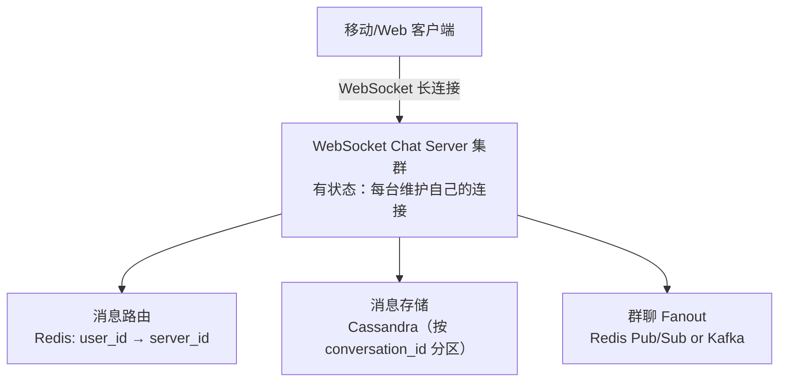

# 系统设计案例：聊天系统（Chat System）

## TL;DR

微信/WhatsApp/Slack 这类聊天系统。核心难点：**实时消息推送**（WebSocket 连接管理）+ **消息不丢失**（离线消息存储）+ **消息有序**（单会话内消息的顺序一致性）。

---

## 需求澄清

**功能需求：**
- 1 对 1 私聊（One-to-one chat）
- 群聊（Group chat，上限 500 人）
- 消息包含：文本、图片、文件
- 已读回执（Read receipt）
- 离线消息（用户不在线时消息不丢失）

**非功能需求：**
- 低延迟：在线用户之间消息延迟 < 100ms
- 高可用：消息不丢失
- 顺序保证：同一会话内消息的顺序一致（A 发的 msg1 和 msg2，所有人看到的顺序相同）

**规模估算：**
```
DAU: 1 亿
每人每天发 40 条消息（微信平均）
写 QPS = 1 亿 × 40 / 86400 ≈ 46,000 QPS
消息体大小：平均 1 KB（纯文本 100B，图片消息存 URL）
存储：46,000 × 1KB × 86400 × 365 = 1.4 PB/年 → 需要分片
```

---

## 实时通信：WebSocket

### 为什么选 WebSocket

```
短轮询（每秒问一次"有新消息吗？"）→ 延迟高、带宽浪费
长轮询（挂着等服务器推）→ 可以，但连接频繁重建
WebSocket（建立后双向全双工）→ 推荐，延迟最低，连接持久
```

WebSocket 连接的维护：

```
用户 A 打开 App →
  建立 WebSocket 连接到 Chat Server A
  服务器在 Redis 记录：user_A → server_A

用户 B 打开 App →
  建立 WebSocket 连接到 Chat Server B
  服务器在 Redis 记录：user_B → server_B

用户 A 给用户 B 发消息：
  → Chat Server A 收到消息
  → 查 Redis：user_B 在 server_B 上
  → 通过内部 HTTP/RPC 把消息转发给 server_B
  → server_B 通过 WebSocket 推送给用户 B
```

---

## 系统架构



---

## 消息发送流程

### 1 对 1 消息

```
[用户 A 发消息给用户 B]

1. A 通过 WebSocket 发消息到 Server-1
2. Server-1：
   a. 生成 message_id（Snowflake，保证有序）
   b. 写入 Cassandra（持久化，保证不丢）
   c. 查 Redis Session Map：user_B 在 Server-2
   d. 通过 RPC 调用 Server-2 的 "deliver(userId=B, message)" 接口
3. Server-2 通过 WebSocket 推送给用户 B（如果 B 在线）
4. 用户 B 收到消息后发 ACK
5. 消息状态更新为"已送达"
```

### 群聊消息

```
[用户 A 在群 G（500人）发消息]

1. A 通过 WebSocket 发消息到 Server-1
2. Server-1：
   a. 生成 message_id，写 Cassandra
   b. 查群成员列表（500人）
   c. 对每个在线成员：
      - 查 Session Map 找到其 Server
      - RPC 转发
   d. 这会产生 500 次 RPC 调用，成本高！

优化（用 Redis Pub/Sub 广播）：
   Server-1 发布消息到 Redis Channel "group:G"
   所有订阅了该 Channel 的 Chat Server 收到消息
   每台 Server 检查哪些在线用户在群 G 里，推给他们
   → 从 O(群成员数) 的点对点 RPC → O(服务器数量) 的广播
```

---

## 消息存储：Cassandra

聊天消息的特点：
- 写多读少（每条消息写一次，读取时按会话分页）
- 按会话查询（查 conversation_id=123 的最近 100 条消息）
- 数据量大（不可避免要分片）

Cassandra 是天然的选择：

```sql
-- Cassandra 表设计
CREATE TABLE messages (
  conversation_id  UUID,
  message_id       BIGINT,        -- Snowflake ID（时间有序）
  sender_id        BIGINT,
  content          TEXT,
  content_type     TEXT,          -- 'text', 'image', 'file'
  media_url        TEXT,          -- 图片/文件的 S3 URL
  created_at       TIMESTAMP,
  status           TEXT,          -- 'sent', 'delivered', 'read'

  PRIMARY KEY (conversation_id, message_id)
) WITH CLUSTERING ORDER BY (message_id DESC);

-- 查询最近 20 条消息（非常高效）：
SELECT * FROM messages
WHERE conversation_id = 'conv123'
LIMIT 20;

-- 分页（加载更多）：
SELECT * FROM messages
WHERE conversation_id = 'conv123'
  AND message_id < 1700000001000000
LIMIT 20;
```

**为什么 message_id 用 Snowflake？**

Snowflake ID 是时间有序的（高位是时间戳），作为 Cassandra 的 Clustering Key，按时间倒序排列。支持高效的范围查询（"查在某个时间之前的消息"），天然实现了游标分页。

---

## 离线消息处理

用户 B 不在线时（关闭 App）：

```
方案一：消息存 Cassandra，B 上线后拉取

B 上线流程：
1. 建立 WebSocket 连接
2. 发送 "sync" 请求：{ last_seen_message_id: "xxx" }
3. 服务器查 Cassandra：message_id > last_seen_message_id 的所有消息
4. 推送给 B（可能很多条，分批推）
5. B 更新本地 last_seen

服务器端同时发 Push 通知（APNs/FCM）：
  "您有 3 条未读消息"
  （这个 Push 是提醒，真正消息体由 WebSocket 传输）
```

---

## 消息顺序保证

**问题：**

用户 A 快速发了 2 条消息：
- msg1："你好"
- msg2："在吗"

如果 msg2 比 msg1 先到达服务器（网络乱序），用户 B 看到的是 "在吗/你好"。

**解决方案：**

1. **客户端 sequence number**：每个客户端维护单调递增的本地序号，消息附带序号。服务器按序号确认并排序。

2. **Snowflake message_id**：Snowflake ID 含时间戳，时间越晚 ID 越大。客户端展示时按 message_id 排序，而不是按接收顺序。

3. **单会话有序**：每个 conversation 有一个递增的 `seq_num`，服务器收到消息时原子性地获取下一个 seq_num（Redis INCR），消息带上 seq_num 存入 Cassandra。客户端展示时按 seq_num 排序，发现 seq 不连续时等待缺失的消息或触发重新同步。

```typescript
// 获取会话的下一个序号（Redis 原子操作）
async function getNextSeqNum(conversationId: string): Promise<number> {
  return await redis.incr(`seq:${conversationId}`);
}

// 发消息时
const seqNum = await getNextSeqNum(conversationId);
const message = await cassandra.insert({
  conversationId,
  messageId: snowflake.nextId(),
  seqNum,
  senderId,
  content
});
```

---

## 已读回执

```
数据模型：
  receipt 表（Redis Hash 存，轻量）：
  Key: "receipt:{conversationId}:{userId}"
  Value: last_read_message_id

已读流程：
1. 用户 B 看到消息（进入聊天界面）
2. B 发送 ACK：{ conversationId, messageId }
3. 服务器更新 Redis
4. 通知用户 A："B 已读到 messageId=xxx"
   A 的界面显示"已读"标记

群聊已读：
  每个成员各自维护自己的 last_read
  群消息的"已读人数" = 查询所有成员 last_read ≥ 该消息 ID 的人数
  （查 Redis 批量 HGET，O(群成员数)，群大时可以做懒计算）
```

---

## Node.js 类比

如果你用过 `ws` 包或 `socket.io`，这就是它的大规模版本：

```typescript
// 单机版（socket.io）
io.on('connection', (socket) => {
  socket.on('send_message', async (data) => {
    const { to, content } = data;
    io.to(to).emit('new_message', { from: socket.userId, content });
  });
});

// 分布式版（加了 Redis Session Map）
wsServer.on('connection', (ws, userId) => {
  redis.set(`session:${userId}`, serverId); // 记录用户在哪台服务器

  ws.on('send_message', async (data) => {
    const { to, content } = data;
    const targetServer = await redis.get(`session:${to}`);

    if (targetServer === serverId) {
      // 目标在本机，直接推
      localSockets.get(to)?.send(JSON.stringify({ from: userId, content }));
    } else {
      // 目标在其他机器，RPC 转发
      await rpcClient.deliver(targetServer, { userId: to, message: { from: userId, content } });
    }
  });
});
```

---

## 常见陷阱

1. **Chat Server 是有状态的**：每台 Chat Server 维护着当前连接到它的 WebSocket 连接（内存中）。不能随意杀掉 Chat Server，否则连接断开。滚动发布时需要先把用户迁移（断开连接让客户端重连），再更新服务

2. **心跳机制**：客户端需要定期发心跳包（如每 30 秒），服务器检测到心跳超时（如 60 秒没心跳）则标记用户离线，清除 Session Map 里的记录

3. **消息幂等**：客户端发消息后网络超时，不知道是否发送成功，可能重发。消息需要携带客户端生成的 `client_message_id`（UUID），服务器用 UNIQUE 约束防止重复存储

4. **大文件传输**：不要通过 WebSocket 传文件内容（带宽和内存压力大）。文件先上传到 S3，消息里只传 S3 URL

---

## 面试 Q&A

### 简单

**Q: 为什么用 WebSocket 而不是 HTTP 长轮询来实现聊天？**

A: WebSocket 建立后是持久的全双工连接，服务器可以随时主动推送消息，无额外开销；长轮询每次推送后都需要重新建立连接，有握手开销，且在高消息频率下无优势。WebSocket 的延迟更低（服务器推送时，无需等待客户端的下一次轮询），对于实时聊天场景更合适。

**Q: 如何处理用户离线时发来的消息？**

A: 发送方服务器写消息到 Cassandra（持久化），然后给接收方发 Push 通知（FCM/APNs）提醒"有新消息"。用户上线后，客户端发送 sync 请求（带上本地的 last_seen_message_id），服务器查询 Cassandra 返回所有未读消息。

---

### 中等

**Q: 如何保证同一会话内消息的顺序？**

A: 每个会话维护一个单调递增的序号（用 Redis INCR 原子获取，保证顺序性），消息存入 Cassandra 时带上序号。客户端展示消息时按序号排序，而不是按接收时间。客户端发现序号不连续时（如收到 seq=5 但没有 seq=4），触发一次重新同步（向服务器请求 seq=4 的消息）。

**Q: 群聊的 Fanout 如何优化？**

A: 对于大群（几百人），不逐一 RPC 转发，而是用 Redis Pub/Sub：消息服务器发布到 `group:{groupId}` 频道，所有 Chat Server 订阅该频道（广播），每台 Chat Server 收到后推送给本机上该群的在线成员。这样 Fanout 的代价从 O(群成员数) 降到 O(Chat Server 数量)。

---

### 困难

**Q: 如何设计一个每天处理 1000 亿条消息（WhatsApp 量级）的聊天系统？**

A: 分层解析：

**连接层（WebSocket Server）：** 每台服务器维持 10 万个 WebSocket 连接（受文件描述符限制，可调整内核参数），100 万 DAU 需要 10 台服务器，1 亿 DAU 需要 1000 台。Session Map 存 Redis Cluster（按 userId hash 分片）。

**消息存储（Cassandra Cluster）：** 1000 亿条/天 ÷ 86400 ≈ 116 万 QPS 写入。Cassandra 按 conversation_id 分区，单机 10 万 QPS 写入，需要约 12 台以上节点（加上副本因子 3，实际约 36 台）。消息保留策略：7 天全量，更早的消息压缩归档到 S3。

**热点会话的消息路由：** 超级大群（数万人）的消息不走实时 Fanout，而是改成拉模式——成员上线时主动拉取群的最新消息，用轮询或长轮询而非 WebSocket 推送。这样避免单次消息产生数万次 RPC。

**多数据中心：** 用户连接到离自己最近的数据中心（跨数据中心路由靠 Global Load Balancer，如 AWS Route53 地理路由）。跨区消息通过消息队列（Kafka MirrorMaker）同步，容忍 100-500ms 的跨区延迟。

---

## 关联文档

- [../03_communication/03_realtime.md](../03_communication/03_realtime.md) — WebSocket 详解
- [../02_storage/02_nosql.md](../02_storage/02_nosql.md) — Cassandra 数据模型
- [../04_distributed/05_id_generation.md](../04_distributed/05_id_generation.md) — Snowflake 有序 ID
