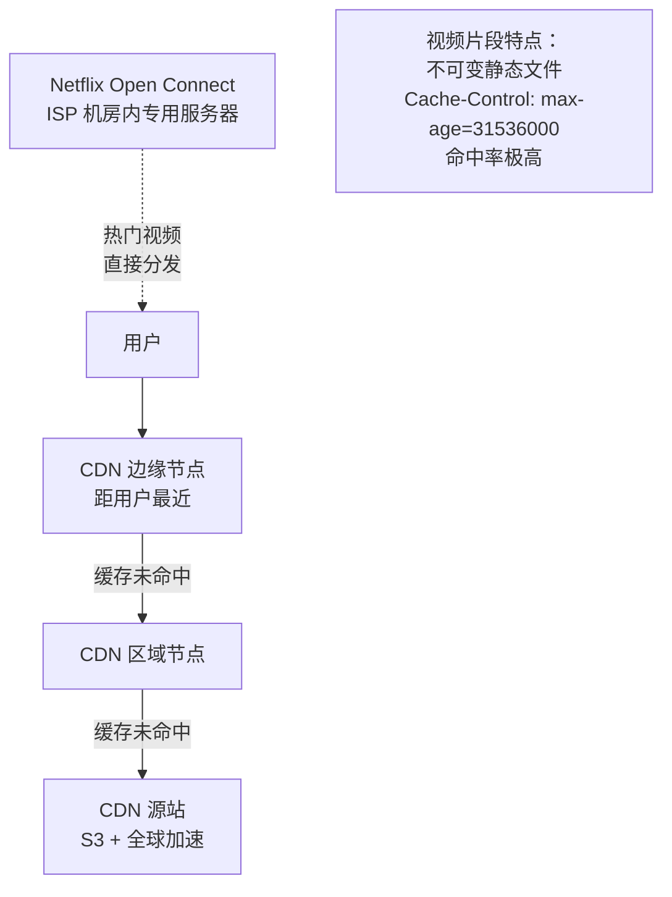

# 系统设计案例：视频流媒体系统

## TL;DR

设计一个类似 YouTube 的视频平台：用户上传视频，经过转码处理，其他用户可以流畅播放。核心难点：**视频转码**（CPU 密集型异步任务）+ **自适应码率流**（根据用户网速切换清晰度）+ **全球 CDN 分发**。

---

## 需求澄清

**功能需求：**
- 上传视频（最大 4 GB）
- 视频转码（多个分辨率：360p, 720p, 1080p, 4K）
- 播放视频（自适应码率）
- 搜索视频
- 视频推荐 Feed
- 点赞、评论（不深入设计）

**非功能需求：**
- 高可用（播放不中断）
- 低延迟播放（< 3 秒首帧时间）
- 全球用户低延迟（CDN）
- 转码延迟可以接受（上传后 5 分钟内可以播放）

**规模估算：**
```
YouTube 数据参考：
  DAU: 5 亿
  每天上传: 500 小时视频/分钟 = 720,000 分钟/天 = 12,000 小时/天
  每天播放: 每人每天看 30 分钟 = 5 亿 × 30 分钟 = 2.5 亿小时/天

存储：
  1 分钟 1080p 视频（压缩后）≈ 150 MB
  转码后 4 个清晰度 ≈ 600 MB/分钟
  每天 720,000 分钟 × 600 MB ≈ 450 TB/天 → 需要对象存储
  
带宽：
  2.5 亿小时/天 × (150 MB/分钟 × 60 / 3600) ≈ 2.5 亿 × 150 MB/小时
  → 约 10 Pbps 峰值（这是 Netflix 的量级，靠 CDN 分担）
```

---

## 视频上传流程

```
[大文件分片上传（与分布式文件存储类似）]

1. 客户端把视频分成 4 MB 的块
2. POST /upload/init → 获取 upload_id
3. 并发上传块（最多 5 个并发）
4. POST /upload/complete
5. 服务器合并块到 Object Storage（S3）

上传完成后：
  写 videos 表（status='processing', raw_key='s3://raw/video123.mp4'）
  发 Kafka 消息到 "video_transcoding" Topic
```

---

## 核心设计：视频转码

### 为什么需要转码

```
用户上传的原始视频：
  格式各异（MP4, MOV, AVI, MKV, WebM）
  编解码器各异（H.264, H.265, AV1, ProRes）
  分辨率各异（手机竖拍、8K 相机）

需要转成统一格式：
  容器格式：MP4 (H.264) 或 WebM（更好的压缩）
  多个清晰度：360p, 720p, 1080p, 4K
  支持自适应码率流（HLS / MPEG-DASH 格式）
```

### HLS（HTTP Live Streaming）

HLS 是苹果提出的自适应码率流媒体协议：

```
原视频 → 转码服务 →
  生成多个清晰度的视频段：
    /360p/segment_000.ts  (2 秒片段)
    /360p/segment_001.ts
    /360p/segment_002.ts
    ...
    /1080p/segment_000.ts
    /1080p/segment_001.ts
    ...
  
  生成 M3U8 播放列表（索引文件）：
    master.m3u8（主播放列表，列出所有清晰度）
    /360p/index.m3u8（360p 的片段列表）
    /1080p/index.m3u8（1080p 的片段列表）

播放器工作原理：
  1. 下载 master.m3u8，知道有哪些清晰度
  2. 根据当前网速，选择合适的清晰度（如 720p）
  3. 下载 /720p/index.m3u8，知道有哪些片段
  4. 依次下载片段并播放
  5. 实时监测下载速度：
     下载速度 > 播放码率 × 1.5 → 尝试提升到更高清晰度
     下载速度 < 播放码率 × 0.8 → 降到更低清晰度
```

### 转码架构

```
[Kafka: video_transcoding Topic]
    ↓ 消费
[Transcoding Worker 集群]（CPU 密集型，大量 GPU/CPU）
    ├─ 从 S3 下载原始视频
    ├─ 使用 FFmpeg 转码（最耗时的步骤）
    │    ffmpeg -i input.mp4 \
    │      -vf scale=1920:1080 -crf 23 -c:v libx264 output_1080p.mp4
    │      -vf scale=1280:720  -crf 25 -c:v libx264 output_720p.mp4
    │      -vf scale=640:360   -crf 28 -c:v libx264 output_360p.mp4
    ├─ 切片成 2 秒的 .ts 片段（HLS）
    ├─ 生成 M3U8 播放列表
    ├─ 上传所有片段到 CDN 源站（S3）
    └─ 更新 videos 表：status='ready', hls_url='https://cdn/video123/master.m3u8'

转码耗时参考：
  1 分钟 1080p 视频 → 全部转码约 2-5 分钟（取决于 CPU 核数）
  1 小时视频 → 约 2-5 小时（需要并行化）
  YouTube 的大量投入都在这里（海量转码服务器）
```

### 转码的并行化

```
优化：把一个视频的不同清晰度并行转码

Task: 转码 video_123
  ↓ 拆分成子任务
Task 1: 转 video_123 → 360p   (Worker A)
Task 2: 转 video_123 → 720p   (Worker B)
Task 3: 转 video_123 → 1080p  (Worker C)

用 DAG（有向无环图）任务调度：
  所有子任务完成后，汇总生成 master.m3u8
  任何子任务失败 → 重试，不影响其他分辨率

进一步并行：单个分辨率的转码可以按时间片拆分
  video_123_1080p[0:5min]  → Worker A
  video_123_1080p[5:10min] → Worker B
  video_123_1080p[10:15min]→ Worker C
  → 转完后拼接
```

---

## CDN 架构



---

## 数据模型

```sql
-- 视频元数据
CREATE TABLE videos (
  id           BIGINT PRIMARY KEY,  -- Snowflake ID
  user_id      BIGINT NOT NULL,
  title        VARCHAR(200) NOT NULL,
  description  TEXT,
  status       ENUM('uploading','processing','ready','failed','deleted'),
  
  -- 原始文件
  raw_storage_key  VARCHAR(500),       -- S3 Key
  
  -- 转码结果
  hls_url          VARCHAR(500),       -- HLS master.m3u8 URL（CDN）
  thumbnail_url    VARCHAR(500),
  duration_secs    INT,
  
  -- 统计
  view_count       BIGINT DEFAULT 0,
  like_count       BIGINT DEFAULT 0,
  
  created_at   TIMESTAMP,
  published_at TIMESTAMP,             -- NULL 表示未发布
  
  INDEX idx_user_id (user_id),
  FULLTEXT INDEX idx_title (title)    -- 支持全文搜索
);

-- 转码任务
CREATE TABLE transcoding_jobs (
  id            BIGINT PRIMARY KEY,
  video_id      BIGINT NOT NULL,
  resolution    VARCHAR(10),          -- '360p', '720p', '1080p', '4K'
  status        ENUM('pending','running','completed','failed'),
  worker_id     VARCHAR(100),
  started_at    TIMESTAMP,
  completed_at  TIMESTAMP,
  error_msg     TEXT,

  INDEX idx_video_id (video_id)
);
```

---

## 搜索功能

视频搜索需要全文检索：

```
方案：MySQL FULLTEXT 或 Elasticsearch

建立索引：
  视频标题、描述、标签

上传视频后：
  同步写 MySQL（视频元数据）
  异步写 Elasticsearch（全文索引）
  （用 Kafka 的 CDC 或 Debezium 同步）

搜索请求：
  GET /search?q=python+tutorial
  → Elasticsearch：BM25 打分，返回相关 video_id 列表
  → MySQL：批量查视频元数据（标题、缩略图、播放量）
  → 返回搜索结果列表
```

---

## 播放计数和热门视频

```
问题：视频播放量是高频写入（每次播放 +1）
  热门视频可能每秒 10 万次播放 → 单行更新成为瓶颈

解决：批量写入

客户端每播放一次 → 发事件到 Kafka（"video_viewed"）
Kafka Consumer（每 10 秒消费一批）：
  batch_update: UPDATE videos SET view_count = view_count + {count} WHERE id = ?
  每 10 秒一次批量更新，而不是每次播放都更新

或者：
  Redis INCR（实时，高吞吐）
  + 定期（每分钟）把 Redis 计数刷到 MySQL
```

---

## 视频推荐

```
简化设计（不深入推荐算法）：

实时推荐（简单版）：
  按用户历史观看的视频类别，推同类别最热视频
  
离线推荐（工业级）：
  协同过滤（A 看了 X，B 也看了 X 且还看了 Y → 推 Y 给 A）
  基于内容的过滤（视频 Embedding + 相似度计算）
  每天离线计算，结果存 Redis（user_id → 推荐视频 ID 列表）
  
实时个性化：
  用户实时行为（刚刚看了什么）→ 流处理（Flink）→ 调整推荐
```

---

## Node.js 类比

```typescript
// 视频上传完成后，触发转码
app.post('/upload/complete', async (req, res) => {
  const { uploadId, s3Key } = req.body;

  // 写 DB
  const video = await db.videos.create({
    userId: req.user.id,
    rawStorageKey: s3Key,
    status: 'processing'
  });

  // 发 Kafka 消息触发转码（不等待转码完成）
  await kafka.produce('video_transcoding', {
    videoId: video.id,
    s3Key,
    resolutions: ['360p', '720p', '1080p']
  });

  res.json({ videoId: video.id, status: 'processing' });
});

// Transcoding Worker（独立服务）
kafka.consume('video_transcoding', async (msg) => {
  const { videoId, s3Key, resolutions } = msg;

  // 并发转码多个分辨率
  await Promise.all(resolutions.map(async (res) => {
    const outputKey = `videos/${videoId}/${res}/`;
    await ffmpegTranscode(s3Key, res, outputKey);
    // ffmpeg 调用可能花 5-30 分钟
  }));

  // 生成 master.m3u8
  const hlsUrl = await generateHlsMasterPlaylist(videoId, resolutions);

  // 更新视频状态
  await db.videos.update(videoId, {
    status: 'ready',
    hlsUrl
  });
});
```

---

## 常见陷阱

1. **转码任务不幂等**：Kafka Consumer 重启后同一消息可能被重新消费，导致重复转码。需要在 `transcoding_jobs` 表里检查是否已存在该 video_id + resolution 的记录，已存在则跳过

2. **大文件超时**：转码 1 小时的视频可能需要几个小时。需要设置合理的 Kafka Consumer 超时时间，或使用心跳机制告诉 Kafka Consumer 仍在处理中（避免被 rebalance）

3. **CDN 缓存问题**：视频片段修改后（如内容违规被替换），CDN 缓存的旧版本还会继续分发。需要通过 CDN 缓存失效（Cache Invalidation）或在文件路径中加版本号（内容寻址）来解决

4. **存储成本**：每个视频存 4 种分辨率，存储成本是原始的 4 倍。优化：低清晰度用更激进的压缩比（`-crf 28` 而不是 `-crf 23`），4K 分辨率只对订阅高清服务的用户提供

---

## 面试 Q&A

### 简单

**Q: 为什么视频要分成多个分辨率，而不是只存一个最高清版本？**

A: 不同用户的网络带宽差异很大：4K 视频需要 20 Mbps，而 3G 用户只有 1-5 Mbps，低端手机屏幕分辨率也不支持 4K。多个分辨率让系统能根据用户实际带宽自动选择合适的清晰度，避免缓冲卡顿（降级到低清晰度）或浪费带宽（提升到高清晰度）。

**Q: HLS 的原理是什么？**

A: HTTP Live Streaming 是苹果开发的自适应码率协议。视频被切成 2-10 秒的小片段（`.ts` 文件），配套一个 M3U8 播放列表文件（文本格式，记录片段 URL 列表）。播放器下载 M3U8 后，依次下载片段进行播放。多个清晰度对应多个片段集合，播放器根据实时下载速度动态切换清晰度，流畅播放（不需要从头重新加载）。

---

### 中等

**Q: 如何加快大视频的转码速度？**

A: 两层并行化：1）不同分辨率并行转码（360p、720p、1080p 同时进行，各用一个 Worker）；2）单个分辨率的转码按时间片拆分（1 小时视频拆成 12 个 5 分钟片段，12 台 Worker 同时转，转完后拼接），理论上可以把 1 小时视频的转码时间压缩到几分钟。YouTube 在上传后几分钟内就能播放，正是因为有海量转码服务器和激进的并行化。

**Q: 视频平台如何处理 CDN 缓存和内容更新的一致性？**

A: 视频片段（`.ts` 文件）在生成后内容不变，设置超长 Cache-Control（如 1 年），让 CDN 永久缓存。如果视频需要修改（如替换违规内容），生成新的片段文件和新的 URL（路径中加版本号或内容 Hash），而不是更新原有 URL 的内容。这样 CDN 旧缓存不受影响，用户访问新 URL 时自然获取新内容，不需要主动失效旧缓存。

---

### 困难

**Q: 设计一个支持每天上传 500 小时/分钟视频（YouTube 量级）的转码系统，保证上传后 5 分钟内可以播放。**

A: 

**转码队列规划：** 每分钟 500 小时原始视频 = 30,000 小时/分钟。每分钟 1080p 视频的转码需要约 2-5 分钟 CPU 时间（单核），转 4 个清晰度 = 8-20 分钟 CPU 时间/分钟原始视频。即每 1 分钟原始视频需要约 8-20 分钟的 CPU 处理时间，需要 8-20 倍的并发处理能力。500 小时/分钟 × 60 = 30,000 分钟/分钟原始视频，需要约 24 万个 CPU 核的转码能力（这就是为什么 YouTube 每年花巨额在计算资源上）。

**5 分钟内可播放（渐进式可用）：** 不需要等所有清晰度全部转完才能播放。转码策略：优先转低清晰度（360p、720p）——这两个分辨率只需要原始视频转码时间的 30%，可以在 1-2 分钟内完成。优先处理前几分钟（而不是等整个视频转完）——用户刚开始播放时只需要视频前 30 秒的片段。先上传前 10 个片段到 CDN → 标记"可播放" → 用户开始看 → 后台继续转剩余部分。

**弹性扩缩容：** 转码 Worker 是无状态的，可以用 Kubernetes 根据 Kafka Topic 的 lag（积压消息数）自动扩缩容。高峰（白天上传高峰）时自动扩到更多 Worker，低谷（凌晨）时缩减，节省成本。

---

## 关联文档

- [../02_storage/04_object_storage.md](../02_storage/04_object_storage.md) — 对象存储（S3）、CDN
- [../03_communication/02_async.md](../03_communication/02_async.md) — Kafka 异步任务队列
- [../08_distributed_storage.md](./08_distributed_storage.md) — 分片上传
