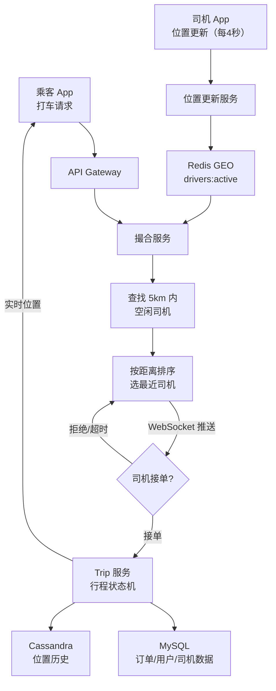
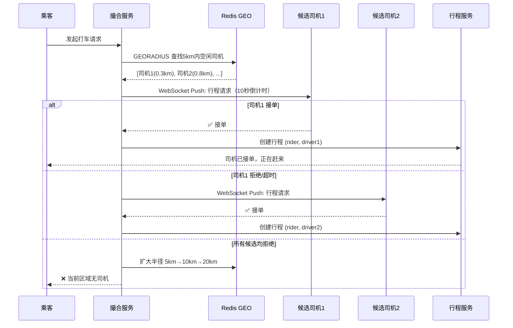
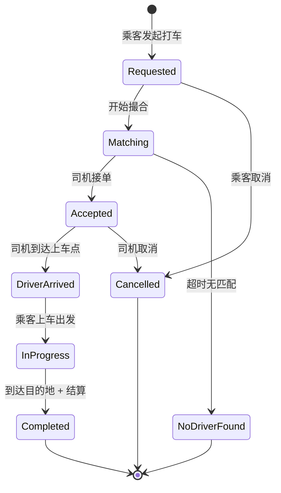

# 系统设计案例：打车系统（Ride Sharing）

## TL;DR

设计一个类似 Uber 或滴滴的打车系统：乘客发起打车请求，系统从附近找到空闲司机并撮合。核心难点：**地理位置查询**（快速找到附近的司机）+ **高频位置更新**（司机每秒上报 GPS）+ **实时匹配**（低延迟撮合）。

---

## 需求澄清

**功能需求：**
- 乘客发起打车请求
- 系统推荐附近的司机并撮合
- 行程进行中，乘客可以实时看到司机位置
- 行程完成后，双方互评

**非功能需求：**
- 低延迟匹配（3-10 秒内找到司机）
- 高位置更新频率（司机每 4 秒上报一次 GPS）
- 高可用（找不到司机要告诉用户，不能静默失败）

**规模估算：**
```
DAU: 100 万司机，1000 万乘客
在线司机峰值: 50 万（午晚高峰）
司机位置更新频率: 每 4 秒一次
位置更新 QPS = 500,000 / 4 = 125,000 QPS（写入极高）
乘客打车请求: 每秒 10,000 次

每次位置更新数据: userId + lat + lng + timestamp ≈ 50 字节
125,000 QPS × 50 字节 = 6.25 MB/s 写入（不大，但每秒 12.5 万次写入对 DB 是压力）
```

---

## 核心设计：地理位置索引

### 问题

如何找到"距离乘客 5 公里内的所有空闲司机"？

```sql
-- 朴素方案（不可行）：
SELECT * FROM drivers
WHERE ABS(lat - 37.7749) < 0.045  -- 5 公里 ≈ 0.045 纬度
  AND ABS(lng - (-122.4194)) < 0.055
  AND status = 'available';

-- 问题：全表扫描，50 万司机无法建立二维复合索引
```

---

### 方案一：Geohash

```
原理：
  把地球表面划分成网格，每个网格有一个 Base32 编码的字符串（Geohash）
  字符串越长，精度越高，网格越小
  
  旧金山（37.7749, -122.4194）的 Geohash：
  精度 4：9q8y（约 40km × 20km）
  精度 5：9q8yy（约 5km × 5km）
  精度 6：9q8yyh（约 1.2km × 0.6km）

前缀相同的两个 Geohash 位置相近：
  9q8yy... 的司机都在同一个 5km × 5km 的网格里

查询附近司机（Geohash 精度 6）：
  乘客位置 Geohash = "9q8yyh"
  查询 "9q8yyh" 及其 8 个相邻格子（9q8yyf, 9q8yyk, 9q8yyj...）的所有空闲司机
  → 最多 9 × 网格内司机数，通常每格 < 100 个司机
  → 非常快！（Redis Key 直接查）
```

**Redis 存储司机位置（Geohash 方案）：**

```typescript
// 司机上报位置时
async function updateDriverLocation(driverId: string, lat: number, lng: number): Promise<void> {
  const geohash = geohashEncode(lat, lng, 6); // 精度 6 ≈ 1 公里

  const pipe = redis.pipeline();
  // 记录司机的当前 Geohash
  pipe.set(`driver:loc:${driverId}`, geohash, 'EX', 30); // 30 秒内没更新 → 自动清除

  // 把司机加入对应 Geohash 的司机集合
  const setKey = `drivers:${geohash}`;
  pipe.sadd(setKey, driverId);
  pipe.expire(setKey, 30);
  await pipe.exec();
}

// 查找附近空闲司机
async function findNearbyDrivers(lat: number, lng: number, radiusKm: number): Promise<string[]> {
  const precision = radiusKm < 5 ? 6 : 5; // 根据搜索半径选精度
  const centerGeohash = geohashEncode(lat, lng, precision);
  const neighbors = getNeighbors(centerGeohash); // 8 个相邻格子
  const cells = [centerGeohash, ...neighbors]; // 9 个格子

  const allDriverIds = new Set<string>();
  for (const cell of cells) {
    const driverIds = await redis.smembers(`drivers:${cell}`);
    driverIds.forEach(id => allDriverIds.add(id));
  }

  // 精确过滤距离（Geohash 是粗筛，这里做精确距离计算）
  const nearby: string[] = [];
  for (const driverId of allDriverIds) {
    const driverPos = await redis.hgetall(`driver:info:${driverId}`);
    const dist = haversineDistance(lat, lng, driverPos.lat, driverPos.lng);
    if (dist <= radiusKm) nearby.push(driverId);
  }

  return nearby;
}
```

---

### 方案二：Redis GEO（更简洁，推荐）

Redis 内置了地理位置支持（基于 Geohash），使用更简单：

```typescript
// 司机上报位置
await redis.geoadd('drivers:active', lng, lat, driverId);
// 设置 key 的 TTL（通过额外的 expire 或用 ZADD 的实现原理）

// 查找 5km 内的司机
const nearbyDrivers = await redis.georadius(
  'drivers:active',
  lng, lat,         // 乘客位置
  5, 'km',          // 搜索半径
  'ASC',            // 按距离排序
  'COUNT', 10,      // 最多返回 10 个
  'WITHCOORD',      // 顺带返回坐标
  'WITHDIST'        // 顺带返回距离
);
// 返回：[{id:'driver1', dist:0.5, coord:[lng,lat]}, ...]

// 更新位置（GEOADD 会更新已存在的成员）
await redis.geoadd('drivers:active', newLng, newLat, driverId);
```

---

## 高频位置更新

50 万司机每 4 秒上报一次 = **12.5 万 QPS 写入**

直接写 MySQL 无法承受，需要分层处理：

```
司机 App → 位置更新 API
    ↓
[Redis GEO]（主要存储，高吞吐写入）
    ↓ 异步，每 5 秒批量写一次
[Cassandra]（历史轨迹存储，用于行程回放、数据分析）
    ↓ 离线分析
[Spark/Hadoop]（路况分析、司机行为分析）
```

**Cassandra 位置历史表：**

```sql
CREATE TABLE driver_locations (
  driver_id   UUID,
  ts          TIMESTAMP,
  lat         FLOAT,
  lng         FLOAT,
  speed       FLOAT,       -- 速度（km/h）
  heading     SMALLINT,    -- 方向（0-359 度）
  trip_id     UUID,        -- 当前行程 ID（没行程时为 NULL）
  
  PRIMARY KEY (driver_id, ts)
) WITH CLUSTERING ORDER BY (ts DESC);
-- 按 driver_id 分区，时间倒序，适合查询某司机的历史轨迹
```

---

## 系统架构



---

## 撮合流程（Match Flow）



---

## 行程状态机



```sql
CREATE TABLE trips (
  id            BIGINT PRIMARY KEY,  -- Snowflake ID
  rider_id      BIGINT NOT NULL,
  driver_id     BIGINT,
  status        ENUM('requested','matching','accepted','driver_arrived',
                     'in_progress','completed','cancelled'),
  pickup_lat    FLOAT,
  pickup_lng    FLOAT,
  pickup_address VARCHAR(500),
  dropoff_lat   FLOAT,
  dropoff_lng   FLOAT,
  dropoff_address VARCHAR(500),
  
  estimated_price  DECIMAL(10,2),
  final_price      DECIMAL(10,2),
  
  requested_at  TIMESTAMP,
  accepted_at   TIMESTAMP,
  started_at    TIMESTAMP,
  completed_at  TIMESTAMP,
  
  INDEX idx_rider (rider_id),
  INDEX idx_driver (driver_id),
  INDEX idx_status_created (status, requested_at)
);
```

---

## 实时位置共享（行程中）

行程进行中，乘客需要实时看到司机位置：

```
方案：WebSocket（乘客和司机各自建立 WebSocket 连接）

司机每 4 秒上报位置：
  司机 App → WebSocket → 位置服务
  位置服务更新 Redis：driver:pos:{driverId} = {lat, lng, timestamp}

乘客查看司机位置：
  方案 A（轮询）：乘客每 3 秒请求一次 GET /trip/{id}/driver_location
  方案 B（推送）：位置服务检测到司机位置变化 → 推送给该行程的乘客 WebSocket

方案 B 更实时，实现如下：
  位置服务收到司机位置更新 →
  查找该司机的当前行程（Redis: trip:{driverId}）→
  WebSocket 推送给乘客：{ lat, lng, heading, eta }
```

---

## 价格计算（Surge Pricing）

```
基础价格 = 起步价 + 里程费 + 时间费

动态定价（Surge）：
  某区域请求数 >> 可用司机数 → 价格乘以 Surge 系数（1.5x, 2x）
  
实现：
  每分钟计算各 Geohash 格子的：
    demand = 过去 1 分钟的打车请求数
    supply = 该区域的空闲司机数
    
  surge_factor = demand / supply（做平滑处理）
  
  存入 Redis：surge:{geohash} = 1.8  TTL = 2 分钟
  
  乘客查价时：
    估价 = 基础价格 × surge_factor
    显示"当前区域拼车量大，价格较高"
```

---

## Node.js 类比

如果你写过 Google Maps API 的距离查询，打车系统就是它的实时版：

```typescript
// 地理距离计算（Haversine 公式）
function haversineDistance(lat1: number, lng1: number, lat2: number, lng2: number): number {
  const R = 6371; // 地球半径（km）
  const dLat = (lat2 - lat1) * Math.PI / 180;
  const dLng = (lng2 - lng1) * Math.PI / 180;
  const a = Math.sin(dLat/2)**2 +
            Math.cos(lat1 * Math.PI/180) * Math.cos(lat2 * Math.PI/180) *
            Math.sin(dLng/2)**2;
  return R * 2 * Math.atan2(Math.sqrt(a), Math.sqrt(1-a));
}

// Ride matching（简化版）
async function findMatch(riderId: string, riderLat: number, riderLng: number): Promise<string | null> {
  // 查找 5km 内的空闲司机
  const nearbyDrivers = await redis.georadius(
    'drivers:active', riderLng, riderLat,
    5, 'km', 'ASC', 'COUNT', 5
  );

  for (const driver of nearbyDrivers) {
    const driverId = driver.name;

    // 尝试发送请求（有 10 秒超时）
    const accepted = await sendRideRequest(driverId, riderId, 10000);
    if (accepted) return driverId;
  }

  return null; // 无可用司机
}
```

---

## 常见陷阱

1. **Geohash 边界问题**：两个位置相邻但 Geohash 不同（跨格子边界），查询时必须包含相邻格子（9 个格子），否则会漏掉边界附近的司机

2. **司机位置更新的 TTL**：司机关闭 App 后，Redis 里的位置数据应该自动失效（设置 30 秒 TTL），防止系统向已离线的司机发送请求

3. **并发撮合冲突**：多个乘客同时向同一个司机发请求。用 Redis 分布式锁（SETNX）标记司机的"正在处理请求"状态，防止同一司机被多个乘客同时占用

4. **位置精度 vs 写入频率**：更新频率越高（如每 1 秒），位置越精确，但写入 QPS 越大（每 1 秒更新 = 每 4 秒的 4 倍 QPS）。行程中（乘客需要看到实时位置）用每 4 秒，未接单时可以降低到每 10 秒

---

## 面试 Q&A

### 简单

**Q: 为什么用 Geohash 而不是直接用经纬度范围查询找附近司机？**

A: 直接用经纬度范围查询（`WHERE lat BETWEEN x AND x+d AND lng BETWEEN y AND y+d`）需要在 lat 和 lng 上做二维查询，数据库无法同时高效利用两个列的索引，会退化成全表扫描或效率低下的双列索引扫描。Geohash 把二维坐标编码成一维字符串，相同前缀的字符串在地理上相近，可以用字符串前缀索引高效查询，或在 Redis 里直接按前缀分桶存储。

**Q: 司机位置每 4 秒更新一次，如何避免对数据库造成压力？**

A: 位置数据写入 Redis（内存存储，支持 12.5 万 QPS），不直接写 MySQL。Redis 里的位置数据只需保留"当前位置"（TTL 30 秒），历史轨迹异步批量写入 Cassandra（每 5 秒批量写一次），大幅降低写入频率。MySQL 只存最终的行程记录（行程完成后写一次），不参与实时位置更新。

---

### 中等

**Q: 如何处理高峰期司机供不应求的情况？**

A: 动态定价（Surge Pricing）是核心工具：统计每个区域（Geohash 格子）的实时供需比（打车请求数 / 空闲司机数），供需比高时提高价格系数，抑制需求、激励远处司机向高需求区域移动。系统层面：扩大搜索半径（从 5km 扩到 10km）、提高发送请求的候选司机数量（从前 3 扩到前 10）、调度调度中心协调司机前往高需求区域。

**Q: 乘客打车时，如何保证司机不会被两个乘客同时抢？**

A: 用 Redis 分布式锁标记司机状态：向司机发送请求时，先执行 `SET driver:lock:{driverId} 1 NX EX 15`（15 秒锁，对应 10 秒超时 + 缓冲），获取锁成功才发送请求；其他乘客尝试向同一司机发请求时，获取锁失败，跳过该司机尝试下一个。司机接单或超时后，释放锁（或等 TTL 自动过期）。

---

### 困难

**Q: 如何设计一个支持 100 万司机实时位置更新（每 4 秒一次）的系统，覆盖全球 10 个城市？**

A:

**位置更新写入层：** 100 万司机 / 4 秒 = 25 万 QPS。用 Redis Cluster（10 个主节点），按 driver_id 哈希分片，每节点 2.5 万 QPS 写入，完全没问题（Redis 单机 10 万 QPS）。每个城市独立的 Redis Cluster（降低跨城市路由延迟），城市内的司机连接本城市的 Redis。

**地理查询优化：** Redis GEORADIUS 在数据量大时（50 万司机在一个 ZSET）性能会下降（O(N+log(N))，N 是范围内的成员数）。优化：按城市分 ZSET（`drivers:active:SF`、`drivers:active:NYC`），每个城市的司机数量有上限（通常城市不会有超过 10 万在线司机）。进一步按大区域分（Geohash 精度 4，约 40km 网格），搜索时只查询 9 个格子，每格通常 < 1000 个司机，GEORADIUS 在几百 KB 的数据上速度 < 1ms。

**历史位置存储：** 25 万 QPS 直接写 Cassandra 太高，先写 Kafka（Kafka 轻松支持），Consumer 批量写 Cassandra（每 5 秒一批，相当于 25 万 × 5 = 125 万条/批，每批写入）。Cassandra 按 driver_id 分区，10 个节点，每节点 12,500 QPS 批量写入，可以接受。

**多区域高可用：** 每个城市的关键服务（撮合服务、位置服务）本地部署，不跨城市依赖。全球统一的用户账户数据用 CockroachDB 或 Aurora Global Database（多主、多区域复制），读就近读，写路由到最近的主节点。

---

## 关联文档

- [../02_storage/02_nosql.md](../02_storage/02_nosql.md) — Cassandra 高写入量、Redis GEO
- [../03_communication/03_realtime.md](../03_communication/03_realtime.md) — WebSocket 实时位置推送
- [../04_distributed/06_distributed_lock.md](../04_distributed/06_distributed_lock.md) — Redis 分布式锁（防止并发撮合冲突）
