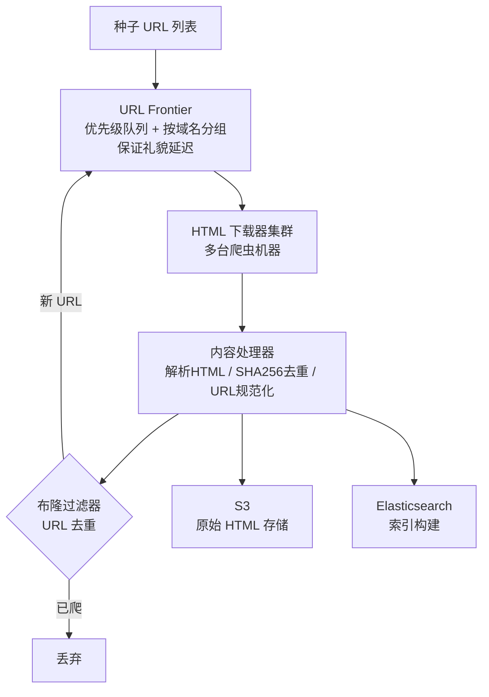

# 系统设计案例：网络爬虫（Web Crawler）

## TL;DR

从种子 URL 出发，抓取网页内容，提取新链接，递归爬取整个互联网。核心难点：**URL 去重**（500 亿 URL 如何高效判断是否爬过）+ **礼貌爬取**（不把目标网站打垮）+ **分布式协调**（多台机器不重复爬同一 URL）。

---

## 需求澄清

**功能需求：**
- 从给定种子 URL 列表出发，爬取网页 HTML 内容
- 提取页面中的链接，加入待爬队列
- 支持周期性重爬（网页内容会更新）
- 爬取结果存储供下游使用（搜索引擎索引、数据分析）

**非功能需求：**
- 规模：爬取 10 亿个页面，每页平均 100 KB
- 时间：30 天内完成首次全量爬取
- 礼貌性：每个域名每秒最多请求 1 次（遵守 robots.txt）
- 去重：同一 URL 不重复爬取（URL 规范化后去重）

**规模估算：**
```
目标：10 亿页面，30 天内完成
所需速率：10亿 / (30 × 86400) ≈ 400 页/秒

每页 100 KB，400 页/秒：
  网络带宽：400 × 100KB = 40 MB/s（可以接受）
  存储：10亿 × 100KB = 100 TB

URL 去重存储：
  每个 URL 平均 50 字节，10 亿个：50 GB
  → 布隆过滤器：10 亿条，1% 误差率 ≈ 1.2 GB（内存中）
```

---

## 系统架构



---

## 核心设计一：URL Frontier（待爬队列）

URL Frontier 不是简单的 FIFO 队列，需要解决两个问题：

### 1. 优先级（Prioritizer）

不是所有 URL 等价，重要页面应该优先爬：

```
重要性评分因素：
  PageRank（被多少其他页面引用）
  更新频率（新闻首页 > 企业介绍页）
  内容类型（首页 > 深层子页面）

实现：多个优先级队列（Priority Queue）
  高优队列（news.ycombinator.com, bbc.com/news）
  中优队列（普通博客、商品页）
  低优队列（论坛归档、旧版页面）

调度：高优队列 60% 时间，中优 30%，低优 10%
```

### 2. 礼貌性（Politeness）

每个域名不能被请求太快（会被封 IP，也不道德）：

```
问题：URL Frontier 里可能连续有 100 个 amazon.com 的 URL
→ 连续请求 amazon.com 100 次 → 被封

解决：按域名分队列

架构：
  前端队列（按优先级）→ 映射 → 后端队列（按域名）

后端队列（每个域名一个）：
  [amazon.com 队列] [bbc.com 队列] [github.com 队列] ...
  
  每个后端队列附带"下次可爬时间"（Last-Crawled + 延迟）
  调度器：选择"下次可爬时间已到"的队列，取出 URL 分配给爬虫

延迟设置：
  遵守 robots.txt 的 Crawl-delay 指令
  默认：每个域名间隔 1 秒
  robots.txt 里指定了更长的 → 遵守
```

---

## 核心设计二：URL 去重（Bloom Filter）

10 亿 URL，如何快速判断是否已爬过？

```
方案对比：

HashSet（内存）：
  10 亿个 URL × 50 字节 = 50 GB 内存 → 太贵

关系数据库（MySQL）：
  INSERT ... WHERE NOT EXISTS
  高 QPS 写入 + 查询，性能瓶颈

布隆过滤器（Bloom Filter）：
  10 亿 URL，1% 误差率 → 约 1.2 GB 内存
  查询：O(k) 次哈希运算，常数时间
  写入：同样 O(k)
  → 推荐！

布隆过滤器的局限性：
  假阳性（False Positive）：
    可能把"未爬过"的 URL 判断为"已爬过"（概率 1%）
    → 1% 的新 URL 会被漏掉，可以接受
  无法删除：
    一旦 URL 标记为"已爬"，无法撤销
    → 重爬需要定期重建布隆过滤器
```

**URL 规范化（去重前必做）：**

```typescript
function normalizeUrl(url: string): string {
  const u = new URL(url);
  
  // 1. 统一 scheme（http → https，如果 https 可访问）
  u.protocol = 'https:';
  
  // 2. 移除默认端口（https://example.com:443 → https://example.com）
  if (u.port === '443' || u.port === '80') u.port = '';
  
  // 3. 路径末尾斜杠统一（/path/ → /path）
  if (u.pathname !== '/' && u.pathname.endsWith('/')) {
    u.pathname = u.pathname.slice(0, -1);
  }
  
  // 4. 排序 query 参数（?b=2&a=1 → ?a=1&b=2）
  u.searchParams.sort();
  
  // 5. 移除追踪参数（utm_source, fbclid 等不影响内容的参数）
  ['utm_source', 'utm_medium', 'utm_campaign', 'fbclid'].forEach(p => {
    u.searchParams.delete(p);
  });
  
  // 6. 转小写 host（Example.COM → example.com）
  u.hostname = u.hostname.toLowerCase();
  
  return u.toString();
}
```

---

## 核心设计三：robots.txt 遵守

```typescript
// 每个域名的 robots.txt 只读取一次，缓存起来
class RobotsCache {
  private cache = new Map<string, RobotsRules>();

  async isAllowed(url: string): Promise<boolean> {
    const host = new URL(url).hostname;

    if (!this.cache.has(host)) {
      const robotsUrl = `https://${host}/robots.txt`;
      const rules = await fetchAndParseRobots(robotsUrl);
      this.cache.set(host, rules); // 缓存 24 小时
    }

    const rules = this.cache.get(host)!;
    return rules.isAllowed('MyBot', url);
  }
}

// robots.txt 示例：
// User-agent: *
// Disallow: /admin/
// Disallow: /private/
// Crawl-delay: 2      ← 爬虫必须遵守，2 秒一次
// Sitemap: https://example.com/sitemap.xml  ← 可以直接从 sitemap 获取 URL 列表
```

---

## 核心设计四：内容去重

不同 URL 可能有相同的内容（镜像站、重定向）：

```
方法一：MD5/SHA256 签名
  对每个页面内容计算 SHA256
  存入 BloomFilter（或 Redis SET）
  新爬到的页面，计算 Hash → 已存在 → 跳过（镜像/重复内容）
  
方法二：SimHash（近似重复检测）
  MD5 检测完全一致的副本（二进制相同）
  SimHash 检测近似重复（内容大部分相同，少量差异）
  
  原理：把文档向量化为 64 位 hash
        Hamming Distance ≤ 3 → 认为是近似重复
  
  适合：新闻网站的同一新闻被不同源转载
```

---

## 分布式协调

多台爬虫机器如何协调，不重复爬同一 URL？

```
URL Frontier 用 Redis（或 Kafka）实现，集中管理：

架构：
  URL Frontier Service（中心化）
    └─ Redis Sorted Set：pending_urls（score = 优先级）
    └─ Redis Hash：domain_next_crawl_time（域名 → 下次可爬时间）

爬虫机器：
  循环执行：
    1. 向 URL Frontier 请求下一个 URL
    2. Frontier 找到"优先级最高且下次爬取时间已到"的 URL
    3. 原子性地取出（ZPOPMAX） + 更新域名下次爬取时间
    4. 爬虫下载、解析
    5. 新 URL 提交回 Frontier
    6. 内容提交给存储服务
```

---

## 周期性重爬

网页内容会更新，需要定期重爬：

```
重爬策略：
  高更新频率页面（新闻首页）：每小时
  中等页面（商品详情）：每天
  低更新频率（静态文档）：每月

如何判断更新频率？
  1. 历史数据：上次爬和这次爬，内容 Hash 是否变了
  2. HTTP 头部：Last-Modified, ETag（If-Modified-Since 请求）
  3. 机器学习：根据内容类型预测

条件请求（省带宽）：
  GET /page HTTP/1.1
  If-None-Match: "etag_value"
  
  服务器响应 304 Not Modified → 内容未变，不用重传
```

---

## 存储设计

```
原始 HTML 存储（S3）：
  Key: "crawl/{sha256_of_url}.html.gz"（gzip 压缩节省 70% 空间）
  
爬取记录（MySQL）：
  CREATE TABLE crawl_records (
    url_hash    CHAR(64) PRIMARY KEY,  -- SHA256(normalized_url)
    url         TEXT,
    last_crawl  TIMESTAMP,
    next_crawl  TIMESTAMP,
    http_status SMALLINT,              -- 200, 404, 301...
    content_hash CHAR(64),             -- 内容 SHA256（用于去重和判断是否更新）
    etag        VARCHAR(500),
    s3_key      VARCHAR(500),
    crawl_count INT DEFAULT 0,
    
    INDEX idx_next_crawl (next_crawl)  -- 调度重爬时按 next_crawl 查询
  );
```

---

## Node.js 类比

如果你写过简单的爬虫脚本，这是它的大规模版本：

```typescript
// 简单版（单机）
import axios from 'axios';
import * as cheerio from 'cheerio';

async function crawl(url: string, visited = new Set<string>()): Promise<void> {
  if (visited.has(url)) return;
  visited.add(url);

  const html = await axios.get(url);
  const $ = cheerio.load(html.data);
  
  // 提取链接
  const links: string[] = [];
  $('a[href]').each((_, el) => {
    links.push($(el).attr('href')!);
  });
  
  // 保存内容
  await saveToS3(url, html.data);
  
  // 递归爬取（分布式版本：把 links 放进队列而不是直接递归）
  for (const link of links) {
    await crawl(link, visited); // 分布式版：kafka.produce('url_queue', link)
  }
}

// 分布式版（Worker）
kafka.consume('url_queue', async (url) => {
  if (await bloomFilter.exists(url)) return; // 已爬过

  await respectRobotsTxt(url);   // 检查 robots.txt
  await rateLimiter.wait(getDomain(url)); // 礼貌延迟

  const html = await download(url);
  await bloomFilter.add(url);
  await saveContent(url, html);

  const newUrls = extractLinks(html, url);
  for (const newUrl of newUrls) {
    if (!await bloomFilter.exists(newUrl)) {
      kafka.produce('url_queue', newUrl);
    }
  }
});
```

---

## 常见陷阱

1. **URL 环路（URL Trap）**：有些网站会动态生成无限多的 URL（如日历翻页：`/cal?date=2024-01-01`，`/cal?date=2024-01-02`...）。需要限制每个域名的爬取深度（如最多 5 层）和每个域名的最大 URL 数量（如 100 万）

2. **蜘蛛陷阱（Spider Trap）**：`/a/b/c/a/b/c/a/...` 这种循环路径。通过限制 URL 的最大长度（如 2048 字节）和路径深度（如最多 10 层）来防止

3. **动态页面（JavaScript 渲染）**：现代网站大量使用 SPA，直接 GET HTML 拿不到内容。需要用无头浏览器（Puppeteer/Playwright）渲染 JavaScript 后再提取，代价是每页几秒，10 亿页面会很慢。通常只对已知重要站点用无头浏览器

4. **布隆过滤器重建**：布隆过滤器不支持删除操作，URL 需要重爬时（内容更新），不能从 BF 里删掉已爬标记。解决：定期重建 BF（如每月一次），或用 Counting Bloom Filter（支持删除，但内存更大）

---

## 面试 Q&A

### 简单

**Q: 如何保证爬虫不重复爬取同一 URL？**

A: 两道防线：1）URL 规范化——不同写法的同一 URL（`http://` vs `https://`，末尾 `/` 有无等）先统一格式；2）布隆过滤器——每爬取一个 URL 后加入布隆过滤器，下次遇到同 URL 时，先查布隆过滤器，返回"可能存在"则跳过，返回"一定不存在"则爬取。10 亿 URL 的布隆过滤器只需约 1.2 GB 内存。

**Q: 什么是 robots.txt，爬虫必须遵守吗？**

A: robots.txt 是网站根目录下的文本文件，规定了哪些路径不允许爬虫访问、爬取频率等。如 `Disallow: /admin/` 表示禁止爬取管理路径，`Crawl-delay: 2` 表示每次请求间隔 2 秒。遵守 robots.txt 是行业惯例和道德规范，违反不会有法律后果但可能被封 IP，且 Google 等搜索引擎明确遵守。爬虫需要缓存每个域名的 robots.txt（24 小时有效），减少重复获取。

---

### 中等

**Q: 如何实现礼貌爬取（避免单个域名请求过快）？**

A: URL Frontier 按域名分队列，每个域名队列绑定一个"下次可爬时间"（Last Crawl Time + Delay）。调度器只从"可爬时间已到"的队列中选 URL 分配给爬虫。延迟默认 1 秒，如果 robots.txt 里指定了 Crawl-delay 就遵守。多台爬虫机器共享同一个 URL Frontier（Redis），保证全局的礼貌延迟而非每台机器独立计时。

**Q: 10 亿个 URL 如何在内存中去重？**

A: 不用存完整 URL，用布隆过滤器（Bloom Filter）：选 k 个独立哈希函数，把 URL 映射到 m 位的 bit 数组上，设置对应位为 1。查询时同样 k 个哈希，若对应位全为 1 则"可能存在"，有任何一位为 0 则"一定不存在"。10 亿 URL、1% 误差率 → m ≈ 9.6 × 10^9 位 ≈ 1.2 GB，远比存所有 URL（50 GB）省内存，查询 O(k) 常数时间。

---

### 困难

**Q: 如何设计一个 30 天内爬取 100 亿个页面的分布式爬虫系统？**

A:

**规模计算：** 100 亿 / (30 × 86400) ≈ 3,900 页/秒。每页下载约 0.5 秒（含网络延迟），单机最多 2 并发 → 需要约 1000 台爬虫机器（实际考虑失败重试，准备 1500 台）。

**URL Frontier（去中心化）：** 单台 Redis 扛不住所有 URL 的读写（QPS 太高），按域名 Hash 分到多个 Frontier Shard，每个 Shard 负责一批域名。爬虫机器固定连接对应的 Frontier Shard，减少协调开销。

**存储层：** 原始 HTML 写 S3（100TB，启用 S3 Multipart Upload 并行写入）；URL 去重用分布式布隆过滤器（Redis Cluster，100 亿条 × 1.2 GB/10亿 = 12 GB）；爬取记录写 Cassandra（按 url_hash 分区，高写入量）。

**容错：** 每台爬虫在 Kafka 里 ACK 消息前先完成存储，防止崩溃丢任务。Kafka Topic 分区 = 爬虫机器数，每台消费 1 个分区，崩溃后另一台接管该分区继续爬。

**扩展性：** 靠近完成时（第 20 天）发现速度不够？动态加机器，Kafka Consumer Group 自动 Rebalance 分配更多分区，无需停服。

---

## 关联文档

- [../02_storage/03_cache.md](../02_storage/03_cache.md) — 布隆过滤器详解
- [../03_communication/02_async.md](../03_communication/02_async.md) — Kafka 分布式任务队列
- [../02_rate_limiter.md](./02_rate_limiter.md) — 礼貌爬取的限流实现
