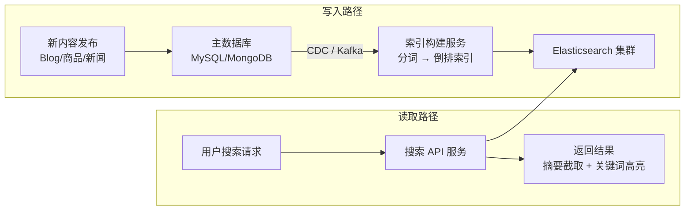

# 系统设计案例：全文搜索系统

## TL;DR

用户输入关键词，系统从数十亿文档中找出最相关的结果并排序返回。核心难点：**倒排索引的构建与查询**（如何在海量文档中毫秒级找到包含关键词的文档）+ **相关性排序**（找到之后，哪个更靠前）+ **索引与主存储的同步**。

> 注意与 [03_search_autocomplete.md](./03_search_autocomplete.md) 的区别：自动补全是前缀匹配 + Trie，全文搜索是分词匹配 + 倒排索引，两者是不同的系统。

---

## 需求澄清

**功能需求：**
- 输入关键词，返回最相关的文档列表（支持分页）
- 支持多词查询（"python tutorial"）
- 支持过滤（按时间、分类、作者）
- 搜索结果高亮（关键词在摘要里加粗）

**非功能需求：**
- 低延迟：搜索 < 200ms
- 近实时索引：新内容发布后，1 分钟内可以被搜到
- 规模：10 亿文档，每文档平均 5 KB

**规模估算：**
```
文档总量：10 亿，每文档 5 KB
原始数据量：10亿 × 5KB = 5 PB

倒排索引大小约为原始数据的 30-50%：
  → 索引存储 ≈ 1.5-2.5 PB（需要分片）

搜索 QPS：10 万/秒（读多）
索引写入：1000 文档/秒（相对较少）
```

---

## 核心数据结构：倒排索引（Inverted Index）

### 正向索引 vs 倒排索引

```
正向索引（Forward Index）：
  文档 → 包含的词
  doc1: ["python", "tutorial", "beginner"]
  doc2: ["python", "advanced", "async"]
  
  查询"python"：需要扫描所有文档 → O(N)，不可行

倒排索引（Inverted Index）：
  词 → 包含该词的文档列表
  "python"   → [doc1(位置:0), doc2(位置:0), doc5(位置:3), ...]
  "tutorial" → [doc1(位置:1), doc8(位置:2), ...]
  "beginner" → [doc1(位置:2), ...]

  查询"python"：直接查索引，O(1) 找到文档列表
```

### 倒排列表（Posting List）的详细结构

```
每个词对应一个 Posting List（按 doc_id 排序）：

"python" → [
  { doc_id: 1, freq: 3, positions: [0, 15, 42] },
  { doc_id: 2, freq: 1, positions: [0] },
  { doc_id: 5, freq: 2, positions: [3, 27] },
  ...
]

字段说明：
  doc_id：文档 ID
  freq：该词在文档中出现次数（用于 TF-IDF 计算）
  positions：词在文档中的位置（用于短语查询和高亮）
```

### 多词查询的集合操作

```
查询："python tutorial"（默认 AND）

步骤：
1. 获取 "python" 的 Posting List：[1, 2, 5, 8, 13, ...]
2. 获取 "tutorial" 的 Posting List：[1, 3, 8, 21, ...]
3. 取交集（归并，因为两个列表都有序）：[1, 8, ...]
4. 对交集文档计算相关性得分，排序返回

归并时间复杂度：O(min(|L1|, |L2|))
优化：先处理最短的 Posting List（词越罕见，列表越短，先过滤效果越好）
```

---

## 相关性排序：TF-IDF 与 BM25

### TF-IDF

```
TF（Term Frequency，词频）：词在文档中出现的频率
  TF("python", doc1) = 词出现次数 / 文档总词数 = 3/100 = 0.03

IDF（Inverse Document Frequency，逆文档频率）：词的稀缺性
  IDF("python") = log(总文档数 / 包含该词的文档数)
               = log(1,000,000 / 50,000) = log(20) ≈ 3.0
  
  常见词（"the", "and"）→ IDF 接近 0（出现在几乎所有文档）
  罕见词（"elasticsearch"）→ IDF 很高（区分度强）

TF-IDF 得分 = TF × IDF
  "python" 在 doc1 中：0.03 × 3.0 = 0.09
  多词查询：各词得分求和
```

### BM25（现代搜索引擎的标准，Elasticsearch 默认算法）

BM25 是 TF-IDF 的改进版，解决了两个问题：

```
问题1：TF 线性增长（词出现 100 次得分是 1 次的 100 倍，不合理）
BM25 对 TF 做饱和处理：
  score ∝ TF × (k1 + 1) / (TF + k1)
  k1 通常取 1.2，TF 再高，分值也趋于上限

问题2：长文档天然包含更多词，得分虚高
BM25 加入文档长度归一化：
  分母加上 b × (docLen / avgDocLen)
  b 通常取 0.75，长文档被适当惩罚

BM25 公式（简化版）：
  score(q, d) = Σ IDF(t) × TF(t,d)×(k1+1) / (TF(t,d) + k1×(1-b+b×|d|/avgdl))
```

### 实际排序因素

纯文本相关性只是排序的一部分，实际系统还考虑：

```
文档质量信号：
  PageRank（被多少其他文档引用）
  点击率（用户搜索后点击该结果的比例）
  时效性（新文章加分，旧文章衰减）

个性化因素：
  用户历史行为（之前看过的类似文章加分）
  地理位置（本地内容加分）

最终得分 = BM25 × 文档质量权重 × 时效性权重 × 个性化权重
```

---

## 系统架构



---

## 索引构建管道

### 文档处理流程

```
原始文档："Python is a great programming language for beginners"

Step 1: 字符过滤（Character Filter）
  去除 HTML 标签、特殊字符
  "Python is a great programming language for beginners"

Step 2: 分词（Tokenizer）
  按空格/标点分割
  ["Python", "is", "a", "great", "programming", "language", "for", "beginners"]

Step 3: Token 过滤（Token Filter）
  - 转小写：["python", "is", "a", "great", "programming", "language", "for", "beginners"]
  - 去停用词（Stopwords）：移除 "is", "a", "for"
    ["python", "great", "programming", "language", "beginners"]
  - 词干提取（Stemming）："programming" → "program", "beginners" → "begin"
    ["python", "great", "program", "languag", "begin"]

Step 4: 写入倒排索引
  "python"   → doc_id + positions
  "great"    → doc_id + positions
  "program"  → doc_id + positions
  ...
```

### 中文分词（特殊处理）

```
英文用空格分词，中文没有空格：
  "苹果手机价格" → 需要分成 ["苹果", "手机", "价格"]？
                   还是 ["苹果手机", "价格"]？

中文分词器（IK Analyzer、jieba）：
  基于词典 + 统计模型，切分成有意义的词
  "苹果手机价格" → ["苹果", "手机", "价格"] 或 ["苹果手机", "价格"]（同义词扩展）

搜索时需要用相同的分词器处理 query，保证一致性
```

---

## Elasticsearch 架构

### 分片（Shard）

```
一个 Elasticsearch Index 可以分成多个 Shard（分片）：
  Index: products（商品搜索）
    Shard 0 → Node 1（主）/ Node 2（副本）
    Shard 1 → Node 2（主）/ Node 3（副本）
    Shard 2 → Node 3（主）/ Node 1（副本）

写入：文档按 hash(doc_id) % shard_count 路由到对应 Shard
查询：Query 广播到所有 Shard，每个 Shard 返回 Top N，Coordinator 汇总后全局排序返回 Top N

分片数量一旦设置不能改（改了 hash 路由就乱了）
→ 初始规划很重要，通常设置为节点数的 1.5 倍
```

### 近实时索引（NRT）

```
Elasticsearch 的写入不是立刻可见的：

写入流程：
  文档写入 → In-memory buffer（内存）
           → Translog（WAL，保证崩溃恢复）
  
  每隔 1 秒（默认）：
    buffer 刷新成新的 Segment（不可变文件）
    新 Segment 对搜索可见 ← 这是"近实时"的来源（1 秒延迟）
  
  每隔 30 分钟（或 buffer 满）：
    Flush：把 Segment 持久化到磁盘，清空 Translog

  Segment 合并（Merge）：
    后台定期把多个小 Segment 合并成大 Segment
    减少文件数量，提高查询效率
```

---

## 主存储与搜索引擎的同步

搜索引擎（Elasticsearch）不是 Source of Truth，主数据库（MySQL）才是：

```
双写策略（简单但有一致性问题）：
  写 MySQL 成功 → 立刻写 Elasticsearch
  
  问题：MySQL 写成功，Elasticsearch 写失败 → 数据不一致
  
CDC + Kafka（推荐）：
  MySQL Binlog → Debezium（CDC 工具）→ Kafka Topic
  → Elasticsearch Consumer 消费，写入 ES
  
  优点：松耦合，MySQL 是唯一写入点，ES 是最终一致的视图
  延迟：通常 1-5 秒（Kafka 消费延迟 + ES 刷新延迟）
```

---

## 搜索 API 设计

```typescript
// 搜索请求
interface SearchRequest {
  query: string;          // 搜索关键词
  filters?: {
    category?: string;
    dateFrom?: string;
    dateTo?: string;
    author?: string;
  };
  page?: number;          // 页码（从 1 开始）
  pageSize?: number;      // 每页条数（默认 10，最大 50）
  highlight?: boolean;    // 是否返回高亮摘要
}

// Elasticsearch 查询构建
function buildEsQuery(req: SearchRequest) {
  return {
    query: {
      bool: {
        must: [{
          multi_match: {
            query: req.query,
            fields: ['title^3', 'content', 'tags^2'], // ^3 表示 title 权重 3 倍
            type: 'best_fields',
            fuzziness: 'AUTO', // 容忍拼写错误
          }
        }],
        filter: [
          req.filters?.category && { term: { category: req.filters.category } },
          req.filters?.dateFrom && { range: { createdAt: { gte: req.filters.dateFrom } } },
        ].filter(Boolean),
      }
    },
    highlight: req.highlight ? {
      fields: { title: {}, content: { fragment_size: 150, number_of_fragments: 3 } }
    } : undefined,
    from: ((req.page ?? 1) - 1) * (req.pageSize ?? 10),
    size: req.pageSize ?? 10,
    sort: [
      { _score: 'desc' },          // 相关性优先
      { createdAt: 'desc' },       // 相关性相同时，新的优先
    ]
  };
}
```

---

## Node.js 类比

如果你用过 MySQL 的 `LIKE '%python%'`，这就是它的工业级替代：

```typescript
// ❌ MySQL LIKE：全表扫描，不支持相关性排序
const results = await db.query(
  "SELECT * FROM articles WHERE content LIKE '%python%' LIMIT 10"
);

// ✅ Elasticsearch：倒排索引，毫秒级，支持相关性排序
const { hits } = await esClient.search({
  index: 'articles',
  body: {
    query: { match: { content: 'python' } },
    size: 10
  }
});
```

---

## 常见陷阱

1. **用 Elasticsearch 做主存储**：ES 不是数据库，没有严格的事务、不保证写入成功、Shard 重新分配时可能短暂不可用。主数据用 MySQL/PostgreSQL，ES 只是可搜索的派生视图

2. **分片数规划不足**：分片数创建后不能改（只能 Reindex，代价极高）。初始分片数 = 预期节点数 × 1.5，宁可多设也别少设

3. **深度分页（Deep Pagination）**：`from=10000&size=10` 需要每个 Shard 返回 10010 条，Coordinator 汇总 Shard 数 × 10010 条再取 10 条，内存消耗极大。大于 10000 的翻页改用 `search_after`（基于上一页最后一条的排序值）

4. **索引 Mapping 没有提前规划**：ES 的 Dynamic Mapping 会自动推断字段类型，但可能推错（如把数字 ID 推断为 float）。生产环境必须显式定义 Mapping，并关闭 Dynamic Mapping

---

## 面试 Q&A

### 简单

**Q: 倒排索引是什么，为什么搜索引擎用它而不是数据库的 B-Tree 索引？**

A: 倒排索引是"词 → 文档列表"的映射：知道了关键词，立刻找到包含它的所有文档。B-Tree 索引是"文档 → 字段值"的有序结构，擅长精确匹配和范围查询，但无法高效处理"文档内容包含某个词"这类全文查询（LIKE '%keyword%' 需要全表扫描）。倒排索引把这个查询变成 O(1) 的索引查找，是全文搜索的基础。

**Q: TF-IDF 和 BM25 的核心区别是什么？**

A: 都基于"词频 × 稀缺性"的思路，BM25 有两个关键改进：1）TF 饱和——词出现 100 次不应该得分是 1 次的 100 倍，BM25 对高词频做饱和处理；2）文档长度归一化——长文档天然包含更多词，BM25 按文档长度适当惩罚，避免长文档虚高得分。现代搜索引擎（Elasticsearch、Solr）默认使用 BM25。

---

### 中等

**Q: 如何保证主数据库和搜索引擎的数据一致性？**

A: 推荐 CDC（Change Data Capture）+ Kafka 方案：监听 MySQL Binlog（用 Debezium），把数据变更事件发到 Kafka，搜索引擎的消费者异步消费并更新 ES。优点是松耦合——MySQL 是唯一写入源，ES 是最终一致的副本，即使 ES 短暂宕机，消息会在 Kafka 积压，恢复后自动追赶。代价是 1-5 秒的同步延迟，对搜索场景是可以接受的。

**Q: 搜索结果如何实现关键词高亮？**

A: 两种方式：1）ES 原生 Highlight API——查询时指定 highlight 字段，ES 找到匹配片段并用 `<em>` 标签包裹关键词，支持按 fragment_size 截取摘要片段，自动处理分词后的词干匹配（搜 "program" 能高亮 "programming"）；2）客户端自己处理——拿到文档全文后，按 query 关键词正则匹配并包裹 HTML 标签，实现简单但无法处理词干匹配。ES 原生方案更准确，推荐使用。

---

### 困难

**Q: 设计一个支持 10 亿文档、10 万搜索 QPS 的全文搜索系统，延迟 P99 < 200ms。**

A:

**索引层（Elasticsearch Cluster）：** 10 亿文档 × 5 KB = 5 PB 原始数据，倒排索引约 2 PB。32 个主 Shard（每个 Shard 约 60 GB，ES 推荐单 Shard < 50 GB，可适当调整），每个主 Shard 2 个副本，总共 96 个 Shard，分布在 32 台节点（每节点 3 个 Shard，192 GB 内存，SSD 存储）。

**查询优化：** 10 万 QPS 对 32 台节点 = 每台 3000 QPS。每次搜索广播到所有 32 个主 Shard，每 Shard 查询约 1ms，但 32 个并发查询 + Coordinator 汇总，P99 约 20-50ms。加 Redis 缓存热门搜索词（命中率约 30-40%），进一步降低 ES 压力和延迟。

**写入优化：** 1000 文档/秒写入，通过 Bulk API 批量写（每批 500 条），减少网络往返。ES refresh_interval 设为 5 秒（牺牲近实时换取写入吞吐），生产内容对时效性不高时可接受。

**P99 < 200ms 的保证：** ES 查询 50ms + 网络 10ms + 应用处理（摘要截取、高亮）10ms = 约 70ms（P50）。P99 劣化主要来自 GC 停顿和 Shard Merge，通过 JVM 调优（G1GC，heap 30 GB）和 force merge（低峰期合并 Segment）控制长尾。超过 200ms 的查询加熔断返回降级结果（如只返回标题不返回摘要）。

---

## 关联文档

- [./03_search_autocomplete.md](./03_search_autocomplete.md) — 前缀搜索（Trie，与本文互补）
- [../02_storage/02_nosql.md](../02_storage/02_nosql.md) — Elasticsearch 属于 NoSQL 家族
- [../05_methodology/reference/03_patterns.md](../05_methodology/reference/03_patterns.md) — CQRS（主存储 + 搜索引擎是典型的读模型分离）
