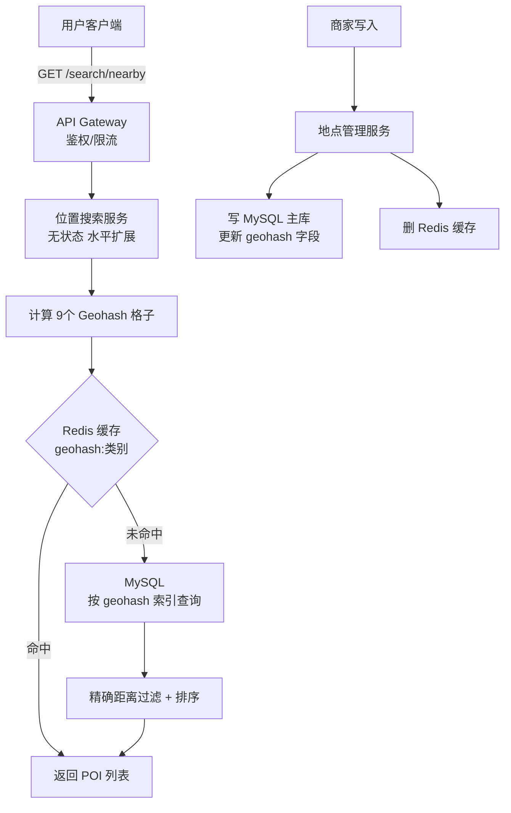

# 系统设计案例：附近地点服务（Proximity Service / Yelp）

## TL;DR

用户打开 App，查找"附近 1 公里内的咖啡馆"，系统返回按距离排序的地点列表。与打车系统的关键区别：**地点（POI）是静态数据**，不像司机位置每秒变化——这让我们可以用更重的预计算来换取极快的查询速度。

---

## 需求澄清

**功能需求：**
- 返回用户当前位置附近 N 公里内的地点（POI = Point of Interest）
- 按距离排序，支持按类别过滤（餐厅、咖啡馆、加油站）
- 地点详情页（名称、地址、评分、营业时间、图片）
- 商家可以新增/修改/删除自己的地点

**非功能需求：**
- 低延迟：搜索 < 100ms
- 高可用：核心搜索功能不能挂
- 数据规模：全球 2 亿个 POI
- 读远多于写（用户搜索 vs 商家更新）

**规模估算：**
```
DAU：1 亿用户，每人每天搜索 5 次
搜索 QPS = 1亿 × 5 / 86400 ≈ 6000 QPS（读）
写入 QPS ≈ 100 QPS（商家更新地点，远少于读）

POI 数据：2 亿条 × 每条 1 KB = 200 GB（单库可以存，但查询需要地理索引）
```

---

## API 设计

```
搜索附近地点：
GET /v1/search/nearby
  ?latitude=37.7749
  &longitude=-122.4194
  &radius=1000          // 单位：米，默认 500，最大 20000
  &category=restaurant  // 可选过滤
  &page=1
  &pageSize=20

Response:
{
  "total": 142,
  "businesses": [
    {
      "id": "biz_123",
      "name": "Blue Bottle Coffee",
      "latitude": 37.7751,
      "longitude": -122.4180,
      "distance": 210,        // 米
      "rating": 4.8,
      "category": "coffee",
      "address": "66 Mint St, San Francisco"
    },
    ...
  ],
  "cursor": "eyJwYWdlIjoyfQ"  // 下一页游标
}

获取地点详情：
GET /v1/businesses/{id}

新增地点（商家）：
POST /v1/businesses

更新地点（商家）：
PUT /v1/businesses/{id}
```

---

## 核心设计：地理索引方案对比

### 方案一：Geohash（推荐）

原理见 [10_ride_sharing.md](./10_ride_sharing.md)，这里重点讲**与 POI 静态数据的结合**：

```
POI 是静态的 → 可以预计算 Geohash 存入数据库

建表时增加 geohash 列：
  ALTER TABLE businesses ADD COLUMN geohash6 VARCHAR(6);  -- 精度 6 ≈ 1.2km×0.6km
  ALTER TABLE businesses ADD COLUMN geohash5 VARCHAR(5);  -- 精度 5 ≈ 5km×5km
  ALTER TABLE businesses ADD COLUMN geohash4 VARCHAR(4);  -- 精度 4 ≈ 40km×20km
  
  CREATE INDEX idx_geohash6 ON businesses(geohash6, category);
  CREATE INDEX idx_geohash5 ON businesses(geohash5, category);

查询"附近 1km 内的餐厅"：
  1. 计算用户位置的 geohash6 = "9q8yyh"
  2. 获取 9 个相邻格子（中心 + 8 个邻居）
  3. SELECT * FROM businesses
     WHERE geohash6 IN ('9q8yyh','9q8yyy','9q8yyk',...)
       AND category = 'restaurant'
  4. 过滤：用 Haversine 公式计算精确距离，去掉超出半径的
  5. 按距离排序返回
```

**Geohash 精度选择策略：**

```
半径 < 1km  → 用 geohash6（格子约 1.2km，9个格子覆盖约 3×3km）
半径 1-5km  → 用 geohash5（格子约 5km，9个格子覆盖约 15×15km）
半径 > 5km  → 用 geohash4（格子约 40km）

动态选精度（查询时判断）：
  radius <= 1000m → geohash6
  radius <= 5000m → geohash5
  else            → geohash4
```

**边界问题（必须说）：**

```
问题：用户在格子边缘，最近的 POI 在相邻格子里
  用户位置 Geohash6 = "9q8yyh"
  最近的咖啡馆在 "9q8yyz" 格子里（距离 50m）
  
  只查 "9q8yyh" → 漏掉这家咖啡馆！

解决：查中心格子 + 8个相邻格子（共9个）
  然后再做精确距离过滤，去掉超出半径的
```

---

### 方案二：QuadTree（内存索引，适合极高 QPS）

```
原理：把地图递归四分，直到每个格子内的 POI 数量 ≤ 阈值（如 100 个）

全球 2 亿 POI 的 QuadTree：
  叶节点数 ≈ 2亿/100 = 200万个叶节点
  非叶节点 ≈ 200万 × 1/3 ≈ 67万（四叉树约 1/3 是非叶）
  总节点约 267万
  每个节点约 50 字节 → 总内存约 130 MB（可以全量放内存！）

查询：从根节点出发，找到覆盖查询区域的叶节点，返回其中的 POI
时间复杂度：O(log N)，极快

缺点：
  实现复杂（需要维护树结构）
  POI 更新时需要重建树（或增量更新，复杂）
  单机内存存储，水平扩展需要多机复制整棵树
```

### 方案对比

| | Geohash（DB 索引）| QuadTree（内存）|
|--|----------|---------|
| 实现复杂度 | 低（SQL 索引）| 高（自己维护树）|
| 查询速度 | 快（索引查询）| 极快（内存操作）|
| 更新 | 简单（UPDATE 一条记录）| 复杂（更新树结构）|
| 水平扩展 | 容易（数据库分片）| 需要复制整棵树 |
| 推荐场景 | 大多数场景 | 极高 QPS（> 10万/秒）|

**面试中推荐 Geohash**：实现简单、维护容易，能满足绝大多数场景的 QPS 需求。

---

## 系统架构


  从库×N：读         地点详情缓存
```

---

## 数据模型

```sql
-- 地点主表
CREATE TABLE businesses (
  id            BIGINT PRIMARY KEY,
  name          VARCHAR(200) NOT NULL,
  owner_id      BIGINT NOT NULL,        -- 商家用户 ID
  address       VARCHAR(500),
  city          VARCHAR(100),
  country       CHAR(2),                -- 'US', 'CN'
  latitude      DECIMAL(9, 6) NOT NULL, -- -90 到 90，精度 6 位 ≈ 0.1 米
  longitude     DECIMAL(9, 6) NOT NULL, -- -180 到 180
  geohash6      CHAR(6) NOT NULL,       -- 预计算，写入时自动生成
  geohash5      CHAR(5) NOT NULL,
  geohash4      CHAR(4) NOT NULL,
  category      VARCHAR(50),
  rating        DECIMAL(2, 1),          -- 1.0 - 5.0
  rating_count  INT DEFAULT 0,
  is_open       BOOLEAN DEFAULT TRUE,
  created_at    TIMESTAMP,
  updated_at    TIMESTAMP,

  INDEX idx_geohash6_cat (geohash6, category),   -- 核心查询索引
  INDEX idx_geohash5_cat (geohash5, category),
  INDEX idx_owner (owner_id)
);

-- 地点详情（大字段单独存，不污染主表）
CREATE TABLE business_details (
  business_id   BIGINT PRIMARY KEY,
  description   TEXT,
  phone         VARCHAR(20),
  website       VARCHAR(500),
  hours         JSON,    -- {"mon": "9:00-22:00", "tue": "9:00-22:00", ...}
  photos        JSON,    -- S3 URL 列表
  FOREIGN KEY (business_id) REFERENCES businesses(id)
);
```

---

## 缓存设计

```
缓存层一：Geohash 格子缓存（减少 DB 读压力）

Key:   "geo:{geohash}:{category}"     如 "geo:9q8yyh:restaurant"
Value: [{id, name, lat, lng, rating}, ...]（该格子内所有 POI）
TTL:   10 分钟（POI 数据变化不频繁）

命中率分析：
  热门区域（市中心）的 geohash 格子被大量用户查询 → 命中率极高
  偏远地区 → 可能 Cache Miss，但请求量也少

缓存层二：地点详情缓存

Key:   "biz:{id}"
Value: 完整地点信息（包含详情）
TTL:   1 小时

写时删除（Cache-Aside）：
  商家更新地点 → DELETE Redis Key → 下次读时重新加载
```

---

## 渐进式扩展

```
阶段一：单机（10 万 POI，1000 QPS）
  单台 MySQL + 单台应用服务 + 可选 Redis
  Geohash 索引已经足够快

阶段二：读写分离（100 万 POI，5000 QPS）
  MySQL 主从：主库写，3 台从库读
  搜索服务多实例（3-5 台），无状态水平扩展
  Redis 缓存热门 geohash 格子

阶段三：数据库分片（2 亿 POI，3 万 QPS）
  按地理区域分片：北美、欧洲、亚洲... 各自独立的 MySQL 集群
  API Gateway 根据用户 IP/GPS 路由到对应区域集群
  各区域独立扩展，互不影响

阶段四：极高 QPS（> 10 万 QPS）
  引入 QuadTree 内存索引，替代 DB 查询热点区域
  或者用 Elasticsearch 的 geo_distance 查询（自带地理索引优化）
```

---

## Node.js 类比

```typescript
// Haversine 距离计算（精确过滤用）
function distanceMeters(lat1: number, lng1: number, lat2: number, lng2: number): number {
  const R = 6371000; // 地球半径（米）
  const φ1 = lat1 * Math.PI / 180;
  const φ2 = lat2 * Math.PI / 180;
  const Δφ = (lat2 - lat1) * Math.PI / 180;
  const Δλ = (lng2 - lng1) * Math.PI / 180;
  const a = Math.sin(Δφ/2)**2 + Math.cos(φ1) * Math.cos(φ2) * Math.sin(Δλ/2)**2;
  return R * 2 * Math.atan2(Math.sqrt(a), Math.sqrt(1-a));
}

async function searchNearby(lat: number, lng: number, radiusM: number, category?: string) {
  // 1. 根据半径选 geohash 精度
  const precision = radiusM <= 1000 ? 6 : radiusM <= 5000 ? 5 : 4;
  const centerHash = geohash.encode(lat, lng, precision);
  const neighbors = geohash.neighbors(centerHash);
  const cells = [centerHash, ...Object.values(neighbors)]; // 9 个格子

  // 2. 查缓存 / DB
  const cacheKey = `geo:${cells.sort().join(',')}:${category ?? 'all'}`;
  let candidates = await redis.get(cacheKey);
  if (!candidates) {
    candidates = await db.query(
      `SELECT id, name, latitude, longitude, rating
       FROM businesses
       WHERE geohash${precision} IN (?) ${category ? 'AND category = ?' : ''}`,
      category ? [cells, category] : [cells]
    );
    await redis.setex(cacheKey, 600, JSON.stringify(candidates));
  }

  // 3. 精确距离过滤 + 排序
  return candidates
    .map(b => ({ ...b, distance: distanceMeters(lat, lng, b.latitude, b.longitude) }))
    .filter(b => b.distance <= radiusM)
    .sort((a, b) => a.distance - b.distance);
}
```

---

## 常见陷阱

1. **只查中心格子忘了相邻格子**：用户在格子边缘时会漏掉最近的 POI，必须查 9 个格子再用精确距离过滤

2. **Geohash 精度固定**：不同搜索半径应该用不同精度，精度太细（格子太小）需要查更多格子，精度太粗（格子太大）候选 POI 太多，过滤代价大

3. **直接用经纬度做范围查询**：`WHERE lat BETWEEN ? AND ? AND lng BETWEEN ? AND ?` 无法用复合索引（MySQL 不支持二维索引），会退化成全表扫描，必须用 Geohash 字符串索引

4. **距离排序用 ORDER BY 数学计算**：`ORDER BY 6371 * acos(...)` 无法走索引，全表计算极慢。正确做法：先用 Geohash 快速筛选候选集（通常 < 1000 条），再在内存里做精确距离计算和排序

---

## 面试 Q&A

### 简单

**Q: 这道题和打车系统的地理查询有什么本质区别？**

A: 核心区别是数据的动态性。打车系统的司机位置每 4 秒更新一次，是高频动态数据，必须用 Redis GEO 实时维护；POI（餐厅、咖啡馆）是静态数据，地址几乎不变，可以在数据库写入时预计算好 Geohash 列并建索引。静态数据可以加更激进的缓存（TTL 10 分钟到 1 小时），动态数据最多缓存几十秒。这个区别决定了整个系统架构的复杂度差异。

**Q: Geohash 和 QuadTree 如何选择？**

A: 大多数场景选 Geohash：实现简单（数据库加一列存 geohash 字符串，建字符串索引），维护容易（POI 更新只需更新一行记录），水平扩展直接按地理区域分库。QuadTree 适合极高 QPS（> 10 万/秒）且 POI 更新频率极低的场景——把整棵树放内存，查询不走数据库，速度极快，但实现复杂且更新代价高。

---

### 中等

**Q: 如何处理搜索半径跨越多个 Geohash 格子边界的情况？**

A: 固定查中心格子 + 8 个相邻格子（共 9 个），然后对候选结果做精确的 Haversine 距离计算，过滤掉超出搜索半径的 POI。9 个格子的覆盖面积约为单个格子的 9 倍，足以覆盖格子边缘的情况。唯一例外是搜索半径远大于格子尺寸时（如用 geohash4 的 40km 格子搜索 100km 半径），需要扩展到更多相邻格子，但这种情况可以提升到更粗精度处理。

**Q: 如果某个热门区域（如纽约市中心）的 geohash 格子里有 10 万个 POI，查询会很慢吗？**

A: 会。解决方案：1）提高 Geohash 精度（geohash6 → geohash7，格子更小，每格 POI 更少），密集区域用更细的精度；2）在 geohash 索引基础上加 category 二级索引，让过滤提前在 DB 层发生；3）Redis 缓存该格子的搜索结果（热门区域 TTL 可以设短一些如 1 分钟，但能挡住大量重复查询）；4）分页返回（每次只返回 20 个，不做全量排序）。

---

### 困难

**Q: 设计支持全球 2 亿 POI、每秒 3 万搜索请求的系统，P99 < 100ms。**

A:

**分区策略：** 按地理区域分片（北美、欧洲、亚太各一个 MySQL 集群），每个区域约 6000-8000 万 POI。Region 路由由 API Gateway 根据用户 GPS 坐标判断（如纬度/经度范围），请求只打到对应 Region，不跨区域查询。

**读扩展：** 每个 Region：1 主 + 3 从 MySQL（主写从读），3 万 QPS / 3 从库 = 1 万 QPS/从库（MySQL 的 SELECT + 索引可以轻松支撑）。无状态搜索服务每个 Region 10 台，每台承担 3000 QPS。

**缓存：** Redis Cluster 缓存热门 geohash 格子（城市中心区域）的搜索结果。每个 Region 独立的 Redis Cluster。缓存命中率预计 60-70%（城市用户集中在热点区域），实际打到 DB 的 QPS 约 1 万/秒，非常健康。

**P99 < 100ms 的保证：** Redis 缓存命中 < 5ms；DB 查询：geohash 索引 + 9 个格子 + category 过滤，候选集通常 < 500 条，排序在内存完成，总计 < 20ms；加上网络 < 10ms，P99 约 30-50ms。P99 劣化来源是缓存冷启动和 DB 偶发慢查询，通过 Connection Pool 调优和慢查询监控控制在 100ms 以内。

---

## 关联文档

- [./10_ride_sharing.md](./10_ride_sharing.md) — Geohash 原理、Redis GEO（动态位置版本）
- [../02_storage/01_rdbms.md](../02_storage/01_rdbms.md) — 复合索引设计
- [../02_storage/03_cache.md](../02_storage/03_cache.md) — Cache-Aside 策略
