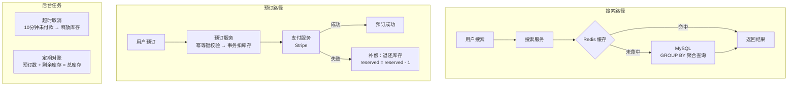

# 系统设计案例：酒店/票务预订系统

## TL;DR

用户搜索某日期的可用房间，选择后完成预订。核心难点：**库存并发控制**（同一间房同一时间只能被一个人订）+ **超卖防止**（不能卖出比实际库存更多的房间）+ **预订流程的原子性**（扣库存和付款要么都成功要么都失败）。

这道题的本质是**有限库存在高并发下的安全分配**，同样适用于：演唱会门票、限量商品秒杀、机票预订。

---

## 需求澄清

**功能需求：**
- 搜索：给定城市、入住/退房日期、人数，返回可用酒店列表
- 查看房型详情和价格
- 预订：选择房型，支付，拿到确认号
- 取消预订（有取消政策）
- 查看我的预订

**非功能需求：**
- 不能超卖（同一间房同一天绝对不能卖给两个人）
- 高并发：热门酒店在节假日可能有数千人同时抢
- 最终一致性可以接受：搜索显示"有房"但下单时发现没有，需要友好提示
- 数据一致性 > 可用性（宁可报错让用户重试，不能多卖）

**规模估算：**
```
全球酒店数：50 万家
平均每家 100 间房，平均预订 1 年 = 365 天
库存记录：50万 × 100 × 365 ≈ 180 亿条（按日存储库存）

搜索 QPS：5000（读多）
预订 QPS：100（写少，但对一致性要求极高）
```

---

## API 设计

```
搜索可用酒店：
GET /v1/hotels/search
  ?city=San+Francisco
  &check_in=2024-06-01
  &check_out=2024-06-03
  &guests=2

Response:
{
  "hotels": [
    {
      "id": "hotel_123",
      "name": "Grand Hyatt",
      "rating": 4.5,
      "lowest_price": 289,
      "available_rooms": 12,   // 当前搜索条件下的剩余间数
      "thumbnail_url": "..."
    }
  ]
}

查看酒店房型：
GET /v1/hotels/{hotel_id}/room_types
  ?check_in=2024-06-01&check_out=2024-06-03

发起预订：
POST /v1/reservations
{
  "hotel_id": "hotel_123",
  "room_type_id": "deluxe_king",
  "check_in": "2024-06-01",
  "check_out": "2024-06-03",
  "guest_count": 2,
  "idempotency_key": "uuid-xxx"  // 客户端生成，防重复提交
}

Response:
{
  "reservation_id": "res_456",
  "status": "confirmed",
  "total_price": 578,
  "confirmation_code": "HYT-2024-XYZ"
}

取消预订：
DELETE /v1/reservations/{id}
```

---

## 数据模型

```sql
-- 酒店基本信息
CREATE TABLE hotels (
  id          BIGINT PRIMARY KEY,
  name        VARCHAR(200),
  city        VARCHAR(100),
  address     VARCHAR(500),
  rating      DECIMAL(2,1),
  latitude    DECIMAL(9,6),
  longitude   DECIMAL(9,6)
);

-- 房型（每家酒店有多种房型）
CREATE TABLE room_types (
  id          BIGINT PRIMARY KEY,
  hotel_id    BIGINT NOT NULL,
  name        VARCHAR(100),     -- "Deluxe King", "Standard Twin"
  total_count INT NOT NULL,     -- 该酒店该房型的总间数
  base_price  DECIMAL(10,2),
  max_guests  INT,
  amenities   JSON,
  INDEX idx_hotel (hotel_id)
);

-- 库存表（核心表，记录每种房型每天的剩余间数）
CREATE TABLE room_inventory (
  id              BIGINT PRIMARY KEY,
  hotel_id        BIGINT NOT NULL,
  room_type_id    BIGINT NOT NULL,
  date            DATE NOT NULL,     -- 具体哪一天
  total_inventory INT NOT NULL,      -- 当天总库存（可能因维修等临时减少）
  reserved        INT NOT NULL DEFAULT 0,  -- 已预订数量
  
  UNIQUE KEY uk_room_date (hotel_id, room_type_id, date),  -- 防重复
  INDEX idx_hotel_date (hotel_id, date)
);

-- 预订记录
CREATE TABLE reservations (
  id               BIGINT PRIMARY KEY,
  idempotency_key  VARCHAR(100) UNIQUE,
  user_id          BIGINT NOT NULL,
  hotel_id         BIGINT NOT NULL,
  room_type_id     BIGINT NOT NULL,
  check_in         DATE NOT NULL,
  check_out        DATE NOT NULL,
  status           ENUM('pending','confirmed','cancelled','completed'),
  total_price      DECIMAL(10,2),
  payment_id       BIGINT,         -- 关联支付记录
  created_at       TIMESTAMP,
  cancelled_at     TIMESTAMP,
  
  INDEX idx_user (user_id),
  INDEX idx_hotel_dates (hotel_id, check_in, check_out)
);
```

---

## 核心设计：库存并发控制

这是整道题最难的部分。

### 问题场景

```
酒店 X 的豪华大床房，2024-06-01 只剩 1 间

用户 A 和用户 B 同时看到"剩余 1 间"
A 点击预订，B 也点击预订
→ 两人都成功了！超卖了！
```

### 方案一：乐观锁（Optimistic Lock）— 推荐

```sql
-- 预订时：尝试更新库存（原子操作）
UPDATE room_inventory
SET reserved = reserved + 1
WHERE hotel_id = ?
  AND room_type_id = ?
  AND date = ?
  AND (total_inventory - reserved) >= 1  -- 关键：剩余量 ≥ 需要数量

-- affectedRows = 1 → 成功抢到库存
-- affectedRows = 0 → 库存不足，预订失败
```

**多天预订（入住 3 晚）的处理：**

```sql
-- 必须 3 天都有库存才能预订，且操作要原子
-- 用事务保证：3 条 UPDATE 要么全成功，要么全回滚

BEGIN TRANSACTION;

  UPDATE room_inventory
  SET reserved = reserved + 1
  WHERE hotel_id = 123 AND room_type_id = 456
    AND date = '2024-06-01'
    AND (total_inventory - reserved) >= 1;
  -- 检查 affectedRows，如果 0 → ROLLBACK

  UPDATE room_inventory
  SET reserved = reserved + 1
  WHERE hotel_id = 123 AND room_type_id = 456
    AND date = '2024-06-02'
    AND (total_inventory - reserved) >= 1;
  -- 检查 affectedRows，如果 0 → ROLLBACK

  UPDATE room_inventory
  SET reserved = reserved + 1
  WHERE hotel_id = 123 AND room_type_id = 456
    AND date = '2024-06-03'
    AND (total_inventory - reserved) >= 1;
  -- 检查 affectedRows，如果 0 → ROLLBACK

  INSERT INTO reservations (...) VALUES (...);

COMMIT;
```

```typescript
async function createReservation(params: ReservationParams): Promise<Reservation> {
  const { hotelId, roomTypeId, checkIn, checkOut, userId, idempotencyKey } = params;
  const dates = getDatesInRange(checkIn, checkOut); // ['2024-06-01', '2024-06-02', ...]

  return await db.transaction(async (trx) => {
    // 1. 幂等检查
    const existing = await trx('reservations').where({ idempotencyKey }).first();
    if (existing) return existing;

    // 2. 逐天扣减库存（在事务内）
    for (const date of dates) {
      const updated = await trx.raw(`
        UPDATE room_inventory
        SET reserved = reserved + 1
        WHERE hotel_id = ? AND room_type_id = ? AND date = ?
          AND (total_inventory - reserved) >= 1
      `, [hotelId, roomTypeId, date]);

      if (updated[0].affectedRows === 0) {
        throw new Error(`NO_AVAILABILITY: ${date}`); // 触发 ROLLBACK
      }
    }

    // 3. 创建预订记录
    const totalPrice = await calculatePrice(hotelId, roomTypeId, dates);
    const [id] = await trx('reservations').insert({
      idempotencyKey, userId, hotelId, roomTypeId,
      checkIn, checkOut, status: 'confirmed', totalPrice,
      createdAt: new Date()
    });

    return trx('reservations').where({ id }).first();
  });
}
```

### 方案二：悲观锁（Pessimistic Lock）

```sql
-- SELECT FOR UPDATE：锁住这些行，其他事务必须等待
BEGIN TRANSACTION;

SELECT * FROM room_inventory
WHERE hotel_id = ? AND room_type_id = ?
  AND date IN ('2024-06-01', '2024-06-02', '2024-06-03')
FOR UPDATE;  -- 行锁，阻塞其他并发写

-- 检查每天的库存，都够才继续
UPDATE room_inventory SET reserved = reserved + 1 ...
INSERT INTO reservations ...

COMMIT;
```

**乐观锁 vs 悲观锁：**

| | 乐观锁 | 悲观锁 |
|--|--------|--------|
| 机制 | 更新时检查条件，失败重试 | 读时加锁，排队等待 |
| 适用 | 并发冲突少（大多数时间能成功）| 并发冲突多（热门房型）|
| 性能 | 冲突少时高，冲突多时反复重试 | 稳定但吞吐低（锁等待）|
| 超卖风险 | 无（条件更新原子）| 无（锁保护）|
| **推荐** | **一般场景** | 节假日热门酒店高并发 |

---

## 搜索可用库存

```
搜索"2024-06-01 到 06-03 的可用房间"：
需要找到每种房型在这 3 天每天都有剩余的情况

SQL：
SELECT
  rt.id,
  rt.name,
  rt.base_price,
  MIN(ri.total_inventory - ri.reserved) AS min_available  -- 最少剩余天的可用数
FROM room_types rt
JOIN room_inventory ri ON rt.id = ri.room_type_id
WHERE rt.hotel_id = ?
  AND ri.date BETWEEN '2024-06-01' AND '2024-06-02'  -- checkOut 前一天
GROUP BY rt.id, rt.name, rt.base_price
HAVING MIN(ri.total_inventory - ri.reserved) >= 1   -- 每天至少有 1 间
ORDER BY rt.base_price;
```

**搜索结果缓存：**

```
搜索结果允许近似（显示"剩余 5 间"时实际可能只有 4 间）
→ 可以缓存搜索结果，TTL = 1-5 分钟

Key: "search:{hotelId}:{checkIn}:{checkOut}:{guests}"
Value: 房型列表（含可用数量）
TTL: 2 分钟

库存变化后，不需要立刻失效（搜索结果的近似是可接受的）
真正的一致性保证在"下单"时（乐观锁兜底）
```

---

## 系统架构



---

## 预订超时释放库存

```
场景：
  用户点击"预订"→ 库存被锁定
  用户付款页面放着没有操作（去接电话了）
  10 分钟后应该自动取消，释放库存

实现方案：

方案 A：定时任务扫描（简单）
  每分钟扫描 reservations 表
  SELECT * FROM reservations
  WHERE status = 'pending'
    AND created_at < NOW() - INTERVAL 10 MINUTE
  
  找到超时记录 → UPDATE status = 'cancelled'
               → UPDATE room_inventory SET reserved = reserved - 1

方案 B：延迟消息队列（推荐）
  创建预订时，发一条 10 分钟后触发的消息到 Kafka（或 RocketMQ 延迟队列）
  消息内容：{ reservationId, action: 'check_timeout' }
  
  10 分钟后，Consumer 收到消息：
    查询 reservation 状态
    如果仍是 'pending' → 取消 + 释放库存
    如果已是 'confirmed' → 忽略（用户已付款）
  
  优点：精确到秒，不需要定期全表扫描
```

---

## 取消预订 & 退款

```
取消政策（常见）：
  入住前 24 小时以上取消 → 全额退款
  入住前 24 小时内取消 → 不退款（或扣手续费）
  
取消流程：
  1. 检查取消政策，计算退款金额
  2. 事务内：
     UPDATE reservations SET status = 'cancelled'
     UPDATE room_inventory SET reserved = reserved - 1 (每一天)
  3. 调用支付系统退款
  4. 发通知给用户

注意：步骤 2 和 3 是跨系统操作（预订服务 + 支付服务）
→ 用 Saga 模式保证最终一致性：
  步骤 2 成功 + 步骤 3 失败 → 补偿：回滚步骤 2（恢复 reserved）
```

---

## Node.js 类比

如果你写过购物车结账，这就是它的库存控制版本：

```typescript
// 普通电商：先检查后更新（非原子，有竞态）
const stock = await db.stock.findOne({ productId });
if (stock.count < 1) throw new Error('Out of stock');
await db.stock.update({ productId }, { count: stock.count - 1 }); // ← 不安全！

// 酒店预订：原子更新 + WHERE 条件（安全）
const result = await db.raw(`
  UPDATE room_inventory
  SET reserved = reserved + 1
  WHERE room_type_id = ? AND date = ?
    AND (total_inventory - reserved) >= 1
`, [roomTypeId, date]);

if (result.affectedRows === 0) throw new Error('No availability'); // 没抢到
```

---

## 常见陷阱

1. **用"查库存再预订"两步操作（非原子）**：查到有库存，到更新时可能已被别人抢走（TOCTOU 竞态条件）。必须用原子 UPDATE + WHERE 条件，通过 `affectedRows` 判断是否成功，而不是先 SELECT 再 UPDATE

2. **多天预订的部分失败**：6 月 1 日和 3 日有房，2 日没有，如果逐天更新不在事务里，可能 1 日和 3 日的库存被扣了，2 日失败，导致 1 日和 3 日库存白白占用。必须在事务里逐天更新，任何一天失败立刻 ROLLBACK

3. **库存预热**：酒店上线时需要批量初始化未来 1 年每天的库存记录（50 万酒店 × 100 房型 × 365 天 = 180 亿条）。不能在用户首次搜索时才创建——会有大量 INSERT 竞争。需要提前批量预生成，或者用"不存在即为满库存"的惰性初始化策略

4. **不考虑取消后的库存恢复**：取消预订时必须减少 `reserved`（`reserved = reserved - 1`），否则被取消的库存永远不可用，酒店白损失收入

---

## 面试 Q&A

### 简单

**Q: 如何防止同一间房被两个用户同时预订（超卖）？**

A: 用原子的条件更新代替"先查后改"：`UPDATE room_inventory SET reserved = reserved + 1 WHERE ... AND (total_inventory - reserved) >= 1`。这条 SQL 由数据库原子执行，两个并发事务会串行竞争行锁，只有一个能使 `reserved + 1` 后满足 `reserved <= total_inventory`，另一个的 `affectedRows = 0`，返回库存不足。这就是乐观锁的思想，不需要显式加锁。

**Q: 搜索显示"有房"，下单时却提示"无房"，这正常吗？**

A: 正常，这是系统设计上有意接受的最终一致性。搜索结果可以缓存（TTL 几分钟），允许短暂不准确；下单时才做精确的库存检查（原子扣减）。如果搜索和下单都要强一致，搜索时就得加行锁，严重降低搜索吞吐量。互联网产品普遍接受这种"搜索近似、下单精确"的设计，并给出友好的"手慢了，请重新选择"提示。

---

### 中等

**Q: 用户预订了 3 晚，如何保证这 3 天的库存原子扣减（要么全成功要么全失败）？**

A: 把 3 条 UPDATE 语句放在同一个数据库事务里。事务开始后逐天执行 `UPDATE room_inventory SET reserved = reserved + 1 WHERE ... AND (total_inventory - reserved) >= 1`，每次检查 `affectedRows`，任何一天返回 0（库存不足）立刻 `ROLLBACK`，已成功更新的前几天自动回滚。事务提交后才插入 reservation 记录，保证库存变动和预订记录同时生效或同时不生效。

**Q: 节假日热门酒店高并发抢房（每秒数千请求）时，乐观锁会不会因为频繁失败重试导致性能很差？**

A: 会。高冲突场景下乐观锁的重试风暴会让数据库压力倍增。解决方案：1）Redis 原子操作预扣库存——用 `DECR` 在 Redis 里预扣，成功才写 DB，Redis 是单线程操作，天然串行；2）请求队列——把同一房型的预订请求放入单一队列（按房型分区的 Kafka），逐一消费处理，避免并发冲突；3）切换悲观锁——`SELECT FOR UPDATE` 让请求排队，虽然吞吐低但稳定，适合真正的超高并发场景。

---

### 困难

**Q: 设计一个双十一级别的秒杀场景：10 万间限量酒店房型在 0 点准时开卖，每秒数十万请求涌入。**

A: 这已经是秒杀系统而非普通预订系统，需要专门的架构：

**流量削峰：** API Gateway 对每个用户做限流（每用户每秒最多 1 次预订请求），消除重复点击。前端做倒计时，0 点之前请求直接返回"未开始"，不打到后端。

**Redis 预扣库存：** 活动开始前，把库存数量写入 Redis（`SET inventory:hotel_xxx:room_yyy 100`）。用户请求到来时，先 `DECR inventory:hotel_xxx:room_yyy`，结果 ≥ 0 则"预扣成功"，< 0 则立刻 `INCR` 还回去并返回"售罄"。Redis 单线程，DECR 天然原子，每秒可以处理 10 万次，不怕并发。

**异步写 DB：** 预扣 Redis 成功后，把预订请求写入 Kafka，立刻返回用户"预订受理中，请稍等"。Kafka Consumer 异步按序写 DB（不存在并发冲突，因为 Redis 已经保证了不超卖），写完后通过 WebSocket 或 Push 通知用户"预订成功/失败"。

**兜底对账：** 活动结束后，对比 Redis 已预扣数量 vs DB 实际成功预订数，两者之差就是"Redis 预扣成功但 DB 写入失败"的数量，补偿处理（释放这部分库存或重试写入）。

---

## 关联文档

- [./14_payment_system.md](./14_payment_system.md) — 支付流程（预订后的付款）
- [../04_distributed/02_distributed_tx.md](../04_distributed/02_distributed_tx.md) — Saga 模式（取消预订的跨服务补偿）
- [../04_distributed/06_distributed_lock.md](../04_distributed/06_distributed_lock.md) — 分布式锁（Redis 预扣库存的另一种实现）
