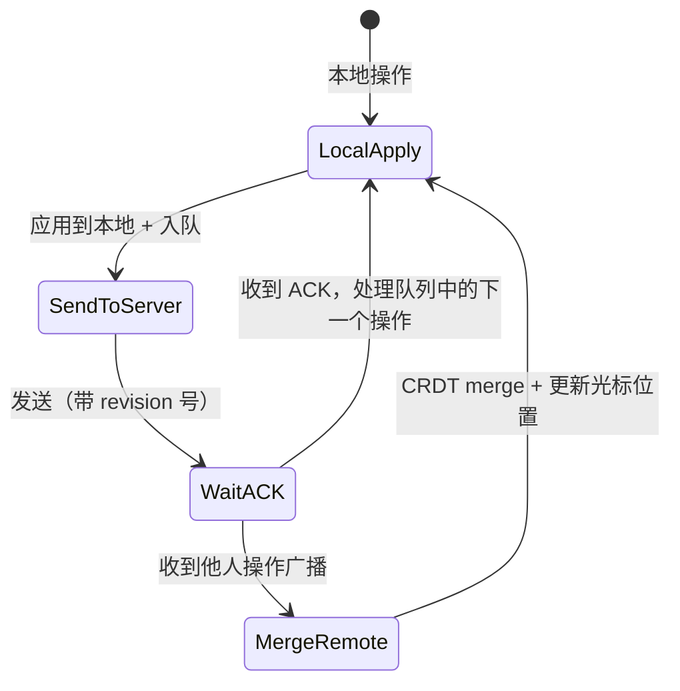

# 设计协同文档编辑器（类 Google Docs）

## TL;DR

核心难点：**多人同时编辑同一份文档，如何保证所有人最终看到一致的内容，且每人的操作不被对方覆盖？**

这道题的独特性在于：它不是"读多写少"，也不是"强一致 vs 最终一致"的简单选择——它需要一套专门的**冲突合并算法**，加上实时通信和持久化的组合设计。

---

## 需求澄清

### 功能需求
- 多用户（2~50 人）同时编辑同一份文档
- 实时看到他人光标位置和编辑内容（< 100ms 感知延迟）
- 支持富文本格式（加粗、斜体、标题、列表）
- 版本历史（查看、恢复历史版本）
- 文档权限（Owner / Editor / Viewer）

### 非功能需求
- 延迟：操作本地立即生效，远端同步 < 200ms
- 可用性：弱网、断线重连后能正确同步
- 持久化：不丢失内容（Auto-save）
- 规模：1 亿用户，100 万并发文档

### 容量估算

```
活跃文档数：100 万
每文档平均同时编辑人数：3 人
平均每秒操作数（每人 1 次）：3 次/文档 × 100 万 = 300 万次操作/秒

操作包大小：约 100 字节（操作类型 + 位置 + 内容）
带宽：300 万 × 100B = 300 MB/s（广播给所有协作者，实际更高）

存储：
  文档内容：平均 50 KB/文档 × 1 亿文档 = 5 TB
  操作日志（版本历史）：每次操作 200B × 每天 1000 次编辑 × 1 亿文档 = 20 TB/天
  → 需要操作日志压缩/合并（Snapshot）
```

---

## 核心难点：并发冲突

假设文档内容是 `"Hello"`，两个用户同时编辑：

```
用户 A：在位置 5 插入 " World"   → 期望结果："Hello World"
用户 B：在位置 5 插入 "!"        → 期望结果："Hello!"

同时发生时，结果取决于处理顺序：
  A 先：B 要在位置 5 插 "!" → 实际应在位置 11（因为 A 已插入 6 字符）
         结果："Hello World!"  ✅
  B 先：A 要在位置 5 插 " World" → 实际应在位置 6
         结果："Hello! World"  也合理 ✅

如果不处理：
  A 先：B 仍在位置 5 插 "!" → 结果："Hello! World"  ❌（"!"跑到了 World 前面）
```

**解决这类冲突有两种主流方案：OT 和 CRDT。**

---

## 方案一：OT（Operational Transformation，操作变换）

### 核心思想

不是直接应用远端操作，而是先**变换（Transform）**它：把远端操作根据本地已执行的操作做位置偏移修正，再应用。

### 操作定义

所有编辑操作都可以归为三类：

```
Insert(pos, char)    在位置 pos 插入字符 char
Delete(pos)          删除位置 pos 的字符
Retain(n)            跳过 n 个字符（不修改）
```

### 变换规则（Transform Function）

```
Transform(op_a, op_b) → op_a'
  op_a' 是在 op_b 已执行后，op_a 需要调整的等效操作

规则示例：
  op_a = Insert(5, " World")
  op_b = Insert(5, "!")    （op_b 先执行）

  op_b 在位置 5 插入了 1 个字符，op_a 原本的位置 5 就向后移了 1 位
  op_a' = Insert(6, " World")
  
  最终结果：先执行 op_b → "Hello!"
            再执行 op_a' → "Hello! World"  ✅
```

### 服务器中心化 OT 架构

```
客户端 A                 服务器                  客户端 B
  |                        |                        |
  |--- op_a (rev=5) ------>|                        |
  |                        | 收到 op_a，当前 rev=6  |
  |                        | 发现 op_b(rev=5~6)先到 |
  |                        | Transform(op_a, op_b)  |
  |                        | 得到 op_a'             |
  |                        |--- broadcast op_a' --->|
  |<-- ack + op_a' --------|                        |
  |                        |                        |

关键：服务器是单点权威仲裁者，维护一个操作的全局顺序
```

### 版本向量（Revision Number）

每个操作带有"基于哪个版本"的标记。服务器收到操作后，变换到当前最新版本。

```
文档版本  操作序列
  0       (初始：空文档)
  1       Insert(0, "H")
  2       Insert(1, "e")
  3       Insert(2, "l")
  ...

客户端 A 在 rev=5 时发送操作，但服务器当前是 rev=7
→ 服务器需要对 A 的操作做 transform(op_a, op_6 ∘ op_7)，得到 op_a'
→ 应用 op_a'，文档变为 rev=8
```

### OT 的问题

- **实现极其复杂**：多种操作类型组合的变换规则容易有 bug
- **服务器必须串行**：所有操作必须经过中心服务器排序，无法去中心化
- **历史上 Google Docs 用 OT，踩了很多坑**

---

## 方案二：CRDT（Conflict-free Replicated Data Type，无冲突复制数据类型）

### 核心思想

不变换位置，而是**给每个字符分配全局唯一 ID 和因果顺序**，冲突在数据结构层面消除。

### 文档模型

不用"位置"表示字符在哪里，而是用**前驱节点 ID**：

```
每个字符节点：
  id:       唯一 ID（作者 ID + 本地时钟）
  char:     字符内容
  parent:   前驱字符的 ID（我插在谁后面）
  deleted:  是否已删除（逻辑删除，保留节点，Tombstone）

文档 "Hi"：
  [ROOT] → [H, id=A1] → [i, id=A2]

用户 A 在 i 后插入 "!"：
  新节点：[!, id=A3, parent=A2]
  
用户 B 同时在 i 后插入 " there"：
  新节点：[t, id=B1, parent=A2] → [h, id=B2, parent=B1] → ...

两个操作都 parent=A2，产生"冲突"：
  用字典序比较 id：A3 vs B1 → B1 排在 A3 后（B > A）
  最终顺序：[H] → [i] → [ there] → [!]
  或         [H] → [i] → [!] → [ there]  取决于比较规则
  
关键：两端各自独立合并，结果一致（Convergent）
```

### CRDT 的优势

```
不需要中心服务器仲裁
每个客户端都能独立合并，P2P 可用
离线编辑后重连，自动合并（不会丢内容）
```

### CRDT 的问题

```
Tombstone 积累：删除的字符节点永远保留（逻辑删除），文档越来越大
  解决：定期 GC（需要确保所有客户端都已收到删除操作后才能清理）

性能：大文档时 CRDT 操作的 ID 树遍历成本较高
  解决：RGA（Replicated Growable Array）、Yjs 等成熟库优化

顺序不确定性：并发插入的排序是字典序，不一定符合用户直觉
```

### 现实选择

| | OT | CRDT |
|--|----|----|
| 实现复杂度 | 极高（变换规则 bug 多）| 中等（数据结构复杂但有成熟库）|
| 去中心化 | 需要中心服务器 | 天然支持 P2P |
| 离线支持 | 复杂 | 优秀 |
| 代表产品 | Google Docs（早期）| Figma、Notion（新一代）|
| 推荐 | 面试说 CRDT，理由：离线支持好，无需中心仲裁，有成熟库（Yjs/Automerge）|

---

## 系统架构

```
[客户端（浏览器）]
     |
     | WebSocket（双向实时通信）
     |
[协作服务（Collaboration Service）]
     |         |
     |         | Redis Pub/Sub（跨实例广播）
     |         |
[其他协作服务实例]
     |
[操作日志（Operation Log）]  ← Kafka（持久化操作流）
     |
[文档快照服务（Snapshot Service）]
     |
[对象存储（文档内容）] + [MySQL（元数据）]
```

### 客户端状态机



### 光标同步

光标位置不能用字符下标（因为别人插入字符后下标会变），要用 CRDT 的字符 ID：

```
用户 A 光标在字符 id=B5 后面
  → 广播：{ userId: A, afterId: B5 }
  → 其他客户端找到 id=B5 的字符，在其后渲染 A 的光标
  → 无论 B 在前面插入多少字符，A 的光标位置语义不变
```

---

## 持久化与版本历史

### Auto-Save 策略

```
策略：不是每次操作都写数据库，而是：
  1. 操作立即写 Kafka（持久，低延迟）
  2. 每隔 N 秒 或 M 次操作，Snapshot Service 把当前文档状态快照写入对象存储
  3. 加载文档时：读最新 Snapshot + 快照后的操作日志，重放得到当前状态

好处：
  - 不因数据库写入阻塞实时协作
  - Kafka 持久化保证不丢操作
  - Snapshot 避免重放全量操作历史
```

### 版本历史

```
保存什么：每次用户手动保存（Ctrl+S）或里程碑时，打一个 Snapshot 版本标记
查看历史：展示某个版本的 Snapshot 内容（不需要重放）
恢复历史：把历史 Snapshot 作为新的基准，覆盖当前文档
```

---

## 权限控制

```
文档级权限表：
  doc_permissions(doc_id, user_id, role)
  role: owner | editor | commenter | viewer

  Viewer：只能读（WebSocket 推送但无法发送操作）
  Editor：可以发送操作
  Owner：可以修改权限、删除文档

链接分享：
  doc_share_links(doc_id, token, role, expires_at)
  通过链接访问时，验证 token → 授予临时权限
```

---

## 存在感（Presence）

实时显示"谁在线，谁在编辑哪里"：

```
每个客户端连接后，通过 WebSocket 广播：
  { type: 'presence', userId, displayName, cursorId, color }

服务端维护（Redis）：
  doc:{docId}:presence → { userId → { cursor, lastSeen } }
  TTL = 30秒（客户端每 15 秒 heartbeat）

用户断线：TTL 过期后自动从 presence 里清除
```

---

## 断线重连

```
重连流程：
  1. WebSocket 断开
  2. 客户端继续本地操作（离线模式），操作入本地队列
  3. 重连后，发送"我当前的 rev + 离线期间的操作队列"
  4. 服务端做 CRDT merge
  5. 服务端返回"离线期间其他人的操作"
  6. 客户端本地 merge，更新视图

关键：CRDT 保证离线操作可以无冲突合并
```

---

## 横向扩展

```
问题：用户 A 连在服务器1，用户 B 连在服务器2，如何实时同步？

方案：Redis Pub/Sub
  每个文档有一个 channel：doc:{docId}
  服务器1 收到 A 的操作 → publish 到 Redis channel
  服务器2 订阅该 channel → 收到操作 → 推给 B

扩展考虑：
  - 文档 → 服务器的 sticky routing（同一文档的操作尽量路由到同一服务器，减少跨服务器通信）
  - 用 consistent hash by docId 路由
```

---

## 面试问答

**Q: OT 和 CRDT 哪个更适合做协同编辑？**

A: 两者都能解决问题，选择取决于架构约束。OT 需要中心服务器串行化所有操作，实现复杂但在服务端有完整的操作顺序控制；CRDT 不需要中心仲裁，天然支持离线编辑和 P2P，现有成熟库（Yjs、Automerge）解决了大部分实现复杂度。现代协同产品（Figma、Notion）倾向于 CRDT。面试中推荐 CRDT，理由是离线支持好、扩展性强、有成熟库可用。

**Q: 光标位置如何在他人插入字符后保持正确？**

A: 用字符 ID 而不是字符下标表示光标位置。CRDT 给每个字符分配全局唯一 ID，光标记录的是"在哪个字符 ID 之后"，不管前面插入多少字符，这个语义不变。接收到光标更新的客户端只需找到对应 ID 的字符节点，在其后渲染光标。

**Q: 大量用户离线后同时重连，如何处理合并风暴？**

A: 限速重连（指数退避 + jitter），避免所有离线用户同时重连服务器。合并本身 CRDT 是 O(n log n)，主要压力在服务器 CPU。可以用消息队列（Kafka）缓冲重连时的操作流，异步处理合并，重连响应只返回最新 Snapshot，客户端拿到 Snapshot 后再异步接收增量操作。

---

## 关联文档

- [03_realtime.md](../03_communication/03_realtime.md) — WebSocket 横向扩展方案
- [02_async.md](../03_communication/02_async.md) — Kafka 持久化操作日志
- [06_chat_system.md](06_chat_system.md) — 实时消息 + 在线状态设计
- [04_fault_tolerance.md](../04_distributed/04_fault_tolerance.md) — 断线重连、指数退避
