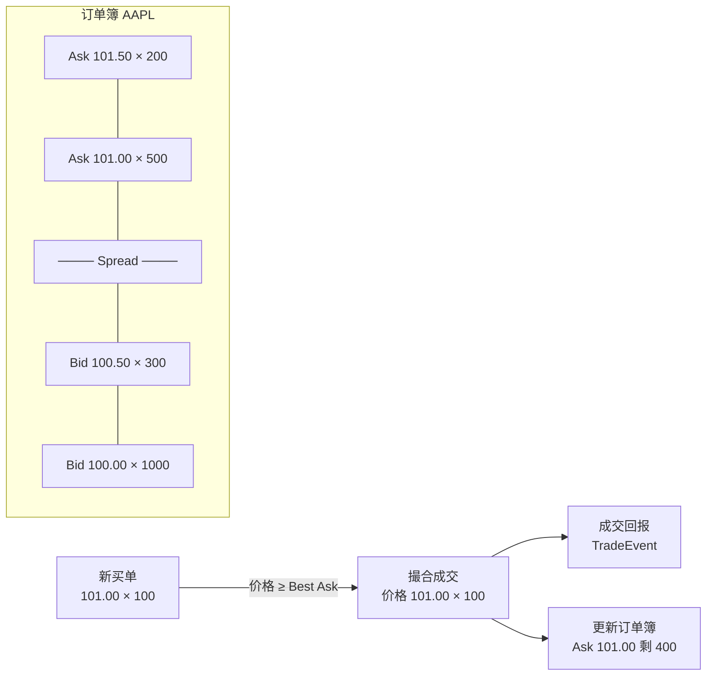
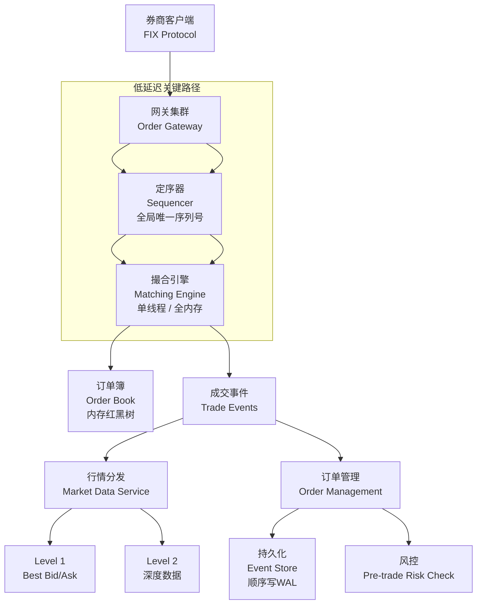
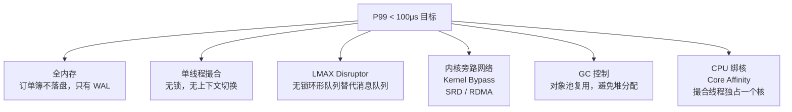
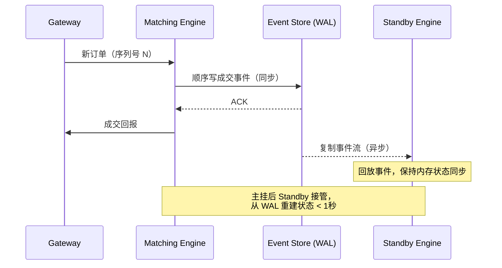
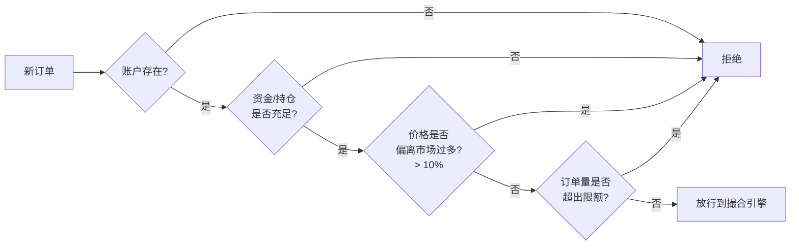

# 系统设计：股票交易所（Low-Latency Stock Exchange）

## TL;DR

交易所的核心是**撮合引擎（Matching Engine）**，将买卖订单按价格-时间优先级配对成交。极致低延迟（微秒级）的关键：全内存、避免 GC、无锁数据结构、内核旁路网络。

---

## 需求澄清

```
功能需求：
  - 下单：市价单（Market）、限价单（Limit）、止损单（Stop）
  - 撮合：价格优先、时间优先
  - 行情：实时推送 Level 1（最优报价）和 Level 2（深度订单簿）
  - 订单状态：New → PartiallyFilled → Filled / Cancelled

非功能需求：
  - 撮合延迟：P99 < 100 微秒（μs）
  - 吞吐量：100 万订单/秒
  - 可用性：99.99%（年停机 < 1小时）
  - 公平性：同价格时严格按时间顺序（FIFO）
  - 准确性：金融级，不允许丢单、重复撮合
```

---

## 核心概念

### 订单类型

```
市价单（Market Order）：以当前最优价格立即成交，不设价格限制
限价单（Limit Order）：指定价格，只在市价达到时成交，未成交挂在订单簿
止损单（Stop Order）：触发价格到达后转为市价单（保护性卖出）
```

### 订单簿（Order Book）

```
卖单（Ask / Offer）  ← 价格从低到高，最低价优先成交
  Ask: 101.50  数量: 200
  Ask: 101.00  数量: 500   ← Best Ask（最优卖价）
  ──────────── Spread ────
  Bid: 100.50  数量: 300   ← Best Bid（最优买价）
  Bid: 100.00  数量: 1000
  Bid: 99.50   数量: 800
买单（Bid）  ← 价格从高到低，最高价优先成交

撮合条件：Buy Limit Price ≥ Best Ask → 成交
```



---

## 整体架构



---

## 撮合引擎设计

### 订单簿数据结构

```typescript
// 价格层级：同一价格的所有订单按时间排队
class PriceLevel {
  constructor(
    public readonly price: number,
    public readonly orders: Order[] = [],  // FIFO 队列
  ) {}

  get totalQuantity(): number {
    return this.orders.reduce((sum, o) => sum + o.remainingQty, 0);
  }
}

// 买单簿：最高价优先（Max Heap）
// 卖单簿：最低价优先（Min Heap）
class OrderBook {
  // 用 TreeMap（按价格排序的 Map）模拟有序结构
  private readonly bids = new Map<number, PriceLevel>(); // price → PriceLevel
  private readonly asks = new Map<number, PriceLevel>();

  // 有序价格列表（实际用红黑树，这里用排序数组模拟）
  private bidPrices: number[] = []; // 降序
  private askPrices: number[] = []; // 升序

  getBestBid(): PriceLevel | null {
    return this.bidPrices.length > 0
      ? this.bids.get(this.bidPrices[0])!
      : null;
  }

  getBestAsk(): PriceLevel | null {
    return this.askPrices.length > 0
      ? this.asks.get(this.askPrices[0])!
      : null;
  }

  addOrder(order: Order): void {
    const book   = order.side === Side.BUY ? this.bids : this.asks;
    const prices = order.side === Side.BUY ? this.bidPrices : this.askPrices;

    if (!book.has(order.price)) {
      book.set(order.price, new PriceLevel(order.price));
      // 插入并保持有序（实际用红黑树 O(log n)，这里简化为 O(n)）
      prices.push(order.price);
      if (order.side === Side.BUY) {
        prices.sort((a, b) => b - a); // 买单降序
      } else {
        prices.sort((a, b) => a - b); // 卖单升序
      }
    }
    book.get(order.price)!.orders.push(order);
  }
}
```

### 撮合算法（价格-时间优先）

```typescript
enum Side  { BUY = 'BUY', SELL = 'SELL' }
enum OType { MARKET = 'MARKET', LIMIT = 'LIMIT' }
enum OStatus { NEW, PARTIALLY_FILLED, FILLED, CANCELLED }

interface Order {
  id: string;
  symbol: string;
  side: Side;
  type: OType;
  price: number;      // 限价；市价单设为 MAX_SAFE_INTEGER（买）或 0（卖）
  quantity: number;
  remainingQty: number;
  status: OStatus;
  timestamp: number;  // 纳秒时间戳，保证 FIFO
}

interface TradeEvent {
  tradeId: string;
  buyOrderId: string;
  sellOrderId: string;
  price: number;
  quantity: number;
  timestamp: number;
}

class MatchingEngine {
  private readonly books = new Map<string, OrderBook>(); // symbol → OrderBook
  private readonly trades: TradeEvent[] = [];

  processOrder(order: Order): TradeEvent[] {
    const book = this.getOrCreateBook(order.symbol);
    const newTrades: TradeEvent[] = [];

    if (order.side === Side.BUY) {
      this.matchBuy(order, book, newTrades);
    } else {
      this.matchSell(order, book, newTrades);
    }

    // 未完全成交的限价单挂单
    if (order.remainingQty > 0 && order.type === OType.LIMIT) {
      book.addOrder(order);
    }

    return newTrades;
  }

  private matchBuy(order: Order, book: OrderBook, trades: TradeEvent[]): void {
    while (order.remainingQty > 0) {
      const bestAsk = book.getBestAsk();
      if (!bestAsk) break;

      // 买价 < 最优卖价 → 无法成交，挂单
      if (order.type === OType.LIMIT && order.price < bestAsk.price) break;

      const sellOrder = bestAsk.orders[0];
      const matched   = Math.min(order.remainingQty, sellOrder.remainingQty);

      trades.push(this.createTrade(order, sellOrder, bestAsk.price, matched));

      order.remainingQty    -= matched;
      sellOrder.remainingQty -= matched;

      if (sellOrder.remainingQty === 0) {
        bestAsk.orders.shift(); // 卖单完全成交，移出队列
        sellOrder.status = OStatus.FILLED;
      } else {
        sellOrder.status = OStatus.PARTIALLY_FILLED;
      }
    }

    order.status = order.remainingQty === 0
      ? OStatus.FILLED
      : order.remainingQty < order.quantity
        ? OStatus.PARTIALLY_FILLED
        : OStatus.NEW;
  }

  private matchSell(order: Order, book: OrderBook, trades: TradeEvent[]): void {
    while (order.remainingQty > 0) {
      const bestBid = book.getBestBid();
      if (!bestBid) break;
      if (order.type === OType.LIMIT && order.price > bestBid.price) break;

      const buyOrder = bestBid.orders[0];
      const matched  = Math.min(order.remainingQty, buyOrder.remainingQty);

      trades.push(this.createTrade(buyOrder, order, bestBid.price, matched));

      order.remainingQty   -= matched;
      buyOrder.remainingQty -= matched;

      if (buyOrder.remainingQty === 0) {
        bestBid.orders.shift();
        buyOrder.status = OStatus.FILLED;
      } else {
        buyOrder.status = OStatus.PARTIALLY_FILLED;
      }
    }
  }

  private createTrade(buy: Order, sell: Order, price: number, qty: number): TradeEvent {
    return {
      tradeId:    `T-${Date.now()}-${Math.random()}`,
      buyOrderId:  buy.id,
      sellOrderId: sell.id,
      price,
      quantity: qty,
      timestamp: Date.now(),
    };
  }

  private getOrCreateBook(symbol: string): OrderBook {
    if (!this.books.has(symbol)) {
      this.books.set(symbol, new OrderBook());
    }
    return this.books.get(symbol)!;
  }
}
```

---

## 低延迟关键技术



### LMAX Disruptor 模式（无锁环形队列）

```
传统 Queue：锁竞争 → 上下文切换 → 延迟 10-100μs
Disruptor：
  ┌─────────────────────────────────────────────┐
  │  环形缓冲区（大小 = 2^n，预分配，不 GC）      │
  │  [slot0][slot1][slot2]...[slotN-1]           │
  │     ↑ Producer 写入（CAS 更新 sequence）      │
  │                    ↑ Consumer 读取（无锁）     │
  └─────────────────────────────────────────────┘

延迟：< 1μs（比 ArrayBlockingQueue 快 10x）
```

---

## 持久化与容错



**关键设计**：撮合引擎不直接持久化订单簿状态，而是持久化所有**输入事件**（订单）。故障恢复时只需回放事件流即可重建订单簿，保证确定性（相同输入 → 相同状态）。

---

## 风控（Pre-trade Risk Check）



风控检查必须 < 10μs，否则影响整体延迟目标。所有风控数据（账户余额、持仓）也必须在内存中。

---

## 延迟对比

| 组件 | 延迟 | 技术 |
|------|------|------|
| 网络（同机房） | 50-100μs | 普通 TCP |
| 网络（内核旁路） | 1-5μs | RDMA / SRD |
| 撮合引擎（单订单） | 1-10μs | 单线程 + 全内存 |
| 消息队列（Kafka） | 1-5ms | 不能用于关键路径 |
| 数据库写入 | 1-10ms | 不能在撮合路径上 |

---

## 面试追问

**Q: 为什么撮合引擎要单线程？**

多线程需要锁来保证订单簿一致性，锁竞争引入延迟和不确定性。单线程处理所有订单，天然无锁，吞吐量反而更高（避免上下文切换）。100 万订单/秒 × 10μs/订单 = 10^6 × 10×10^-6 = 10 秒的计算量，一个现代核每秒可处理 > 10^8 次简单操作，绰绰有余。

**Q: 怎么保证 FIFO 公平性？**

定序器（Sequencer）给每个到达的订单分配全局单调递增序列号，撮合引擎严格按序列号处理。网络到达顺序不等于公平顺序，序列号保证了在交易所层面的时间公平性。

**Q: 如果撮合引擎挂了怎么办？**

热备 Standby 引擎实时回放相同的事件流（保证状态一致），主机挂掉后 < 1秒切换，通过 WAL 重放确保状态完整。

**Q: 订单簿用什么数据结构？为什么不用 HashMap？**

用红黑树（Java TreeMap / C++ std::map）。需要：①按价格有序遍历找 Best Bid/Ask，②范围查询（Level 2 深度）。HashMap 无序，无法支持这些操作。红黑树 O(log n)，对订单簿价格档位数（通常 < 1000 档）来说完全够用。
