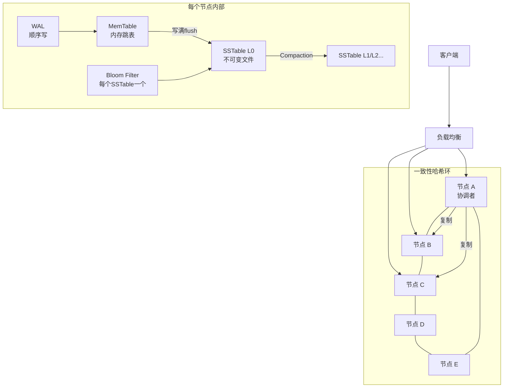
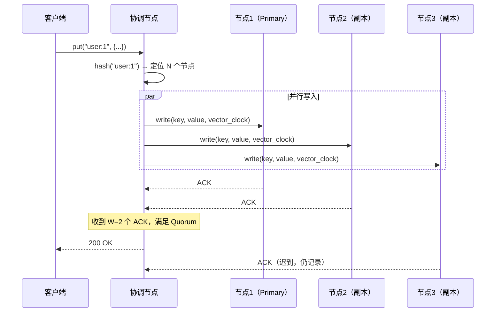
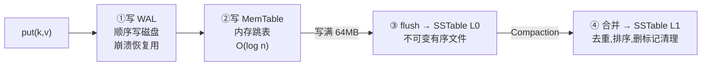
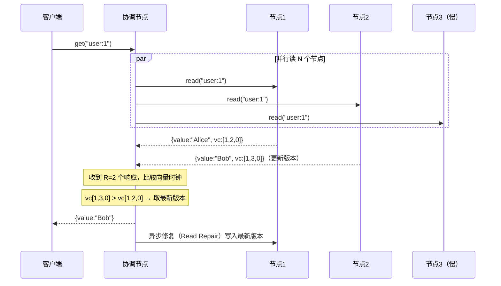
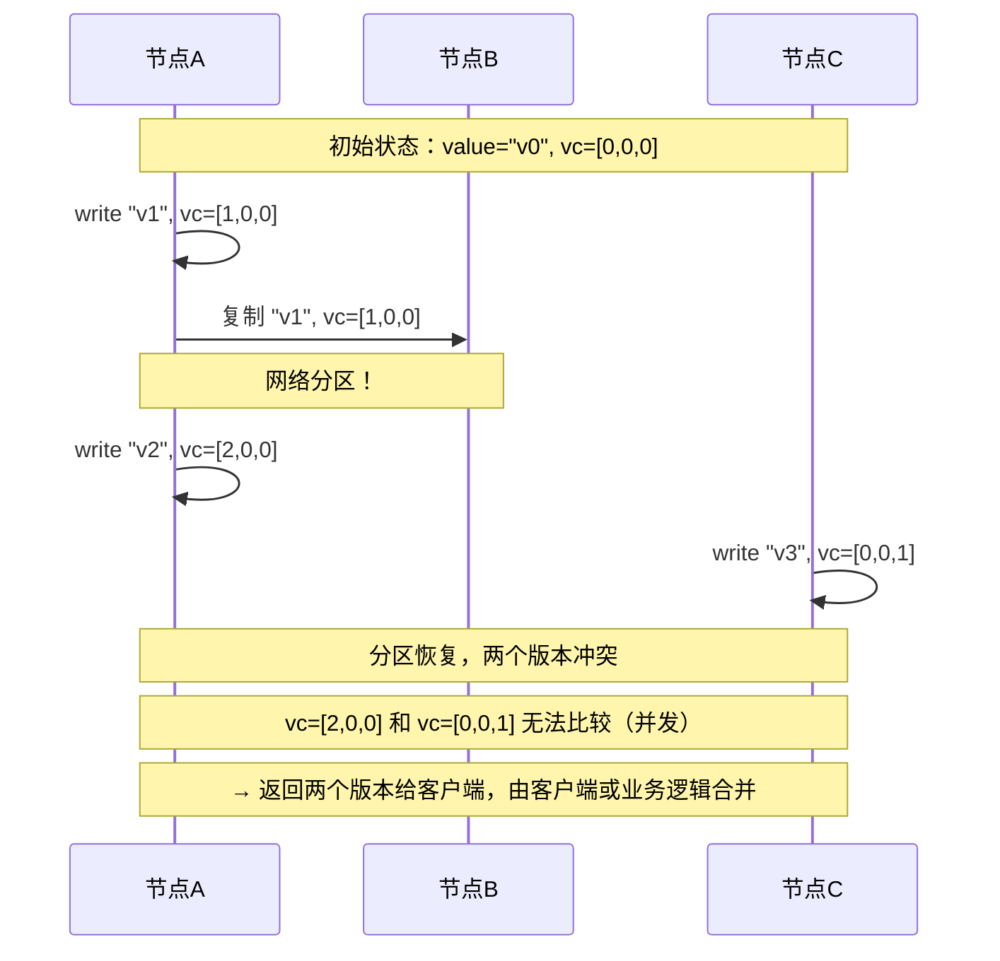
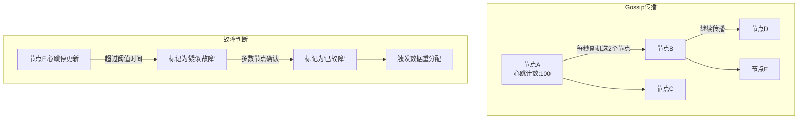
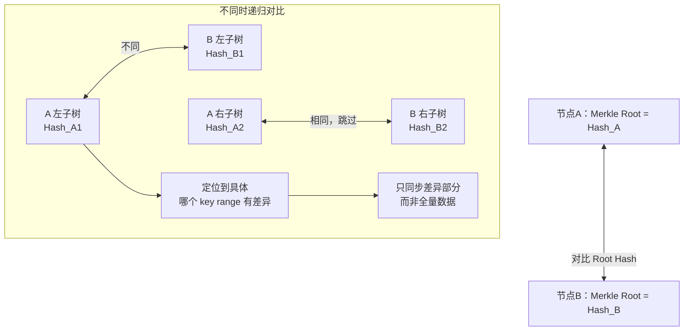

# 系统设计：分布式 Key-Value 存储（设计 DynamoDB/Cassandra）

## TL;DR

设计一个类 DynamoDB 的分布式 KV 存储，核心挑战：**如何在数千台节点上均匀分布数据，同时保证高可用和可调一致性**。答案是：一致性哈希 + Quorum 读写 + 向量时钟冲突解决 + Gossip 协议故障检测。

---

## 需求澄清

```
功能需求：
  - put(key, value)：写入或更新
  - get(key)：读取，key 不存在返回 null
  - delete(key)：删除
  - 支持大 value（最大 10MB）

非功能需求：
  - 低延迟：P99 读 < 10ms，写 < 20ms
  - 高可用：99.99%（允许部分节点故障时继续工作）
  - 可扩展：水平扩展到 1000+ 节点
  - 可调一致性：可配置强一致 / 最终一致
  - 数据规模：100TB+
```

---

## 与竞品横向对比

| 特性 | Redis | DynamoDB | Cassandra | etcd | 你设计的 |
|------|-------|---------|-----------|------|---------|
| 数据模型 | KV / 多结构 | KV + 范围 | 宽列 | KV | KV |
| 一致性 | 强（单节点）| 可调 | 可调 | 强（Raft）| 可调 |
| 可用性 | AP | AP | AP | CP | AP |
| 持久化 | AOF/RDB | 是 | 是 | 是 | WAL+SSTable |
| 水平扩展 | 需 Cluster | 自动 | 自动 | 有限 | 一致性哈希 |
| 适用场景 | 缓存/会话 | 大规模业务 | 时序/日志 | 配置/选主 | 通用存储 |

---

## 整体架构



---

## 核心设计一：一致性哈希（数据分布）

```mermaid
flowchart LR
    subgraph 哈希环（0 ~ 2^32-1）
        direction LR
        A["节点A\n@100"] --- B["节点B\n@200"] --- C["节点C\n@300"] --- D["节点D\n@400"] --- A
        K1["key='user:1'\nhash=150\n→ 落在节点B"] 
        K2["key='order:5'\nhash=350\n→ 落在节点D"]
    end
```

**虚拟节点（解决数据倾斜）：**

```
每个物理节点 → 100~200 个虚拟节点（不同哈希位置）
  节点A → [A#1@50, A#2@180, A#3@320, ...]
  节点B → [B#1@100, B#2@250, B#3@380, ...]

效果：数据分布更均匀，节点上下线时迁移数据量 ≈ 1/N
```

**关键参数（仿 Dynamo）：**
```
N = 3（副本数）
W = 2（写 Quorum：至少2个节点确认）
R = 2（读 Quorum：至少2个节点响应）
W + R > N → 强一致；W=1,R=1 → 最终一致（高性能）

协调节点（Coordinator）：客户端请求到达的节点
  → 找到 key 在哈希环上对应的 N 个节点
  → 并行发送读/写请求，收到 Quorum 数量的响应即返回
```

---

## 核心设计二：写入流程



**写入节点内部流程（LSM Tree）：**



---

## 核心设计三：读取流程



**节点内部读取（LSM Tree 读路径）：**

```
查找 key "user:1"：
  1. MemTable（内存跳表）→ O(log n)
  2. L0 SSTable（可能多个，有重叠）
     → 用 Bloom Filter 过滤不含此 key 的文件
     → 二分查找索引块 → 读数据块
  3. L1, L2... 依次向下（每层文件不重叠，二分定位）

Bloom Filter 的作用：
  key 不存在时，大概率 Bloom Filter 就能判断 → 跳过磁盘读
  避免读放大（Read Amplification）
```

---

## 核心设计四：冲突解决（向量时钟）



**Last-Write-Wins（LWW）vs 向量时钟：**

```
LWW（Cassandra 默认）：
  每个写操作带时间戳，取最新时间戳的值
  优点：简单
  缺点：依赖时钟同步，可能丢失数据

向量时钟（DynamoDB 早期）：
  记录每个节点的逻辑时钟 [c_A, c_B, c_C, ...]
  可以检测到并发写（两个向量时钟无法比较大小）
  优点：不丢数据（保留所有并发版本）
  缺点：需要客户端合并逻辑，向量时钟可能无限增长
```

---

## 核心设计五：故障检测（Gossip 协议）



**对比中心化心跳 vs Gossip：**

| | 中心化心跳 | Gossip |
|--|---------|--------|
| 单点故障 | 有（心跳服务器故障）| 无 |
| 网络带宽 | O(n)（所有节点→中心）| O(n log n) |
| 收敛时间 | 快 | O(log n) 轮次 |
| 一致性 | 强 | 最终一致 |

---

## 核心设计六：数据修复（Merkle Tree 反熵）



---

## 面试追问

**Q: W+R > N 为什么能保证强一致？**

写入确认的 W 个节点和读取的 R 个节点，至少有 1 个重叠（W+R>N → 重叠≥1）。这个重叠节点一定有最新的写入，读到的值不会是旧值。

**Q: 如果协调节点在写入 W 个确认前宕机怎么办？**

其他节点已写入的数据不丢（有 WAL），客户端收不到响应重试即可（幂等写入）。通过幂等键防止重复写入。

**Q: Hinted Handoff 是什么？**

目标节点暂时不可用时，协调者把写入数据临时存在另一个"提示"节点上，等目标节点恢复后转发。保证高可用（AP），但可能短暂一致性问题。

**Q: 为什么 Cassandra 用 LWW 而不是向量时钟？**

向量时钟需要客户端实现合并逻辑，增加使用复杂度；向量时钟大小随节点数增长可能无界。LWW 简单、性能好，大多数场景（写入覆盖）够用，代价是极端情况下可能丢写。
