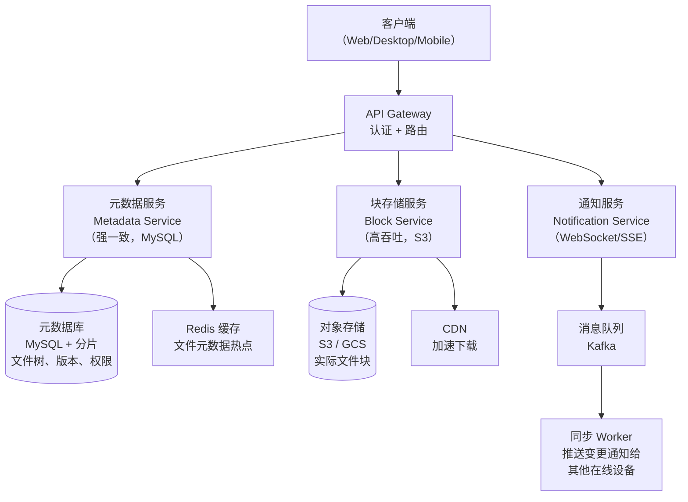
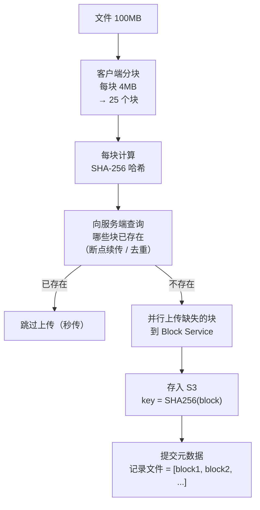
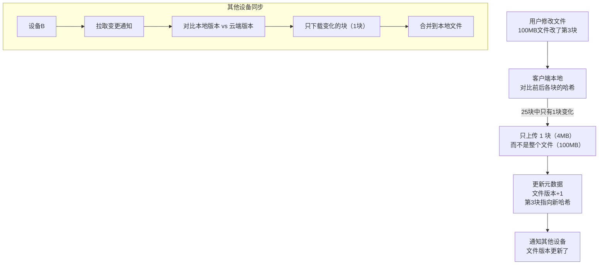
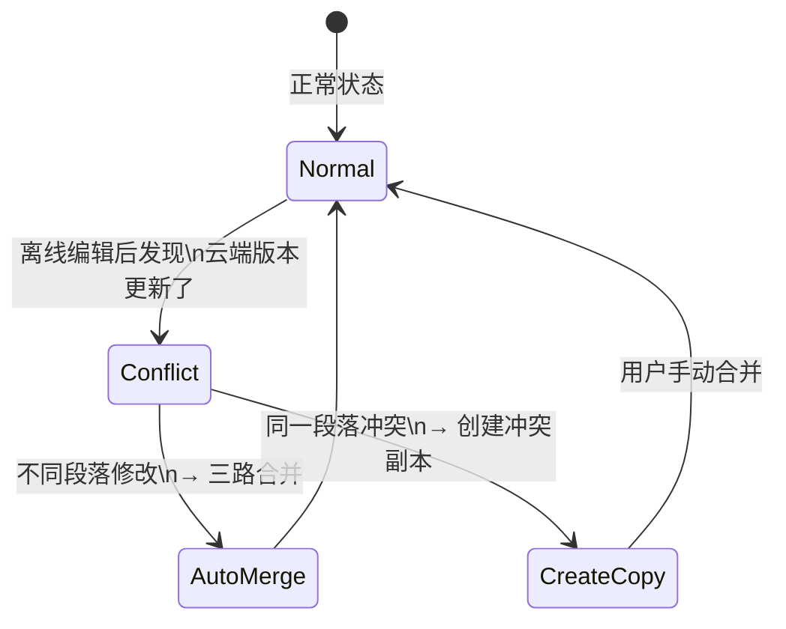
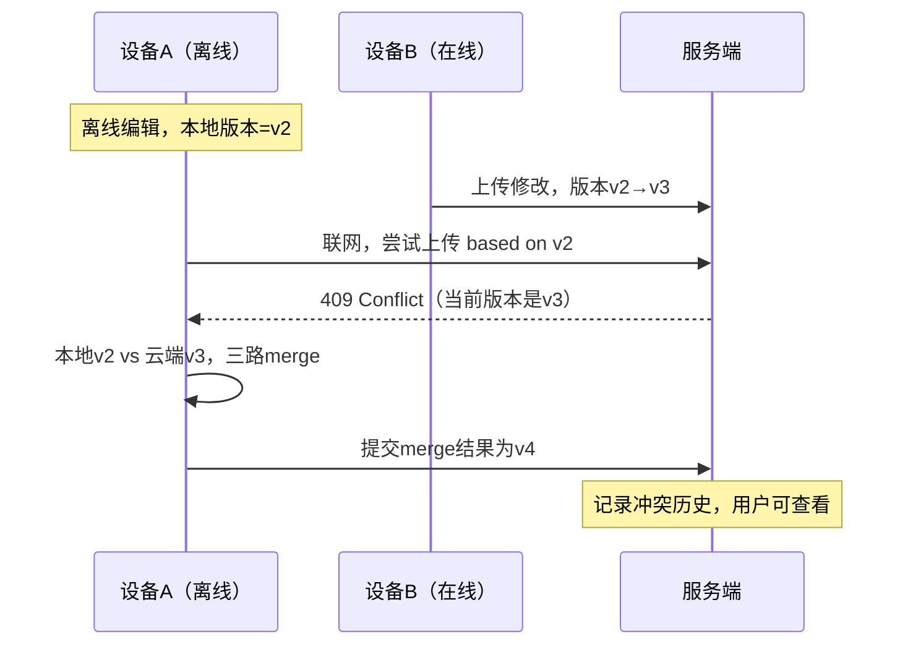
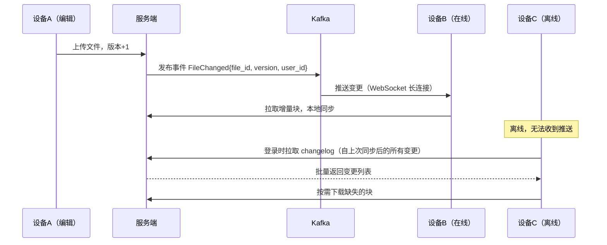
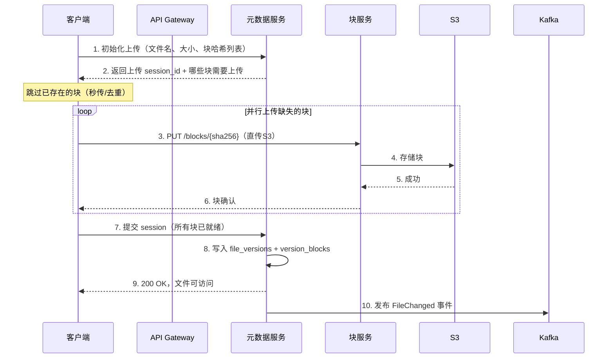

# 系统设计：Google Drive（云盘文件同步）

## TL;DR

核心难点有三：**分块上传（大文件处理）、增量同步（只传变化的块）、冲突解决（多设备同时编辑）**。架构上把元数据服务（强一致）和块存储（高吞吐）分开设计。

---

## 需求澄清

```
功能需求：
  - 上传 / 下载文件（支持大文件，最大 10GB）
  - 自动同步（多设备文件保持一致）
  - 文件版本历史（可回退到过去版本）
  - 共享文件 / 文件夹给他人
  - 离线编辑（联网后同步）

非功能需求：
  - 可靠性：数据不丢（3 副本 + 跨 AZ）
  - 一致性：同一文件在所有设备最终一致
  - 低延迟：上传开始后立刻反馈进度
  - 带宽优化：只传变化的部分（增量同步）

规模估算：
  DAU: 5000 万
  平均文件大小: 500KB
  每人每天上传 2 个文件
  写 QPS = 5000万 × 2 / 86400 ≈ 1200 QPS
  存储：5000万用户 × 平均 10GB = 500 PB（用 S3 / 对象存储）
```

---

## 与竞品横向对比

| 特性 | Google Drive | Dropbox | OneDrive | iCloud |
|------|-------------|---------|---------|-------|
| 块大小 | 256KB | 4MB | 可变 | — |
| 去重 | 全局去重 | 全局去重 | 账户内 | 账户内 |
| 冲突策略 | 保留两个版本 | 创建冲突副本 | 自动合并 | 最新覆盖 |
| 版本历史 | 30天（免费）| 180天 | 30天 | 30天 |
| 协同编辑 | 支持（Docs）| 不支持 | 支持（Office）| 不支持 |
| 离线 | 支持 | 支持 | 支持 | 支持 |

---

## 整体架构



---

## 核心设计一：分块上传（Chunked Upload）



**去重原理（内容寻址存储）：**

```
块的存储 key = SHA256(块内容)
  → 两个文件有相同的块（如相同的图片），只存一份
  → 用户上传同一文件，块已存在，直接秒传（不占新空间）

数据库记录：
  blocks 表：sha256 → s3_url（块的实际位置）
  file_versions 表：file_id + version → [sha256_1, sha256_2, ...]
```

---

## 核心设计二：增量同步（Delta Sync）



**块大小选择：**

```
块太小（1KB）：
  元数据爆炸（100MB文件 = 10万条记录）
  上传请求数过多（HTTP 连接开销大）

块太大（100MB）：
  小改动也要重新上传整个块
  并行上传无法拆分

最佳：4MB（Dropbox）~ 256KB（Google Drive 内部）
  4MB：均衡元数据和传输效率，适合文档/图片
  小块（256KB）：适合频繁小改动的场景（协同文档）
```

---

## 核心设计三：元数据结构

```sql
-- 用户表
CREATE TABLE users (
  id         BIGINT PRIMARY KEY,
  email      VARCHAR(255) UNIQUE,
  quota_gb   INT DEFAULT 15
);

-- 文件/文件夹表（统一管理）
CREATE TABLE files (
  id         BIGINT PRIMARY KEY,
  owner_id   BIGINT,
  parent_id  BIGINT,           -- 父文件夹 id（NULL = 根目录）
  name       VARCHAR(1024),
  is_folder  BOOLEAN,
  created_at DATETIME,
  INDEX (owner_id, parent_id)  -- 列出目录内容
);

-- 文件版本表
CREATE TABLE file_versions (
  id          BIGINT PRIMARY KEY,
  file_id     BIGINT,
  version     INT,
  size_bytes  BIGINT,
  created_at  DATETIME,
  created_by  BIGINT,          -- 哪个设备/用户创建的版本
  PRIMARY KEY (file_id, version)
);

-- 块引用表（版本 → 块列表）
CREATE TABLE version_blocks (
  version_id   BIGINT,
  block_index  INT,             -- 块的顺序（0,1,2,...）
  block_sha256 CHAR(64),        -- 指向 blocks 表
  PRIMARY KEY (version_id, block_index)
);

-- 块表（内容寻址，全局去重）
CREATE TABLE blocks (
  sha256   CHAR(64) PRIMARY KEY,
  s3_url   VARCHAR(2048),
  size     INT,
  ref_count INT                 -- 有多少文件版本引用这个块
);

-- 共享权限表
CREATE TABLE file_shares (
  file_id     BIGINT,
  shared_with BIGINT,           -- 用户 id 或 -1（公开）
  permission  ENUM('view','edit'),
  PRIMARY KEY (file_id, shared_with)
);
```

---

## 核心设计四：冲突解决



**冲突检测流程：**



---

## 核心设计五：通知机制（多设备实时同步）



**两种推送方式：**

| | WebSocket（长连接）| 轮询（定时拉取）|
|--|---------|---------|
| 实时性 | 毫秒级 | 取决于轮询间隔 |
| 服务端开销 | 高（维护连接）| 低 |
| 适用场景 | 桌面客户端 | 移动端（省电）|
| Dropbox 选择 | WebSocket | — |
| Google Drive | SSE | 移动端轮询 |

---

## 上传大文件完整流程



---

## 面试追问

**Q: 为什么元数据和块存储要分开？**

元数据需要**强一致**（文件树结构、权限、版本号），用关系型 DB + 事务保证。块存储需要**高吞吐**，几十TB 的文件数据，用对象存储（S3）更合适。如果混在一起，数据库会成为瓶颈。

**Q: 删除文件时 S3 的块怎么处理？**

软删除：文件标记为删除，块不立即删除（block.ref_count--）。后台定时任务扫描 ref_count=0 的块，批量删除。这样版本历史功能不会因为删除文件破坏。

**Q: 共享文件夹中的文件如何计算配额？**

只计在文件所有者的配额里，而不是每个有权限的用户都计。文件共享给 100 人，只有上传者那 100MB 被计费。

**Q: 如何防止用户上传病毒文件？**

上传完成后，异步对块内容做病毒扫描（ClamAV 等）。扫描期间文件状态为 PENDING，扫描通过后变 AVAILABLE。发现病毒则标记 QUARANTINED，通知用户并阻止下载。
