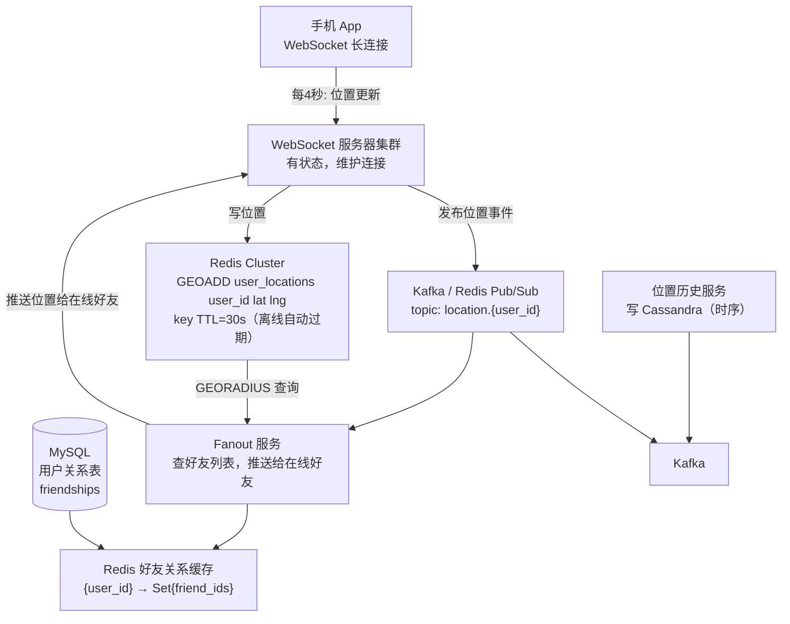
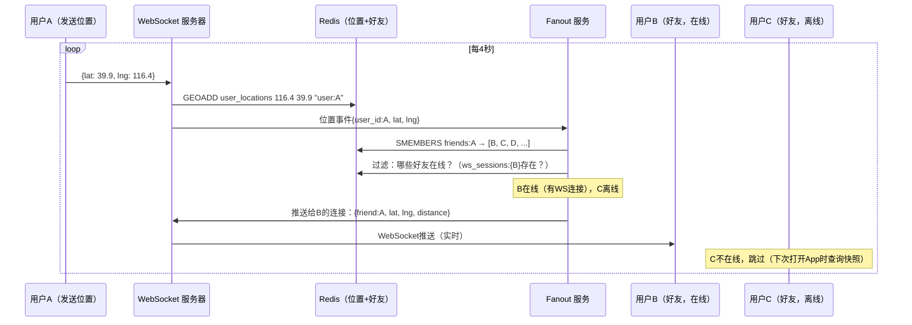
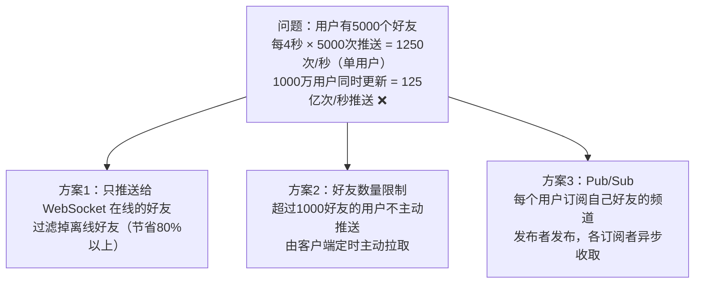
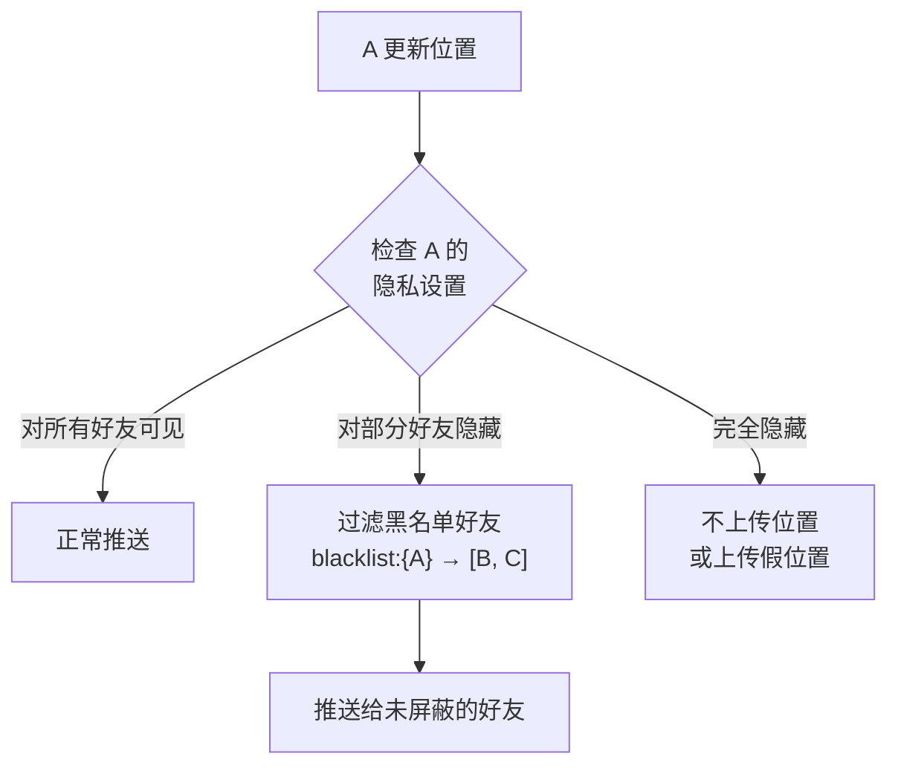
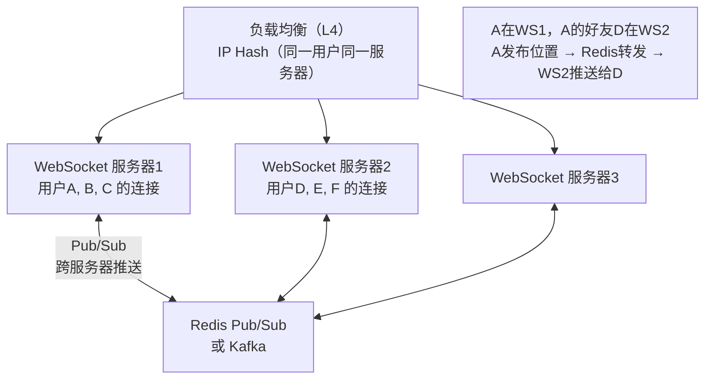

# 系统设计：附近的人（Nearby Friends）

## TL;DR

**与附近搜索（Proximity Service）的核心区别**：附近搜索是静态 POI 数据库查询；附近的人是**实时动态位置流**，用户位置每 N 秒更新一次，需要实时推送给朋友。核心技术：WebSocket 长连接 + Redis Geospatial + Pub/Sub。

---

## Nearby Friends vs Proximity Service 深度对比

```mermaid
flowchart LR
    subgraph Proximity Service（附近搜索）
        PS1["数据特征：静态\nPOI 位置不变"] --> PS2["数据库：MySQL+Geohash索引"]
        PS2 --> PS3["查询：用户发起，按需查询"]
        PS3 --> PS4["延迟要求：<100ms即可"]
    end
    
    subgraph Nearby Friends（附近的人）
        NF1["数据特征：高频动态\n位置每4秒更新"] --> NF2["存储：Redis（内存，过期自动清理）"]
        NF2 --> NF3["推送：服务端主动推，WebSocket"]
        NF3 --> NF4["延迟要求：<1s，接近实时"]
    end
```

| 维度 | Proximity Service | Nearby Friends |
|------|------------------|----------------|
| 数据更新频率 | 几乎不变（餐厅位置）| 每 4 秒一次 |
| 数据量 | 静态 DB（2 亿 POI）| 实时在线用户（数百万并发）|
| 查询发起方 | 客户端主动拉 | 服务端主动推 |
| 存储 | MySQL + Geohash 索引 | Redis + WebSocket |
| 关系模型 | 无（任何人都能搜）| 有（只看好友）|

---

## 需求澄清

```
功能需求：
  - 看到 5km 内的在线好友及距离
  - 好友位置实时更新（每 4 秒刷新）
  - 可设置隐私（不让特定好友看到）
  - 历史位置记录（24小时）

非功能需求：
  - 延迟：好友位置更新 < 1 秒到达我的设备
  - 规模：DAU 1 亿，同时在线 10%（1000万）
  - 位置更新 QPS = 1000万 / 4秒 = 250万 QPS（高频写！）
```

---

## 整体架构



---

## 核心设计一：位置数据存储

### Redis Geospatial（实时位置）

```
数据结构：Redis GEO（底层是 ZSet，score = 编码后的经纬度）

命令：
  GEOADD user_locations 116.4 39.9 "user:1001"   # 更新位置
  GEORADIUS user_locations 116.4 39.9 5 km        # 查5km内所有人
  GEODIST user_locations user:1001 user:1002 km   # 两人距离
  GEOPOS user_locations user:1001                  # 获取某人位置

设计细节：
  - Key 设计：user_locations（所有用户共一个 ZSet）
    → 问题：单个 ZSet 在 Redis Cluster 无法拆分（GEORADIUS 要求同一节点）
    → 解决：按 Geohash 分区，user_locations:{geohash5} 多个 ZSet
  
  - TTL：每次位置更新重置 TTL=30s
    → 用户关闭 App 后，30秒内位置自动过期
    → 不需要"离线"事件，Redis 自动清理

  - 精度：GEOADD 精度约 0.6m，完全满足"附近"需求
```

### Cassandra（历史位置）

```
表设计（时序数据，按用户+时间分区）：

CREATE TABLE location_history (
  user_id    BIGINT,
  recorded_at TIMESTAMP,
  lat        DOUBLE,
  lng        DOUBLE,
  accuracy   FLOAT,
  PRIMARY KEY (user_id, recorded_at)
) WITH CLUSTERING ORDER BY (recorded_at DESC)
  AND default_time_to_live = 86400;  -- 24小时后自动删除

查询：SELECT * FROM location_history 
      WHERE user_id = 1001 
      AND recorded_at > now() - 1h;
```

---

## 核心设计二：实时推送流程



---

## 核心设计三：Fanout 的扩展性问题



**Redis Pub/Sub 方案（推荐）：**

```
每个用户 A 上线时：
  SUB location.channel.friend1
  SUB location.channel.friend2
  ...（订阅所有在线好友的频道）

A 发布位置时：
  PUBLISH location.channel.A "{lat:39.9, lng:116.4}"

好友 B 订阅了 location.channel.A → 收到推送

问题：好友关系变化时要更新订阅
好友下线时 channel 自动无订阅者
```

---

## 核心设计四：隐私控制



**隐私数据结构：**

```
Redis Set：privacy_blacklist:{user_id} → Set{blocked_friend_ids}
在 Fanout 时过滤：好友 B 在黑名单里 → 不推送给 B

模糊化距离（防止精确定位）：
  真实距离 324m → 展示 "300m 以内"
  真实距离 2.1km → 展示 "2km 以内"
  只显示区间，不显示精确坐标
```

---

## 核心设计五：WebSocket 服务横向扩展



**Session 路由：**

```
Redis Hash：ws_server:{user_id} → server_id
  用户A连接到 WS1 → 记录 ws_server:A = "ws1"

Fanout 推送给好友时：
  查 ws_server:{friend_id} → 知道好友在哪台服务器
  通过服务器间消息（Redis Pub/Sub）转发推送
```

---

## 面试追问

**Q: 位置更新 250 万 QPS 怎么扛？**

① Redis Cluster 水平扩展（16+ 分片），每分片扛约 10 万写 QPS  
② WebSocket 服务器集群（无状态化，靠 Redis 共享状态）  
③ 客户端只在位置变化超过阈值（如 50m）才更新，减少无效写入  
④ 静止用户降低更新频率（30秒一次 → 4秒一次只在移动中）

**Q: 用户很多好友，Fanout 怎么优化？**

① 只推给在线好友（过滤离线，节省 80%+）  
② 分批异步推送，避免单次 Fanout 阻塞  
③ 好友超过 1000 的用户：不推送，改为客户端定时拉取（拉 vs 推 混合）

**Q: 和 Proximity Service 对比，为什么这里不用 MySQL + Geohash？**

MySQL 适合静态数据查询，1000 万用户每 4 秒写一次 = 250 万写 QPS，MySQL 根本扛不住。Redis 内存 KV 写入快（50 万+ QPS/节点），Cluster 可线性扩展。另外 MySQL 的 Geohash 索引不适合频繁更新场景（每次更新需要删旧记录插新记录）。
