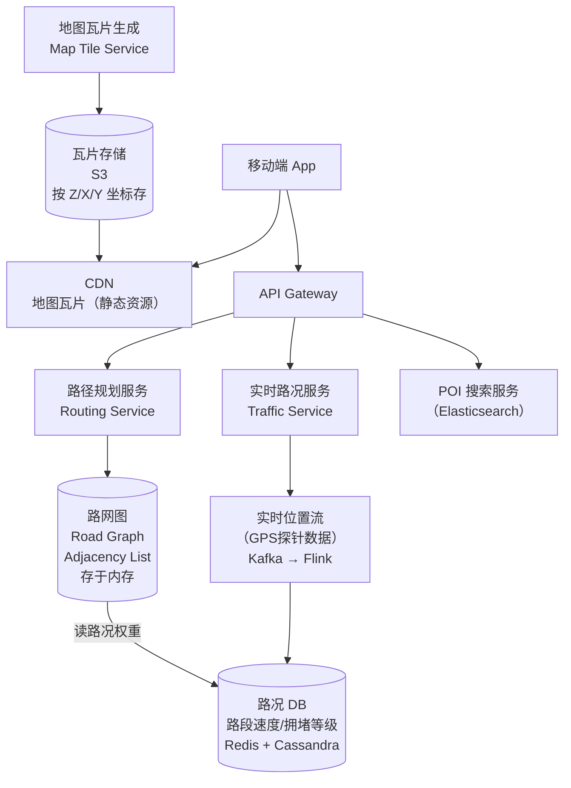
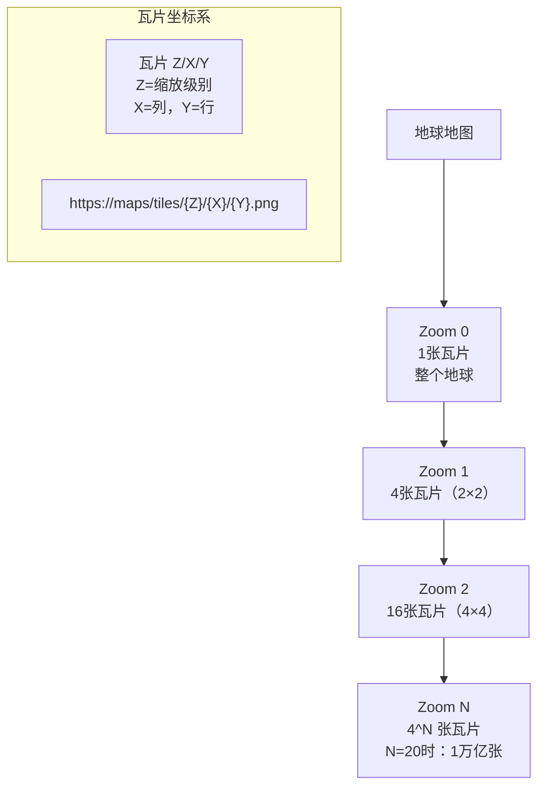
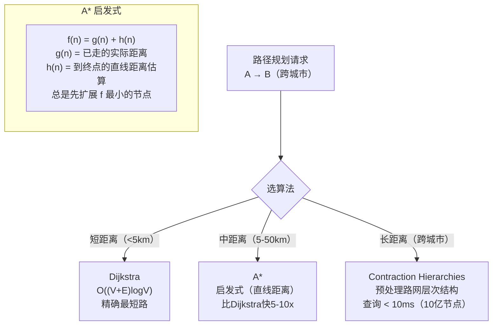
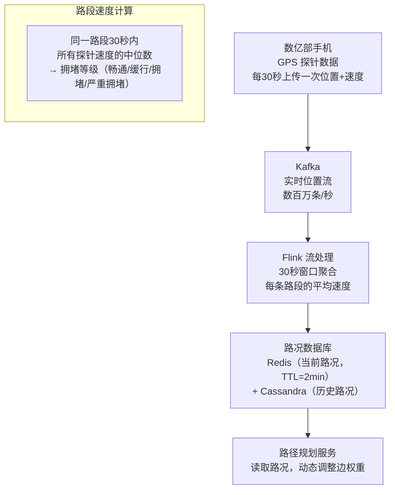
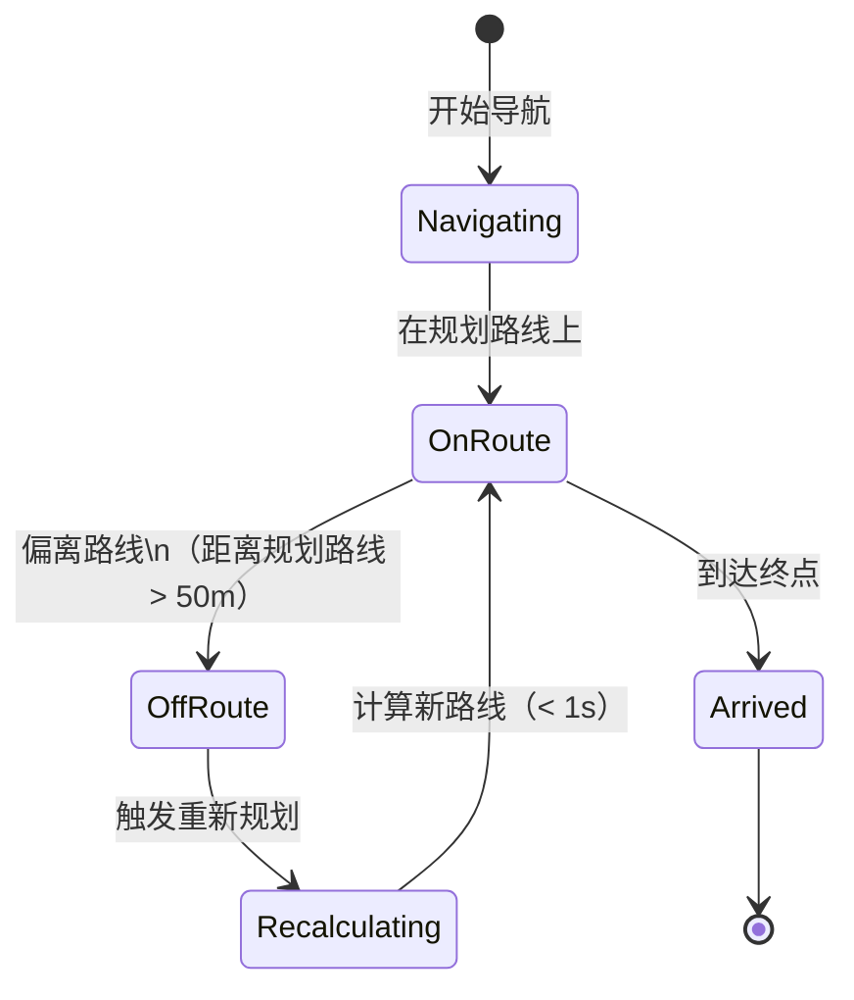
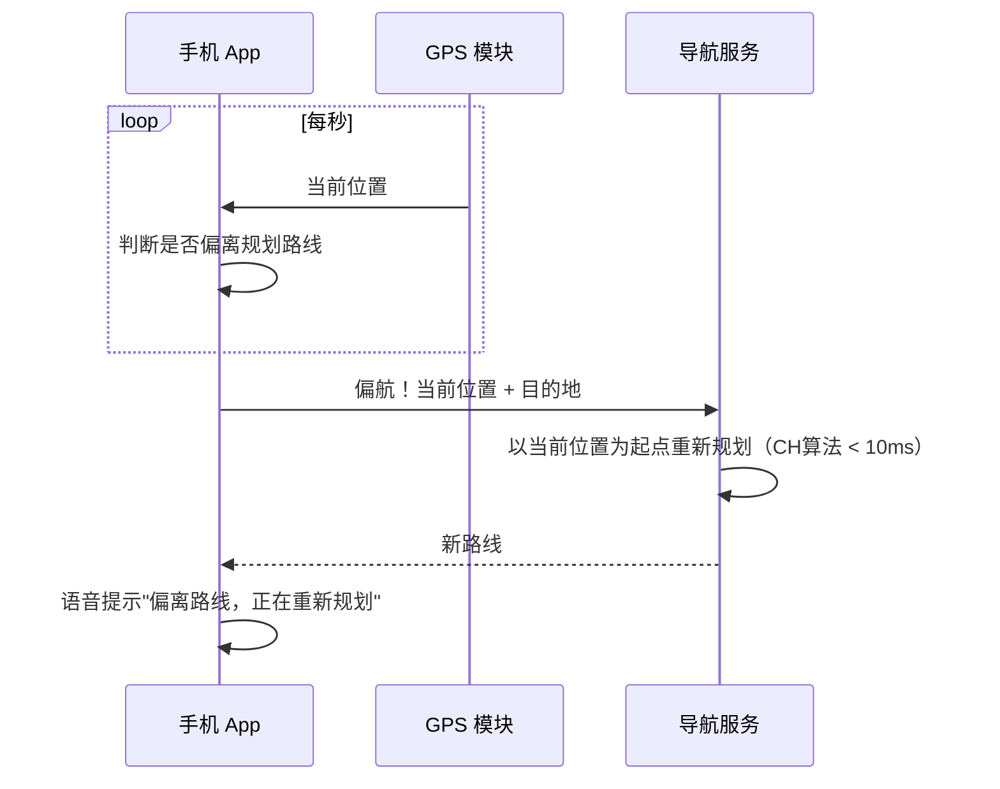

# 系统设计：Google Maps（地图导航）

## TL;DR

Google Maps 的核心是三件事：**地图渲染（瓦片）、路径规划（图算法）、实时交通（流式数据）**。面试重点在路径规划的数据结构和算法选择，以及 ETA 估算如何结合实时路况。

---

## 需求澄清

```
功能需求：
  - 地图展示：滚动、缩放、POI标注
  - 路线规划：驾车/步行/公交，支持多途径点
  - 实时导航：逐步指引，偏航重新规划
  - ETA 预估：到达时间（含实时路况）
  - 路况信息：拥堵、事故、限速

非功能需求：
  - 地图加载 < 200ms（CDN 缓存）
  - 路线规划 < 1s（10亿节点的路网）
  - 实时路况更新延迟 < 30s
  - 地图数据：整个地球道路网络 ~ 数十 TB
  - 日活 10 亿用户，峰值导航 QPS 1000万+
```

---

## 整体架构



---

## 核心设计一：地图瓦片（Map Tiles）



**瓦片请求流程：**

```
用户滑动地图到新区域：
  1. 计算视口内需要哪些 Z/X/Y 瓦片
  2. 优先从本地缓存读（已下载的瓦片）
  3. 缓存未命中 → 请求 CDN
  4. CDN 未命中 → 回源 S3
  5. 预加载周边瓦片（用户可能滑到的方向）

瓦片更新：
  道路变化（新修高速）→ 地图数据管道重新生成受影响的瓦片
  CDN 缓存失效（TTL 或主动 Purge）
  
Tile 格式对比：
  栅格瓦片（PNG/WebP）：兼容所有客户端，文件大
  矢量瓦片（Protobuf）：客户端渲染，文件小10x，支持旋转/动态样式
  Google Maps 现在用矢量瓦片（WebGL 渲染）
```

---

## 核心设计二：路网图数据结构

```mermaid
flowchart LR
    subgraph 道路图（有向图）
        A["A\n(39.9,116.4)"] -->|"100m, 60km/h"| B["B\n(39.91,116.4)"]
        B -->|"200m, 80km/h"| C["C\n(39.91,116.5)"]
        A -->|"150m, 40km/h"| D["D\n(39.9,116.45)"]
        D -->|"80m, 30km/h\n拥堵×2"| B
    end
```

**存储结构（邻接表，内存优化）：**

```
路网规模：
  全球节点数（路口）：约 10 亿
  边数（路段）：约 30 亿
  压缩存储：每个节点 ~50 字节 → 10亿 × 50B = 50GB
  边存储：30亿 × 20字节 = 60GB
  → 单台机器内存不够（约110GB），需分片 + 内存压缩

邻接表（TypeScript 类比）：
  class RoadGraph {
    nodes: Int32Array;     // node_id → offset in edges[]
    edges: EdgeData[];     // [to_node, base_weight_ms, road_type]
    // 动态权重（路况）存 Redis，查询时叠加
  }

道路分层（Hierarchical Graph）：
  小路（Local Road）→ 省道（State Road）→ 高速（Highway）
  长途导航只在高速层搜索，局部用小路细化
  → 减少搜索节点数从 10 亿 → 100 万（加速 1000x）
```

---

## 核心设计三：路径规划算法



**Contraction Hierarchies（CH）— Google Maps 实际使用：**

```
预处理阶段（离线，可接受小时级）：
  1. 给每个节点计算"重要性"（度数高、处于关键路径上的节点重要性高）
  2. 按重要性从低到高"收缩"节点（删除不重要节点，在邻居间加"捷径边"）
  3. 形成多层图：底层=所有道路，高层=只有高速/主干道

查询阶段（在线，< 10ms）：
  双向搜索：从起点向上搜索（越来越重要的节点）
             从终点向上搜索
  在某个"最重要"节点相遇
  展开路径：把捷径边替换为实际道路

效果：
  暴力 Dijkstra：10亿节点 → 数分钟
  CH：< 10ms（快 10万倍）
```

---

## 核心设计四：实时路况



**动态权重叠加：**

```
边权重（行驶时间）= 距离 / 当前实时速度
  路段 A→B：距离 500m，限速 60km/h = 30s
  实时路况：拥堵，实际速度 20km/h → 行驶时间 = 90s（3倍）

ETA 计算：
  ETA = Σ 路径上所有路段的动态行驶时间
      + 信号灯等待时间（历史统计）
      + 转弯延迟（历史统计）
  
  误差来源：
    路况变化（导航途中新增拥堵）
    个人驾驶习惯差异
    → Google Maps 会定期重新计算 ETA
```

---

## 核心设计五：偏航重新规划





---

## 横向对比：路径算法选择

| 算法 | 时间复杂度 | 预处理 | 适用场景 | 使用者 |
|------|-----------|--------|---------|-------|
| Dijkstra | O((V+E)log V) | 无 | 小图 / 精确最短路 | 教学 |
| A* | 比Dijkstra快5-10x | 无 | 中等图，有明确终点 | 游戏寻路 |
| Bidirectional Dijkstra | 约快2x | 无 | 中等图 | 早期地图 |
| Contraction Hierarchies | < 10ms（10亿节点）| 数小时 | 大规模路网 | Google/HERE |
| RAPTOR | 快速公交路径 | 需时刻表 | 公交规划 | Google Maps 公交 |

---

## 面试追问

**Q: 路网图太大（110GB），如何处理？**

① 分层存储：把全球路网按地理区域分片，每个服务器只加载负责区域的图  
② 分层搜索：本地用详细小路，跨区域只用高速/省道层，节点数减少 1000x  
③ 跨区边：区域边界处的节点在两个分片中都存储（少量冗余）

**Q: 实时路况数据更新有延迟（30s），用户正在经过那条路怎么办？**

① 30s 更新间隔对大多数场景够用（拥堵不会在 30s 内消失）  
② 关键路段可以更短间隔（10s）更新  
③ 导航过程中每分钟重新计算 ETA，如果路况变化大，主动提示绕路

**Q: 为什么不用 BFS 找最短路？**

BFS 只适合无权图（每条边代价相同）。道路有长度、限速、红绿灯延迟等权重，需要 Dijkstra/A* 处理加权图。
