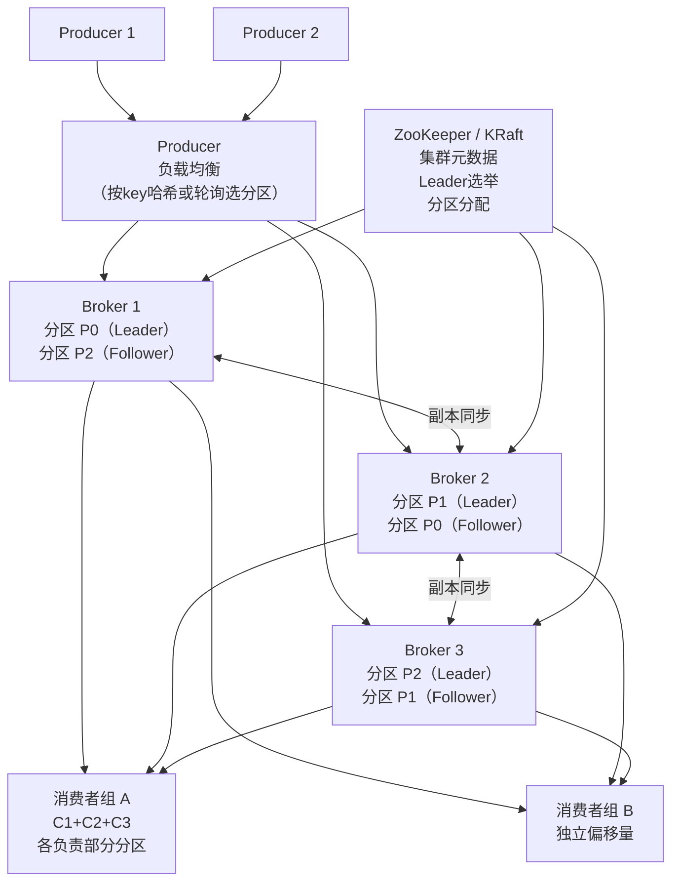
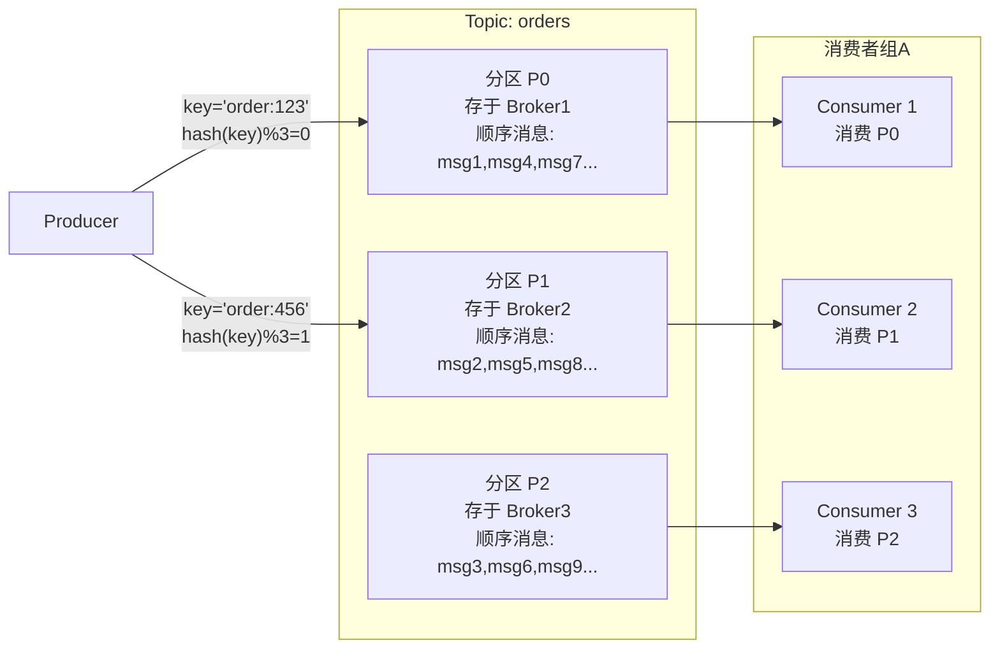
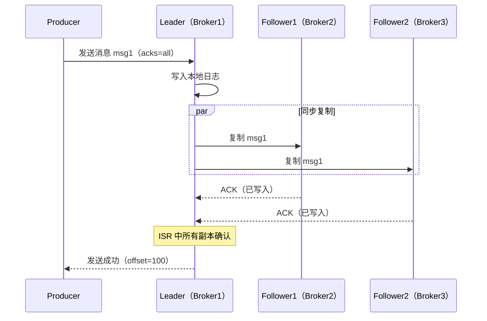
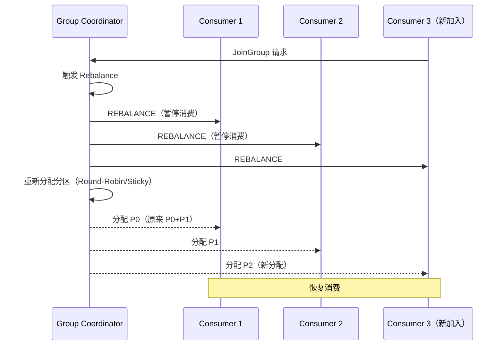
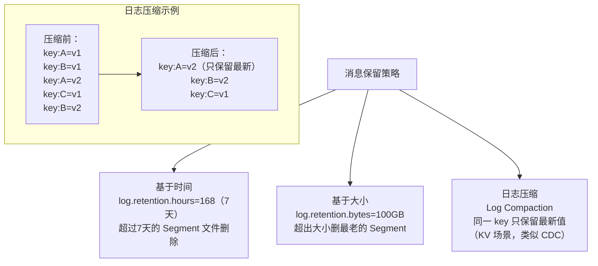

# 系统设计：分布式消息队列（设计 Kafka）

## TL;DR

设计一个类 Kafka 的消息队列，而不是使用 Kafka。核心挑战：**高吞吐顺序写入、消息持久化、消费者组偏移管理、副本一致性**。关键设计：分区 + 顺序写 + 零拷贝 + ISR 副本协议。

---

## 与竞品横向对比

| 特性 | Kafka | RabbitMQ | RocketMQ | SQS | 你设计的 |
|------|-------|---------|---------|-----|---------|
| 模型 | Pub/Sub（拉）| 消息队列（推）| Pub/Sub | 队列 | Pub/Sub（拉）|
| 持久化 | 是（磁盘）| 可选 | 是 | 是（托管）| 是（WAL）|
| 消费语义 | 偏移量，可重放 | ACK删除 | 偏移量 | 至少一次 | 偏移量 |
| 吞吐量 | 极高（百万/s）| 中（万/s）| 高（十万/s）| 托管弹性 | 极高 |
| 消息顺序 | 分区内有序 | 队列内有序 | 分区内有序 | 不保证 | 分区内有序 |
| 延迟 | 毫秒 | 微秒-毫秒 | 毫秒 | 毫秒 | 毫秒 |
| 适用场景 | 流处理/日志 | RPC/任务队列 | 电商/金融 | 云原生 | 通用 |

---

## 需求澄清

```
功能需求：
  - Producer 发布消息到 Topic
  - Consumer 从 Topic 拉取消息
  - 消费者组（Consumer Group）：同一组内每条消息只被一个消费者处理
  - 消息保留：持久化 7 天
  - 消息顺序：同一分区内有序

非功能需求：
  - 吞吐量：写入 100 万条/秒，读取 100 万条/秒
  - 延迟：P99 < 10ms
  - 持久化：不丢消息（WAL）
  - 水平扩展：增加 Broker 线性扩容
  - 高可用：N/2+1 多数派在线时可用
```

---

## 整体架构



---

## 核心设计一：Topic 和分区



**分区规则：**

```
按 key 哈希：partition = hash(key) % num_partitions
  → 同一 key（如同一订单）的消息保证在同一分区，有序
  → 不同 key 均匀分布到不同分区

无 key：轮询分配
  → 最大并行度，但同一业务逻辑的消息可能在不同分区（无序）

分区数选择：
  消费者最大并行度 = min(消费者数, 分区数)
  分区太少：消费者数 > 分区数，部分消费者空闲
  分区太多：Broker 维护开销大（文件句柄、Leader选举）
  经验值：10-100 个分区/Topic
```

---

## 核心设计二：消息存储（Commit Log）

```mermaid
flowchart TD
    subgraph 分区 P0 的存储（磁盘文件）
        Seg0["Segment 0\n00000000000000000000.log\n消息 offset 0~999999"]
        Seg1["Segment 1\n00000000000001000000.log\n消息 offset 1000000~1999999"]
        ActiveSeg["Active Segment\n当前写入段（Append Only）"]
        
        Index0["00000000000000000000.index\n稀疏索引：offset → 文件位置"]
        TimeIndex["timeindex 文件\n时间 → offset（按时间查询用）"]
    end
    
    Write["Producer 写入"] -->|"追加写（顺序IO）"| ActiveSeg
    Read["Consumer 读取\noffset=1500000"] -->|"二分查找Index"| Seg1
```

**为什么顺序写性能极高：**

```
随机写磁盘（HDD）：100 IOPS（0.1万次/秒）
顺序写磁盘（HDD）：300 MB/s（约100万条/秒，每条300字节）
SSD 顺序写：3000 MB/s

Kafka 日志文件 Append Only：
  总是在文件末尾追加，100% 顺序写
  → 磁盘性能接近内存（吞吐量足够）
  → 不需要随机IO，传统磁盘也能达到高吞吐
```

**零拷贝（Zero Copy）：**

```
传统读文件 + 发送网络：
  磁盘 → 内核缓冲区 → 用户空间 → Socket缓冲区 → 网络
  4次数据拷贝，2次上下文切换

Kafka 零拷贝（sendfile 系统调用）：
  磁盘 → 内核缓冲区 → 网络
  2次数据拷贝，0次用户态拷贝
  → 吞吐量提升 2-4x
```

---

## 核心设计三：副本与 ISR



**ISR（In-Sync Replicas）机制：**

```
ISR = 与 Leader 保持同步的 Follower 集合
  判断标准：Follower 落后 Leader 的消息数 < replica.lag.time.max.ms 内

ISR 变化：
  Follower 跟不上 Leader → 从 ISR 中踢出（不影响正常写入）
  Follower 重新追上 → 加回 ISR

acks 参数（Producer 配置）：
  acks=0：不等确认，最高吞吐，可能丢消息
  acks=1：Leader 确认即可，Leader 故障可能丢消息
  acks=all：等 ISR 全部确认，不丢消息，延迟略高
  min.insync.replicas=2：ISR 至少有 2 个副本才接受写入
```

---

## 核心设计四：消费者组和偏移量管理

```mermaid
flowchart TD
    subgraph 消费者组 A（3个消费者，3个分区）
        C1["Consumer 1\nP0: offset=1000"]
        C2["Consumer 2\nP1: offset=800"]
        C3["Consumer 3\nP2: offset=1200"]
    end
    
    subgraph 消费者组 B（独立偏移量）
        D1["Consumer B1\nP0: offset=500（读同样的消息）"]
    end
    
    OffsetStore["__consumer_offsets Topic\n存储所有消费者组的偏移量\n（Kafka 内置特殊 Topic）"]
    
    C1 -->|"提交 offset"| OffsetStore
    C2 -->|"提交 offset"| OffsetStore
    D1 -->|"提交 offset"| OffsetStore
```

**消费者再平衡（Rebalance）：**



---

## 核心设计五：消息保留和清理



---

## 核心设计六：高吞吐写入优化

```
Producer 批量发送（Batching）：
  linger.ms=5：等 5ms，把这段时间的消息批量打包
  batch.size=64KB：或者凑满 64KB
  → 减少网络请求次数：1000条 → 1个请求

消息压缩：
  compression.type=lz4 / zstd
  → 减少网络带宽和磁盘占用（压缩率 3-5x）
  → 解压在 Consumer 端（Broker 透传压缩数据）

内存映射文件（mmap）：
  Kafka Index 文件用 mmap 映射到内存
  → 二分查找 offset 时直接内存操作，无系统调用开销
```

---

## 面试追问

**Q: Kafka 为什么比 RabbitMQ 吞吐量高？**

① **顺序写磁盘**：Kafka Append-only 日志，RabbitMQ 随机写内存+磁盘  
② **零拷贝**：sendfile 避免用户态拷贝  
③ **批量发送**：Producer 批处理，RabbitMQ 逐条 ACK  
④ **Consumer 主动拉取**：不需要 Broker 维护推送状态  
⑤ **分区并行**：天然水平扩展，RabbitMQ 单队列是瓶颈

**Q: 如何保证 Exactly-Once（精确一次）语义？**

Producer 端：幂等 Producer（`enable.idempotence=true`）+ 事务 API  
Consumer 端：消费 + 写 DB 放在同一事务里，失败回滚后重试  
端到端：Kafka Streams 提供 Exactly-Once（内部用事务协调）

**Q: 分区数增加后，有序性如何保证？**

增加分区会导致相同 key 的消息可能路由到不同分区（旧分区 hash(key)%4，新分区 hash(key)%8）。解法：  
① 暂停 Producer，等所有消息消费完，再扩分区  
② 业务层保证幂等，允许重复消费但不允许乱序时，扩分区后手动重分配
