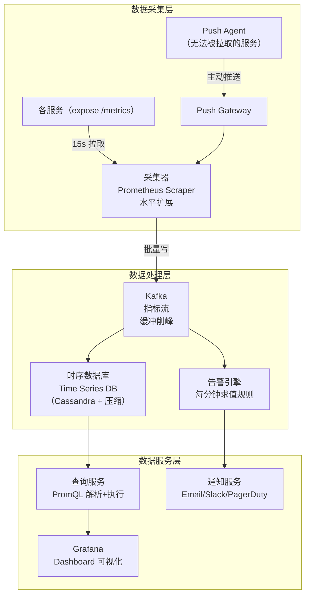
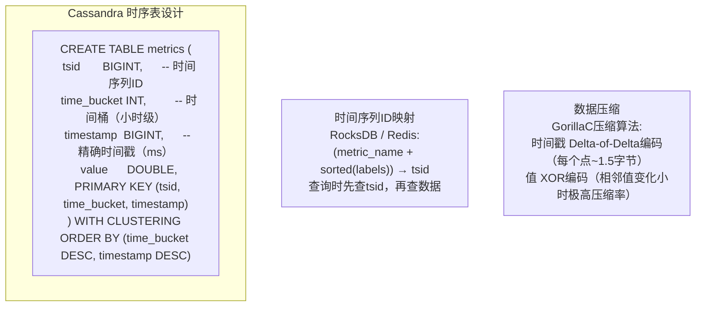
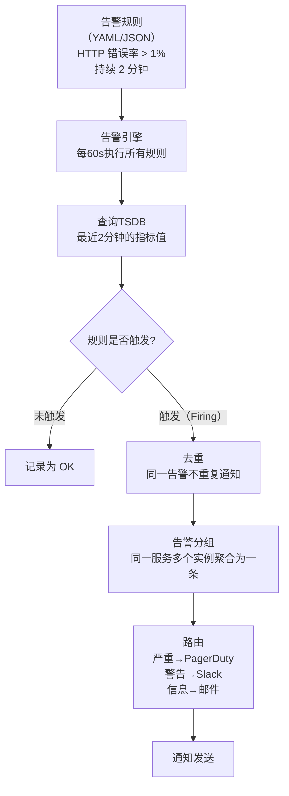
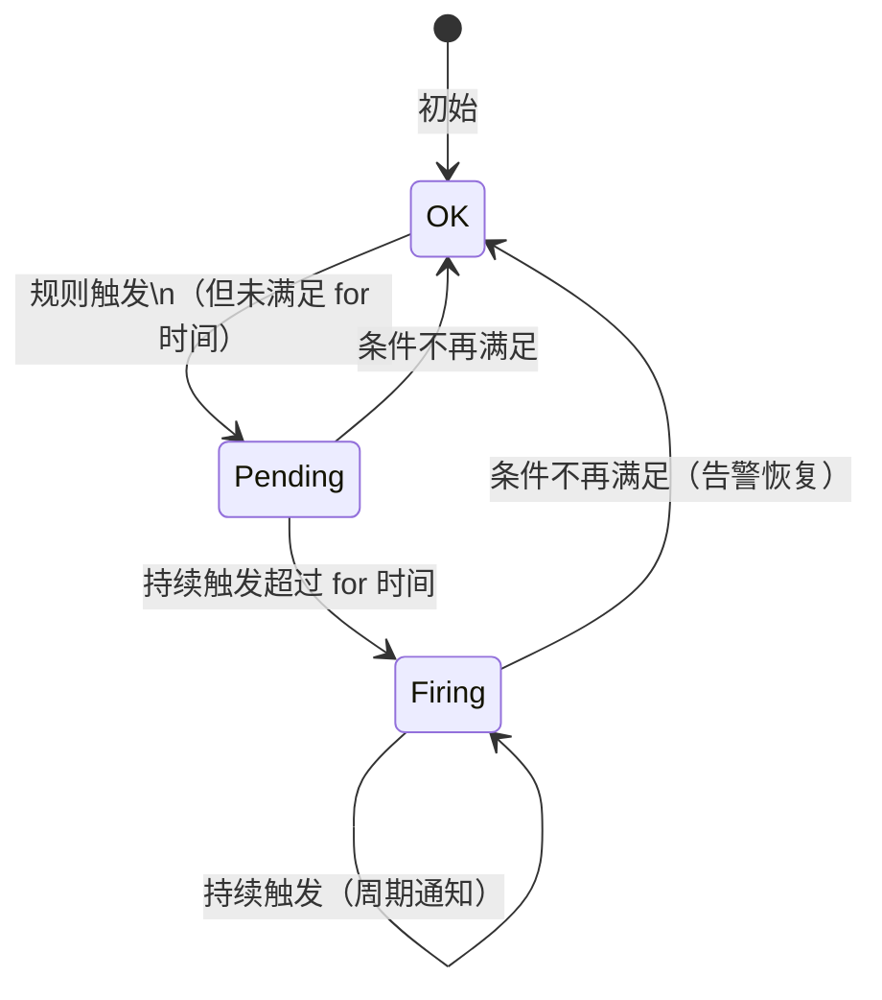
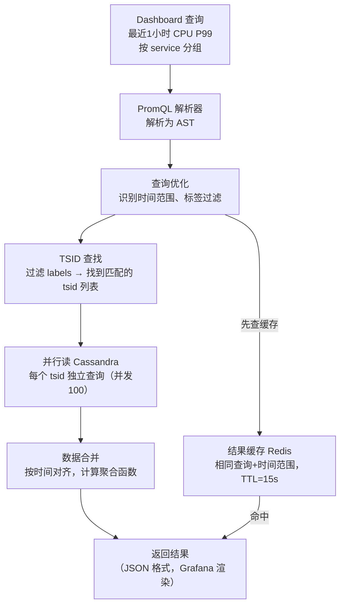

# 系统设计：监控告警系统（Metrics Monitoring & Alerting）

## TL;DR

设计一个类 Prometheus + Alertmanager + Grafana 的监控系统。核心是**时序数据的高效存储和查询**，以及**告警规则引擎的低延迟求值**。拉取模型 vs 推送模型是关键设计决策。

---

## 需求澄清

```
功能需求：
  - 收集指标：CPU、内存、QPS、延迟、错误率等
  - 数据保留：原始数据 7 天，降采样后 1 年
  - 实时告警：指标触发阈值时通知（邮件/Slack/PagerDuty）
  - 可视化：Dashboard 展示时序图
  - 多维度标签：按 region、host、service 过滤

非功能需求：
  - 规模：1000 个服务，每个服务 100 个指标 = 100 万个时间序列
  - 写入：每 15 秒采集一次 → 100万 / 15 = 7万 QPS
  - 查询：Dashboard 每秒约 10 个查询，每查询扫描百万数据点
  - 告警延迟：< 1 分钟（指标异常后 60s 内通知）
```

---

## 与竞品横向对比

| | Prometheus | Datadog | InfluxDB | Graphite | 你设计的 |
|--|---------|---------|---------|---------|---------|
| 收集模式 | 拉取（Pull）| 推送（Push）| 推送 | 推送 | 拉取+推送 |
| 存储 | 本地 TSDB | 托管云 | 本地/云 | Whisper | 分布式 TSDB |
| 查询语言 | PromQL | DQL | Flux/InfluxQL | Graphite | 类 PromQL |
| 告警 | Alertmanager | 内置 | 内置 | 外部 | 内置 |
| 长期存储 | 需 Thanos | 内置 | 内置 | 内置 | Cassandra |
| 适用规模 | 中（单集群）| 大 | 大 | 中 | 大 |

---

## 整体架构



---

## 核心设计一：数据模型（时序数据）

```
指标（Metric）= 指标名 + 标签集（Key-Value）+ 时间戳 + 值

示例：
  http_requests_total{service="order", region="us-east", status="200"} 1024 1700000000
  http_requests_total{service="order", region="us-east", status="500"} 12   1700000000
  cpu_usage_percent{host="server-1", datacenter="us-east"}             75.3  1700000000

数据点格式：
  (metric_name + labels) → 时间序列 ID（TSID）
  TSID + timestamp → value

规模：
  100万个时间序列 × 每15s一个点 × 7天
  = 100万 × 4条/分钟 × 60 × 24 × 7
  ≈ 40亿个数据点
  压缩后约 40GB（每点 10 字节，原始 8 字节 value + 8 字节 timestamp = 16字节，压缩率60%）
```

---

## 核心设计二：Pull vs Push 模型

```mermaid
flowchart LR
    subgraph 拉取模型 Pull（Prometheus 默认）
        Scraper["采集器"] -->|"HTTP GET /metrics"| SvcA["服务A"]
        Scraper -->|"HTTP GET /metrics"| SvcB["服务B"]
        Note1["✅ 控制权在采集器\n✅ 服务端无需知道采集器地址\n❌ 短暂任务可能被遗漏\n❌ 大规模需要服务发现（Consul/K8s）"]
    end
    
    subgraph 推送模型 Push（StatsD/Datadog）
        SvcC["服务C"] -->|"UDP/HTTP 推"| Aggregator["聚合器"]
        SvcD["服务D"] -->|"推"| Aggregator
        Note2["✅ 适合短暂任务（Lambda/批处理）\n✅ 防火墙内网更容易\n❌ 服务需知道收集器地址\n❌ 采集器可能成为单点"]
    end
```

**推荐方案：拉取为主 + 推送补充**

```
长期运行的服务（Web Server、DB）→ Pull（服务暴露 /metrics 端点）
短暂任务（Cron Job、Lambda）→ Push 到 Pushgateway，再被 Pull
批量指标（Log-based metrics）→ Push 到 Kafka，流处理提取
```

---

## 核心设计三：时序数据库存储



**降采样（Downsampling）减少长期存储：**

```
原始数据（15s 间隔）→ 保留 7 天
1 分钟聚合（MAX/MIN/AVG/P99）→ 保留 30 天
5 分钟聚合 → 保留 90 天
1 小时聚合 → 保留 1 年

效果：
  原始：40亿点 × 7天 = 280亿点
  1年聚合数据：100万序列 × 8760小时 = 87亿点
  → 长期存储只需要原始数据的 30%
```

---

## 核心设计四：告警引擎



**告警规则示例：**

```yaml
groups:
  - name: http_alerts
    interval: 60s
    rules:
      - alert: HighErrorRate
        expr: |
          sum(rate(http_requests_total{status=~"5.."}[5m]))
          /
          sum(rate(http_requests_total[5m])) > 0.01
        for: 2m          # 持续触发2分钟才告警（避免瞬间抖动）
        labels:
          severity: critical
        annotations:
          summary: "HTTP 错误率超过 1%"
          
      - alert: HighLatency
        expr: histogram_quantile(0.99, http_request_duration_seconds) > 0.5
        for: 5m
        labels:
          severity: warning
```

**告警状态机：**



---

## 核心设计五：查询优化



---

## 面试追问

**Q: 100万个时间序列，如何快速查找匹配标签的序列？**

倒排索引：`label_value → Set{tsid}`  
例：`region="us-east" → {tsid1, tsid3, tsid8, ...}`  
多个标签求交集：`region="us-east" AND service="order" → tsid 的交集`  
用 BitMap 做集合交集，Roaring Bitmap 效率极高

**Q: 告警系统如何避免告警风暴（一次性触发 1000 条告警）？**

① **分组（Grouping）**：同一服务的多个实例合并成一条告警  
② **抑制（Inhibition）**：严重告警触发时，压制同一服务的警告级告警  
③ **沉默（Silencing）**：维护窗口期间静默所有告警  
④ **速率限制**：每个渠道（如 PagerDuty）每分钟最多发 N 条通知

**Q: 如果 Cassandra 查询慢，如何优化？**

① 降采样：Dashboard 默认查 1 分钟聚合数据，而不是 15 秒原始数据，数据量减少 4 倍  
② 分区设计：time_bucket 按小时分桶，避免单分区过热  
③ 读缓存：Redis 缓存最近 5 分钟热点指标的查询结果  
④ 读副本：多副本提高读吞吐量
