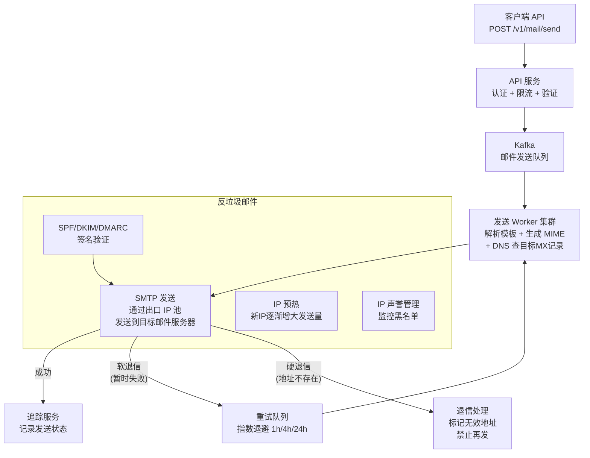
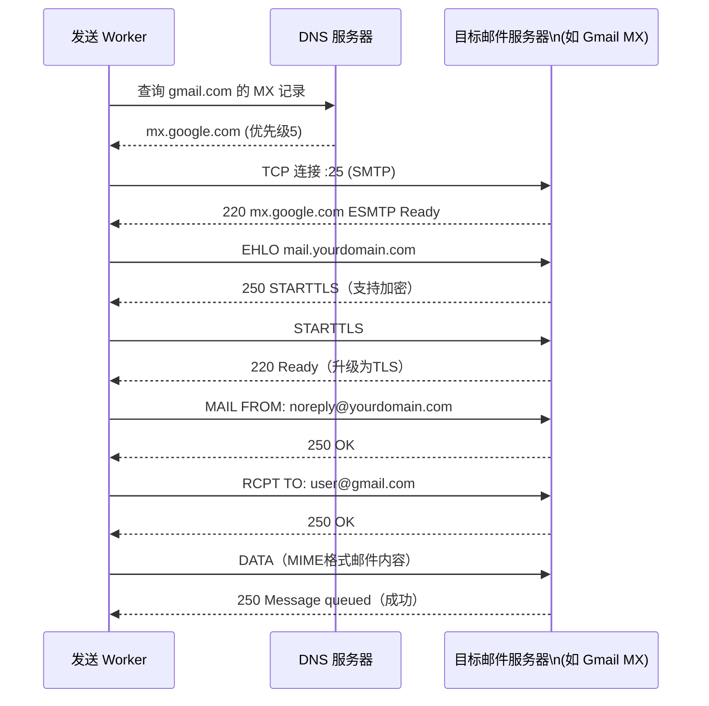
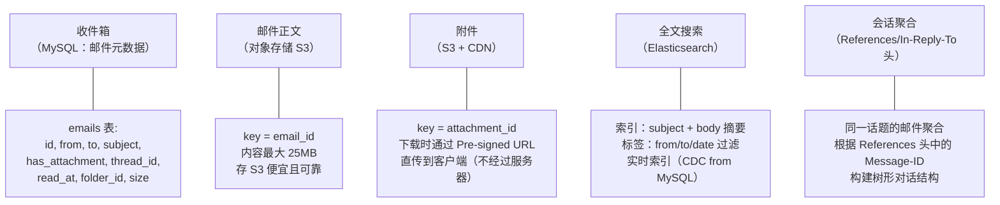
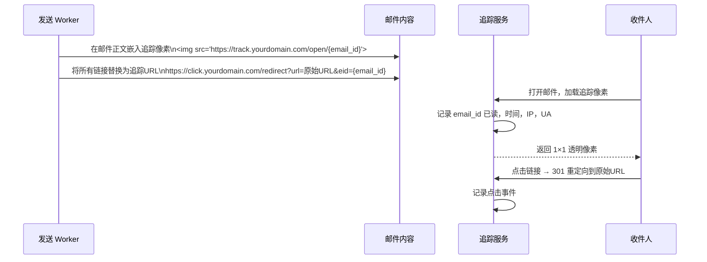
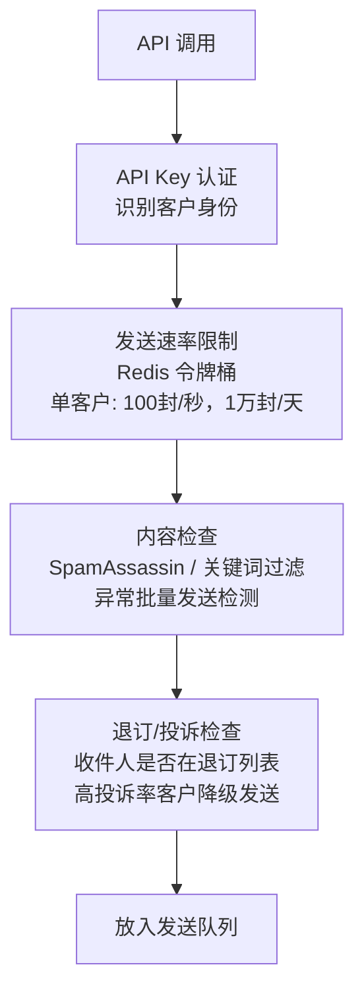

# 系统设计：分布式邮件服务（Distributed Email Service）

## TL;DR

设计一个类 Gmail 的邮件系统，或类 SendGrid 的邮件投递服务。核心挑战：**大规模接收存储、高可靠投递（防垃圾、防退信）、SMTP 协议处理**。

---

## 需求澄清（选择其一）

```
场景一：邮件客户端（类 Gmail）
  - 发送 / 接收 / 读取邮件
  - 附件支持（最大 25MB）
  - 搜索邮件（全文检索）
  - 垃圾邮件过滤
  - DAU 10 亿，每人每天 50 封邮件

场景二：邮件投递服务（类 SendGrid）
  - 接受 API 调用发送邮件（事务邮件：验证码、通知、账单）
  - 高投递率（进入收件箱，而非垃圾箱）
  - 退信处理（无效地址）
  - 发送状态追踪（已发送/已投递/已打开）
```

下面以**场景二（邮件投递服务）为主**，兼顾场景一的存储设计。

---

## 与竞品横向对比

| | SendGrid | Mailgun | Amazon SES | 自建 | 
|--|---------|---------|-----------|------|
| 到达率 | 高 | 高 | 中（需配置）| 取决于 IP 声誉 |
| 价格 | 高 | 中 | 低 | 运维成本高 |
| 灵活性 | 中 | 中 | 中 | 完全可控 |
| 退信处理 | 自动 | 自动 | 需配置 | 需自建 |
| 适用场景 | SaaS | 中小企业 | AWS 用户 | 大型公司 |

---

## 整体架构（邮件投递服务）



---

## 核心设计一：SMTP 发送流程



**退信（Bounce）处理：**

```
软退信（4xx 错误，暂时失败）：
  421 Service temporarily unavailable → 重试（1小时后）
  452 Too many connections → 退避后重试（4小时后）

硬退信（5xx 错误，永久失败）：
  550 User does not exist → 硬退信，标记地址无效
  553 Invalid address → 永久拒绝

处理策略：
  硬退信 → 加入黑名单（Suppression List）
  下次再发到同一地址 → 直接拦截，不尝试发送
  告知客户端该地址无效（API 回调）
```

---

## 核心设计二：高投递率（防进垃圾箱）

```mermaid
flowchart TD
    subgraph 发送方认证（让接收方信任你）
        SPF["SPF 记录\nDNS TXT: v=spf1 include:mail.yourdomain.com -all\n声明哪些IP可以代表你发邮件"] 
        DKIM["DKIM 签名\n私钥签名邮件头\n接收方用DNS公钥验证"]
        DMARC["DMARC 策略\nv=DMARC1; p=quarantine;\n未通过SPF/DKIM的邮件放垃圾箱或拒绝"]
        SPF & DKIM --> DMARC
    end
    
    subgraph IP 声誉管理
        Pool["IP 池\n多个出口IP\n按客户声誉分级"]
        Warm["IP 预热\n新IP从每天100封开始\n逐步增加到百万/天"]
        Monitor["监控黑名单\nSpamhaus/Barracuda\n自动检测IP是否被列黑名单"]
    end
    
    subgraph 内容优化
        Text["纯文本版本\n除了HTML还要有纯文本\nHTML:TEXT = 60:40"]
        Unsub["退订链接\n必须有，且要能用\n(法律要求+声誉)"]
        Ratio["图文比例\n避免图片过多，文字过少\n（垃圾邮件特征）"]
    end
```

**DKIM 签名流程：**

```
发送前：
  1. 取邮件头 + 邮件体的哈希
  2. 用私钥签名（RSA-2048 / Ed25519）
  3. 签名添加到 DKIM-Signature 头

接收方验证：
  1. 从 DNS 查 selector._domainkey.yourdomain.com → 公钥
  2. 用公钥验证签名
  3. 重新计算邮件哈希，对比签名
  → 确认邮件未被篡改，且确实来自声称的域名
```

---

## 核心设计三：邮件存储（场景一 Gmail）



**会话（Thread）识别：**

```
邮件头：
  Message-ID: <unique-id@sender.com>
  References: <prev-id@sender.com> <prev-prev-id@sender.com>
  In-Reply-To: <prev-id@sender.com>

服务器逻辑：
  新邮件到达 → 检查 References 中是否有已知 Message-ID
  有 → 加入同一 thread_id
  无 → 创建新 thread
```

---

## 核心设计四：发送状态追踪（Open Tracking）



---

## 核心设计五：限流与防滥用



---

## 面试追问

**Q: 发送 1 亿封邮件需要多少时间？**

单 SMTP 连接约 10 封/秒（含 DNS + TCP + SMTP 握手）  
100 个发送 Worker × 10 封/秒 = 1000 封/秒  
1 亿封 / 1000 = 100000 秒 ≈ 28 小时  
优化：连接复用（同一目标服务器复用 TCP）、IP 池扩充、并行分批

**Q: 如果被 Gmail 列入黑名单怎么办？**

① 立即停止用该 IP 向 Gmail 发送  
② 向 Gmail 的 Postmaster Tools 申诉，提交发送合规证明  
③ 用新 IP 继续发送，慢慢预热新 IP  
④ 长期：监控用户投诉率（< 0.1%），清理无效地址

**Q: 如何防止客户用你的服务发垃圾邮件？**

① 注册审核（企业验证，不允许个人随意注册）  
② 发送量限额（新客户从低配额开始，逐步提升）  
③ 实时监控投诉率和退订率（超过阈值自动暂停）  
④ 内容扫描（检测已知垃圾邮件特征）  
⑤ 域名/IP 黑名单检查（发送前验证收件人域名）
