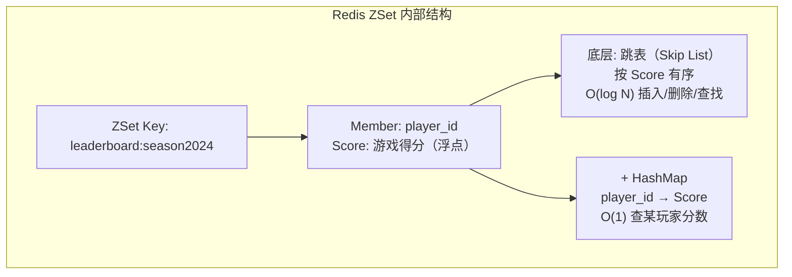
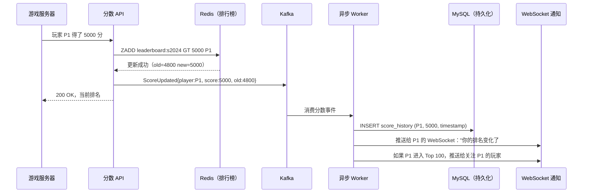
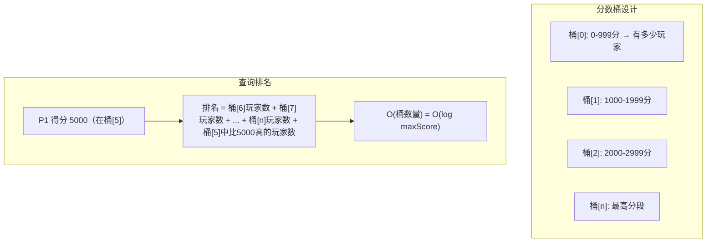
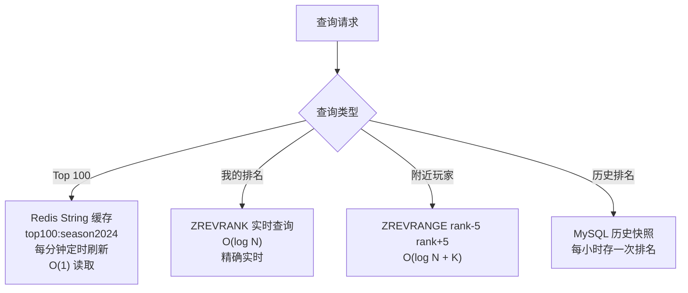

# 系统设计：实时游戏排行榜（Real-time Gaming Leaderboard）

## TL;DR

排行榜的核心数据结构是 **Redis Sorted Set（ZSet）**，支持 O(log N) 分数更新和排名查询。挑战在于：**亿级玩家的全局排名**（ZSet 不能无限扩展）和**实时分数变更的高频写入**。

---

## 需求澄清

```
功能需求：
  - 玩家得分后实时更新排名
  - 查看全球 Top 100
  - 查看自己的排名和附近玩家（上下 N 名）
  - 按赛季/游戏模式分榜
  - 历史排名记录

非功能需求：
  - 玩家总数：1 亿（MAU）
  - 同时在线：1000 万（DAU）
  - 分数更新：10 万 QPS（激烈游戏场景）
  - 排名查询：50 万 QPS（排行榜页面高流量）
  - 延迟：排名更新 < 500ms 可见
  - 数据量：1 亿玩家 × 每个排行榜（当前赛季）
```

---

## 与其他排名方案横向对比

| 方案 | 更新复杂度 | 排名查询 | 优点 | 缺点 |
|------|----------|---------|------|------|
| Redis ZSet | O(log N) | O(log N) | 原生支持排名、实时 | 内存贵，单 ZSet 上限 |
| MySQL ORDER BY | O(N log N) | O(N) 全表扫 | 持久化，熟悉 | 太慢，高频写性能差 |
| MySQL + 排名列 | O(1)更新 | O(1) | 快 | 排名列维护复杂，并发问题 |
| 分段计数（Segment）| O(log N) | O(log N) | 超大规模可用 | 实现复杂 |
| **Redis ZSet（推荐）**| **O(log N)** | **O(log N)** | 简单高效，原生支持 | 内存限制 |

---

## 核心设计一：Redis ZSet 基础实现



**核心命令（TypeScript 客户端示例）：**

```typescript
import { Redis } from 'ioredis';
const redis = new Redis();

const BOARD = 'leaderboard:season2024';

// 更新分数（ZADD with GT：只更新更高分）
async function updateScore(playerId: string, newScore: number): Promise<void> {
  // GT 选项：只有 newScore > 当前分时才更新（防止低分覆盖高分）
  await redis.zadd(BOARD, 'GT', newScore, playerId);
}

// 获取玩家排名（0-based，加1变为1-based）
async function getRank(playerId: string): Promise<number | null> {
  const rank = await redis.zrevrank(BOARD, playerId); // ZREVRANK：分高排前
  return rank !== null ? rank + 1 : null;
}

// 获取玩家分数
async function getScore(playerId: string): Promise<number | null> {
  const score = await redis.zscore(BOARD, playerId);
  return score !== null ? parseFloat(score) : null;
}

// 获取 Top K 玩家（含分数）
async function getTopK(k: number): Promise<Array<{player: string, score: number}>> {
  const results = await redis.zrevrange(BOARD, 0, k - 1, 'WITHSCORES');
  const topK = [];
  for (let i = 0; i < results.length; i += 2) {
    topK.push({ player: results[i], score: parseFloat(results[i + 1]) });
  }
  return topK;
}

// 查看某玩家附近的排名（上下各5名）
async function getSurroundingPlayers(
  playerId: string,
  range: number = 5
): Promise<Array<{player: string, score: number, rank: number}>> {
  const rank = await redis.zrevrank(BOARD, playerId);
  if (rank === null) return [];
  
  const start = Math.max(0, rank - range);
  const end   = rank + range;
  
  const results = await redis.zrevrange(BOARD, start, end, 'WITHSCORES');
  const players = [];
  for (let i = 0; i < results.length; i += 2) {
    players.push({
      player: results[i],
      score:  parseFloat(results[i + 1]),
      rank:   start + Math.floor(i / 2) + 1,
    });
  }
  return players;
}
```

---

## 核心设计二：完整数据流



---

## 核心设计三：亿级玩家的扩展方案

**问题：1 亿玩家的 ZSet 在单节点 Redis 需要多少内存？**

```
每个 ZSet member：
  player_id（字符串）：约 20 字节
  score（double）：8 字节
  ZSet 内部指针：约 32 字节
  合计：约 60 字节/玩家

1 亿玩家：1亿 × 60字节 = 6GB
→ 单节点 16GB Redis 可以放下，但接近极限

10 亿玩家（全球游戏）：60GB → 需要分片
```

**方案一：分片 ZSet（Sharded Leaderboard）**

```mermaid
flowchart TD
    Player["玩家 P1\n得分 5000"] --> Hash["hash(player_id) % 10\n= 分片 3"]
    Hash --> Shard3["Redis Shard 3\nZSet: leaderboard:shard3\n存 1000万玩家"]
    
    subgraph 查询 Top 100（需汇总）
        Q["查 Top 100"] --> AllShards["查所有 10 个分片的 Top 100"]
        AllShards --> Merge["汇总 1000 个候选\n重新排序，取真正的 Top 100"]
    end
    
    Problem["缺点：\n查询 Top 100 需要合并所有分片\n延迟高，实现复杂"]
```

**方案二：分段计数（Segment/Bucket 法，推荐大规模）**



**实际推荐：二级结构**

```
小规模（< 1000 万玩家）：单个 ZSet，简单可靠
中规模（1000 万 ~ 1 亿）：ZSet 按赛季/区服分割，每个 ZSet < 1000 万
超大规模（> 1 亿）：分片 ZSet + 定时任务每分钟计算 Top 100 快照
  → Top 100 查询走缓存（Redis String），每分钟更新一次
  → 个人排名查询走分片 ZSet，实时计算
```

---

## 核心设计四：排名查询优化



**Top 100 缓存刷新：**

```typescript
// 定时任务：每分钟刷新 Top 100 缓存
async function refreshTop100Cache(): Promise<void> {
  const top100 = await redis.zrevrange(BOARD, 0, 99, 'WITHSCORES');
  const enriched = await enrichWithPlayerInfo(top100); // 并行查玩家信息
  
  await redis.setex(
    'top100:season2024',
    60, // 60秒后过期
    JSON.stringify(enriched)
  );
}

// 读取时直接从缓存取（O(1)）
async function getTop100(): Promise<LeaderboardEntry[]> {
  const cached = await redis.get('top100:season2024');
  if (cached) return JSON.parse(cached);
  // 缓存未命中（极少情况）
  return refreshTop100Cache();
}
```

---

## 核心设计五：多维度排行榜

```
赛季榜：leaderboard:season:2024-Q1
区服榜：leaderboard:region:asia-east
好友榜：leaderboard:friend:{user_id}（动态，用户好友列表构成）
周榜：  leaderboard:weekly:2024-W01（每周日凌晨归档，新周清空）

好友榜实现（每个用户一个小 ZSet）：
  用户有 200 个好友 → ZSet 只有 200 个 member
  好友得分 → 同时写到该用户的好友 ZSet
  问题：用户有 200 个好友，每次得分要更新 200 个 ZSet → Fanout 问题
  
  解决（同 News Feed 推拉结合）：
    好友数 < 1000：推模式（实时更新好友 ZSet）
    好友数 > 1000（主播/KOL）：拉模式（查时实时合并）
```

---

## 面试追问

**Q: 如果玩家作弊，分数异常高，如何处理？**

① 服务端验证：分数在服务器计算，不信任客户端上报（防篡改）  
② 异常检测：分数在极短时间内暴增 → 标记待审  
③ 排行榜审核：Top 100 有人工审核流程，申诉机制  
④ 防刷分：每局游戏分数有上限，上限超出自动拒绝

**Q: 赛季结束时如何归档？**

① 归档：将 ZSet 快照写入 MySQL（season_scores 表），记录最终排名  
② 颁奖：Kafka 事件驱动，异步给 Top 玩家发放奖励  
③ 清空：DELETE 或 RENAME ZSet，开始新赛季  
④ 永久记录：玩家历史最高排名可查

**Q: 如何处理相同分数时的排名？**

Redis ZSet 相同分数时按 member 字典序排名（不公平）。  
解决：分数 = 游戏得分 × 10^10 + (MAX_TIME - 达到该分数的时间戳)  
→ 分数相同时，先达到的玩家排名更高（时间优先）
