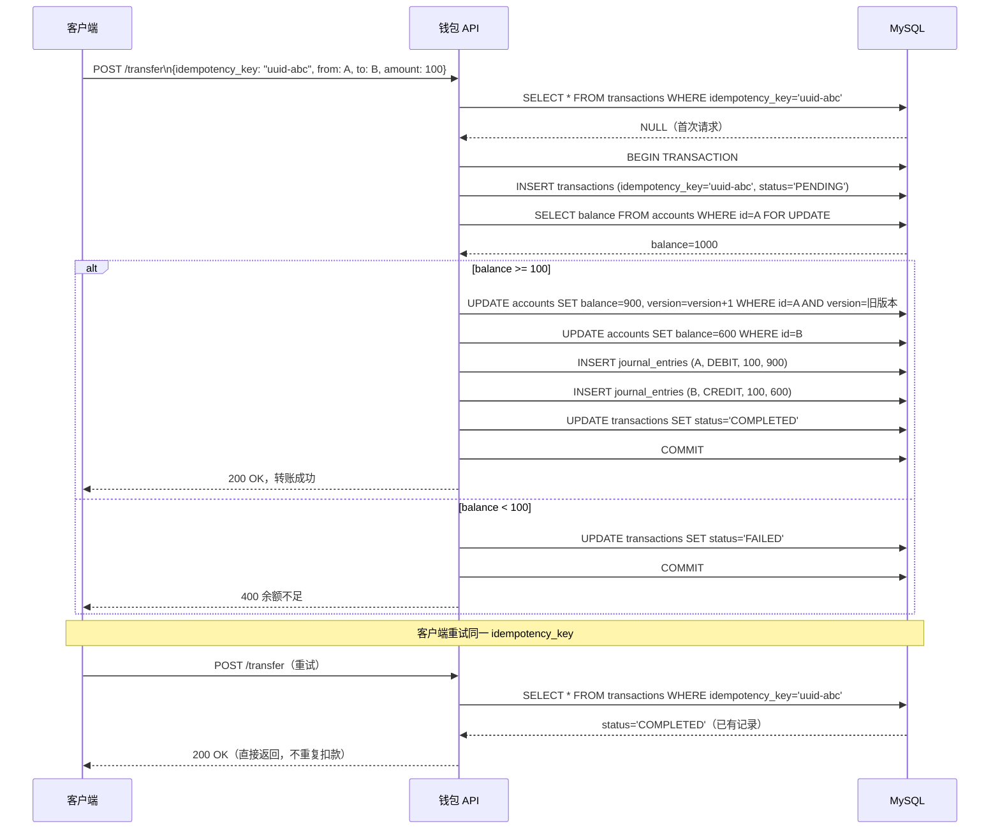
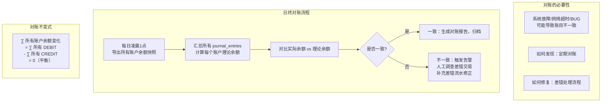
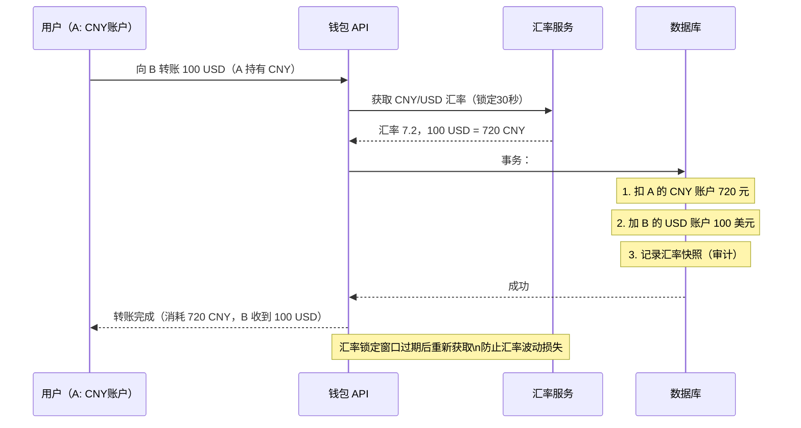

# 系统设计：数字钱包（Digital Wallet）

## TL;DR

数字钱包的核心挑战是**资金安全**：每一笔转账必须满足**原子性（不能部分成功）**、**幂等性（同一操作不能执行两次）**和**一致性（总账不能多也不能少）**。底层设计使用**复式记账（Double-Entry Bookkeeping）**，这是会计学已经验证了几百年的方法。

---

## 需求澄清

```
功能需求：
  - 用户开户、充值（银行转入）
  - 用户间转账（A → B）
  - 提现（钱包转出到银行）
  - 查询余额和交易历史
  - 支持多币种（CNY/USD/EUR）

非功能需求：
  - 正确性：不能多钱/少钱，不能重复扣款
  - 原子性：转账要么全成功，要么全失败
  - 持久性：交易记录永不丢失
  - 规模：1亿用户，10 万 TPS 转账高峰
  - 延迟：< 500ms（同步确认）
  - 合规：每笔交易可审计，可追溯
```

---

## 与竞品横向对比

| | 支付宝/微信支付 | PayPal | Stripe | Venmo |
|--|--------------|--------|--------|-------|
| 主要场景 | 消费 + P2P | 国际电商 | 开发者收款 | P2P 社交 |
| 记账模型 | 复式记账 | 复式记账 | 复式记账 | 复式记账 |
| 跨行转账 | 网联/银联清算 | 银行 ACH | 银行 ACH | 银行 ACH |
| 实时性 | 实时（秒级）| T+1 日 | T+1~2 日 | 实时/T+1 |
| 适用地区 | 中国 | 全球 | 全球 | 美国 |

**共同点：都用复式记账，这是不可绕过的设计原则**

---

## 核心设计一：复式记账（Double-Entry Bookkeeping）

```mermaid
flowchart LR
    subgraph 转账：A 向 B 转账 100 元
        TxnA["账户 A\nDEBIT（借出）100\n余额: 1000 → 900"]
        TxnB["账户 B\nCREDIT（收入）100\n余额: 500 → 600"]
        TxnA -->|"同一事务"| TxnB
    end
    
    subgraph 复式记账不变式
        Rule["所有 DEBIT 之和 = 所有 CREDIT 之和\n任何时刻总账平衡\n如不平衡 → 系统 BUG"]
    end
```

**数据库 Schema：**

```sql
-- 账户表
CREATE TABLE accounts (
  account_id  BIGINT PRIMARY KEY,
  user_id     BIGINT NOT NULL,
  currency    CHAR(3) NOT NULL,       -- CNY / USD
  balance     DECIMAL(19,4) NOT NULL, -- 不用 FLOAT！精度问题
  version     BIGINT NOT NULL DEFAULT 0, -- 乐观锁
  created_at  TIMESTAMP NOT NULL
);

-- 交易流水表（复式记账核心）
CREATE TABLE journal_entries (
  entry_id     BIGINT PRIMARY KEY AUTO_INCREMENT,
  txn_id       CHAR(36) NOT NULL,     -- 事务ID（幂等键）
  account_id   BIGINT NOT NULL,
  entry_type   ENUM('DEBIT','CREDIT') NOT NULL,
  amount       DECIMAL(19,4) NOT NULL,
  balance_after DECIMAL(19,4) NOT NULL,
  description  VARCHAR(255),
  created_at   TIMESTAMP NOT NULL,
  INDEX idx_txn_id (txn_id),
  INDEX idx_account_created (account_id, created_at)
);

-- 转账事务表（幂等控制）
CREATE TABLE transactions (
  txn_id        CHAR(36) PRIMARY KEY,  -- 客户端生成的 UUID
  idempotency_key VARCHAR(128) UNIQUE NOT NULL,
  from_account  BIGINT NOT NULL,
  to_account    BIGINT NOT NULL,
  amount        DECIMAL(19,4) NOT NULL,
  currency      CHAR(3) NOT NULL,
  status        ENUM('PENDING','COMPLETED','FAILED') NOT NULL,
  created_at    TIMESTAMP NOT NULL,
  completed_at  TIMESTAMP
);
```

---

## 核心设计二：幂等转账实现



**TypeScript 实现：**

```typescript
interface TransferRequest {
  idempotencyKey: string;
  fromAccountId:  bigint;
  toAccountId:    bigint;
  amount:         string; // 字符串避免浮点问题，如 "100.00"
  currency:       string;
}

async function transfer(req: TransferRequest, db: DatabaseClient): Promise<TransferResult> {
  // 幂等检查
  const existing = await db.query(
    'SELECT * FROM transactions WHERE idempotency_key = ?',
    [req.idempotencyKey]
  );
  if (existing) return { status: existing.status, txnId: existing.txn_id };

  const txnId = generateUUID();
  
  await db.transaction(async (tx) => {
    // 插入 PENDING 记录（唯一键约束防并发重复）
    await tx.execute(
      'INSERT INTO transactions (txn_id, idempotency_key, from_account, to_account, amount, currency, status) VALUES (?,?,?,?,?,?,?)',
      [txnId, req.idempotencyKey, req.fromAccountId, req.toAccountId, req.amount, req.currency, 'PENDING']
    );

    // 锁定源账户（FOR UPDATE 悲观锁）
    const [fromAcc] = await tx.query(
      'SELECT balance, version FROM accounts WHERE account_id = ? FOR UPDATE',
      [req.fromAccountId]
    );
    
    const amount = new Decimal(req.amount);
    if (new Decimal(fromAcc.balance).lessThan(amount)) {
      await tx.execute(
        'UPDATE transactions SET status=? WHERE txn_id=?', ['FAILED', txnId]
      );
      throw new InsufficientFundsError();
    }

    const newFromBalance = new Decimal(fromAcc.balance).minus(amount).toString();
    
    // 乐观锁更新（WHERE version=旧版本，防止并发）
    const result = await tx.execute(
      'UPDATE accounts SET balance=?, version=version+1 WHERE account_id=? AND version=?',
      [newFromBalance, req.fromAccountId, fromAcc.version]
    );
    if (result.affectedRows === 0) throw new ConcurrentModificationError();

    // 更新目标账户（锁定再更新）
    const [toAcc] = await tx.query(
      'SELECT balance FROM accounts WHERE account_id = ? FOR UPDATE', [req.toAccountId]
    );
    const newToBalance = new Decimal(toAcc.balance).plus(amount).toString();
    await tx.execute(
      'UPDATE accounts SET balance=? WHERE account_id=?', [newToBalance, req.toAccountId]
    );

    // 写入流水
    await tx.execute(
      'INSERT INTO journal_entries (txn_id, account_id, entry_type, amount, balance_after) VALUES (?,?,?,?,?),(?,?,?,?,?)',
      [txnId, req.fromAccountId, 'DEBIT',  req.amount, newFromBalance,
       txnId, req.toAccountId,   'CREDIT', req.amount, newToBalance]
    );

    await tx.execute(
      'UPDATE transactions SET status=?, completed_at=NOW() WHERE txn_id=?',
      ['COMPLETED', txnId]
    );
  });

  return { status: 'COMPLETED', txnId };
}
```

---

## 核心设计三：分布式余额一致性

```mermaid
flowchart TD
    subgraph 问题：大规模分库分表后的跨分片转账
        UserA["用户A\n分片1（MySQL实例1）"] -->|"转账"| UserB["用户B\n分片2（MySQL实例2）"]
        Problem["无法用单个 DB 事务\n跨两个 MySQL 实例!"]
    end
    
    subgraph 方案一：本地消息表（推荐）
        Step1["1. 本地事务：扣A余额 + 写本地消息表（同一实例）"]
        Step2["2. 定时任务：扫描消息表，发 Kafka 消息"]
        Step3["3. 消费者：收到消息，给B加余额（幂等）"]
        Step4["4. 成功后：更新消息表为已完成"]
        Step1 --> Step2 --> Step3 --> Step4
    end
    
    subgraph 方案二：Saga（补偿事务）
        S1["步骤1: 扣A余额"] 
        S2["步骤2: 加B余额"]
        S1 -->|"成功"| S2
        S1 -->|"失败"| Rollback1["无需补偿（未发生）"]
        S2 -->|"失败"| Compensate["补偿: 退还A余额\n（加回A）"]
    end
```

**本地消息表实现（推荐用于分布式转账）：**

```sql
-- 本地消息表（与转账在同一DB实例）
CREATE TABLE outbox_messages (
  msg_id      BIGINT PRIMARY KEY AUTO_INCREMENT,
  topic       VARCHAR(100) NOT NULL,
  payload     JSON NOT NULL,
  status      ENUM('PENDING', 'SENT') DEFAULT 'PENDING',
  created_at  TIMESTAMP NOT NULL,
  sent_at     TIMESTAMP
);

-- 转账操作（单一 DB 事务）：
-- 1. 扣除 A 的余额
-- 2. 向 outbox_messages 插入一条 "给B加余额" 的消息
-- COMMIT（原子性保证：要么都成功，要么都失败）

-- 后台轮询任务（每秒）：
-- SELECT * FROM outbox_messages WHERE status='PENDING' LIMIT 100
-- 发送到 Kafka → 消费者给 B 加余额（幂等，用 msg_id 做幂等键）
-- UPDATE outbox_messages SET status='SENT' WHERE msg_id=?
```

---

## 核心设计四：对账（Reconciliation）



---

## 核心设计五：跨币种转账与汇率



---

## 面试追问

**Q: 余额用什么数据类型存？**

绝对不能用 `FLOAT` 或 `DOUBLE`（浮点精度问题：0.1 + 0.2 ≠ 0.3）。  
用 `DECIMAL(19,4)` 或在代码层用整数存"分"（100元 = 10000分），避免精度损失。  
TypeScript 中用 `decimal.js` 库处理金融计算。

**Q: 如何防止用户余额变负数（超卖）？**

① 数据库层：`CHECK (balance >= 0)` 约束  
② 代码层：转账前检查余额，不够直接拒绝  
③ 行级锁：`FOR UPDATE` 锁定账户行，防止并发超扣  
④ 乐观锁：`WHERE version=旧版本`，并发更新失败时重试或报错

**Q: 如果数据库宕机，转账消息发出去了但 DB 没写进去怎么办？**

本地消息表模式的精髓：消息是在 **DB 事务内**写入的（与账户更新同一事务），因此：  
- DB 事务成功 → 消息一定写入了  
- DB 事务失败 → 消息也一定没写入（原子性）  
- Kafka 发送失败 → 定时任务会重试（消息还在 outbox，status=PENDING）  
绝不会出现 "扣了钱但消息没发出去" 或 "消息发出去了但钱没扣" 的情况。

**Q: 如何防止刷余额攻击（同一秒并发 1000 个转账请求）？**

① 行级锁（`FOR UPDATE`）：同一账户并发转账自动串行化  
② 幂等键：重复请求直接返回已有结果，不重复扣款  
③ 速率限制：同一用户每秒最多 N 笔转账  
④ 乐观锁：并发版本冲突 → 让客户端重试，不静默失败
