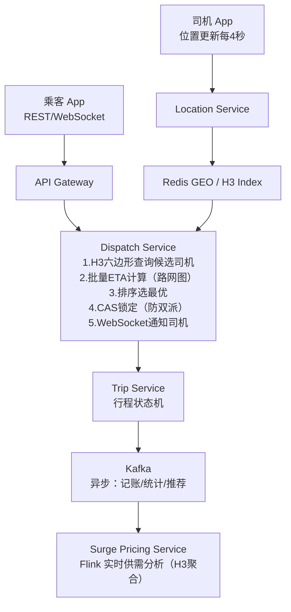

# Uber 架构演进

> 来源：Uber Engineering Blog、QCon 演讲、OSDI/SOSP 论文。
> 核心：Uber 是一个**地理位置驱动**的实时双边市场，架构的每个决策都围绕"位置"和"实时匹配"展开。

---

## 系统规模（2023 年）

```
日订单量：2500 万次
同时在线司机：约 500 万
同时活跃用户：约 1200 万
位置更新 QPS：约 100 万次/秒（500 万司机 × 每 4 秒更新一次）
服务城市：1 万个
```

---

## 核心挑战

```
1. 位置高频写入：百万级司机每隔几秒更新位置，峰值百万 QPS
2. 附近查询：用户叫车时，毫秒级找到附近空闲司机
3. 实时匹配：在秒内给用户匹配最合适的司机
4. 状态一致性：司机接单后立刻从"可派单池"移除，防止双派
5. 全球化：1 万个城市，不同时区、法规、货币、语言
```

---

## 演进阶段

### 阶段一：单体起步（2010-2014）

```
Python + SQLAlchemy + PostgreSQL（单库）
城市覆盖：2-3 个城市，司机数百人

Geography 查询：
  PostGIS 扩展（PostgreSQL 的地理空间插件）
  SELECT * FROM drivers
  WHERE ST_DWithin(location, ST_Point(:lng, :lat), :radius)
  AND status = 'available'

问题：增长到几十个城市后，单库撑不住，地理查询变慢
```

### 阶段二：微服务拆分（2014-2016）

**按城市分片（City Sharding）**

```
核心洞察：大多数业务逻辑是城市内的——用户和司机在同一城市
→ 按城市分片，每个城市一套独立服务

City Service（每城市独立）：
  - 司机位置存储
  - 附近司机查询
  - 行程状态管理

全局服务：
  - 用户账户
  - 支付
  - 评价

好处：城市间完全隔离，一个城市的问题不影响其他城市
问题：跨城市功能（如机场接送跨城市、长途）处理复杂
```

**从 PostgreSQL 迁到 MySQL + Schemaless**

```
Schemaless：Uber 自研的构建在 MySQL 之上的文档存储层
  - 灵活 Schema（类 MongoDB）
  - 底层还是 MySQL（运维成熟）
  - 支持二级索引

为什么不直接用 MongoDB？
  Uber 在 2016 年发过著名博客解释：MySQL 的 Binlog 复制更可靠，
  在故障恢复场景下行为更可预测
```

### 阶段三：位置存储专项优化（2015-2018）

**问题：百万 QPS 的位置写入**

```
朴素方案：每次位置更新直接写数据库
  100 万 QPS × 每次写 → 数据库撑不住

解决方案一：Redis 作为位置缓存
  司机位置存 Redis（内存，超快）
  Redis key：driver:{driverId}:location
  Value：{ lat, lng, heading, speed, timestamp }
  TTL：60 秒（司机超时未更新视为离线）

附近查询：Redis GEO 命令
  GEOADD drivers:available {lng} {lat} {driverId}
  GEORADIUS drivers:available {lng} {lat} 2 km ASC COUNT 10
  
  时间复杂度：O(N + log(N))，N 是候选 Geohash 格子内的司机数
```

**Geohash vs Redis GEO 的关系：**

```
Redis GEO 内部使用 Geohash 编码：
  把经纬度编码为 52 位整数
  存入 Sorted Set，score = geohash 值
  附近查询 = 找 geohash 相近的 key

优点：Redis 原生支持，不需要自己实现 Geohash
缺点：热点城市（纽约、上海）的 Geohash 格子内司机极多，查询慢

优化：把"可派单司机"和"所有司机"分开存储
  drivers:available:{city} 只存空闲司机
  减少每次查询扫描的数量
```

**H3 六边形地理索引（2018 年开源）**

```
Uber 自研 H3：把地球表面划分为六边形网格（类似蜂巢）

为什么六边形？
  正方形网格（Geohash）的问题：角落格子的对角线距离是边长的 1.4 倍
  → 附近查询时，距离精度不一致

六边形网格：
  每个六边形到相邻六边形的距离相等
  → 附近查询精度更均匀
  → 不需要查 9 个格子（Geohash），查 7 个六边形（1 个中心 + 6 个相邻）

精度级别：0~15 级，每级边长递减
  Level 9：六边形边长约 174m（适合司机匹配）
  Level 7：六边形边长约 1.2km（适合供需分析）
```

### 阶段四：DISCO 匹配系统（2017-至今）

**司机匹配不只是"找最近"**

```
用户叫车时，朴素做法：返回直线距离最近的司机
实际问题：
  最近的司机可能在单行道另一侧，实际行驶距离很远
  最近的司机可能已经快接到另一单（但 Redis 里还是 available）
  拥堵时直线距离近但到达时间（ETA）长

Uber 的做法：基于 ETA 的匹配
  对候选司机计算真实 ETA（路网距离，考虑实时路况）
  选 ETA 最小的司机派单
  
  ETA 计算：路网图（Road Network Graph）+ Dijkstra / A* 算法
           实时路况数据 → 动态调整路网权重
```

**防双派（Race Condition）**

```
场景：2 个用户同时叫车，附近只有 1 个司机
  → 系统可能把同一司机派给 2 个用户

解决：乐观锁 + 版本号
  Redis 里司机状态带版本号：{ status: available, version: 42 }
  派单操作：
    GET driver:123 → { status: available, version: 42 }
    SET driver:123 { status: dispatched, version: 43 } IF version == 42
    → 原子 CAS 操作（用 Redis Lua 脚本保证原子性）
    → 如果版本号不匹配（已被别人派出），派单失败，换下一个候选司机
```

---

## 最终架构全景



---

## 动态定价（Surge Pricing）

```
原理：供需失衡时提高价格，吸引司机进入该区域

计算：
  每个 H3 Level-7 六边形（约 1.2km）实时统计：
    demand = 该区域乘客请求数（最近 5 分钟）
    supply = 该区域可用司机数
    surge_multiplier = f(demand / supply)

  供不应求（如雨天、演唱会散场）→ 价格 ×1.5~×3.0
  供过于求 → 价格回落到正常

实现：Flink 流处理，滑动窗口聚合
     结果存 Redis，每分钟更新一次
```

---

## 关键设计决策总结

| 问题 | Uber 的解决方案 | 为什么 |
|------|---------------|--------|
| 位置高频写 | Redis GEO（内存）| 数据库无法抗百万 QPS |
| 附近查询精度 | H3 六边形（自研）| Geohash 距离不均匀 |
| 司机匹配 | 基于 ETA 而非直线距离 | 路网距离才是真实代价 |
| 防双派 | Redis CAS（Lua 原子操作）| 无锁高并发状态更新 |
| 城市扩展 | 城市级分片 | 业务天然按城市隔离 |
| 动态定价 | 流处理（Flink）+ H3 聚合 | 实时供需感知 |

---

## 面试可借鉴的点

1. **H3 六边形索引**——打车/外卖类题目的加分答案（比 Geohash 更先进）
2. **ETA-based 匹配**——记住"不是找最近，是找最快到"
3. **CAS 防双派**——并发控制不一定要用悲观锁
4. **城市分片**——地理业务的天然分片键

---

## 关联文档

- [../06_case_studies/10_ride_sharing.md](../06_case_studies/10_ride_sharing.md) — 打车系统完整设计
- [../06_case_studies/15_proximity_service.md](../06_case_studies/15_proximity_service.md) — 附近查询（Geohash / H3）
- [../04_distributed/06_distributed_lock.md](../04_distributed/06_distributed_lock.md) — Redis 分布式锁（CAS）
