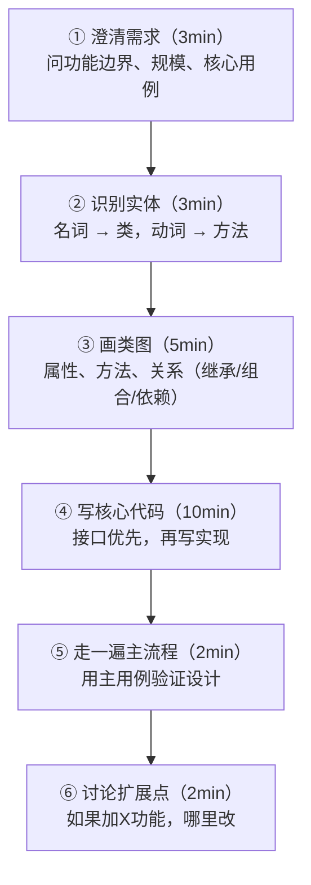
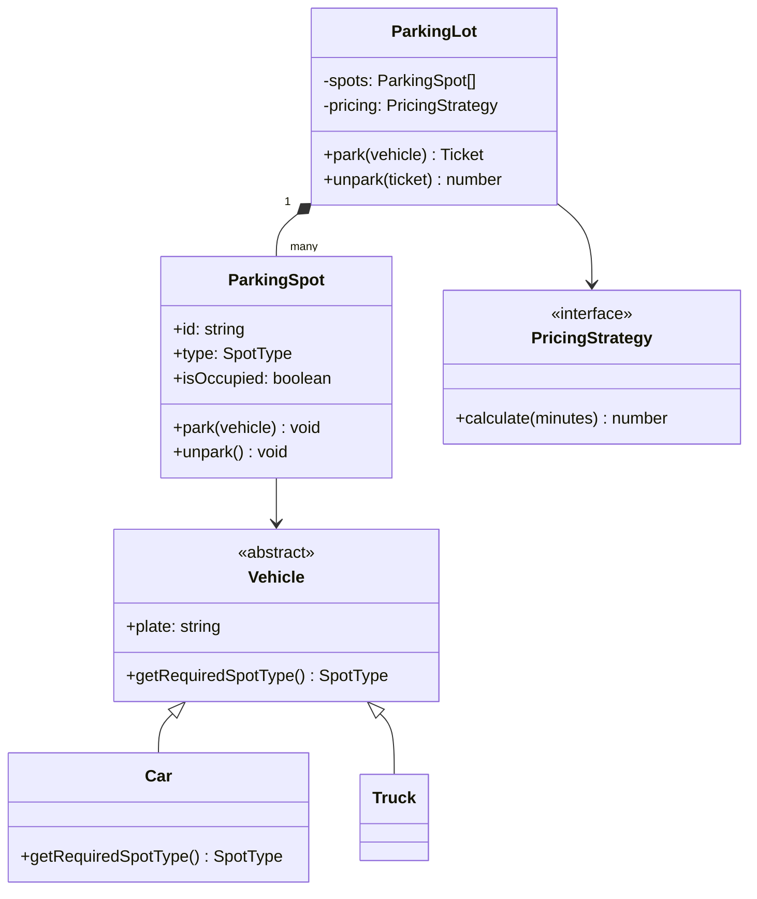

# OOD 面试方法论

## TL;DR

OOD 题考的不是代码量，是**你如何把需求翻译成可扩展的类结构**。面试官看的是：你能不能识别实体、定义职责边界、正确使用继承/组合、以及说清楚你的设计决策。

---

## 面试流程（25 分钟版）



### ① 澄清需求 — 必问的问题

```
停车场：多层吗？车型（小车/摩托/大巴）？计费方式？满了怎么办？
电梯：几部电梯？几层？调度算法（先到先服务 vs SCAN）？
棋类游戏：几个玩家？规则变体？AI 对手？
```

### ② 识别实体 — 名词法

把需求里的名词直接变成类候选：

```
停车场需求："一个停车场有多个停车位，车辆进入时分配车位，离开时计费"

名词 → 类：
  ParkingLot      停车场（主入口）
  ParkingSpot     车位
  Vehicle         车辆（抽象）
  Car/Truck/Bike  具体车型
  Ticket          停车票
  PricingStrategy 计费策略

动词 → 方法：
  进入 → parkingLot.park(vehicle): Ticket
  离开 → parkingLot.unpark(ticket): number（收费金额）
  查询 → parkingLot.getAvailableSpots(): ParkingSpot[]
```

---

## SOLID 原则速查（面试中要能说出口）

| 原则 | 含义 | 违反的典型症状 |
|------|------|--------------|
| **S** Single Responsibility | 一个类只做一件事 | ParkingLot 同时管车位、计费、打印收据 |
| **O** Open/Closed | 对扩展开放，对修改关闭 | 加新车型要改 if/else |
| **L** Liskov Substitution | 子类可以替换父类 | Car.park() 和 Truck.park() 行为完全不同 |
| **I** Interface Segregation | 接口细粒度，不强迫实现不需要的方法 | 一个大接口里有 20 个方法 |
| **D** Dependency Inversion | 依赖抽象不依赖具体 | ParkingLot 直接 new HourlyPricing() |

```typescript
// ❌ 违反 O 原则 — 加新车型要改这里
function getSpotType(vehicle: Vehicle): SpotType {
  if (vehicle instanceof Car) return SpotType.COMPACT;
  if (vehicle instanceof Truck) return SpotType.LARGE;
  if (vehicle instanceof Motorcycle) return SpotType.SMALL;
  // 加电动车还要改这里...
}

// ✅ 遵守 O 原则 — 车辆自己知道需要什么车位
abstract class Vehicle {
  abstract getRequiredSpotType(): SpotType;
}
class Car extends Vehicle {
  getRequiredSpotType() { return SpotType.COMPACT; }
}
```

---

## 常用设计模式速查

### Strategy — 替换算法（最常用）

```typescript
// 计费策略，不同停车场用不同策略
interface PricingStrategy {
  calculate(durationMinutes: number): number;
}

class HourlyPricing implements PricingStrategy {
  constructor(private ratePerHour: number) {}
  calculate(minutes: number): number {
    return Math.ceil(minutes / 60) * this.ratePerHour;
  }
}

class FlatRatePricing implements PricingStrategy {
  constructor(private flatRate: number) {}
  calculate(_minutes: number): number { return this.flatRate; }
}

// ParkingLot 依赖抽象，不知道具体策略
class ParkingLot {
  constructor(private pricing: PricingStrategy) {}
}
```

### Factory — 创建对象（隐藏构造细节）

```typescript
class VehicleFactory {
  static create(type: 'car' | 'truck' | 'motorcycle', plate: string): Vehicle {
    switch (type) {
      case 'car':        return new Car(plate);
      case 'truck':      return new Truck(plate);
      case 'motorcycle': return new Motorcycle(plate);
    }
  }
}
```

### Observer — 事件通知

```typescript
// 车位状态变化时通知显示屏
interface SpotObserver {
  onSpotChanged(spot: ParkingSpot): void;
}

class DisplayBoard implements SpotObserver {
  onSpotChanged(spot: ParkingSpot): void {
    console.log(`Floor ${spot.floor}: ${spot.id} is now ${spot.status}`);
  }
}
```

### Singleton — 全局唯一入口

```typescript
class ParkingLot {
  private static instance: ParkingLot;
  private constructor() {}   // 禁止外部 new
  
  static getInstance(): ParkingLot {
    if (!ParkingLot.instance) {
      ParkingLot.instance = new ParkingLot();
    }
    return ParkingLot.instance;
  }
}
```

---

## 类图速记（Mermaid classDiagram）



---

## 常见 OOD 题型速查

| 题目 | 核心难点 | 关键模式 |
|------|---------|---------|
| [停车场](./01_parking_lot.md) | 车位分配、计费策略 | Strategy、Factory |
| [LRU Cache](./02_lru_cache.md) | O(1) get/put、淘汰 | HashMap + 双向链表 |
| [电梯系统](./03_elevator.md) | 多电梯调度、状态机 | State、Strategy |
| [扑克牌游戏](./04_card_game.md) | 牌型抽象、规则扩展 | Template Method |
| 自动贩卖机 | 状态机、库存管理 | State |
| 图书馆系统 | 借阅记录、搜索 | Observer |
| 酒店预订 | 房间类型、时间冲突 | Strategy、Factory |
