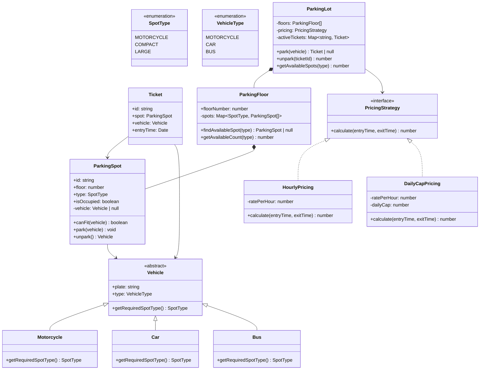

# OOD：停车场系统（Parking Lot）

## TL;DR

经典入门题。考点是**多态车型 + 可替换计费策略 + 车位分配算法**。答出 Strategy 模式替换计费、抽象 Vehicle 支持多车型，基本就过了。

---

## 需求澄清（面试开场必问）

```
Q: 有几层？每层多少车位？
A: 多层，每层有三种车位：小型(COMPACT)、大型(LARGE)、摩托车(MOTORCYCLE)

Q: 支持哪些车型？
A: 摩托车、小轿车、大巴车。摩托车占 MOTORCYCLE 位，小车占 COMPACT 位，大巴占 LARGE 位。

Q: 计费方式？
A: 按小时收费，不同停车场可能费率不同；可能有日封顶。

Q: 停满了怎么办？
A: 返回 null，拒绝入场。需要能查当前剩余车位数。
```

---

## 类图



---

## TypeScript 实现

```typescript
// ─── Enums ───────────────────────────────────────────────────────────────────

enum SpotType {
  MOTORCYCLE = 'MOTORCYCLE',
  COMPACT    = 'COMPACT',
  LARGE      = 'LARGE',
}

// ─── Vehicle ─────────────────────────────────────────────────────────────────

abstract class Vehicle {
  constructor(public readonly plate: string) {}
  abstract getRequiredSpotType(): SpotType;
}

class Motorcycle extends Vehicle {
  getRequiredSpotType() { return SpotType.MOTORCYCLE; }
}

class Car extends Vehicle {
  getRequiredSpotType() { return SpotType.COMPACT; }
}

class Bus extends Vehicle {
  getRequiredSpotType() { return SpotType.LARGE; }
}

// ─── Spot ─────────────────────────────────────────────────────────────────────

class ParkingSpot {
  private vehicle: Vehicle | null = null;

  constructor(
    public readonly id: string,
    public readonly floor: number,
    public readonly type: SpotType,
  ) {}

  get isOccupied() { return this.vehicle !== null; }

  canFit(vehicle: Vehicle): boolean {
    return !this.isOccupied && this.type === vehicle.getRequiredSpotType();
  }

  park(vehicle: Vehicle): void {
    if (this.isOccupied) throw new Error(`Spot ${this.id} is already occupied`);
    this.vehicle = vehicle;
  }

  unpark(): Vehicle {
    if (!this.vehicle) throw new Error(`Spot ${this.id} is empty`);
    const v = this.vehicle;
    this.vehicle = null;
    return v;
  }
}

// ─── Ticket ───────────────────────────────────────────────────────────────────

interface Ticket {
  id: string;
  spot: ParkingSpot;
  vehicle: Vehicle;
  entryTime: Date;
}

// ─── Pricing Strategy ─────────────────────────────────────────────────────────

interface PricingStrategy {
  calculate(entryTime: Date, exitTime: Date): number;
}

class HourlyPricing implements PricingStrategy {
  constructor(private readonly ratePerHour: number) {}

  calculate(entryTime: Date, exitTime: Date): number {
    const minutes = (exitTime.getTime() - entryTime.getTime()) / 60_000;
    return Math.ceil(minutes / 60) * this.ratePerHour;
  }
}

class DailyCapPricing implements PricingStrategy {
  constructor(
    private readonly ratePerHour: number,
    private readonly dailyCap: number,
  ) {}

  calculate(entryTime: Date, exitTime: Date): number {
    const minutes = (exitTime.getTime() - entryTime.getTime()) / 60_000;
    const hourly  = Math.ceil(minutes / 60) * this.ratePerHour;
    const days    = Math.ceil(minutes / (60 * 24));
    return Math.min(hourly, days * this.dailyCap);
  }
}

// ─── Floor ────────────────────────────────────────────────────────────────────

class ParkingFloor {
  // 按类型分桶，O(1) 找到可用车位
  private readonly spots: Map<SpotType, ParkingSpot[]> = new Map([
    [SpotType.MOTORCYCLE, []],
    [SpotType.COMPACT,    []],
    [SpotType.LARGE,      []],
  ]);

  constructor(public readonly floorNumber: number) {}

  addSpot(spot: ParkingSpot): void {
    this.spots.get(spot.type)!.push(spot);
  }

  findAvailableSpot(type: SpotType): ParkingSpot | null {
    return this.spots.get(type)?.find(s => !s.isOccupied) ?? null;
  }

  getAvailableCount(type: SpotType): number {
    return this.spots.get(type)?.filter(s => !s.isOccupied).length ?? 0;
  }
}

// ─── ParkingLot ───────────────────────────────────────────────────────────────

class ParkingLot {
  private readonly floors: ParkingFloor[];
  private readonly activeTickets = new Map<string, Ticket>();
  private ticketCounter = 0;

  constructor(
    floors: ParkingFloor[],
    private readonly pricing: PricingStrategy,
  ) {
    this.floors = floors;
  }

  /** 车辆入场，返回票据；停满返回 null */
  park(vehicle: Vehicle): Ticket | null {
    const spot = this.findSpot(vehicle);
    if (!spot) return null;

    spot.park(vehicle);

    const ticket: Ticket = {
      id:        `T${++this.ticketCounter}`,
      spot,
      vehicle,
      entryTime: new Date(),
    };
    this.activeTickets.set(ticket.id, ticket);
    return ticket;
  }

  /** 车辆出场，返回应付金额 */
  unpark(ticketId: string): number {
    const ticket = this.activeTickets.get(ticketId);
    if (!ticket) throw new Error(`Ticket ${ticketId} not found`);

    ticket.spot.unpark();
    this.activeTickets.delete(ticketId);

    return this.pricing.calculate(ticket.entryTime, new Date());
  }

  /** 查询某类车位总剩余数 */
  getAvailableSpots(type: SpotType): number {
    return this.floors.reduce((sum, f) => sum + f.getAvailableCount(type), 0);
  }

  /** 从最低层开始找可用车位 */
  private findSpot(vehicle: Vehicle): ParkingSpot | null {
    const type = vehicle.getRequiredSpotType();
    for (const floor of this.floors) {
      const spot = floor.findAvailableSpot(type);
      if (spot) return spot;
    }
    return null;
  }
}

// ─── 使用示例 ─────────────────────────────────────────────────────────────────

function buildParkingLot(): ParkingLot {
  const floor1 = new ParkingFloor(1);
  // 1 层：2 摩托位 + 3 小车位 + 1 大车位
  floor1.addSpot(new ParkingSpot('1-M1', 1, SpotType.MOTORCYCLE));
  floor1.addSpot(new ParkingSpot('1-M2', 1, SpotType.MOTORCYCLE));
  floor1.addSpot(new ParkingSpot('1-C1', 1, SpotType.COMPACT));
  floor1.addSpot(new ParkingSpot('1-C2', 1, SpotType.COMPACT));
  floor1.addSpot(new ParkingSpot('1-C3', 1, SpotType.COMPACT));
  floor1.addSpot(new ParkingSpot('1-L1', 1, SpotType.LARGE));

  const floor2 = new ParkingFloor(2);
  floor2.addSpot(new ParkingSpot('2-C1', 2, SpotType.COMPACT));
  floor2.addSpot(new ParkingSpot('2-C2', 2, SpotType.COMPACT));

  const pricing = new HourlyPricing(10); // ¥10/小时
  return new ParkingLot([floor1, floor2], pricing);
}

const lot    = buildParkingLot();
const car    = new Car('京A-12345');
const bike   = new Motorcycle('京B-00001');

const carTicket  = lot.park(car)!;
const bikeTicket = lot.park(bike)!;

console.log(`Car parked at spot: ${carTicket.spot.id}`);   // 1-C1
console.log(`Bike parked at spot: ${bikeTicket.spot.id}`); // 1-M1
console.log(`Available compact spots: ${lot.getAvailableSpots(SpotType.COMPACT)}`); // 3

// 模拟停了 2 小时后出场
const fee = lot.unpark(carTicket.id);
console.log(`Fee: ¥${fee}`); // ¥20
```

---

## 关键设计决策

**为什么 Vehicle 是抽象类，不是 interface？**

抽象类可以包含共享属性（`plate`），子类只需覆盖 `getRequiredSpotType()`。如果用 interface 则每个子类都要重复声明 `plate`。

**为什么 ParkingFloor 按 SpotType 分桶存储？**

每次 `findAvailableSpot` 只扫对应类型的车位，而不是遍历全部。100 个车位里有 10 个摩托位，只扫 10 次而不是 100 次。

**为什么 PricingStrategy 是接口？**

新增计费方式（如周末打折、会员折扣）只需实现新 class，不修改 ParkingLot。符合开放/关闭原则。

---

## 面试追问

**Q: 如果一辆小车可以停到大车位（降级使用），怎么改？**

```typescript
// 修改 canFit 逻辑，支持"上兼容"
canFit(vehicle: Vehicle): boolean {
  if (this.isOccupied) return false;
  const spotRank  = { MOTORCYCLE: 0, COMPACT: 1, LARGE: 2 };
  const spotLevel = spotRank[this.type];
  const vehLevel  = spotRank[vehicle.getRequiredSpotType()];
  return spotLevel >= vehLevel; // 车位等级 >= 车辆需求等级
}
```

**Q: 如何支持残障车位（只有特定证件才能停）？**

在 ParkingSpot 加 `isHandicapped: boolean`，Vehicle 加 `hasHandicapPermit: boolean`，`canFit` 增加检查。

**Q: 并发场景（同时两辆车抢同一个空位）怎么处理？**

单机用 `Mutex` 锁住 `park()` 方法；分布式场景用 Redis SETNX 对 spot_id 加分布式锁，抢到锁才能分配。

**Q: 如何知道哪层还有空位（入口显示屏）？**

维护一个 `Map<SpotType, number>` 的计数器，`park/unpark` 时原子更新，显示屏轮询这个计数器，不需要扫描所有车位。
