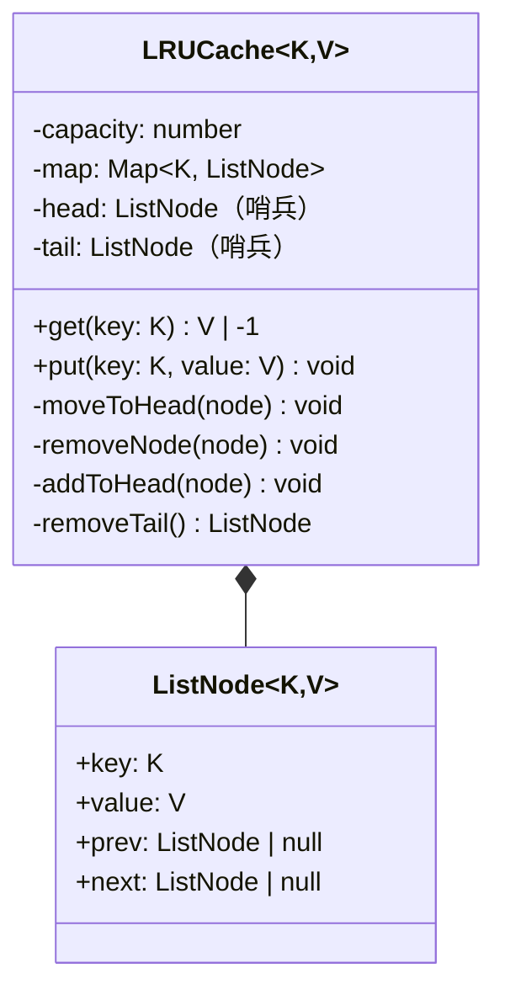

# OOD：LRU Cache

## TL;DR

面试里最常见的数据结构题改编成 OOD。核心要求：**`get` 和 `put` 都是 O(1)**。答案是 `HashMap + 双向链表`，HashMap 做 O(1) 定位，链表维护访问顺序（头部最新，尾部最旧）。

---

## 需求澄清

```
Q: 容量固定吗？
A: 是，构造时传入 capacity

Q: get 不存在时返回什么？
A: -1 或 undefined（约定好就行）

Q: 线程安全吗？
A: 先实现单线程版，面试官追问再讨论锁

Q: key/value 的类型？
A: 先用 number，面试官允许的话用泛型
```

---

## 数据结构设计

```
HashMap:  key → Node（O(1) 定位）
双向链表: 维护访问顺序（最近访问 = 头部，最久未访问 = 尾部）

初始状态（capacity=3，存入 1,2,3）：
  dummy_head ↔ [3] ↔ [2] ↔ [1] ↔ dummy_tail
  最新 ←────────────────────────────→ 最旧

get(2)：把 2 移到头部
  dummy_head ↔ [2] ↔ [3] ↔ [1] ↔ dummy_tail

put(4)：容量满了，删尾部的 1，再把 4 插入头部
  dummy_head ↔ [4] ↔ [2] ↔ [3] ↔ dummy_tail
```

```mermaid
flowchart LR
    subgraph HashMap
        K1["key=2 → Node2"]
        K2["key=3 → Node3"]
        K3["key=4 → Node4"]
    end
    subgraph 双向链表（新→旧）
        H["dummy\nhead"] <-->|next/prev| N4["Node4\nval=40"] <-->|next/prev| N2["Node2\nval=20"] <-->|next/prev| N3["Node3\nval=30"] <-->|next/prev| T["dummy\ntail"]
    end
```

---

## 类图



---

## TypeScript 实现

```typescript
class ListNode<K, V> {
  prev: ListNode<K, V> | null = null;
  next: ListNode<K, V> | null = null;
  constructor(public key: K, public value: V) {}
}

class LRUCache<K = number, V = number> {
  private readonly map   = new Map<K, ListNode<K, V>>();
  private readonly head: ListNode<K, V>;  // 哨兵：最近访问端
  private readonly tail: ListNode<K, V>;  // 哨兵：最久未访问端

  constructor(private readonly capacity: number) {
    // 哨兵节点简化边界判断，无需检查 null
    this.head = new ListNode<K, V>(null as K, null as V);
    this.tail = new ListNode<K, V>(null as K, null as V);
    this.head.next = this.tail;
    this.tail.prev = this.head;
  }

  get(key: K): V | -1 {
    const node = this.map.get(key);
    if (!node) return -1;
    this.moveToHead(node);   // 访问了 → 最近使用
    return node.value;
  }

  put(key: K, value: V): void {
    const existing = this.map.get(key);

    if (existing) {
      existing.value = value;
      this.moveToHead(existing);
      return;
    }

    const node = new ListNode(key, value);
    this.map.set(key, node);
    this.addToHead(node);

    if (this.map.size > this.capacity) {
      const lru = this.removeTail();  // 淘汰最久未使用
      this.map.delete(lru.key);
    }
  }

  // ── 链表操作（全部 O(1)）────────────────────────────────────────────────────

  private addToHead(node: ListNode<K, V>): void {
    node.prev       = this.head;
    node.next       = this.head.next;
    this.head.next!.prev = node;
    this.head.next  = node;
  }

  private removeNode(node: ListNode<K, V>): void {
    node.prev!.next = node.next;
    node.next!.prev = node.prev;
  }

  private moveToHead(node: ListNode<K, V>): void {
    this.removeNode(node);
    this.addToHead(node);
  }

  private removeTail(): ListNode<K, V> {
    const lru = this.tail.prev!;
    this.removeNode(lru);
    return lru;
  }
}
```

---

## 走一遍主流程验证

```typescript
const cache = new LRUCache<number, number>(3);

cache.put(1, 10);  // 链表: [1]
cache.put(2, 20);  // 链表: [2,1]
cache.put(3, 30);  // 链表: [3,2,1]

cache.get(1);      // 链表: [1,3,2]  → 返回 10，1 移到头部

cache.put(4, 40);  // 容量满，淘汰尾部 2，链表: [4,1,3]

console.log(cache.get(2)); // -1（已淘汰）
console.log(cache.get(1)); // 10
console.log(cache.get(3)); // 30
console.log(cache.get(4)); // 40
```

---

## 泛型版（完整可运行）

```typescript
// 上面的实现已经是泛型 LRUCache<K, V>
// 用于字符串 key 的示例：

const strCache = new LRUCache<string, string>(2);
strCache.put('name', 'Alice');
strCache.put('city', 'Beijing');
strCache.get('name');          // 访问 name，city 变成 LRU
strCache.put('job', 'Engineer'); // 淘汰 city
console.log(strCache.get('city')); // -1
```

---

## 复杂度分析

| 操作 | 时间 | 空间 |
|------|------|------|
| get  | O(1) | — |
| put  | O(1) | — |
| 总计 | — | O(capacity) |

HashMap `O(1)` 定位节点，双向链表 `O(1)` 移动节点（有 prev/next 直接操作）。

---

## 面试追问

**Q: 为什么用双向链表，单向链表不行吗？**

删除节点需要找到它的前驱。单向链表删除是 O(n)（要从头找 prev），双向链表因为有 `prev` 指针，删除是 O(1)。

**Q: 为什么要哨兵节点（dummy head/tail）？**

避免处理链表为空的边界情况（head = null 时的 null check），所有操作总是在两个哨兵之间进行，代码更简洁。

**Q: 线程安全怎么做？**

```typescript
import { Mutex } from 'async-mutex';

class ThreadSafeLRUCache<K, V> extends LRUCache<K, V> {
  private readonly mutex = new Mutex();

  async get(key: K): Promise<V | -1> {
    return this.mutex.runExclusive(() => super.get(key));
  }

  async put(key: K, value: V): Promise<void> {
    return this.mutex.runExclusive(() => super.put(key, value));
  }
}
```

**Q: 如果要支持 TTL（过期时间）？**

每个 Node 加 `expireAt: number`，`get` 时检查是否过期：

```typescript
get(key: K): V | -1 {
  const node = this.map.get(key);
  if (!node) return -1;
  if (node.expireAt && Date.now() > node.expireAt) {
    this.removeNode(node);
    this.map.delete(key);
    return -1;
  }
  this.moveToHead(node);
  return node.value;
}
```

**Q: Node.js / Redis 的 LRU 实现和这个有什么区别？**

Redis 用的是近似 LRU（Approximated LRU）——随机采样 N 个 key，淘汰其中最久未使用的，避免精确 LRU 需要维护全局链表的开销。适合超大数据量场景，牺牲少量精度换取性能。
