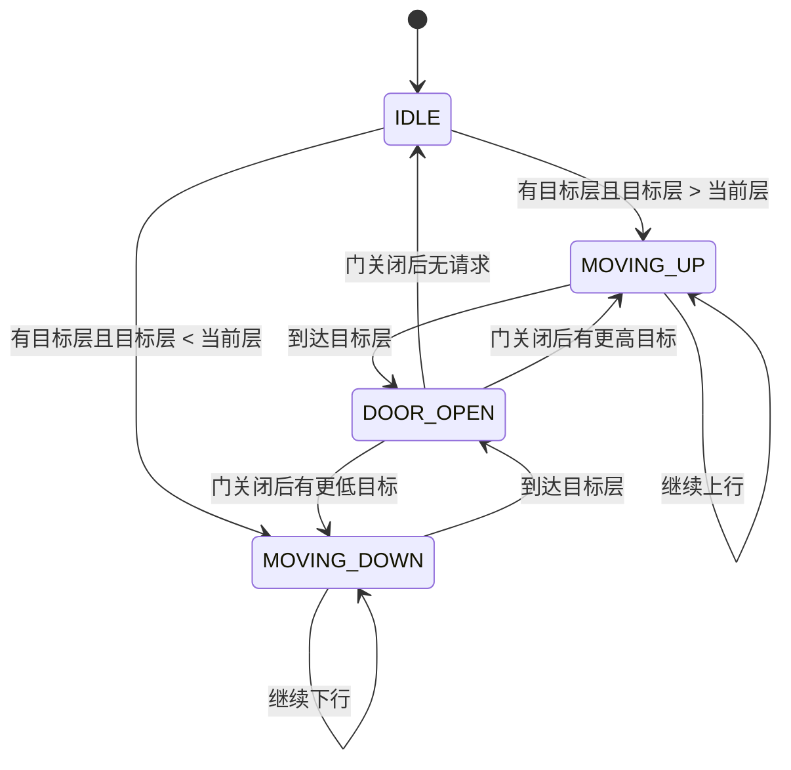
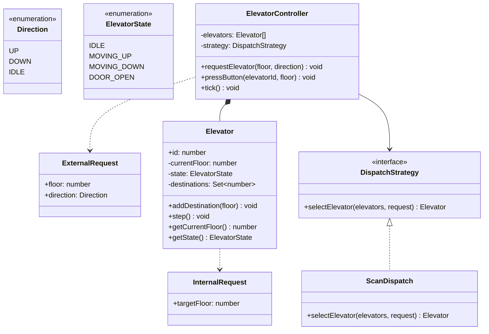

# OOD：电梯系统（Elevator System）

## TL;DR

考点是**状态机 + 调度策略**。电梯本身是一个状态机（IDLE/MOVING_UP/MOVING_DOWN/DOOR_OPEN），调度算法（SCAN/LOOK）决定多台电梯如何分配请求。用 Strategy 模式把调度算法抽出来，可以在不改电梯类的情况下换调度逻辑。

---

## 需求澄清

```
Q: 几台电梯，几层楼？
A: 可配置，比如 3 台电梯、20 层

Q: 请求类型？
A: 两种：①大厅按钮（外部请求：哪层、上还是下）②电梯内按钮（内部请求：去哪层）

Q: 调度算法？
A: SCAN（电梯扫描算法）——先走完当前方向所有请求，再掉头

Q: 紧急情况？
A: 简化版可以不考虑，追问再加
```

---

## 状态机



---

## 类图



---

## TypeScript 实现

```typescript
// ─── Types ────────────────────────────────────────────────────────────────────

enum Direction { UP = 'UP', DOWN = 'DOWN', IDLE = 'IDLE' }

enum ElevatorState {
  IDLE        = 'IDLE',
  MOVING_UP   = 'MOVING_UP',
  MOVING_DOWN = 'MOVING_DOWN',
  DOOR_OPEN   = 'DOOR_OPEN',
}

interface ExternalRequest {
  floor: number;
  direction: Direction;
}

// ─── Elevator ─────────────────────────────────────────────────────────────────

class Elevator {
  private currentFloor = 1;
  private state        = ElevatorState.IDLE;
  private destinations = new Set<number>(); // 需要停的楼层

  constructor(public readonly id: number) {}

  addDestination(floor: number): void {
    if (floor !== this.currentFloor) {
      this.destinations.add(floor);
    }
  }

  /** 模拟走一步（每次调用 = 运行一个时间单位）*/
  step(): void {
    if (this.state === ElevatorState.DOOR_OPEN) {
      this.state = this.chooseNextState();
      return;
    }

    if (this.destinations.size === 0) {
      this.state = ElevatorState.IDLE;
      return;
    }

    // SCAN：先找当前方向上最近的目标
    const nextFloor = this.getNextFloor();

    if (nextFloor === null) {
      this.state = ElevatorState.IDLE;
      return;
    }

    if (nextFloor > this.currentFloor) {
      this.currentFloor++;
      this.state = ElevatorState.MOVING_UP;
    } else if (nextFloor < this.currentFloor) {
      this.currentFloor--;
      this.state = ElevatorState.MOVING_DOWN;
    }

    if (this.currentFloor === nextFloor) {
      this.destinations.delete(this.currentFloor);
      this.state = ElevatorState.DOOR_OPEN;
      console.log(`Elevator ${this.id}: 到达 ${this.currentFloor} 层，开门`);
    }
  }

  getCurrentFloor()          { return this.currentFloor; }
  getState()                 { return this.state; }
  getDestinations()          { return new Set(this.destinations); }
  isIdle()                   { return this.destinations.size === 0; }

  /** 与请求楼层的"代价"估算（调度器用） */
  costTo(floor: number, direction: Direction): number {
    const distance = Math.abs(this.currentFloor - floor);

    // 电梯在同方向路径上 → 低代价
    if (this.state === ElevatorState.IDLE) return distance;

    const movingUp = this.state === ElevatorState.MOVING_UP;
    const sameDir  = (movingUp && direction === Direction.UP)
                  || (!movingUp && direction === Direction.DOWN);

    if (sameDir) {
      // 在当前运动方向的前方 → 顺路
      if ((movingUp && floor >= this.currentFloor)
       || (!movingUp && floor <= this.currentFloor)) {
        return distance;
      }
    }

    // 需要掉头 → 高代价
    return distance + 10;
  }

  // ── 私有 ──────────────────────────────────────────────────────────────────

  private getNextFloor(): number | null {
    if (this.destinations.size === 0) return null;

    // 按 SCAN 算法：优先当前方向最近的
    const above = [...this.destinations].filter(f => f > this.currentFloor).sort((a, b) => a - b);
    const below = [...this.destinations].filter(f => f < this.currentFloor).sort((a, b) => b - a);

    if (this.state === ElevatorState.MOVING_UP || this.state === ElevatorState.IDLE) {
      return above[0] ?? below[0] ?? null;
    } else {
      return below[0] ?? above[0] ?? null;
    }
  }

  private chooseNextState(): ElevatorState {
    if (this.destinations.size === 0) return ElevatorState.IDLE;
    const next = this.getNextFloor()!;
    if (next > this.currentFloor)  return ElevatorState.MOVING_UP;
    if (next < this.currentFloor)  return ElevatorState.MOVING_DOWN;
    return ElevatorState.IDLE;
  }
}

// ─── Dispatch Strategy ────────────────────────────────────────────────────────

interface DispatchStrategy {
  selectElevator(elevators: Elevator[], request: ExternalRequest): Elevator;
}

/** 选代价最小的电梯（基于 SCAN 代价函数） */
class MinCostDispatch implements DispatchStrategy {
  selectElevator(elevators: Elevator[], request: ExternalRequest): Elevator {
    return elevators.reduce((best, current) =>
      current.costTo(request.floor, request.direction)
      < best.costTo(request.floor, request.direction)
        ? current : best
    );
  }
}

// ─── Controller ───────────────────────────────────────────────────────────────

class ElevatorController {
  private readonly elevators: Elevator[];

  constructor(
    count: number,
    private readonly strategy: DispatchStrategy = new MinCostDispatch(),
  ) {
    this.elevators = Array.from({ length: count }, (_, i) => new Elevator(i + 1));
  }

  /** 大厅按钮：某层有人要上/下 */
  requestElevator(floor: number, direction: Direction): void {
    const selected = this.strategy.selectElevator(this.elevators, { floor, direction });
    selected.addDestination(floor);
    console.log(`Elevator ${selected.id} dispatched to floor ${floor} (${direction})`);
  }

  /** 电梯内按钮：乘客要去哪层 */
  pressButton(elevatorId: number, targetFloor: number): void {
    const elevator = this.elevators.find(e => e.id === elevatorId);
    if (!elevator) throw new Error(`Elevator ${elevatorId} not found`);
    elevator.addDestination(targetFloor);
  }

  /** 模拟时间推进（每 tick = 1 个时间单位，所有电梯移动一步） */
  tick(): void {
    this.elevators.forEach(e => e.step());
  }

  status(): void {
    this.elevators.forEach(e => {
      console.log(
        `Elevator ${e.id}: 当前层=${e.getCurrentFloor()} 状态=${e.getState()} 目标=${[...e.getDestinations()]}`
      );
    });
  }
}

// ─── 使用示例 ─────────────────────────────────────────────────────────────────

const controller = new ElevatorController(2); // 2 台电梯

// 1 楼有人要上去
controller.requestElevator(1, Direction.UP);
controller.status();

// 电梯 1 到达 1 楼后，乘客按 8 楼
controller.tick(); // 电梯移动
controller.pressButton(1, 8);

// 同时 5 楼有人要下去
controller.requestElevator(5, Direction.DOWN);

// 模拟运行 10 步
for (let i = 0; i < 10; i++) {
  controller.tick();
}
controller.status();
```

---

## 关键设计决策

**为什么用 `costTo()` 而不是简单比较距离？**

纯距离会忽略方向。假设电梯正在从 1 楼上到 10 楼，你请求 3 楼向上——虽然电梯已经过了 3 楼，但它需要先跑到 10 楼再下来，实际代价远大于另一台静止在 5 楼的电梯。`costTo` 的方向惩罚（+10）模拟了掉头成本。

**destinations 为什么用 Set 而不是数组？**

同一层可能被多次按（多人按同一楼层），Set 自动去重，不需要手动检查重复。

---

## 面试追问

**Q: 如果要支持紧急停止/消防模式？**

加 `EMERGENCY` 状态，进入后电梯直接下到 1 楼，忽略所有 destinations，不响应新请求。Controller 广播 `setEmergency()` 给所有电梯。

**Q: 调度算法还有什么选择？**

- **FCFS**（先来先服务）：最简单，按请求时间顺序处理，但效率低
- **SCAN/电梯算法**：当前实现，来回扫描，效率高
- **LOOK**：SCAN 的优化版，不走到端点才掉头，走到最后一个请求就掉头
- **最短寻道时间优先（SSTF）**：每次选距离最近的请求，可能造成饥饿

**Q: 分布式多栋楼的电梯系统？**

每栋楼一个 Controller，楼间不共享电梯。如果需要跨楼层统一调度（如机场），加一个 BuildingController 协调多个 ElevatorController。
