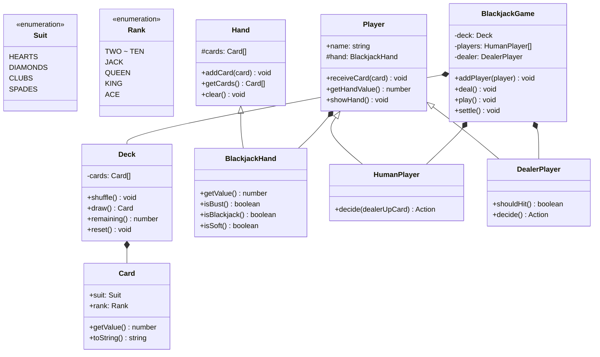

# OOD：扑克牌 / 纸牌游戏（Card Game）

## TL;DR

考点是**抽象层次设计**：牌面和游戏规则要分离，这样同一套牌可以玩不同游戏（21点、德州扑克、斗地主）。用 Template Method 模式把通用流程写在父类，子类只覆盖不同的规则。

---

## 需求澄清

```
Q: 支持哪种游戏？
A: 先实现通用的牌和牌组，再实现 Blackjack（21点）

Q: 几副牌？
A: 默认 1 副（52 张），可配置

Q: 需要实现 AI 玩家吗？
A: 实现基本的庄家策略（< 17 必须补牌）

Q: 需要下注系统？
A: 可以加，但不是核心
```

---

## 类图



---

## TypeScript 实现

```typescript
// ─── Card Primitives ──────────────────────────────────────────────────────────

enum Suit {
  HEARTS   = '♥',
  DIAMONDS = '♦',
  CLUBS    = '♣',
  SPADES   = '♠',
}

enum Rank {
  TWO   = '2',  THREE = '3', FOUR  = '4',
  FIVE  = '5',  SIX   = '6', SEVEN = '7',
  EIGHT = '8',  NINE  = '9', TEN   = '10',
  JACK  = 'J',  QUEEN = 'Q', KING  = 'K',
  ACE   = 'A',
}

// 每种牌面的基础点数（Ace 的特殊逻辑在 Hand 里处理）
const RANK_VALUE: Record<Rank, number> = {
  [Rank.TWO]: 2, [Rank.THREE]: 3, [Rank.FOUR]: 4,
  [Rank.FIVE]: 5, [Rank.SIX]: 6, [Rank.SEVEN]: 7,
  [Rank.EIGHT]: 8, [Rank.NINE]: 9, [Rank.TEN]: 10,
  [Rank.JACK]: 10, [Rank.QUEEN]: 10, [Rank.KING]: 10,
  [Rank.ACE]: 11,   // 默认 11，超出 21 时降为 1
};

class Card {
  constructor(
    public readonly suit: Suit,
    public readonly rank: Rank,
  ) {}

  getValue(): number { return RANK_VALUE[this.rank]; }

  toString(): string { return `${this.rank}${this.suit}`; }
}

// ─── Deck ─────────────────────────────────────────────────────────────────────

class Deck {
  private cards: Card[] = [];

  constructor(private readonly deckCount = 1) {
    this.reset();
  }

  reset(): void {
    this.cards = [];
    for (let d = 0; d < this.deckCount; d++) {
      for (const suit of Object.values(Suit)) {
        for (const rank of Object.values(Rank)) {
          this.cards.push(new Card(suit as Suit, rank as Rank));
        }
      }
    }
    this.shuffle();
  }

  shuffle(): void {
    // Fisher-Yates
    for (let i = this.cards.length - 1; i > 0; i--) {
      const j = Math.floor(Math.random() * (i + 1));
      [this.cards[i], this.cards[j]] = [this.cards[j], this.cards[i]];
    }
  }

  draw(): Card {
    const card = this.cards.pop();
    if (!card) throw new Error('Deck is empty');
    return card;
  }

  remaining(): number { return this.cards.length; }
}

// ─── Hand ─────────────────────────────────────────────────────────────────────

class BlackjackHand {
  protected cards: Card[] = [];

  addCard(card: Card): void { this.cards.push(card); }

  getCards(): Card[] { return [...this.cards]; }

  clear(): void { this.cards = []; }

  /**
   * Blackjack 计点：Ace 先算 11，若超 21 则降为 1
   * 例：[A, A, 9] → 11+11+9=31 → 降一个A → 1+11+9=21 ✅
   */
  getValue(): number {
    let total  = 0;
    let aces   = 0;

    for (const card of this.cards) {
      total += card.getValue();
      if (card.rank === Rank.ACE) aces++;
    }

    // 每次超出 21，把一个 Ace 从 11 降到 1（差值 10）
    while (total > 21 && aces > 0) {
      total -= 10;
      aces--;
    }

    return total;
  }

  isBust():      boolean { return this.getValue() > 21; }
  isBlackjack(): boolean { return this.cards.length === 2 && this.getValue() === 21; }
  isSoft():      boolean {
    // Soft hand：有一个 Ace 被算作 11
    const hasAce  = this.cards.some(c => c.rank === Rank.ACE);
    const rawTotal = this.cards.reduce((s, c) => s + c.getValue(), 0);
    return hasAce && rawTotal !== this.getValue();
  }

  toString(): string {
    return `[${this.cards.join(', ')}] = ${this.getValue()}`;
  }
}

// ─── Players ──────────────────────────────────────────────────────────────────

enum Action { HIT = 'HIT', STAND = 'STAND' }

abstract class Player {
  protected hand = new BlackjackHand();

  constructor(public readonly name: string) {}

  receiveCard(card: Card): void { this.hand.addCard(card); }

  getHandValue(): number { return this.hand.getValue(); }

  showHand(): void {
    console.log(`${this.name}: ${this.hand}`);
  }

  resetHand(): void { this.hand.clear(); }

  isBust(): boolean { return this.hand.isBust(); }
  isBlackjack(): boolean { return this.hand.isBlackjack(); }
}

class HumanPlayer extends Player {
  // 基础策略：根据庄家明牌决策（可替换为任意策略）
  decide(dealerUpCard: Card): Action {
    const value = this.getHandValue();
    const dealerValue = dealerUpCard.getValue();

    if (value >= 17) return Action.STAND;
    if (value <= 11) return Action.HIT;
    // 软手 12-16：庄家 7+ 时要牌
    if (this.hand.isSoft()) {
      return dealerValue >= 7 ? Action.HIT : Action.STAND;
    }
    // 硬手 12-16：庄家 7+ 时要牌
    return dealerValue >= 7 ? Action.HIT : Action.STAND;
  }
}

class DealerPlayer extends Player {
  constructor() { super('庄家'); }

  // 庄家固定策略：软17或以下必须要牌
  shouldHit(): boolean {
    const value = this.getHandValue();
    return value < 17 || (value === 17 && this.hand.isSoft());
  }

  getUpCard(): Card { return this.hand.getCards()[0]; }

  showUpCard(): void {
    console.log(`${this.name}明牌: ${this.getUpCard()}`);
  }
}

// ─── Game ─────────────────────────────────────────────────────────────────────

class BlackjackGame {
  private readonly deck   = new Deck();
  private readonly dealer = new DealerPlayer();
  private readonly players: HumanPlayer[] = [];

  addPlayer(player: HumanPlayer): void {
    this.players.push(player);
  }

  play(): void {
    this.resetAll();
    this.dealInitial();
    this.showInitialState();
    this.playPlayerTurns();
    this.playDealerTurn();
    this.settle();
  }

  // ── Private ──────────────────────────────────────────────────────────────────

  private resetAll(): void {
    [...this.players, this.dealer].forEach(p => p.resetHand());
  }

  private dealInitial(): void {
    // 轮流发两张
    for (let i = 0; i < 2; i++) {
      this.players.forEach(p => p.receiveCard(this.deck.draw()));
      this.dealer.receiveCard(this.deck.draw());
    }
  }

  private showInitialState(): void {
    this.dealer.showUpCard();
    this.players.forEach(p => p.showHand());
  }

  private playPlayerTurns(): void {
    const dealerUp = this.dealer.getUpCard();

    for (const player of this.players) {
      if (player.isBlackjack()) {
        console.log(`${player.name}: Blackjack！`);
        continue;
      }

      let action: Action;
      do {
        action = player.decide(dealerUp);
        if (action === Action.HIT) {
          player.receiveCard(this.deck.draw());
          player.showHand();
          if (player.isBust()) {
            console.log(`${player.name}: 爆牌！`);
            break;
          }
        }
      } while (action === Action.HIT);
    }
  }

  private playDealerTurn(): void {
    console.log('\n--- 庄家回合 ---');
    this.dealer.showHand();

    while (this.dealer.shouldHit()) {
      this.dealer.receiveCard(this.deck.draw());
      this.dealer.showHand();
    }
  }

  private settle(): void {
    const dealerValue = this.dealer.getHandValue();
    const dealerBust  = this.dealer.isBust();

    console.log('\n--- 结算 ---');
    for (const player of this.players) {
      const pv    = player.getHandValue();
      const bust  = player.isBust();
      const bj    = player.isBlackjack();

      let result: string;
      if (bust) {
        result = '输（爆牌）';
      } else if (bj && !this.dealer.isBlackjack()) {
        result = '赢（Blackjack！2.5倍）';
      } else if (dealerBust || pv > dealerValue) {
        result = '赢';
      } else if (pv === dealerValue) {
        result = '平局';
      } else {
        result = '输';
      }

      console.log(`${player.name}（${pv}点）: ${result}`);
    }
    console.log(`庄家（${dealerValue}点）`);
  }
}

// ─── 使用示例 ─────────────────────────────────────────────────────────────────

const game = new BlackjackGame();
game.addPlayer(new HumanPlayer('Alice'));
game.addPlayer(new HumanPlayer('Bob'));
game.play();
```

---

## 关键设计决策

**为什么 `getValue()` 放在 `BlackjackHand` 而不是 `Card`？**

Ace 的点数（1 还是 11）取决于整手牌的总点数，是手牌级别的逻辑，不是单张牌的属性。`Card.getValue()` 只返回默认值（Ace=11），复杂的 Ace 折算放在 `BlackjackHand.getValue()` 里。

**为什么 `HumanPlayer.decide()` 接受 `dealerUpCard` 参数？**

策略决策需要上下文（庄家明牌）。如果把庄家引用存在 Player 里，造成 Player↔Dealer 循环依赖。通过参数传入，保持 Player 的独立性，也方便测试。

**为什么不用继承而是用组合（`Player` 持有 `BlackjackHand`）？**

同一个 Player 在不同游戏里要用不同 Hand 类型（Blackjack vs TexasHoldem）。用组合可以动态替换 Hand，继承则固定了。

---

## 面试追问

**Q: 如何支持多种游戏（德州扑克、斗地主）？**

```typescript
// 抽象游戏基类，Template Method 模式
abstract class CardGame {
  protected deck: Deck;
  protected players: Player[];

  // 模板方法定义流程，具体步骤由子类实现
  play(): void {
    this.setup();
    this.dealInitial();
    this.playRounds();
    this.showdown();
  }

  protected abstract setup(): void;
  protected abstract dealInitial(): void;
  protected abstract playRounds(): void;
  protected abstract showdown(): void;
}

class BlackjackGame extends CardGame { /* ... */ }
class TexasHoldem   extends CardGame { /* ... */ }
```

**Q: 如何让 HumanPlayer 支持真实玩家输入（交互式）？**

```typescript
interface DecisionProvider {
  getAction(hand: BlackjackHand, dealerUpCard: Card): Promise<Action>;
}

class ConsoleDecision implements DecisionProvider {
  async getAction(): Promise<Action> {
    const input = await readLine('Hit or Stand? (h/s): ');
    return input.toLowerCase() === 'h' ? Action.HIT : Action.STAND;
  }
}

class AutoDecision implements DecisionProvider {
  async getAction(hand: BlackjackHand, dealerUpCard: Card): Promise<Action> {
    // 基础策略（自动模式）
    return hand.getValue() < 17 ? Action.HIT : Action.STAND;
  }
}
```

**Q: Deck 在高并发多局同时进行时怎么处理？**

每局游戏创建独立的 Deck 实例，不共享。如果要节省内存，可以用对象池（Pool 模式）预创建若干 Deck，每局借用一个，结束后归还并 `reset()`。
