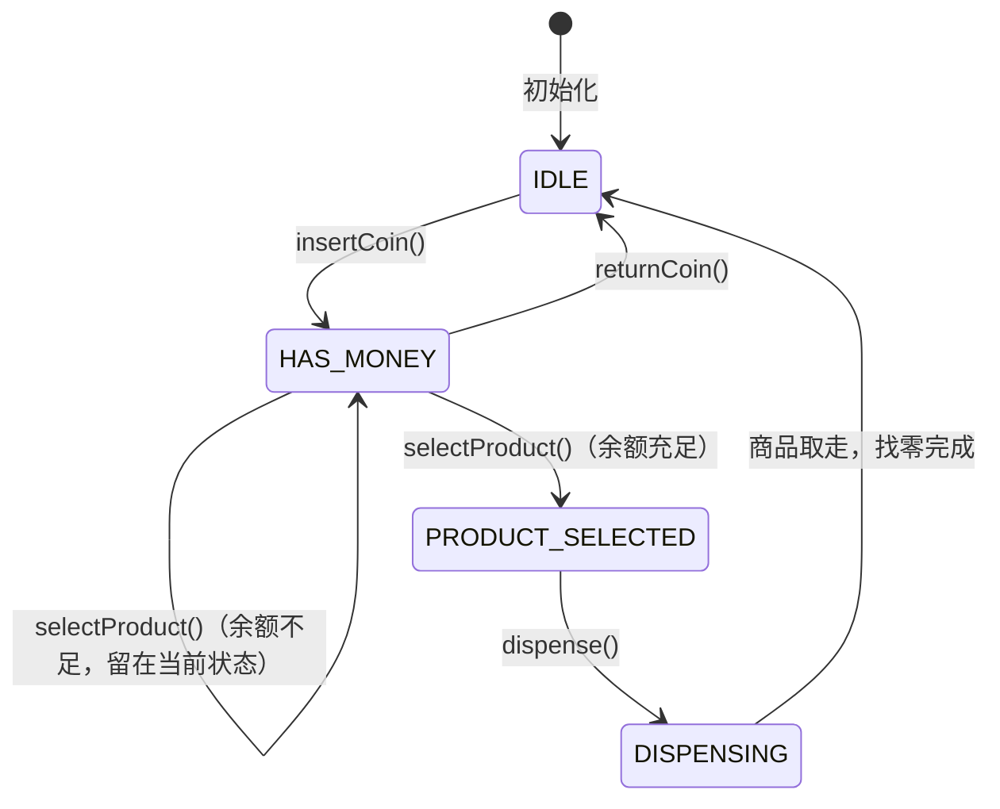
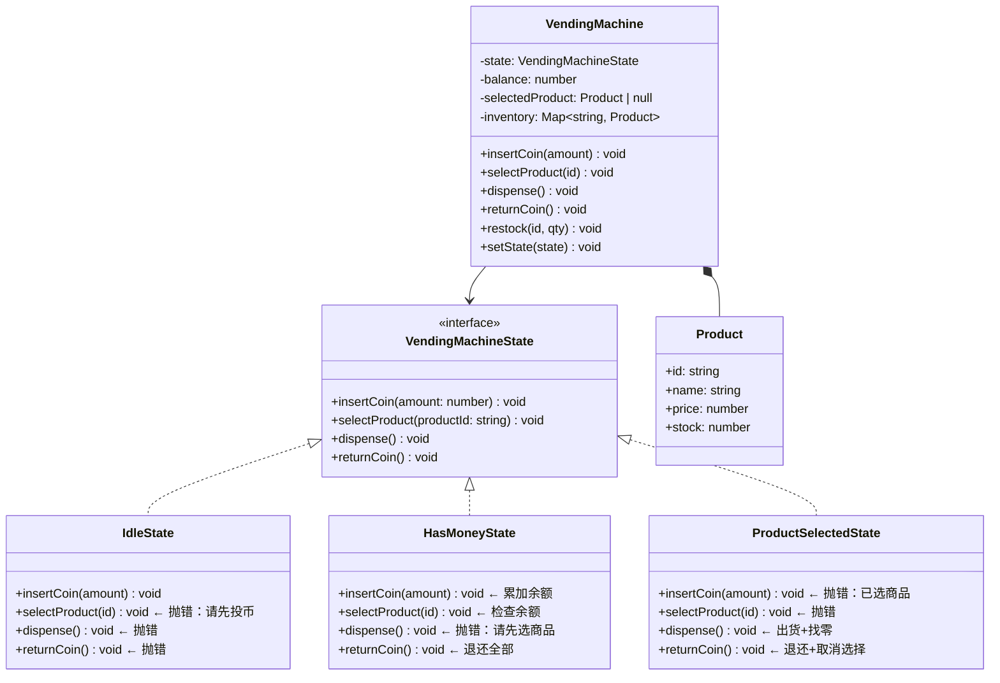

# OOD：自动贩卖机（Vending Machine）

## TL;DR

State 模式的教科书例子。贩卖机有明确的状态（待机/已投币/已选商品/找零），每个状态下对同一操作的响应不同。用 State 模式把每个状态的行为封装到独立类，避免 `switch/if-else` 堆砌。

---

## 需求澄清

```
Q: 支持哪些操作？
A: 投币、选商品、退币、取商品、补货（管理员）

Q: 一次只能买一件？
A: 是，简化版

Q: 支持多种硬币面值？
A: 支持 1元、5元、10元

Q: 商品不足或余额不足怎么处理？
A: 返回错误信息，硬币退还
```

---

## 状态机



---

## 类图



---

## TypeScript 实现

```typescript
// ─── State Interface ──────────────────────────────────────────────────────────

interface VendingMachineState {
  insertCoin(amount: number): void;
  selectProduct(productId: string): void;
  dispense(): void;
  returnCoin(): void;
  getName(): string;
}

// ─── Product ──────────────────────────────────────────────────────────────────

interface Product {
  id: string;
  name: string;
  price: number;
  stock: number;
}

// ─── VendingMachine（Context）────────────────────────────────────────────────

class VendingMachine {
  private state: VendingMachineState;
  private balance = 0;
  private selectedProduct: Product | null = null;
  private readonly inventory = new Map<string, Product>();

  // 预构建各状态实例（避免每次 new）
  private readonly idleState:    VendingMachineState;
  private readonly hasMoneyState: VendingMachineState;
  private readonly selectedState: VendingMachineState;

  constructor() {
    this.idleState     = new IdleState(this);
    this.hasMoneyState  = new HasMoneyState(this);
    this.selectedState  = new ProductSelectedState(this);
    this.state = this.idleState;
  }

  // ── 委托给当前状态 ───────────────────────────────────────────────────────────

  insertCoin(amount: number): void   { this.state.insertCoin(amount); }
  selectProduct(id: string): void    { this.state.selectProduct(id); }
  dispense(): void                   { this.state.dispense(); }
  returnCoin(): void                 { this.state.returnCoin(); }

  // ── 状态间共享的内部操作（由 State 调用）─────────────────────────────────────

  setState(state: VendingMachineState): void {
    console.log(`状态切换: ${this.state.getName()} → ${state.getName()}`);
    this.state = state;
  }

  addBalance(amount: number): void { this.balance += amount; }

  getBalance(): number { return this.balance; }

  clearBalance(): void { this.balance = 0; }

  setSelectedProduct(product: Product | null): void {
    this.selectedProduct = product;
  }

  getSelectedProduct(): Product | null { return this.selectedProduct; }

  getProduct(id: string): Product | undefined { return this.inventory.get(id); }

  getIdleState():    VendingMachineState { return this.idleState; }
  getHasMoneyState(): VendingMachineState { return this.hasMoneyState; }
  getSelectedState(): VendingMachineState { return this.selectedState; }

  // ── 库存管理 ─────────────────────────────────────────────────────────────────

  restock(id: string, name: string, price: number, qty: number): void {
    const existing = this.inventory.get(id);
    if (existing) {
      existing.stock += qty;
    } else {
      this.inventory.set(id, { id, name, price, stock: qty });
    }
    console.log(`补货: ${name} × ${qty}`);
  }

  dispenseProduct(): void {
    if (!this.selectedProduct) return;
    this.selectedProduct.stock--;
    console.log(`出货: ${this.selectedProduct.name}（剩余库存: ${this.selectedProduct.stock}）`);
  }

  giveChange(amount: number): void {
    if (amount > 0) {
      console.log(`找零: ¥${amount}`);
    }
  }

  currentStatus(): void {
    console.log(`状态: ${this.state.getName()} | 余额: ¥${this.balance}`);
  }
}

// ─── Concrete States ──────────────────────────────────────────────────────────

class IdleState implements VendingMachineState {
  constructor(private machine: VendingMachine) {}

  getName() { return 'IDLE'; }

  insertCoin(amount: number): void {
    this.machine.addBalance(amount);
    console.log(`投入 ¥${amount}，当前余额 ¥${this.machine.getBalance()}`);
    this.machine.setState(this.machine.getHasMoneyState());
  }

  selectProduct(_id: string): void {
    console.log('错误：请先投币');
  }

  dispense(): void {
    console.log('错误：请先投币并选择商品');
  }

  returnCoin(): void {
    console.log('错误：没有余额可退');
  }
}

class HasMoneyState implements VendingMachineState {
  constructor(private machine: VendingMachine) {}

  getName() { return 'HAS_MONEY'; }

  insertCoin(amount: number): void {
    this.machine.addBalance(amount);
    console.log(`追加投入 ¥${amount}，当前余额 ¥${this.machine.getBalance()}`);
  }

  selectProduct(id: string): void {
    const product = this.machine.getProduct(id);

    if (!product) {
      console.log(`错误：商品 ${id} 不存在`);
      return;
    }
    if (product.stock === 0) {
      console.log(`错误：${product.name} 已售罄`);
      return;
    }
    if (this.machine.getBalance() < product.price) {
      console.log(`余额不足：${product.name} 需要 ¥${product.price}，当前 ¥${this.machine.getBalance()}`);
      return;
    }

    this.machine.setSelectedProduct(product);
    console.log(`已选择: ${product.name}（¥${product.price}）`);
    this.machine.setState(this.machine.getSelectedState());
  }

  dispense(): void {
    console.log('错误：请先选择商品');
  }

  returnCoin(): void {
    const balance = this.machine.getBalance();
    this.machine.clearBalance();
    console.log(`退还 ¥${balance}`);
    this.machine.setState(this.machine.getIdleState());
  }
}

class ProductSelectedState implements VendingMachineState {
  constructor(private machine: VendingMachine) {}

  getName() { return 'PRODUCT_SELECTED'; }

  insertCoin(_amount: number): void {
    console.log('错误：已选商品，请先取出或取消');
  }

  selectProduct(_id: string): void {
    console.log('错误：已选商品，请先取出或取消');
  }

  dispense(): void {
    const product = this.machine.getSelectedProduct()!;
    const change  = this.machine.getBalance() - product.price;

    this.machine.dispenseProduct();
    this.machine.giveChange(change);
    this.machine.clearBalance();
    this.machine.setSelectedProduct(null);
    this.machine.setState(this.machine.getIdleState());
  }

  returnCoin(): void {
    const balance = this.machine.getBalance();
    this.machine.clearBalance();
    this.machine.setSelectedProduct(null);
    console.log(`取消选择，退还 ¥${balance}`);
    this.machine.setState(this.machine.getIdleState());
  }
}

// ─── 使用示例 ─────────────────────────────────────────────────────────────────

const vm = new VendingMachine();
vm.restock('A1', '可乐', 3, 5);
vm.restock('A2', '矿泉水', 2, 3);

vm.currentStatus();    // IDLE | 余额 ¥0
vm.selectProduct('A1');  // 错误：请先投币

vm.insertCoin(1);      // 投 ¥1
vm.insertCoin(5);      // 追加 ¥5，余额 ¥6

vm.selectProduct('A1'); // 选可乐（¥3），余额充足
vm.dispense();          // 出货 + 找零 ¥3

vm.currentStatus();    // 回到 IDLE
```

---

## 面试追问

**Q: 为什么用 State 模式而不是 if-else？**

每加一个状态，if-else 版要改所有操作方法；State 模式只需新建一个 State 类。而且 if-else 堆在一起时，某个状态的逻辑分散在多个 if 分支里，State 模式把每个状态的行为内聚在一个类里，更清晰。

**Q: VendingMachine 为什么预构建 State 实例而不每次 new？**

贩卖机频繁切换状态，每次 new 有内存分配开销，也增加 GC 压力。预构建三个实例，状态切换只是换指针，开销极低。

**Q: 如何支持同时购买多件商品？**

把 `selectedProduct: Product | null` 改为 `cart: Map<string, number>`，新增 `CartState`，`dispense()` 时遍历购物车出货并结算。
