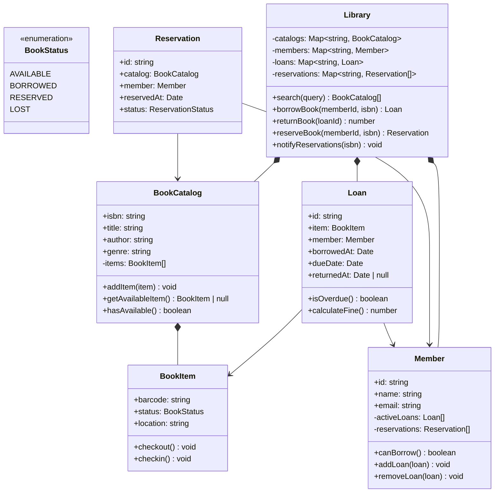

# OOD：图书馆管理系统（Library System）

## TL;DR

考点是**多对多关系建模 + 状态管理**。核心实体：书（Book）/ 书目（BookItem，实体书）/ 会员（Member）/ 借阅记录（Loan）。一个 ISBN 对应多本实体书，一本书一次只能被一人借走。

---

## 需求澄清

```
Q: 核心功能？
A: 搜索书目、借书、还书、预约（排队等待）、罚款计算

Q: 一个 ISBN 可以有多本实体书？
A: 是的。BookCatalog（书目）vs BookItem（实体书）要分清楚

Q: 借阅限制？
A: 一次最多借 5 本，借期 14 天，逾期每天 ¥0.5

Q: 预约机制？
A: 某书全部借出时可以预约，有人还书后通知预约人
```

---

## 类图



---

## TypeScript 实现

```typescript
// ─── Enums & Types ────────────────────────────────────────────────────────────

enum BookStatus {
  AVAILABLE = 'AVAILABLE',
  BORROWED  = 'BORROWED',
  RESERVED  = 'RESERVED',
  LOST      = 'LOST',
}

enum ReservationStatus {
  ACTIVE    = 'ACTIVE',
  FULFILLED = 'FULFILLED',
  CANCELLED = 'CANCELLED',
}

const MAX_LOANS_PER_MEMBER = 5;
const LOAN_DAYS            = 14;
const FINE_PER_DAY         = 0.5; // ¥

// ─── BookCatalog（书目，一个 ISBN 的元数据）──────────────────────────────────

class BookCatalog {
  private items: BookItem[] = [];

  constructor(
    public readonly isbn:   string,
    public readonly title:  string,
    public readonly author: string,
    public readonly genre:  string,
  ) {}

  addItem(item: BookItem): void { this.items.push(item); }

  getAvailableItem(): BookItem | null {
    return this.items.find(i => i.status === BookStatus.AVAILABLE) ?? null;
  }

  hasAvailable(): boolean { return this.getAvailableItem() !== null; }

  getTotalCopies(): number { return this.items.length; }

  getAvailableCount(): number {
    return this.items.filter(i => i.status === BookStatus.AVAILABLE).length;
  }
}

// ─── BookItem（实体书，有条形码）──────────────────────────────────────────────

class BookItem {
  public status: BookStatus = BookStatus.AVAILABLE;

  constructor(
    public readonly barcode:  string,
    public readonly isbn:     string,
    public readonly location: string, // 如：A-03-05（区-排-列）
  ) {}

  checkout(): void {
    if (this.status !== BookStatus.AVAILABLE) {
      throw new Error(`书 ${this.barcode} 不可借出，当前状态: ${this.status}`);
    }
    this.status = BookStatus.BORROWED;
  }

  checkin(): void {
    this.status = BookStatus.AVAILABLE;
  }
}

// ─── Member ───────────────────────────────────────────────────────────────────

class Member {
  private activeLoans:   Loan[]        = [];
  private reservations:  Reservation[] = [];

  constructor(
    public readonly id:    string,
    public readonly name:  string,
    public readonly email: string,
  ) {}

  canBorrow(): boolean { return this.activeLoans.length < MAX_LOANS_PER_MEMBER; }

  addLoan(loan: Loan): void    { this.activeLoans.push(loan); }

  removeLoan(loan: Loan): void {
    this.activeLoans = this.activeLoans.filter(l => l.id !== loan.id);
  }

  addReservation(res: Reservation): void    { this.reservations.push(res); }

  getActiveLoans(): Loan[]        { return [...this.activeLoans]; }
  getReservations(): Reservation[] { return [...this.reservations]; }
}

// ─── Loan（借阅记录）──────────────────────────────────────────────────────────

class Loan {
  public returnedAt: Date | null = null;

  public readonly dueDate: Date;
  public readonly id = `LOAN-${Date.now()}-${Math.random().toString(36).slice(2)}`;

  constructor(
    public readonly item:    BookItem,
    public readonly member:  Member,
    public readonly borrowedAt: Date = new Date(),
  ) {
    this.dueDate = new Date(borrowedAt);
    this.dueDate.setDate(this.dueDate.getDate() + LOAN_DAYS);
  }

  isOverdue(): boolean {
    const checkDate = this.returnedAt ?? new Date();
    return checkDate > this.dueDate;
  }

  calculateFine(): number {
    if (!this.isOverdue()) return 0;
    const returnDate   = this.returnedAt ?? new Date();
    const overdueDays  = Math.ceil(
      (returnDate.getTime() - this.dueDate.getTime()) / (1000 * 60 * 60 * 24)
    );
    return overdueDays * FINE_PER_DAY;
  }
}

// ─── Reservation（预约）──────────────────────────────────────────────────────

class Reservation {
  public status: ReservationStatus = ReservationStatus.ACTIVE;
  public readonly id = `RES-${Date.now()}-${Math.random().toString(36).slice(2)}`;

  constructor(
    public readonly catalog:    BookCatalog,
    public readonly member:     Member,
    public readonly reservedAt: Date = new Date(),
  ) {}
}

// ─── Library（门面/协调器）───────────────────────────────────────────────────

class Library {
  private readonly catalogs     = new Map<string, BookCatalog>();  // isbn → catalog
  private readonly members      = new Map<string, Member>();
  private readonly loans        = new Map<string, Loan>();
  private readonly reservations = new Map<string, Reservation[]>(); // isbn → queue

  // ── 馆藏管理 ─────────────────────────────────────────────────────────────────

  addCatalog(catalog: BookCatalog): void {
    this.catalogs.set(catalog.isbn, catalog);
  }

  addBookItem(item: BookItem): void {
    const catalog = this.catalogs.get(item.isbn);
    if (!catalog) throw new Error(`ISBN ${item.isbn} 不存在`);
    catalog.addItem(item);
  }

  registerMember(member: Member): void {
    this.members.set(member.id, member);
  }

  // ── 搜索 ─────────────────────────────────────────────────────────────────────

  search(query: string): BookCatalog[] {
    const q = query.toLowerCase();
    return [...this.catalogs.values()].filter(c =>
      c.title.toLowerCase().includes(q)  ||
      c.author.toLowerCase().includes(q) ||
      c.isbn.includes(q)
    );
  }

  // ── 借书 ─────────────────────────────────────────────────────────────────────

  borrowBook(memberId: string, isbn: string): Loan {
    const member  = this.getMember(memberId);
    const catalog = this.getCatalog(isbn);

    if (!member.canBorrow()) {
      throw new Error(`会员 ${member.name} 已达最大借阅数 ${MAX_LOANS_PER_MEMBER}`);
    }

    const item = catalog.getAvailableItem();
    if (!item) {
      throw new Error(`《${catalog.title}》无可用库存，可以预约`);
    }

    item.checkout();

    const loan = new Loan(item, member);
    member.addLoan(loan);
    this.loans.set(loan.id, loan);

    console.log(`借书成功: 《${catalog.title}》条码 ${item.barcode}，到期 ${loan.dueDate.toLocaleDateString()}`);
    return loan;
  }

  // ── 还书 ─────────────────────────────────────────────────────────────────────

  returnBook(loanId: string): number {
    const loan = this.getLoan(loanId);

    loan.returnedAt = new Date();
    loan.item.checkin();
    loan.member.removeLoan(loan);

    const fine = loan.calculateFine();
    if (fine > 0) {
      console.log(`逾期罚款: ¥${fine.toFixed(2)}`);
    }

    console.log(`还书成功: 条码 ${loan.item.barcode}`);

    // 通知预约队列
    this.notifyNextReservation(loan.item.isbn);

    return fine;
  }

  // ── 预约 ─────────────────────────────────────────────────────────────────────

  reserveBook(memberId: string, isbn: string): Reservation {
    const member  = this.getMember(memberId);
    const catalog = this.getCatalog(isbn);

    if (catalog.hasAvailable()) {
      throw new Error(`《${catalog.title}》有库存，请直接借阅`);
    }

    const reservation = new Reservation(catalog, member);
    member.addReservation(reservation);

    const queue = this.reservations.get(isbn) ?? [];
    queue.push(reservation);
    this.reservations.set(isbn, queue);

    console.log(`预约成功: 《${catalog.title}》，排队位置 ${queue.length}`);
    return reservation;
  }

  private notifyNextReservation(isbn: string): void {
    const queue = this.reservations.get(isbn);
    if (!queue || queue.length === 0) return;

    const next = queue.find(r => r.status === ReservationStatus.ACTIVE);
    if (!next) return;

    next.status = ReservationStatus.FULFILLED;
    console.log(`通知预约人 ${next.member.name}（${next.member.email}）：《${next.catalog.title}》现在可借`);
  }

  // ── 辅助 ─────────────────────────────────────────────────────────────────────

  private getMember(id: string): Member {
    const m = this.members.get(id);
    if (!m) throw new Error(`会员 ${id} 不存在`);
    return m;
  }

  private getCatalog(isbn: string): BookCatalog {
    const c = this.catalogs.get(isbn);
    if (!c) throw new Error(`ISBN ${isbn} 不存在`);
    return c;
  }

  private getLoan(id: string): Loan {
    const l = this.loans.get(id);
    if (!l) throw new Error(`借阅记录 ${id} 不存在`);
    return l;
  }
}

// ─── 使用示例 ─────────────────────────────────────────────────────────────────

const lib = new Library();

const catalog = new BookCatalog('978-7-111-21743-9', '算法导论', 'Cormen', '计算机');
lib.addCatalog(catalog);
lib.addBookItem(new BookItem('BAR001', '978-7-111-21743-9', 'A-01-01'));
lib.addBookItem(new BookItem('BAR002', '978-7-111-21743-9', 'A-01-02'));

const alice = new Member('M001', 'Alice', 'alice@example.com');
const bob   = new Member('M002', 'Bob',   'bob@example.com');
lib.registerMember(alice);
lib.registerMember(bob);

// Alice 借书
const loan1 = lib.borrowBook('M001', '978-7-111-21743-9');
// Bob 借走最后一本
const loan2 = lib.borrowBook('M002', '978-7-111-21743-9');

// 库存为 0，Charlie 预约
const charlie = new Member('M003', 'Charlie', 'charlie@example.com');
lib.registerMember(charlie);
lib.reserveBook('M003', '978-7-111-21743-9');

// Alice 还书 → 系统通知 Charlie
lib.returnBook(loan1.id);
```

---

## 面试追问

**Q: BookCatalog 和 BookItem 为什么要分开？**

ISBN 是书的逻辑概念，BookItem 是实体概念。一本书可以有 100 本实体，搜索时按 ISBN 找书目，借书时找具体实体书。混在一起的话，同一 ISBN 的多本书要重复存储作者、书名等元数据。

**Q: 如何防止同一会员同时预约多本同一书目？**

`reserveBook` 时检查 member 的现有预约列表，如已有该 ISBN 的 ACTIVE 预约则拒绝。

**Q: 搜索如何优化（现在是 O(n) 遍历）？**

- 建倒排索引：`title 中每个词 → Set<isbn>`，`author → Set<isbn>`
- 用 Elasticsearch 做全文搜索
- 或者简单地在标题、作者上建 Trie（前缀搜索）
