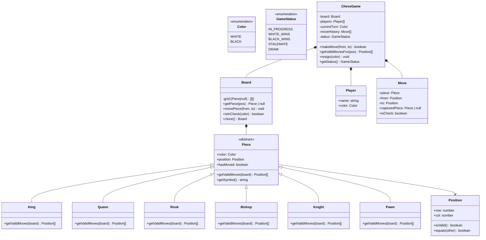

# OOD：在线象棋 / 国际象棋（Chess Game）

## TL;DR

考点是**棋子多态 + 规则封装**。每种棋子有自己的移动规则，用多态实现，而不是在棋盘类里堆 if-else。额外考点：回合管理、将军检测、游戏状态机。

---

## 需求澄清

```
Q: 国际象棋还是中国象棋？
A: 国际象棋（Chess），规则更标准化，面试更常见

Q: 需要实现所有特殊规则吗（王车易位、吃过路兵、升变）？
A: 先实现基本移动和将军检测，特殊规则追问再加

Q: 多人在线？
A: 先实现本地双人，联机是系统设计层面的问题

Q: AI 对手？
A: 不需要，OOD 关注类设计
```

---

## 类图



---

## TypeScript 实现

```typescript
// ─── Types ────────────────────────────────────────────────────────────────────

enum Color { WHITE = 'WHITE', BLACK = 'BLACK' }

enum GameStatus {
  IN_PROGRESS  = 'IN_PROGRESS',
  WHITE_WINS   = 'WHITE_WINS',
  BLACK_WINS   = 'BLACK_WINS',
  STALEMATE    = 'STALEMATE',
}

// ─── Position ─────────────────────────────────────────────────────────────────

class Position {
  constructor(
    public readonly row: number, // 0-7，0=白方底线
    public readonly col: number, // 0-7，0=a列
  ) {}

  isValid(): boolean {
    return this.row >= 0 && this.row < 8 && this.col >= 0 && this.col < 8;
  }

  equals(other: Position): boolean {
    return this.row === other.row && this.col === other.col;
  }

  toString(): string {
    return `${'abcdefgh'[this.col]}${this.row + 1}`;
  }
}

// ─── Board ────────────────────────────────────────────────────────────────────

class Board {
  private grid: (Piece | null)[][] = Array.from({ length: 8 }, () => Array(8).fill(null));

  getPiece(pos: Position): Piece | null {
    return this.grid[pos.row][pos.col];
  }

  setPiece(pos: Position, piece: Piece | null): void {
    this.grid[pos.row][pos.col] = piece;
  }

  movePiece(from: Position, to: Position): Piece | null {
    const piece    = this.getPiece(from)!;
    const captured = this.getPiece(to);
    this.setPiece(to,   piece);
    this.setPiece(from, null);
    piece.position = to;
    piece.hasMoved = true;
    return captured;
  }

  /** 查找某颜色的所有棋子 */
  getPiecesByColor(color: Color): Piece[] {
    const pieces: Piece[] = [];
    for (let r = 0; r < 8; r++) {
      for (let c = 0; c < 8; c++) {
        const p = this.grid[r][c];
        if (p && p.color === color) pieces.push(p);
      }
    }
    return pieces;
  }

  /** 判断某颜色的 King 是否被将军 */
  isInCheck(color: Color): boolean {
    const king      = this.getPiecesByColor(color).find(p => p instanceof King);
    if (!king) return false;
    const opponent  = color === Color.WHITE ? Color.BLACK : Color.WHITE;
    const enemyPieces = this.getPiecesByColor(opponent);

    return enemyPieces.some(piece =>
      piece.getRawMoves(this).some(pos => pos.equals(king.position))
    );
  }

  /** 深拷贝棋盘，用于模拟走法（验证走后是否仍被将军）*/
  clone(): Board {
    const cloned = new Board();
    for (let r = 0; r < 8; r++) {
      for (let c = 0; c < 8; c++) {
        const p = this.grid[r][c];
        if (p) {
          const newPiece = p.clone();
          cloned.grid[r][c] = newPiece;
        }
      }
    }
    return cloned;
  }
}

// ─── Piece（抽象）────────────────────────────────────────────────────────────

abstract class Piece {
  public hasMoved = false;

  constructor(
    public readonly color: Color,
    public position: Position,
  ) {}

  /** 合法走法：过滤掉走后仍被将军的情况 */
  getValidMoves(board: Board): Position[] {
    return this.getRawMoves(board).filter(to => {
      // 模拟走这一步，看自己是否被将军
      const simBoard = board.clone();
      simBoard.movePiece(this.position, to);
      return !simBoard.isInCheck(this.color);
    });
  }

  /** 原始走法（不考虑将军），子类实现 */
  abstract getRawMoves(board: Board): Position[];
  abstract getSymbol(): string;
  abstract clone(): Piece;

  protected opponent(): Color {
    return this.color === Color.WHITE ? Color.BLACK : Color.WHITE;
  }

  /** 沿方向一直走到边界或遇到棋子 */
  protected slide(board: Board, directions: [number, number][]): Position[] {
    const moves: Position[] = [];
    for (const [dr, dc] of directions) {
      let r = this.position.row + dr;
      let c = this.position.col + dc;
      while (r >= 0 && r < 8 && c >= 0 && c < 8) {
        const pos   = new Position(r, c);
        const piece = board.getPiece(pos);
        if (piece) {
          if (piece.color !== this.color) moves.push(pos); // 可以吃对方
          break;
        }
        moves.push(pos);
        r += dr;
        c += dc;
      }
    }
    return moves;
  }
}

// ─── Concrete Pieces ──────────────────────────────────────────────────────────

class King extends Piece {
  getSymbol() { return this.color === Color.WHITE ? '♔' : '♚'; }

  getRawMoves(board: Board): Position[] {
    const moves: Position[] = [];
    for (let dr = -1; dr <= 1; dr++) {
      for (let dc = -1; dc <= 1; dc++) {
        if (dr === 0 && dc === 0) continue;
        const pos = new Position(this.position.row + dr, this.position.col + dc);
        if (!pos.isValid()) continue;
        const piece = board.getPiece(pos);
        if (!piece || piece.color !== this.color) moves.push(pos);
      }
    }
    return moves;
  }

  clone(): King {
    const k = new King(this.color, new Position(this.position.row, this.position.col));
    k.hasMoved = this.hasMoved;
    return k;
  }
}

class Queen extends Piece {
  getSymbol() { return this.color === Color.WHITE ? '♕' : '♛'; }

  getRawMoves(board: Board): Position[] {
    return this.slide(board, [
      [1,0],[-1,0],[0,1],[0,-1],  // 直线（车）
      [1,1],[1,-1],[-1,1],[-1,-1] // 对角（象）
    ]);
  }

  clone(): Queen {
    return new Queen(this.color, new Position(this.position.row, this.position.col));
  }
}

class Rook extends Piece {
  getSymbol() { return this.color === Color.WHITE ? '♖' : '♜'; }

  getRawMoves(board: Board): Position[] {
    return this.slide(board, [[1,0],[-1,0],[0,1],[0,-1]]);
  }

  clone(): Rook {
    const r = new Rook(this.color, new Position(this.position.row, this.position.col));
    r.hasMoved = this.hasMoved;
    return r;
  }
}

class Bishop extends Piece {
  getSymbol() { return this.color === Color.WHITE ? '♗' : '♝'; }

  getRawMoves(board: Board): Position[] {
    return this.slide(board, [[1,1],[1,-1],[-1,1],[-1,-1]]);
  }

  clone(): Bishop {
    return new Bishop(this.color, new Position(this.position.row, this.position.col));
  }
}

class Knight extends Piece {
  getSymbol() { return this.color === Color.WHITE ? '♘' : '♞'; }

  getRawMoves(board: Board): Position[] {
    const jumps: [number, number][] = [
      [2,1],[2,-1],[-2,1],[-2,-1],
      [1,2],[1,-2],[-1,2],[-1,-2],
    ];
    return jumps
      .map(([dr, dc]) => new Position(this.position.row + dr, this.position.col + dc))
      .filter(pos => {
        if (!pos.isValid()) return false;
        const piece = board.getPiece(pos);
        return !piece || piece.color !== this.color;
      });
  }

  clone(): Knight {
    return new Knight(this.color, new Position(this.position.row, this.position.col));
  }
}

class Pawn extends Piece {
  getSymbol() { return this.color === Color.WHITE ? '♙' : '♟'; }

  getRawMoves(board: Board): Position[] {
    const moves: Position[] = [];
    const dir  = this.color === Color.WHITE ? 1 : -1; // 白方向上，黑方向下
    const r    = this.position.row;
    const c    = this.position.col;

    // 向前一步
    const front = new Position(r + dir, c);
    if (front.isValid() && !board.getPiece(front)) {
      moves.push(front);
      // 起始位置可走两步
      if (!this.hasMoved) {
        const twoStep = new Position(r + 2 * dir, c);
        if (!board.getPiece(twoStep)) moves.push(twoStep);
      }
    }

    // 斜向吃子
    for (const dc of [-1, 1]) {
      const diag  = new Position(r + dir, c + dc);
      if (!diag.isValid()) continue;
      const piece = board.getPiece(diag);
      if (piece && piece.color !== this.color) moves.push(diag);
    }

    return moves;
  }

  clone(): Pawn {
    const p = new Pawn(this.color, new Position(this.position.row, this.position.col));
    p.hasMoved = this.hasMoved;
    return p;
  }
}

// ─── Player & Move ────────────────────────────────────────────────────────────

class Player {
  constructor(
    public readonly name:  string,
    public readonly color: Color,
  ) {}
}

interface Move {
  piece:         Piece;
  from:          Position;
  to:            Position;
  capturedPiece: Piece | null;
  isCheck:       boolean;
}

// ─── ChessGame ────────────────────────────────────────────────────────────────

class ChessGame {
  private readonly board: Board;
  private currentTurn: Color = Color.WHITE;
  private status: GameStatus = GameStatus.IN_PROGRESS;
  private readonly moveHistory: Move[] = [];

  constructor(
    private readonly whitePlayer: Player,
    private readonly blackPlayer: Player,
  ) {
    this.board = new Board();
    this.setupBoard();
  }

  makeMove(from: Position, to: Position): boolean {
    if (this.status !== GameStatus.IN_PROGRESS) {
      console.log('游戏已结束');
      return false;
    }

    const piece = this.board.getPiece(from);
    if (!piece || piece.color !== this.currentTurn) {
      console.log('无效：不是你的棋子');
      return false;
    }

    const validMoves = piece.getValidMoves(this.board);
    if (!validMoves.some(pos => pos.equals(to))) {
      console.log(`无效移动: ${from} → ${to}`);
      return false;
    }

    const captured = this.board.movePiece(from, to);
    const opponent = this.opponent();
    const isCheck  = this.board.isInCheck(opponent);

    this.moveHistory.push({ piece, from, to, capturedPiece: captured, isCheck });

    console.log(`${piece.getSymbol()} ${from} → ${to}${isCheck ? ' +' : ''}`);

    // 检查对手是否被将死或逼和
    this.updateGameStatus();
    this.currentTurn = opponent;

    return true;
  }

  getValidMovesFor(pos: Position): Position[] {
    const piece = this.board.getPiece(pos);
    if (!piece || piece.color !== this.currentTurn) return [];
    return piece.getValidMoves(this.board);
  }

  getStatus(): GameStatus { return this.status; }

  printBoard(): void {
    console.log('  a b c d e f g h');
    for (let r = 7; r >= 0; r--) {
      let row = `${r + 1} `;
      for (let c = 0; c < 8; c++) {
        const piece = this.board.getPiece(new Position(r, c));
        row += (piece?.getSymbol() ?? '·') + ' ';
      }
      console.log(row);
    }
  }

  // ── Private ───────────────────────────────────────────────────────────────────

  private opponent(): Color {
    return this.currentTurn === Color.WHITE ? Color.BLACK : Color.WHITE;
  }

  private updateGameStatus(): void {
    const opponentColor = this.opponent();
    const opponentPieces = this.board.getPiecesByColor(opponentColor);
    const hasLegalMoves  = opponentPieces.some(
      p => p.getValidMoves(this.board).length > 0
    );

    if (!hasLegalMoves) {
      if (this.board.isInCheck(opponentColor)) {
        // 将死
        this.status = this.currentTurn === Color.WHITE
          ? GameStatus.WHITE_WINS
          : GameStatus.BLACK_WINS;
        console.log(`将死！${this.currentTurn} 获胜`);
      } else {
        // 逼和
        this.status = GameStatus.STALEMATE;
        console.log('逼和！游戏平局');
      }
    }
  }

  private setupBoard(): void {
    const setup = (color: Color, baseRow: number, pawnRow: number) => {
      const pos = (r: number, c: number) => new Position(r, c);
      this.board.setPiece(pos(baseRow, 0), new Rook(color, pos(baseRow, 0)));
      this.board.setPiece(pos(baseRow, 1), new Knight(color, pos(baseRow, 1)));
      this.board.setPiece(pos(baseRow, 2), new Bishop(color, pos(baseRow, 2)));
      this.board.setPiece(pos(baseRow, 3), new Queen(color, pos(baseRow, 3)));
      this.board.setPiece(pos(baseRow, 4), new King(color, pos(baseRow, 4)));
      this.board.setPiece(pos(baseRow, 5), new Bishop(color, pos(baseRow, 5)));
      this.board.setPiece(pos(baseRow, 6), new Knight(color, pos(baseRow, 6)));
      this.board.setPiece(pos(baseRow, 7), new Rook(color, pos(baseRow, 7)));
      for (let c = 0; c < 8; c++) {
        this.board.setPiece(pos(pawnRow, c), new Pawn(color, pos(pawnRow, c)));
      }
    };
    setup(Color.WHITE, 0, 1);
    setup(Color.BLACK, 7, 6);
  }
}

// ─── 使用示例 ─────────────────────────────────────────────────────────────────

const game = new ChessGame(
  new Player('Alice', Color.WHITE),
  new Player('Bob',   Color.BLACK),
);

game.printBoard();
game.makeMove(new Position(1, 4), new Position(3, 4)); // e2 → e4（白方开局）
game.makeMove(new Position(6, 4), new Position(4, 4)); // e7 → e5（黑方回应）
game.makeMove(new Position(0, 5), new Position(3, 2)); // Bf1 → c4（白方象）
game.printBoard();
```

---

## 面试追问

**Q: 为什么 `getValidMoves` 要克隆棋盘模拟走法？**

直接走一步再判断将军，最后还原，但还原逻辑复杂（被吃的子怎么放回）。克隆棋盘做模拟，原棋盘不变，更安全。性能上每次调用 O(棋子数 × 合法走法数)，在 8×8 棋盘上完全可接受。

**Q: `getRawMoves` 和 `getValidMoves` 为什么要分开？**

判断将军时需要知道对方棋子"能到哪里"（`getRawMoves`），如果用 `getValidMoves` 会触发递归（A 的合法走法 → 模拟 → 判断 B 的合法走法 → 再模拟…），导致无限递归。

**Q: 如何支持王车易位（Castling）？**

`King.getRawMoves()` 里增加检查：①King 和 Rook 都未移动过；②之间无棋子；③经过和目标格子不被攻击。条件满足时加入特殊移动，`movePiece` 时同时移动 Rook。

**Q: 联机双人怎么做？**

这就变成系统设计了。核心：WebSocket 保持长连接，服务端维护棋盘状态，每次移动发 `MoveEvent`，服务端验证合法性后广播给双方。状态存 Redis（热数据）+ 数据库（持久化）。
