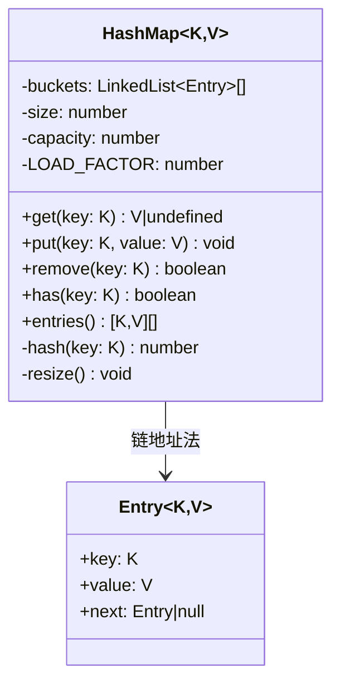
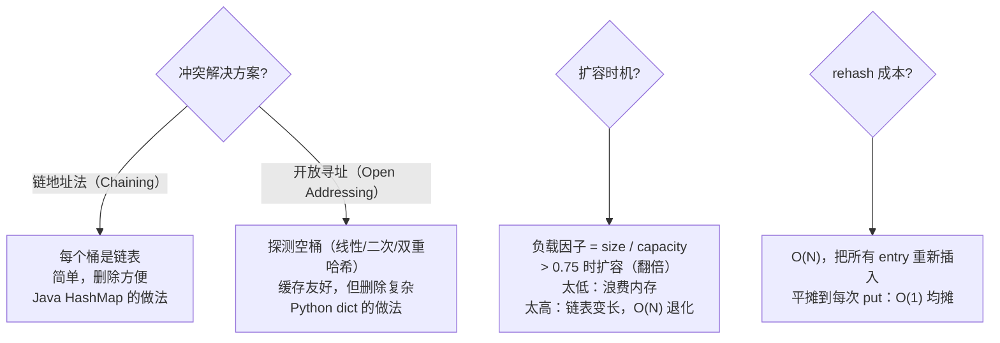

# OOD：设计 HashMap

## 核心考点

泛型设计、哈希冲突处理（链地址法）、动态 rehash、负载因子（load factor）。

---

## 类图



---

## 实现

```typescript
class Entry<K, V> {
  constructor(
    public key:   K,
    public value: V,
    public next:  Entry<K, V> | null = null
  ) {}
}

class HashMap<K, V> {
  private buckets: Array<Entry<K, V> | null>;
  private size     = 0;
  private capacity: number;
  private readonly LOAD_FACTOR = 0.75;

  constructor(initialCapacity = 16) {
    this.capacity = initialCapacity;
    this.buckets  = new Array(this.capacity).fill(null);
  }

  private hash(key: K): number {
    const str = String(key);
    let h = 0;
    for (let i = 0; i < str.length; i++) {
      // 与 Java HashMap 相同的扰动函数
      h = (Math.imul(31, h) + str.charCodeAt(i)) >>> 0;
    }
    return h % this.capacity;
  }

  put(key: K, value: V): void {
    // 超过负载因子时先扩容
    if (this.size / this.capacity >= this.LOAD_FACTOR) {
      this.resize();
    }
    const idx  = this.hash(key);
    let   curr = this.buckets[idx];

    // 遍历链表：找到相同 key 则更新
    while (curr !== null) {
      if (curr.key === key) {
        curr.value = value;
        return;
      }
      curr = curr.next;
    }

    // 未找到：头插法
    const entry      = new Entry(key, value, this.buckets[idx]);
    this.buckets[idx] = entry;
    this.size++;
  }

  get(key: K): V | undefined {
    const idx  = this.hash(key);
    let   curr = this.buckets[idx];
    while (curr !== null) {
      if (curr.key === key) return curr.value;
      curr = curr.next;
    }
    return undefined;
  }

  remove(key: K): boolean {
    const idx  = this.hash(key);
    let   curr = this.buckets[idx];
    let   prev: Entry<K, V> | null = null;

    while (curr !== null) {
      if (curr.key === key) {
        if (prev === null) this.buckets[idx] = curr.next;
        else prev.next = curr.next;
        this.size--;
        return true;
      }
      prev = curr;
      curr = curr.next;
    }
    return false;
  }

  has(key: K): boolean {
    return this.get(key) !== undefined;
  }

  getSize(): number { return this.size; }

  entries(): [K, V][] {
    const result: [K, V][] = [];
    for (const bucket of this.buckets) {
      let curr = bucket;
      while (curr !== null) {
        result.push([curr.key, curr.value]);
        curr = curr.next;
      }
    }
    return result;
  }

  private resize(): void {
    const oldBuckets  = this.buckets;
    this.capacity    *= 2;
    this.buckets      = new Array(this.capacity).fill(null);
    this.size         = 0;

    // rehash 所有已有条目
    for (const bucket of oldBuckets) {
      let curr = bucket;
      while (curr !== null) {
        this.put(curr.key, curr.value); // 重新插入，size 会重新累加
        curr = curr.next;
      }
    }
  }
}
```

---

## 关键设计决策



---

## 复杂度分析

| 操作 | 平均 | 最坏（全部哈希碰撞）|
|------|------|------------------|
| get / put / remove | O(1) | O(N) |
| resize（rehash）| O(N) 单次 | — |
| 均摊 put | O(1) | — |

---

## 面试追问

**Q: 如何让 HashMap 线程安全？**

① `ConcurrentHashMap` 思路：分段锁（16 个 Segment，每个 Segment 一把锁），并发度 = 16  
② 简单方案：每个 `put/get/remove` 加 `Mutex`（性能差）  
③ Java 8+：`ConcurrentHashMap` 改用 CAS + synchronized 只锁单个桶头节点

**Q: 链表过长时如何优化？**

Java 8 引入的优化：同一桶的链表长度超过 8 时，转为红黑树（TreeMap），查询从 O(N) 降为 O(log N)，链表收缩到 6 时再转回链表。

**Q: 为什么 capacity 要是 2 的幂次？**

`hash % capacity` 可以用位运算 `hash & (capacity - 1)` 替代，速度快且分布均匀（二进制低位全为 1 时，% 等价于 &）。
