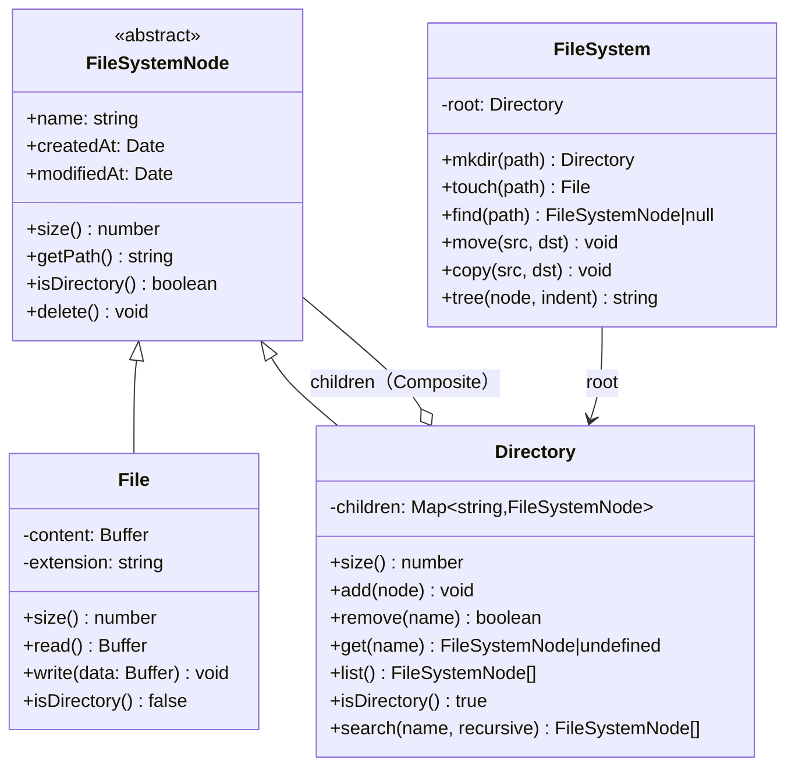
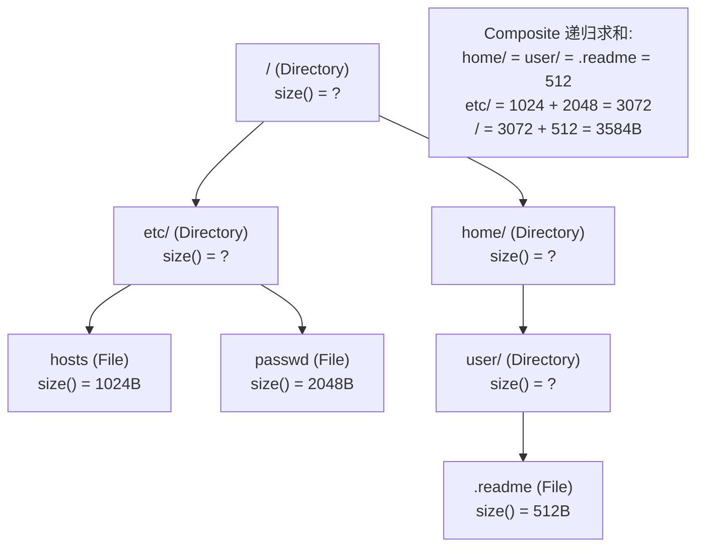

# OOD：设计文件系统（File System）

## 核心考点

**Composite 模式**：`File` 和 `Directory` 实现同一个 `FileSystemNode` 接口，目录可以递归包含子节点，`size()` / `search()` 等操作统一处理。

---

## 类图



---

## 实现

```typescript
abstract class FileSystemNode {
  public modifiedAt: Date = new Date();

  constructor(
    public readonly name: string,
    public readonly createdAt: Date = new Date(),
    protected parent: Directory | null = null
  ) {}

  abstract size(): number;
  abstract isDirectory(): boolean;

  getPath(): string {
    if (this.parent === null) return '/';
    const parentPath = this.parent.getPath();
    return parentPath === '/' ? `/${this.name}` : `${parentPath}/${this.name}`;
  }

  setParent(dir: Directory | null): void {
    this.parent = dir;
  }

  getParent(): Directory | null { return this.parent; }
}

// ── Leaf ──────────────────────────────────────────────
class File extends FileSystemNode {
  private content: Buffer = Buffer.alloc(0);

  get extension(): string {
    const dot = this.name.lastIndexOf('.');
    return dot >= 0 ? this.name.slice(dot + 1) : '';
  }

  size(): number { return this.content.byteLength; }
  isDirectory(): false { return false; }

  read(): Buffer { return Buffer.from(this.content); }

  write(data: Buffer): void {
    this.content     = Buffer.from(data);
    this.modifiedAt  = new Date();
    // 冒泡更新父目录 modifiedAt
    this.parent?.touch();
  }
}

// ── Composite ─────────────────────────────────────────
class Directory extends FileSystemNode {
  private children: Map<string, FileSystemNode> = new Map();

  size(): number {
    let total = 0;
    for (const child of this.children.values()) total += child.size();
    return total;
  }

  isDirectory(): true { return true; }

  add(node: FileSystemNode): void {
    if (this.children.has(node.name)) {
      throw new Error(`${node.name} already exists in ${this.getPath()}`);
    }
    node.setParent(this);
    this.children.set(node.name, node);
    this.touch();
  }

  remove(name: string): boolean {
    const node = this.children.get(name);
    if (!node) return false;
    node.setParent(null);
    this.children.delete(name);
    this.touch();
    return true;
  }

  get(name: string): FileSystemNode | undefined {
    return this.children.get(name);
  }

  list(): FileSystemNode[] {
    return [...this.children.values()];
  }

  touch(): void {
    this.modifiedAt = new Date();
    this.parent?.touch();
  }

  // 递归搜索
  search(pattern: string | RegExp, recursive = true): FileSystemNode[] {
    const results: FileSystemNode[] = [];
    const regex = typeof pattern === 'string'
      ? new RegExp(pattern.replace(/\*/g, '.*'), 'i')
      : pattern;

    for (const child of this.children.values()) {
      if (regex.test(child.name)) results.push(child);
      if (recursive && child.isDirectory()) {
        results.push(...(child as Directory).search(regex, true));
      }
    }
    return results;
  }
}

// ── FileSystem facade ─────────────────────────────────
class FileSystem {
  private readonly root: Directory;

  constructor() {
    this.root = new Directory('/');
  }

  // 解析路径段
  private parsePath(path: string): string[] {
    return path.split('/').filter(Boolean);
  }

  // 定位节点（不创建）
  find(path: string): FileSystemNode | null {
    if (path === '/') return this.root;
    const parts = this.parsePath(path);
    let   curr: FileSystemNode = this.root;

    for (const part of parts) {
      if (!curr.isDirectory()) return null;
      const next = (curr as Directory).get(part);
      if (!next) return null;
      curr = next;
    }
    return curr;
  }

  // 创建目录（-p 语义：递归创建）
  mkdir(path: string): Directory {
    const parts = this.parsePath(path);
    let   curr  = this.root;

    for (const part of parts) {
      let next = curr.get(part);
      if (!next) {
        next = new Directory(part);
        curr.add(next);
      }
      if (!next.isDirectory()) throw new Error(`${part} is a file, not a directory`);
      curr = next as Directory;
    }
    return curr;
  }

  // 创建文件（路径中的目录必须已存在）
  touch(path: string): File {
    const parts   = this.parsePath(path);
    const name    = parts.pop()!;
    const dirPath = '/' + parts.join('/');
    const dir     = this.find(dirPath);
    if (!dir || !dir.isDirectory()) throw new Error(`Directory not found: ${dirPath}`);

    const existing = (dir as Directory).get(name);
    if (existing) {
      if (existing.isDirectory()) throw new Error(`${name} is a directory`);
      return existing as File;
    }
    const file = new File(name);
    (dir as Directory).add(file);
    return file;
  }

  // 打印目录树
  tree(node: FileSystemNode = this.root, indent = ''): string {
    const isLast = true; // 简化，实际需追踪兄弟节点
    const prefix = indent === '' ? '' : indent + '├── ';
    let   result = prefix + node.name + (node.isDirectory() ? '/' : '') + '\n';

    if (node.isDirectory()) {
      const children = (node as Directory).list();
      children.forEach((child, i) => {
        const childIndent = indent + (isLast ? '    ' : '│   ');
        result += this.tree(child, childIndent);
      });
    }
    return result;
  }
}
```

---

## 操作流程（Composite 递归 size）



---

## 面试追问

**Q: 如何实现 `cp -r`（递归复制目录）？**

```typescript
function copyNode(node: FileSystemNode): FileSystemNode {
  if (!node.isDirectory()) {
    const copy = new File(node.name);
    copy.write((node as File).read());
    return copy;
  }
  const copyDir = new Directory(node.name);
  for (const child of (node as Directory).list()) {
    copyDir.add(copyNode(child)); // 递归
  }
  return copyDir;
}
```

**Q: 路径中包含 `..` 和 `.` 如何处理？**

规范化路径：维护一个栈，遇到 `..` 就 pop，遇到 `.` 跳过，最终栈内容就是实际路径段。

**Q: 如何支持软链接（Symlink）？**

新增 `Symlink extends FileSystemNode`，持有 `target: string`（目标路径）。`find()` 时遇到 Symlink 则递归解析目标路径（需检测循环引用，用访问集合防死循环）。
