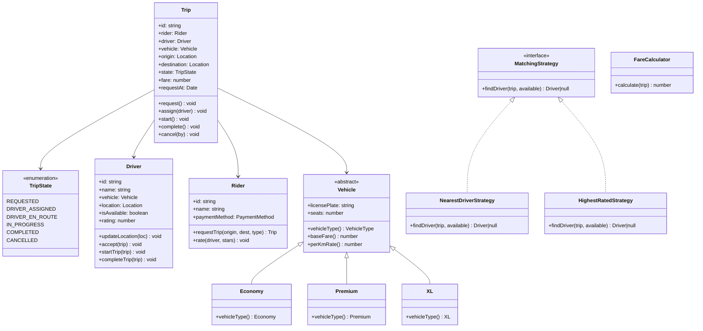
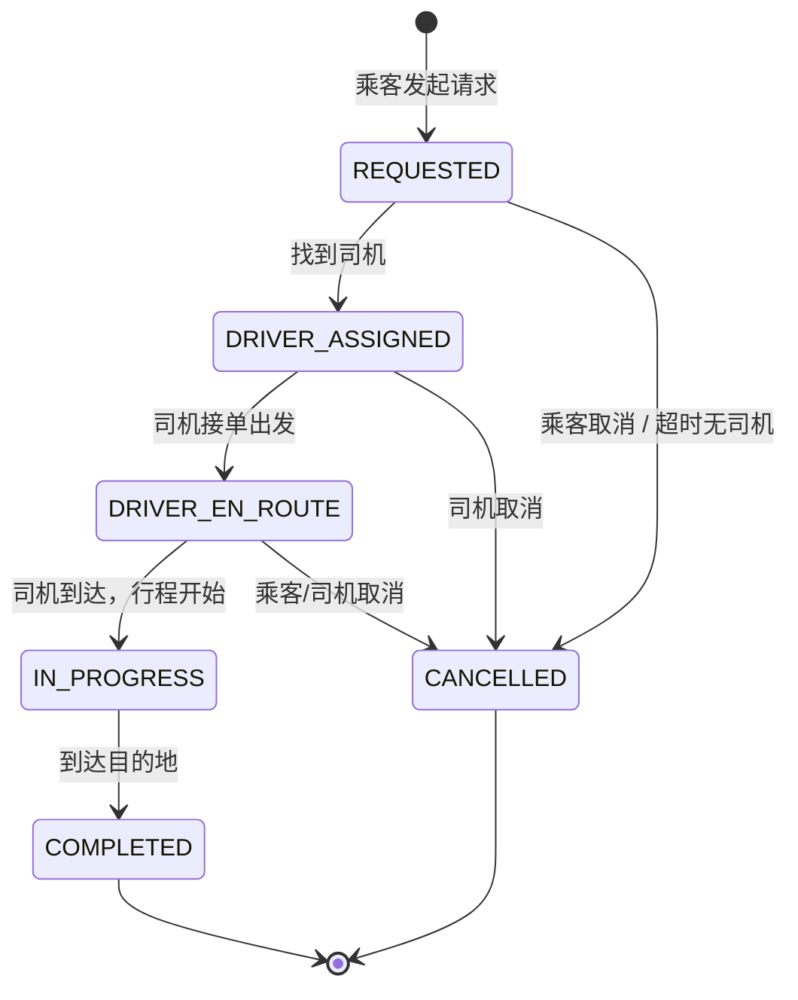

# OOD：网约车系统（Ride Sharing）

## 核心考点

行程状态机（State 模式）、司机匹配策略（Strategy 模式）、实时位置更新（Observer 模式）、多种车型多态。

---

## 类图



---

## 核心实现

```typescript
// ── 位置 ──────────────────────────────────────────────
class Location {
  constructor(
    public readonly lat: number,
    public readonly lng: number
  ) {}

  distanceTo(other: Location): number {
    // Haversine 简化（面试中可近似为欧氏距离）
    const dLat = (other.lat - this.lat) * Math.PI / 180;
    const dLng = (other.lng - this.lng) * Math.PI / 180;
    return Math.sqrt(dLat * dLat + dLng * dLng) * 111; // 粗略 km
  }
}

// ── 车型（多态） ────────────────────────────────────────
enum VehicleType { ECONOMY = 'ECONOMY', PREMIUM = 'PREMIUM', XL = 'XL' }

abstract class Vehicle {
  constructor(
    public readonly licensePlate: string,
    public readonly seats: number
  ) {}
  abstract vehicleType(): VehicleType;
  abstract baseFare(): number;  // 起步价（元）
  abstract perKmRate(): number; // 每公里单价
}

class Economy extends Vehicle {
  vehicleType() { return VehicleType.ECONOMY; }
  baseFare()    { return 8; }
  perKmRate()   { return 1.5; }
}

class Premium extends Vehicle {
  vehicleType() { return VehicleType.PREMIUM; }
  baseFare()    { return 15; }
  perKmRate()   { return 3.0; }
}

class XL extends Vehicle {
  vehicleType() { return VehicleType.XL; }
  baseFare()    { return 12; }
  perKmRate()   { return 2.2; }
}

// ── 行程状态机 ──────────────────────────────────────────
enum TripStatus {
  REQUESTED       = 'REQUESTED',
  DRIVER_ASSIGNED = 'DRIVER_ASSIGNED',
  DRIVER_EN_ROUTE = 'DRIVER_EN_ROUTE',
  IN_PROGRESS     = 'IN_PROGRESS',
  COMPLETED       = 'COMPLETED',
  CANCELLED       = 'CANCELLED',
}

class Trip {
  public status: TripStatus = TripStatus.REQUESTED;
  public driver: Driver | null = null;
  public fare:   number = 0;
  public readonly requestedAt = new Date();

  constructor(
    public readonly id: string,
    public readonly rider: Rider,
    public readonly origin: Location,
    public readonly destination: Location,
    public readonly vehicleType: VehicleType
  ) {}

  assign(driver: Driver): void {
    this.assertStatus(TripStatus.REQUESTED);
    this.driver = driver;
    this.status = TripStatus.DRIVER_ASSIGNED;
  }

  driverEnRoute(): void {
    this.assertStatus(TripStatus.DRIVER_ASSIGNED);
    this.status = TripStatus.DRIVER_EN_ROUTE;
  }

  start(): void {
    this.assertStatus(TripStatus.DRIVER_EN_ROUTE);
    this.status = TripStatus.IN_PROGRESS;
  }

  complete(fare: number): void {
    this.assertStatus(TripStatus.IN_PROGRESS);
    this.fare   = fare;
    this.status = TripStatus.COMPLETED;
    this.driver!.setAvailable(true);
  }

  cancel(): void {
    if ([TripStatus.COMPLETED, TripStatus.CANCELLED].includes(this.status)) {
      throw new Error('Cannot cancel a finished trip');
    }
    this.status = TripStatus.CANCELLED;
    if (this.driver) this.driver.setAvailable(true);
  }

  private assertStatus(expected: TripStatus): void {
    if (this.status !== expected) {
      throw new Error(`Expected status ${expected}, got ${this.status}`);
    }
  }
}

// ── 司机匹配策略（Strategy） ────────────────────────────
interface MatchingStrategy {
  findDriver(trip: Trip, available: Driver[]): Driver | null;
}

class NearestDriverStrategy implements MatchingStrategy {
  findDriver(trip: Trip, available: Driver[]): Driver | null {
    const compatible = available.filter(d => d.vehicle.vehicleType() === trip.vehicleType);
    if (compatible.length === 0) return null;
    return compatible.reduce((best, curr) =>
      curr.location.distanceTo(trip.origin) < best.location.distanceTo(trip.origin)
        ? curr : best
    );
  }
}

class HighestRatedStrategy implements MatchingStrategy {
  findDriver(trip: Trip, available: Driver[]): Driver | null {
    const compatible = available.filter(d => d.vehicle.vehicleType() === trip.vehicleType);
    if (compatible.length === 0) return null;
    return compatible.reduce((best, curr) => curr.rating > best.rating ? curr : best);
  }
}

// ── 计价 ───────────────────────────────────────────────
class FareCalculator {
  calculate(trip: Trip): number {
    const distKm = trip.origin.distanceTo(trip.destination);
    const vehicle = trip.driver!.vehicle;
    const base = vehicle.baseFare() + distKm * vehicle.perKmRate();
    // 动态倍率（简化）
    const surgeMultiplier = 1.0;
    return Math.round(base * surgeMultiplier * 100) / 100;
  }
}

// ── 司机 & 乘客 ─────────────────────────────────────────
class Driver {
  private _available = true;
  public rating = 4.8;

  constructor(
    public readonly id: string,
    public readonly name: string,
    public readonly vehicle: Vehicle,
    public location: Location
  ) {}

  get isAvailable() { return this._available; }
  setAvailable(v: boolean): void { this._available = v; }
  updateLocation(loc: Location): void { this.location = loc; }
}

class Rider {
  constructor(
    public readonly id: string,
    public readonly name: string
  ) {}
}

// ── 调度中心（Facade） ─────────────────────────────────
class RideService {
  private trips   = new Map<string, Trip>();
  private drivers: Driver[] = [];
  private idCounter = 0;

  constructor(private matchingStrategy: MatchingStrategy = new NearestDriverStrategy()) {}

  registerDriver(driver: Driver): void { this.drivers.push(driver); }

  setMatchingStrategy(strategy: MatchingStrategy): void {
    this.matchingStrategy = strategy;
  }

  requestTrip(rider: Rider, origin: Location, dest: Location, type: VehicleType): Trip {
    const trip = new Trip(`trip-${++this.idCounter}`, rider, origin, dest, type);
    this.trips.set(trip.id, trip);

    const available = this.drivers.filter(d => d.isAvailable);
    const driver    = this.matchingStrategy.findDriver(trip, available);

    if (!driver) throw new Error('No driver available');
    driver.setAvailable(false);
    trip.assign(driver);
    trip.driverEnRoute();
    return trip;
  }

  startTrip(tripId: string): void {
    this.getTrip(tripId).start();
  }

  completeTrip(tripId: string): number {
    const trip = this.getTrip(tripId);
    const fare = new FareCalculator().calculate(trip);
    trip.complete(fare);
    return fare;
  }

  cancelTrip(tripId: string): void {
    this.getTrip(tripId).cancel();
  }

  private getTrip(id: string): Trip {
    const trip = this.trips.get(id);
    if (!trip) throw new Error(`Trip ${id} not found`);
    return trip;
  }
}
```

---

## 行程状态机



---

## 面试追问

**Q: 如何实现动态定价（Surge Pricing）？**

供需比 = 当前请求数 / 当前可用司机数。超过阈值（如 2.0）时启用倍率（如 1.5x、2x）。`FareCalculator.calculate()` 中注入 `SurgeService` 获取当前倍率即可。

**Q: 司机如何高频上报位置？**

司机 App 每 4 秒通过 WebSocket 上报 GPS 坐标 → 写入 Redis（`GEOADD`）。调度时用 `GEORADIUS` 找附近可用司机，而不是遍历所有 `drivers` 数组。

**Q: 如何防止同一司机被分配给两个行程（并发竞争）？**

Redis 原子 CAS：`SET driver:{id}:lock {tripId} NX EX 60`，只有 `NX`（Key 不存在时）才成功，实现分布式锁。
